# 【深度】监督&强化学习算法在 A 股中的应用（第十四期免费赠书活动来啦！）

> 原文：[`mp.weixin.qq.com/s?__biz=MzAxNTc0Mjg0Mg==&mid=2653287878&idx=1&sn=3f399aa656e030d06bbc8f8d668d7ea1&chksm=802e37d3b759bec5cf7e10edbc19d0f6a61dacba8c3a123002d2ee2056338c50f134e0cbaedc&scene=27#wechat_redirect`](http://mp.weixin.qq.com/s?__biz=MzAxNTc0Mjg0Mg==&mid=2653287878&idx=1&sn=3f399aa656e030d06bbc8f8d668d7ea1&chksm=802e37d3b759bec5cf7e10edbc19d0f6a61dacba8c3a123002d2ee2056338c50f134e0cbaedc&scene=27#wechat_redirect)


**量化投资与机器学习**

为中国的量化投资事业贡献一份我们的力量!

 

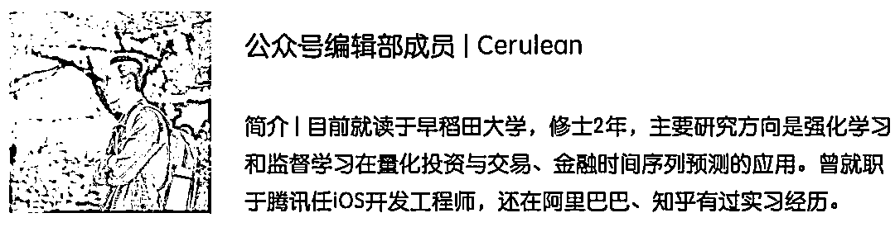

Github 项目：*https://github.com/Ceruleanacg/Personae*

前八期传送门：

【系列 58】[强化学习在 Market Making 上的应](https://mp.weixin.qq.com/s?__biz=MzAxNTc0Mjg0Mg==&mid=2653287860&idx=1&sn=12a3648d2df3f79c3aa20db99bac2949&chksm=802e37a1b759beb72c5fc327c8f0ec9d1fd47776254c9a72bc54851cacc05b7270d05911944b&scene=21#wechat_redirect)用

【系列 57】[为什么机器学习在投资领域并不是那么好用](https://mp.weixin.qq.com/s?__biz=MzAxNTc0Mjg0Mg==&mid=2653287798&idx=1&sn=e246e931e8770386c68b0b10ed735116&chksm=802e3763b759be7556ca7f77d8128df3421633a51f3010a2527a39cb16a69c760f3589cdb943&scene=21#wechat_redirect)

【系列 56】[特征重要性在量化投资中的深度应用](https://mp.weixin.qq.com/s?__biz=MzAxNTc0Mjg0Mg==&mid=2653287672&idx=1&sn=9f59afb57b99cab6692367578c0aaa70&chksm=802e36edb759bffbd644791bb16bbe1ee0042ac3118421976e13141b807f90ae1f3d752c3450&scene=21#wechat_redirect)

【系列 55】[机器学习应用量化投资必须要踩的那些坑](https://mp.weixin.qq.com/s?__biz=MzAxNTc0Mjg0Mg==&mid=2653287642&idx=1&sn=a7c71f89c3ad6f60590585b1bf016780&chksm=802e36cfb759bfd9a629eae57fc430ff457753a138d053cb7666d55cd41f91809d821285a521&scene=21#wechat_redirect)

【系列 54】[因子的有效性分析基于 7 种机器学习算法](https://mp.weixin.qq.com/s?__biz=MzAxNTc0Mjg0Mg==&mid=2653287512&idx=1&sn=14ee62549dab3c64468f78b3dbfd39a5&chksm=802e364db759bf5bb5abffc6a50f72d0e31722c178e01ce11a3d48fb28386055e741c9ecce8d&scene=21#wechat_redirect)

【系列 53】[基于 XGBoost 的量化金融实战](https://mp.weixin.qq.com/s?__biz=MzAxNTc0Mjg0Mg==&mid=2653287481&idx=1&sn=dcb1dda1e2362d8297ae1a97845cf02e&chksm=802e362cb759bf3a3aaea75af824451a3dba7345ecc73e27facc4b917792835fdd2878403c8c&scene=21#wechat_redirect)

【系列 52】[基于 Python 预测股价的那些人那些坑](https://mp.weixin.qq.com/s?__biz=MzAxNTc0Mjg0Mg==&mid=2653287306&idx=1&sn=9f374874636e7d6d52a9b3d92d6aa81b&chksm=802e319fb759b8896acf2ed9529da88a8fda0d76d6a3b816854e9ad5eeecfd6f4af75dd65804&scene=21#wechat_redirect)

## 【系列 51】[通过 ML、Time Series 模型学习股价行为](https://mp.weixin.qq.com/s?__biz=MzAxNTc0Mjg0Mg==&mid=2653287197&idx=1&sn=9630389a52c7d0be4c1feaf3a534c2ce&chksm=802e3108b759b81ed11174f71b23fb73abe5c4ebad0f9d480b6efbd8f7e644de6b2232dc63fa&scene=21#wechat_redirect)

**正文**

目前，在本项目中：

*   实现了 4 个强化学习论文提出的方法

*   实现了 3 个监督学习关于时间序列预测的论文提出的方法

*   实现了一个模拟 A 股交易所，提供基本的买入、持有、卖出股票的操作

对于监督学习模型的数据集：

我们采用 2008 年 1 月 1 日到 2018 年 1 月 1 日这个区间内

*   招商银行（600036）

*   交通银行（601328）

*   中信银行（601998）

*   工商银行（601389）

这四只银行股在第 T 天的

*   开盘价（Open）

*   收盘价（Close）

*   最高价（High）

*   最低价（Low）

*   交易量（Volume）

作为输入数据，第 T+1 天的

*   收盘价（Close）

作为输出数据，进行训练，其中，这个区间前 70%的数据作为训练数据，后 30%作为测试数据，目前没有设置验证集数据。

下图是目前的实验结果，就目前的实验结果来看，监督学习的表现要远好于强化学习。

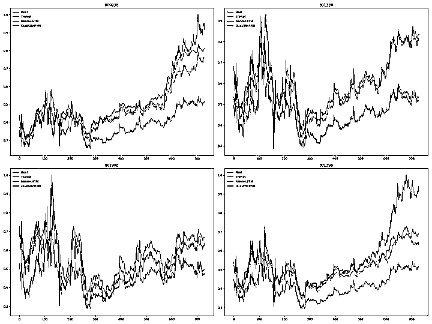

图例 ：蓝色的折线是测试数据集，其他颜色的折线是三种不同的监督学习模型在测试集上的预测。

接下来，我们将会依次对这三个监督学习的模型做一个简短的介绍。

**Naive-LSTM (LSTM)**

该模型是基于 LSTM 和 Dense（全连接）的基本模型，输入是序列长度为 5，即第 T 到第 T+4 天的 OCHLV 数据，输出是一个实数，代表了第 T+5 的预测收盘价格。

> *arXiv:1506.02078: https://arxiv.org/abs/1506.02078*

计算图：

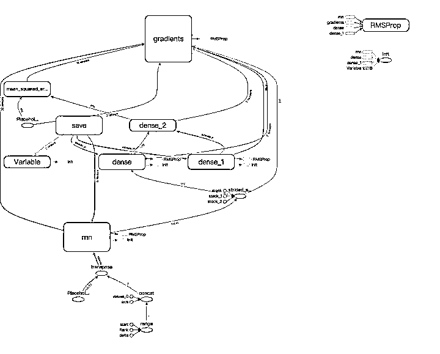

Naive-LSTM

以下是构建模型的核心代码：

```py
def _init_nn(self):
    self.rnn = self.add_rnn(1, self.hidden_size)
    self.rnn_output, _ = tf.nn.dynamic_rnn(self.rnn, self.x, dtype=tf.float32)
    self.rnn_output = self.rnn_output[:, -1]
    self.rnn_output_dense = self.add_fc(self.rnn_output, 16)
    self.y = self.add_fc(self.rnn_output_dense, self.y_space)
```

可以看出，第一行代码调用了项目中封装的用于构建 LSTM 层的 API，第二行代码用于计算该层输出和状态序列，第四行和第五行构造了一个全连接层并计算最终的输出。

## **TreNet (HNN)**

> *IJCAI 2017\. Hybrid Neural Networks for Learning the Trend in Time Series,https://www.ijcai.org/proceedings/2017/0316.pdf*

上述引用的论文提出了一种混合神经网络的结构，同时用 RNN 与 CNN 提取序列特征，然后将输出拼接作为全连接层的输入，最后输出最终的预测结果。

计算图：

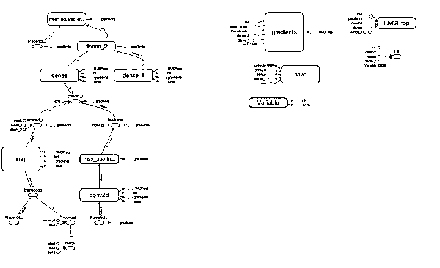

Tre-Net

以下是构建模型的核心代码：

```py
def _init_nn(self):
    self.rnn = self.add_rnn(1, self.hidden_size)
    self.rnn_output, _ = tf.nn.dynamic_rnn(self.rnn, self.rnn_x, dtype=tf.float32)
    self.rnn_output = self.rnn_output[:, -1]
    # self.cnn_x_input is a [-1, 5, 20, 1] tensor, after cnn, the shape will be [-1, 5, 20, 5].
    self.cnn = self.add_cnn(self.cnn_x, filters=2, kernel_size=[2, 2], pooling_size=[2, 2])
    self.cnn_output = tf.reshape(self.cnn, [-1, self.seq_length * self.x_space * 2])
    self.y_concat = tf.concat([self.rnn_output, self.cnn_output], axis=1)
    self.y_dense = self.add_fc(self.y_concat, 16)
    self.y = self.add_fc(self.y_dense, self.y_space)
```

可以看出，第一到第三行构造了 LSTM 层并计算结果，第四到第五行用项目封装的构造 CNN 的 API 构造了 CNN 层并计算了结果。最后拼接了 RNN 和 CNN 的结果，作为全连接层的输入，然后得到最终的计算结果。

## **DA-RNN (DualAttnRNN)**

> *arXiv:1704.02971: A Dual-Stage Attention-Based Recurrent Neural Network for Time Series Prediction。https://arxiv.org/abs/1704.02971*

上述引用的论文提出了一种基于注意力机制（Attention Based Model）的与 Seq-to-Seq 模型的网络结构，其创新点在于该模型连续两次使用注意力机制，在对原始序列使用注意力机制求权重后再次使用注意力机制对编码后的序列求权重，然后经解码与全连接层后输出结果。

计算图：

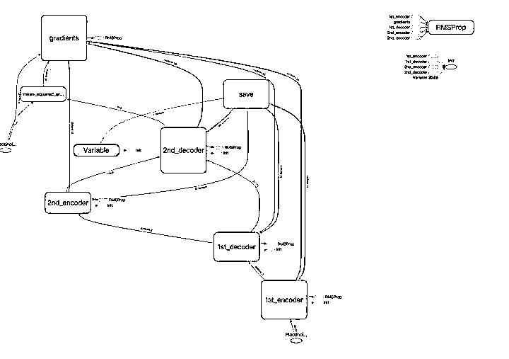

DA-RNN

以下是构建模型的核心代码：

```py
def _init_nn(self):
    # First Attn
    with tf.variable_scope("1st_encoder"):
        self.f_encoder_rnn = self.add_rnn(1, self.hidden_size)
        self.f_encoder_outputs, _ = tf.nn.dynamic_rnn(self.f_encoder_rnn, self.x, dtype=tf.float32)
        self.f_attn_inputs = self.add_fc(self.f_encoder_outputs, self.hidden_size, tf.tanh)
        self.f_attn_outputs = tf.nn.softmax(self.f_attn_inputs)
    with tf.variable_scope("1st_decoder"):
        self.f_decoder_input = tf.multiply(self.f_encoder_outputs, self.f_attn_outputs)
        self.f_decoder_rnn = self.add_rnn(1, self.hidden_size)
        self.f_decoder_outputs, _ = tf.nn.dynamic_rnn(self.f_decoder_rnn, self.f_decoder_input, dtype=tf.float32)
    # Second Attn
    with tf.variable_scope("2nd_encoder"):
        self.s_attn_input = self.add_fc(self.f_decoder_outputs, self.hidden_size, tf.tanh)
        self.s_attn_outputs = tf.nn.softmax(self.s_attn_input)
    with tf.variable_scope("2nd_decoder"):
        self.s_decoder_input = tf.multiply(self.f_decoder_outputs, self.s_attn_outputs)
        self.s_decoder_rnn = self.add_rnn(2, self.hidden_size)
        self.f_decoder_outputs, _ = tf.nn.dynamic_rnn(self.s_decoder_rnn, self.s_decoder_input, dtype=tf.float32)
        self.f_decoder_outputs_dense = self.add_fc(self.f_decoder_outputs[:, -1], 16)
        self.y = self.add_fc(self.f_decoder_outputs_dense, self.y_space)
```

可以看出，分别对应于四个变量命名空间，具有 2 组 4 个编解码层，在每一个编解码层都运用了一次注意力机制，求出当前序列的权重，然后与序列相乘后进行下一步的编解码工作，这是一种 Seq-to-Seq 的机制，更广泛地用于自然语言处理。最终解码的输出结果作为全连接层的输入，然后计算最终的结果。

以上是关于项目中监督学习模型的简短介绍，其中，所有模型的具体实现可以在项目链接中看到。

接下来是关于 3 个强化学习模型的介绍，但是在介绍强化学习模型前，我们首先对强化学习的数据和环境一个简短的概述。

## **Stock Market**

这个文件实现了三个核心类，分别是：

*   Market

*   Trader

*   Position

他们分别代表了市场、交易员、持仓信息，最终 Market 类作为 Agent（强化学习模型）的 Environment（环境），接受 Agent 的 Action（动作），同时给出 Next State（下一状态）和 Reward（奖励），并进行迭代。

对于强化学习使用的数据，我们使用这四只银行股在第 T 天的

*   开盘价（Open）

*   收盘价（Close）

*   最高价（High）

*   最低价（Low）

*   交易量（Volume）

和交易员在第 T 天的

*   现金（Cash）

*   持仓价值（Holding Value）

作为 State（状态），使用交易指令

*   买入（Buy）

*   卖出（Sell）

*   持有（Hold）

作为 Agent（智能体）的 Action（动作），其中，Reward Func（奖励函数）的计算代码如下：

```py
def _update_reward(self, action_code, action_status, position):
    if action_code == ActionCode.Buy:
        if action_status == ActionStatus.Success:
            if position.pro_value > position.cur_value:
                self.reward += 70
            else:
                self.reward -= 50
        else:
            self.reward -= 100
    elif action_code == ActionCode.Sell:
        if action_status == ActionStatus.Success:
            if position.pro_value > position.cur_value:
                self.reward -= 70
            else:
                self.reward += 50
        else:
            self.reward -= 100
    else:
        if action_status == ActionStatus.Success:
            if position.pro_value > position.cur_value:
                self.reward += 70
            else:
                self.reward -= 50
        else:
            self.reward -= 100
```

接下来是关于实验结果与强化学习模型的介绍：

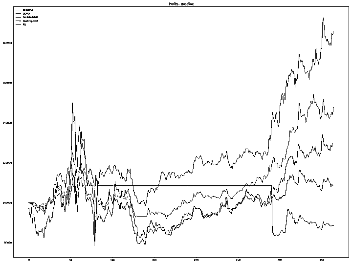

图例 - 横坐标是时间，纵坐标是利润，其中蓝色折线是基准线，其他颜色的折线是强化学习模型表现

可以看出，除了 Policy Gradient 可以跑赢基准收益外，其他强化学习模型的收益甚至不如基准，这里非常值得讨论，目前笔者也在尝试从参数、输入特征、输出特征、奖励函数等多个角度考虑解决该问题。

接下来是关于强化学习模型的介绍：

## **Policy Gradient**

> *NIPS. Vol. 99\. 1999: Policy gradient methods for reinforcement learning with function approximation。https://papers.nips.cc/paper/1713-policy-gradient-methods-for-reinforcement-learning-with-function-approximation.pdf*

计算图：

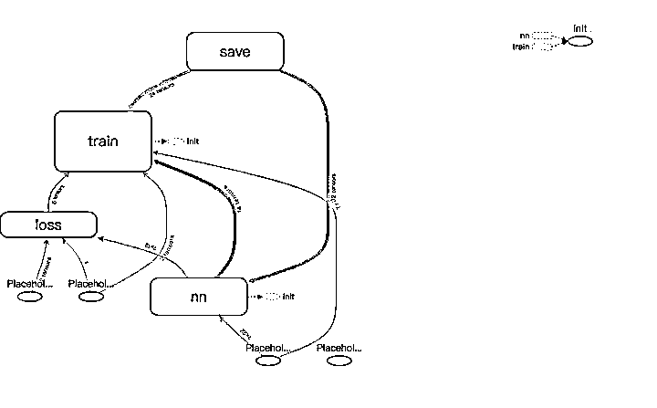

Policy Gradient

Basic Policy Gradient 的思想很朴素，对于一次采样的所有动作中，根据奖励函数值的正负决定梯度下降的方向，从而提高或者降低这些动作出现的概率。

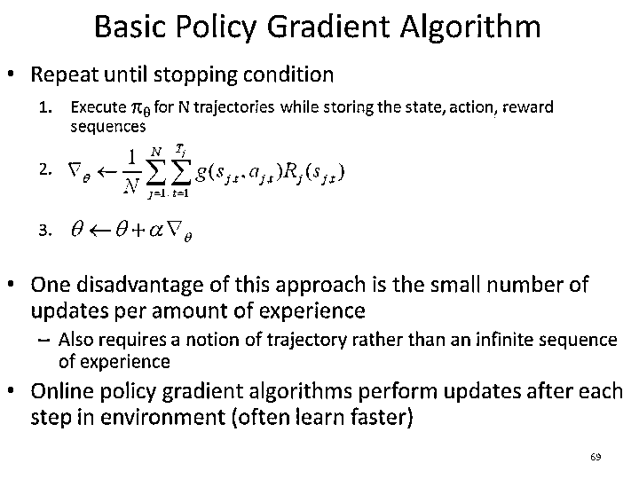

Policy Gradient Algorithm

以下是构建模型的核心代码：

```py
def _init_nn(self):
    # Initialize predict actor and critic.
    w_init, b_init = tf.random_normal_initializer(.0, .3), tf.constant_initializer(0.1)

    with tf.variable_scope('nn'):
        first_dense = tf.layers.dense(self.s,
                                      50,
                                      tf.nn.relu,
                                      kernel_initializer=w_init,
                                      bias_initializer=b_init)

        second_dense = tf.layers.dense(first_dense,
                                       50,
                                       tf.nn.relu,
                                       kernel_initializer=w_init,
                                       bias_initializer=b_init)

        action_prob = tf.layers.dense(second_dense,
                                      self.a_space,
                                      tf.nn.tanh,
                                      kernel_initializer=w_init,
                                      bias_initializer=b_init)

        self.a_prob = action_prob
        self.a_s_prob = tf.nn.softmax(action_prob)

def _init_op(self):
    with tf.variable_scope('loss'):
        # a_one_hot = tf.one_hot(self.a, self.a_space)
        # negative_cross_entropy = -tf.reduce_sum(tf.log(self.a_prob) * a_one_hot)
        negative_cross_entropy = tf.nn.sparse_softmax_cross_entropy_with_logits(logits=self.a_prob, labels=self.a)
        self.loss_fn = tf.reduce_mean(negative_cross_entropy * self.r)
    with tf.variable_scope('train'):
        self.train_op = tf.train.RMSPropOptimizer(self.learning_rate * 2).minimize(self.loss_fn)
    self.session.run(tf.global_variables_initializer())
```

本实现简单地采用两次全连接后输出 Softmax 后各个动作的概率，最后期望最小化采样动作的概率与真实概率乘以奖励函数的值的交叉熵。

## **Double DQN**

> *arXiv:1509.06461: Deep Reinforcement Learning with Double Q-learning。https://arxiv.org/abs/1509.06461*

计算图：

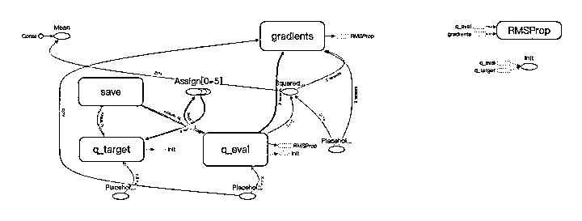

Double-DQN

Double-DQN 采用评估网络与目标网络相互制约，期望避免传统 DQN 中容易出现的过度估计问题。首先使用评估网络预测下一个状态的状态-动作函数值，然后选取取得最大值的动作，计做 amax，接着用目标网络预测下一状态与采用 amax 的状态值计算标签，然后期望最小化标签与评估网络对当前状态的状态-动作函数和当前动作的 Q 的均方差。

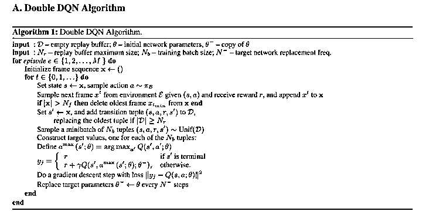

Double-DQN

以下是构建模型的核心代码：

```py
def _init_op(self):
    self.loss = tf.reduce_mean(tf.squared_difference(self.q_next, self.q_eval))
    self.train_op = tf.train.RMSPropOptimizer(self.learning_rate).minimize(self.loss)
    self.e_params = tf.get_collection(tf.GraphKeys.GLOBAL_VARIABLES, scope='q_eval')
    self.t_params = tf.get_collection(tf.GraphKeys.GLOBAL_VARIABLES, scope='q_target')
    self.update_q_target_op = [tf.assign(t, e) for t, e in zip(self.t_params, self.e_params)]
    self.session.run(tf.global_variables_initializer())

def train(self):
    # 1\. If buffer length is less than buffer size, return.
    if self.buffer_length < self.buffer_size:
        return
    # 2\. Update Q-Target if need.
    if self.total_step % self.update_q_target_step == 0:
        self.session.run(self.update_q_target_op)

    # 3\. Get transition batch.
    s, a, r, s_next = self.get_transition_batch()

    # 4\. Calculate q_eval_next.
    q_eval_next = self.session.run(self.q_eval, {self.s: s_next})

    # 5\. Get action indices and make batch indices.
    a_indices = np.argmax(q_eval_next, axis=1)
    b_indices = np.arange(self.batch_size, dtype=np.int)

    # 6\. Calculate q_target_next selected by actions.
    q_target_next = self.session.run(self.q_target, {self.s_next: s_next})
    q_target_next_with_a = q_target_next[b_indices, a_indices]

    # 7\. Calculate labels.
    q_eval = self.session.run(self.q_eval, {self.s: s})
    q_next = q_eval.copy()
    q_next[b_indices, a.astype(np.int)] = r + self.gamma * q_target_next_with_a

    # 8\. Calculate loss.
    _, self.critic_loss = self.session.run([self.train_op, self.loss], {self.s: s, self.q_next: q_next})

    # 9\. Increase total step.
    self.total_step += 1
```

Double-DQN 的实现代码中，注释已经非常详尽，在这里就不再过多赘述。

## **Deep Deterministic Policy Gradient (DDPG)**

> *arXiv:1509.02971: Continuous control with deep reinforcement learning。https://arxiv.org/abs/1509.02971*

计算图：

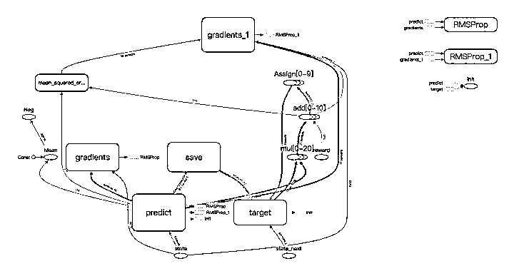

DDPG

DDPG 用于连续动作空间，在本问题中，对于四只股票的买卖持有的动作被映射到区间[0, 11]，其中，DDPG 使用 Actor-Critic Model，引入评估 Actor，目标 Actor 模型与评估 Critic，目标 Critic 模型两组四个网络，其中 Actor 模型用于预测动作，Critic 模型用于评估当前状态与动作的分数（状态-动作值函数），该方法期望最小化：评估 Critic 与评估 Actor 对当前状态-动作函数值与目标 Critic 和目标 Actor 对下一状态-动作函数值的均方差（如算法图所示），依次迭代改进目标 Critic 和目标 Actor。

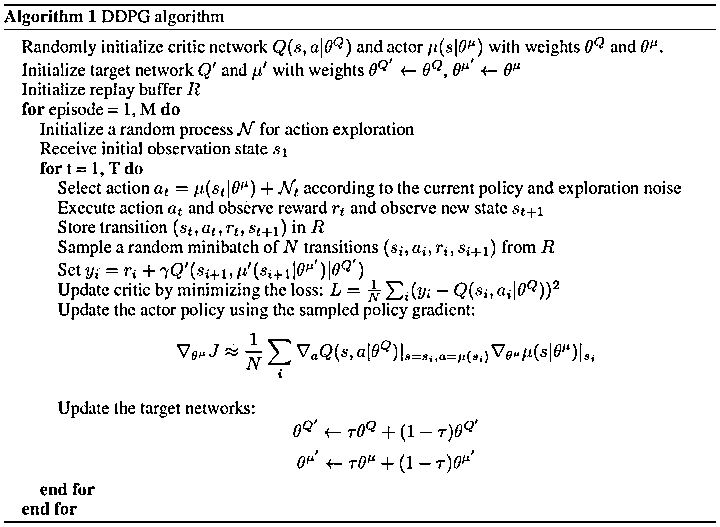

DDPG

以下是构建模型的核心代码：

```py
def _init_nn(self):
    # Initialize predict actor and critic.
    self.a_predict = self.__build_actor_nn(self.s, "predict/actor", trainable=True)
    self.q_predict = self.__build_critic(self.s, self.a_predict, "predict/critic", trainable=True)
    # Initialize target actor and critic.
    self.a_next = self.__build_actor_nn(self.s_next, "target/actor", trainable=False)
    self.q_next = self.__build_critic(self.s_next, self.a_next, "target/critic", trainable=False)
    # Save scopes
    self.scopes = ["predict/actor", "target/actor", "predict/critic", "target/critic"]

def _init_op(self):
    # Get actor and critic parameters.
    params = [tf.get_collection(tf.GraphKeys.GLOBAL_VARIABLES, scope) for scope in self.scopes]
    zipped_a_params, zipped_c_params = zip(params[0], params[1]), zip(params[2], params[3])
    # Initialize update actor and critic op.
    self.update_a = [tf.assign(t_a, (1 - self.tau) * t_a + self.tau * p_a) for p_a, t_a in zipped_a_params]
    self.update_c = [tf.assign(t_c, (1 - self.tau) * t_c + self.tau * p_c) for p_c, t_c in zipped_c_params]
    # Initialize actor loss and train op.
    self.a_loss = -tf.reduce_mean(self.q_predict)
    self.a_train_op = tf.train.RMSPropOptimizer(self.learning_rate).minimize(self.a_loss, var_list=params[0])
    # Initialize critic loss and train op.
    self.q_target = self.r + self.gamma * self.q_next
    self.c_loss = tf.losses.mean_squared_error(self.q_target, self.q_predict)
    self.c_train_op = tf.train.RMSPropOptimizer(self.learning_rate * 2).minimize(self.c_loss, var_list=params[2])
    # Initialize variables.
    self.session.run(tf.global_variables_initializer())
```

代码首先初始化两组四个网络，分别是评估 Actor、目标 Actor，评估 Critic，目标 Critic，然后根据 DDPG 的算法最小化评估 Critic 与评估 Actor 对当前状态-动作函数值与目标 Critic 和目标 Actor 对下一状态-动作函数值的均方差，依次迭代更新 Actor 与 Critic 直至收敛。

## **Dueling-DQN**

> *arXiv:1511.06581: Dueling Network Architectures for Deep Reinforcement Learning。https://arxiv.org/abs/1511.06581*

计算图：

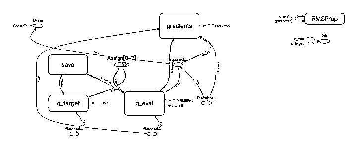

算法：

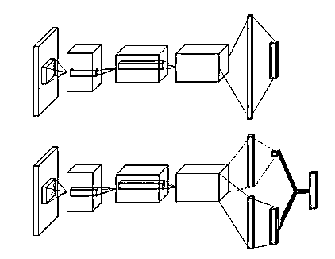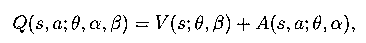

Dueling-DQN

相对于 DQN 直接输出状态-动作函数值，Dueling-DQN 的状态-动作函数值由上式决定，从网络结构上可以看出，在输出状态-动作函数值前，Dueling-DQN 的结构拆分了原 DQN 网络结构的最后一层，这样的思想很像 Actor-Critic 模型中的 Baseline，因为并不是每个状态都是十分重要的，有些时候对于这些状态，采取那个动作都不会有很大的影响。

以下是构建模型的核心代码：

```py
def __build_critic_nn(self, s, scope):
    w_init, b_init = tf.random_normal_initializer(.0, .3), tf.constant_initializer(.1)
    with tf.variable_scope(scope):
        s_first_dense = tf.layers.dense(s,
                                        16,
                                        activation=tf.nn.relu,
                                        kernel_initializer=w_init,
                                        bias_initializer=b_init)

        s_second_dense = tf.layers.dense(s_first_dense,
                                         16,
                                         tf.nn.relu,
                                         kernel_initializer=w_init,
                                         bias_initializer=b_init)

        value = tf.layers.dense(s_second_dense,
                                1,
                                kernel_initializer=w_init,
                                bias_initializer=b_init)

        advantage = tf.layers.dense(s_second_dense,
                                    self.a_space,
                                    kernel_initializer=w_init,
                                    bias_initializer=b_init)

        q = value + (advantage - tf.reduce_mean(advantage, axis=1, keep_dims=True))

        return q
```

即最终对于某个状态-动作函数值而言，Advantage 的在不同动作维度上的值一定意义上描述了这个动作对于这个状态的重要性，最后加上 Q 值，避免了过度估计。

以上是最近关于强化学习和监督学习在 A 股中的一些应用和相关论文方法的实现。

同时，项目中可能有 Bug，欢迎各种 Issue 提出以及欢迎贡献各种代码 : )

**赠书活动**

量化投资与机器学习公众号联合电子工业出版社送出**5 本**《**零起点 TensorFlow 与量化交易**》****

> 本书采用独创的黑箱模式、MBA 案例教学机制，结合大量的经典案例，介绍 TensorFlow 系统和常用的深度学习算法、神经网络模型，以及它们在量化分析当中的具体应用。《零起点 TensorFlow 与量化交易》仅仅作为入门课程，具体的实盘策略，有待广大读者通过进一步深入学习 TensorFlow、PyTorch、MXNet 等新一代深度学习平台来获得。更重要的是，还有待广大的一线实盘操作人员结合专业的金融操盘经验，与各种神经网络模型融会贯通，构建更加符合金融量化实际应用的神经网络模型，从而获得更好的投资回报。
> 
> 作者简介 | 何海群，网名：字王，CHRD 前海智库 CTO，《中华大字库》发明人，20 年人工智能从业经验；zwPython 开发平台、TopQuant.vip 极宽量化系统设计师，中国“Python 创客”项目发起人，国内 Python 量化项目的启蒙者和开拓者：《Python 量化实盘&middot;魔鬼训练营》，Top 极宽量化开源团队的创始人。2018 年于深圳华侨城创意园，启动太和极宽金融孵化基地：金融、科技、艺术三位一体。

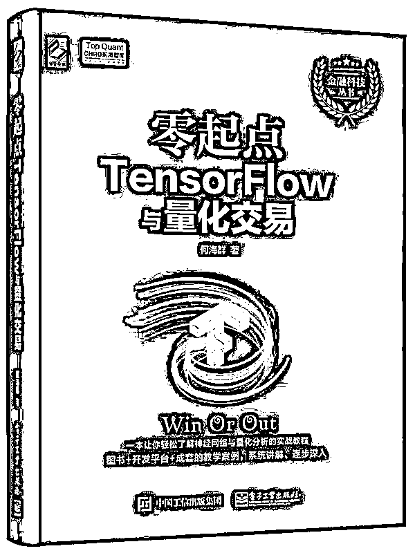

**原价：99.00 元**

**截止 2018.04.21 18:00**

大家在本篇推文【写留言】处发表留言，**获得****点赞****数****前五****的读者，即可免费获赠此书**。届时，工作人员会联系五位读者，寄出此书。

****