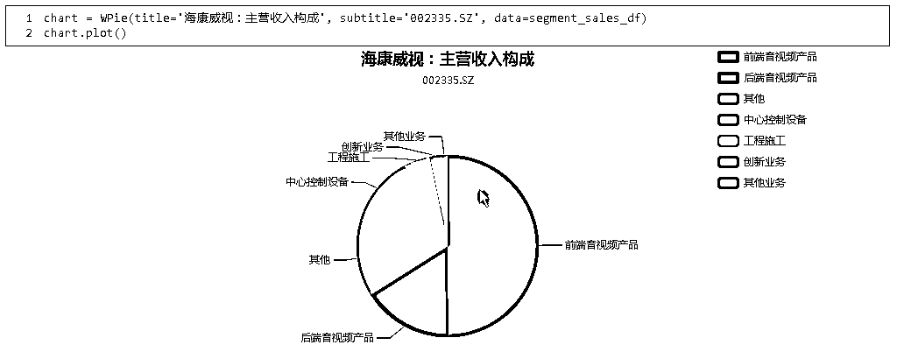

# 【福利】一款量化投资的可视化利器——WindCharts，强势来袭！

> 原文：[`mp.weixin.qq.com/s?__biz=MzAxNTc0Mjg0Mg==&mid=2653287869&idx=1&sn=60a5205cbb38c1ee772b67cb7a971c64&chksm=802e37a8b759bebe44636594be46a476405ef63b93cf0c91cf2e53a0ecb47fd49c76fb8c5fe7&scene=27#wechat_redirect`](http://mp.weixin.qq.com/s?__biz=MzAxNTc0Mjg0Mg==&mid=2653287869&idx=1&sn=60a5205cbb38c1ee772b67cb7a971c64&chksm=802e37a8b759bebe44636594be46a476405ef63b93cf0c91cf2e53a0ecb47fd49c76fb8c5fe7&scene=27#wechat_redirect)


**量化投资与机器学习**

为中国的量化投资事业贡献一份我们的力量!

 

今天，公众号给大家介绍一款量化投资的可视化利器——**Wind****资讯**旗下量化分析云平台**万矿**开发的**国内量化平台首款****交互式可视化 Python 库**——**WindCharts**。

作为量化方向的自媒体平台，公众号觉得这款工具很好用，所以推荐给大家！下面就让我们去了解这款强大的工具吧！


**WindCharts 的优势**

在 Python 中，有很多可视化工具，比如 Matplotlib，seaborn 等，它们可以非常方便地做出常见的图，但是有些图往往需要很长的代码量，编写难度较大，并且画出的图一般是一张图片，无法进行细节分析。而当前基于 JavaScript 的可视化图都非常炫酷，体验感也很好。鉴于此，万矿开发了一套交互式可视化 Python 库：****WindCharts****。

**WindCharts 不仅让大家**方便快捷地**做图，而且所做的图还附带了动态可视化效果，让大家在研究过程中更加直观和详细的分析结果！**

**WindCharts 希望用户**

**更便捷****、****更高效**

**做更有意义的事**

**Windcharts 简介**

WindCharts 库中图形种类丰富，包含**K 线图**，**饼图**，**热力图**，**线型图**，**雷达图**，**关系图**，**日历图**，**堆叠条形图**，每日回撤，**净值组合图**。

具体使用文档：*https://www.windquant.com/qntcloud/help#doc-97*

在使用 WindCharts 时要**注意**的是，作图函数输入**数据集一般都是数据框的格式**，而数据框中的**日期要求是字符型('yyyy-mm-dd')的格式**。

使用前先引入该工具库：

```py
from WindCharts import *
```

再导入其他相关的库：

```py
import datetime 
import pandas as pd
from pandas import DataFrame
from WindPy import *
import talib as ta
w.start(show_welcome=False)
```

下面就让我们一睹 Windcharts 在实际研究中的强大应用吧！

**一、K 线图**

**WCandlestick**

```py
WCandlestick(title,subtitle, data, ma)
```

K 线图是投资者常用的分析工具。在 K 线图中，**除了画出 K 线和均线之外，还可以自己定义想画的曲线(如一些技术指标)。而且在 K 线图中也可以标记买卖点**。 

在本例中，除了画出平安银行从 2017-03-17 至 2017-06-18 的基础行情及均线之外，**还画出了其布林带的上界和下界**。 

```py
wsd_data=w.wsd("000001.SZ", "open,high,low,close,volume", "2017-03-17", "2017-06-18", "")
data_df = DataFrame(wsd_data.Data,index=['open','high','low','close','volume']).T #转置数据表
data_df['date']=[str(date_temp.date()) for date_temp in  wsd_data.Times]
upperband, middleband, lowerband = ta.BBANDS(np.array(data_df['close']))
data_df['upperband'] = upperband
data_df['lowerband'] = lowerband
data_df.head()
```


```py
data_trade = pd.DataFrame([['sell','2017-04-05',9.21],['buy','2017-05-08',8.57],['sell','2017-05-31',9.2]],
columns=['buysell','date','price'])
data_trade
```


## **二、饼图**

**WPie**

```py
WPie(title, subtitle, data)
```

常用饼图来看各个组成部分的占比情况，来判断重要程度。

```py
wss_data=w.wss("002415.SZ", "segment_sales","rptDate=20161231;order=2")
if(wss_data.ErrorCode==-40522015):
   print('该案例需要用到 财务报表-主营业务构成 指标，您没有该指标的权限，如有需要，请联系管理员开通！')
else:
   segment_sales_temp = wss_data.Data[0][0].split(';')
   segment_sales_list=[[temp.split(':')[0],float(temp.split(':')[-1].strip("%"))] for temp in segment_sales_temp]
   segment_sales_df=DataFrame(segment_sales_list,columns=['name','value'])
segment_sales_df.head()
```




## **三、热力图**

**WHeatmap**

```py
WHeatmapWPie(title, subtitle, data)
```

在分析工作中，需要**查看一些对象两两之间的关系**，例如查看所有人工智能概念股，两两之间的相关性。而直接查看他们的相关性矩阵不直观，**用热力图来表示更为直观，可读性更强。**

```py
def get_data(code):
   wsd_data=w.wsd(code, "close,volume,pct_chg", "2017-01-01", "2017-06-27", "")
   data_df = DataFrame(wsd_data.Data,index=wsd_data.Fields).T
   return data_df

#获取股票代码
wset_data=w.wset("sectorconstituent","date=2017-06-28;sectorid=1000011274000000")
code_df=DataFrame(wset_data.Data,index=wset_data.Fields,columns=wset_data.Codes).T

#获取行情数据
data_all=[]
for i in range(len(code_df)): 
   temp_df=get_data(code_df['wind_code'][i])
   data_all.append(temp_df)

#计算相关性
corr_df=DataFrame(columns=[code_df['sec_name'][i] for i in range(len(code_df)) ])
for i in range(len(code_df)):
   #print(i)
   corr_temp=[]
   for j in range(len(code_df)):
       corr_temp1=data_all[i]['CLOSE'].corr(data_all[j]['CLOSE'])
       corr_temp2=data_all[i]['VOLUME'].corr(data_all[j]['VOLUME'])
       corr_temp3=data_all[i]['PCT_CHG'].corr(data_all[j]['PCT_CHG'])
       corr_temp.append((corr_temp1+corr_temp2+corr_temp3)/3)
   corr_df.loc[i]=corr_temp
corr_df=corr_df.fillna(0)
corr_df.index=corr_df.columns
corr_df.head()
```


## **四、线形图**

**WLine**

```py
WLine(title,subtitle,data, category,auto_yaxis=True)
```

在分析工作中，需要同时**查看多个时间序列的走势情况，可用线形图**。例如查看 07 年至 16 年机器人公司的主营业务收入分布情况。

```py
def get_segment_sales(code):
   #主营业务数据获取
   rptDate_list=['2007','2008','2009','2010','2011','2012','2013','2014','2015','2016']
   all_data_df=None

   for rptDate in rptDate_list:
       wss_data=w.wss(code, "segment_sales","rptDate="+rptDate+"1231;order=2")
       if(wss_data.ErrorCode==-40522015):
           print('错误提示：该案例需要用到 财务报表-主营业务构成 指标，您没有该指标的权限，如有需要，请联系管理员开通！')
           break
       else:
           segment_sales_temp=wss_data.Data[0][0].split(';')
           segment_sales_list=[[temp.split(':')[0],float(temp.split(':')[-1].strip("%"))] for temp in segment_sales_temp]
           values=[temp[1] for temp in segment_sales_list]
           items=[temp[0] for temp in segment_sales_list]
           segment_sales_df=DataFrame()
           segment_sales_df[rptDate]=values
           segment_sales_df.index=items
           segment_sales_df=segment_sales_df.T
           if(all_data_df is None):
               all_data_df = segment_sales_df
           else:
               all_data_df=all_data_df.append(segment_sales_df)

   return all_data_df

code='300024.SZ'
all_data_df=get_segment_sales(code)
all_data_df.head()
```


## **五、雷达图**

**WRadar**

```py
WRadar(title,subtitle, data, category)
```

雷达图常用于**展示组成分布的变化情况**。例如，用雷达图可视化万科自 14 年至 16 年的财务数据变化情况。

```py
def get_yoy_equity(code):
   #主营业务数据获取
   rptDate_list=['2014','2015','2016']
   yoy_df=None

   for rptDate in rptDate_list:
       wss_data=w.wss(code, "yoy_equity,yoyeps_basic,yoy_tr,yoycf,yoyprofit,yoydebt","rptDate="+rptDate+"1231")
       if(wss_data.ErrorCode==-40522015):
           print('该案例需要用到某些财务指标，您没有对应指标的权限，如有需要，请联系管理员开通！')
           break
       else:
           yoy=DataFrame(wss_data.Data,index=['净资产(同比增长)','每股收益(同比增长)','营业总收入(同比增长)','现金净流量(同比增长)','净利润(同比增长)','总负债(同比增长)'],columns=[rptDate])
           yoy=yoy.T
           if(yoy_df is None):
               yoy_df = yoy
           else:
               yoy_df=yoy_df.append(yoy)

   return yoy_df

code='000002.SZ'
yoy_df =get_yoy_equity(code)
yoy_df.head()
```


```py
chart = WRadar(title='万科 A：财务指标雷达图',subtitle=code,data=yoy_df,category=list(yoy_df.index))
chart.plot()
```


## **六、关系图**

**WGraph**

```py
WGraph(title, data)
```

关系图用来**展示几个对象之间的关系**。例如使用关系图可视化上市公司浦发银行与大股东的关系。

```py
wset_data=w.wset("top10shareholders","windcode=600000.SH;year=2016;period=年报")
if(wset_data.ErrorCode==-40522015):
   print('该案例需要用到十大股东报表数据，您没有对应指标的权限，如有需要，请联系管理员开通！')
else:
   wset_df=DataFrame(wset_data.Data,index=wset_data.Fields,columns=wset_data.Codes).T

   holder_data=DataFrame()
   holder_data['holder']=wset_df['name']
   holder_data['stock']='浦发银行'
   holder_data['ratio']=[str('%0.2f'%wset_df['ratio'][i]) for i in range(len(wset_df))]

holder_data.head()
```


## **七、日历图**

** WCalendar**

```py
WGraph(title, data, category)
```

日历图可用来**直观展示某个序列的变化情况**。例如使用日历图可视化大盘的每日的涨跌。index_chg_df 为输入数据集。得到图形后，通过拖动图形下方的条形上的指针，可以改变图形的形态，方便查看大涨是哪几天。

```py
wsd_data=w.wsd("000001.SH", "pct_chg", "2016-01-01", "2016-12-31", "")
index_chg_df = DataFrame(wsd_data.Data,index=wsd_data.Fields,columns=wsd_data.Times).T 
index_chg_df.columns=['2016']
index_chg_df.index=[str(index_chg_df.index[i])[5:10] for i in range(len(index_chg_df))]
index_chg_df.head()
```


## **八、堆叠条形图**

**WStacking_bar**

```py
WStacking_bar(title, data)
```

堆叠条形图常用于展示几个对象组成构成的差异性。例如查看几个基金在大类资产持仓分布情况。

```py
list_fund = ['000001.OF','000011.OF','000017.OF','000020.OF']
data = w.wss(list_fund, "prt_stocktonav,prt_bondtonav,prt_fundtonav,prt_warranttonav,prt_cashtonav,prt_othertonav", "rptDate=2017-06-30")
data = DataFrame(data.Data, columns=data.Codes, index=['股票市值占比','债券市值占比','基金市值占比','权证市值占比','银行存款市值占比','其他资产市值占比'])
data = data.fillna(0)
data
```


## **九、每日回撤和净值组合图**

**WMax_Drawdown**

```py
WMax_Drawdown(title, data)
```

**在量化策略回测完成后，通常希望将每日回撤和净值曲线画在同一个图中**。这里以一个 MA 均线策略为例。 

nav_df 为作图输入数据集。如果不想查看每日回撤，点击图形右侧的图例 Max_Drawdown 就可以取消显示每日回撤。

```py
from WindAlgo import * #引入回测框架

def initialize(context):#定义初始化函数
   context.capital = 1000000 #回测的初始资金
   context.securities = ["000001.SZ","600519.SH"] #回测标的
   context.start_date = "20150101" #回测开始时间
   context.end_date = "20170501" #回测结束时间
   context.period = 'd' #策略运行周期, 'd' 代表日, 'm'代表分钟

def handle_data(bar_datetime, context, bar_data):#定义策略函数
   his= bkt.history('600519.SH',30) #使用 history 函数获取近期历史行情
   ma5=ta.MA(np.array(his.get_field('close')), timeperiod=5, matype=0) #使用 talib 技术指标库计算 5 日均线
   ma20=ta.MA(np.array(his.get_field('close')), timeperiod=20, matype=0)
   position=bkt.query_position() #查询当前持仓
   if('600519.SH' in position.get_field('code')): #如果当前持仓中有 600519.SH
       if(ma5[-1]<ma20[-1]): #如果 5 日均线下穿 20 日均线，则卖出所有股票
           bkt.batch_order.sell_all()
   else:
       if('600519.SH' not in position.get_field('code')): #如果当前持仓中没有 600519.SH
           if(ma5[-1]>ma20[-1]): #如果 5 日均线上穿 20 日均线，则买入股票
               res = bkt.order('600519.SH', 4000, 'buy')

bkt = BackTest(init_func = initialize, handle_data_func=handle_data) #实例化回测对象
res = bkt.run(show_progress=False) #调用 run()函数开始回测,show_progress 可用于指定是否显示回测净值曲线图
nav_df=bkt.summary('nav') #获取回测结果
```

```py
nav_df = nav_df.get_dataframe()
nav_df.columns = ['date','nav','benchmark']
nav_df['date'] = [i.strftime('%Y-%m-%d') for i in nav_df['date']]   #将日期转化为字符型
nav_df.head()
```


 **网址：****www.windquant.com**

**iWind 交流群：****463249**

**QQ 群：****465776969**

↙↙↙点击“**阅读原文**”**【可免费注册万矿账号】**