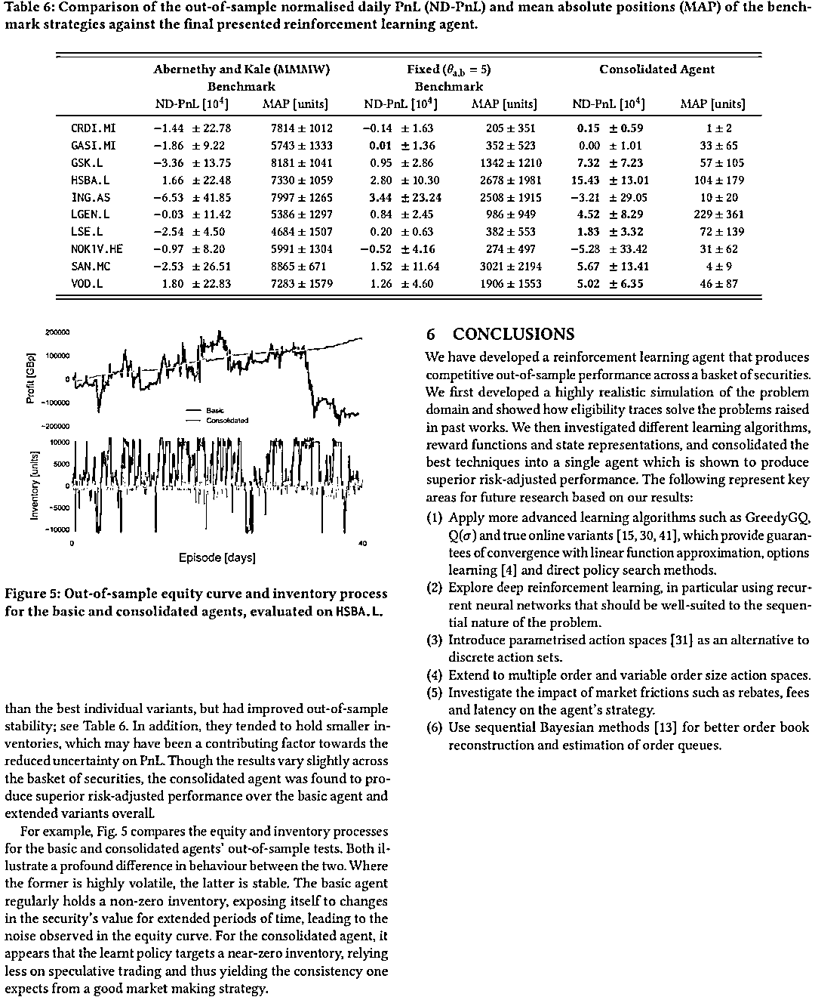

# 【最新研究】强化学习在 Market Making 上的应用（系列 58）

> 原文：[`mp.weixin.qq.com/s?__biz=MzAxNTc0Mjg0Mg==&mid=2653287860&idx=1&sn=12a3648d2df3f79c3aa20db99bac2949&chksm=802e37a1b759beb72c5fc327c8f0ec9d1fd47776254c9a72bc54851cacc05b7270d05911944b&scene=27#wechat_redirect`](http://mp.weixin.qq.com/s?__biz=MzAxNTc0Mjg0Mg==&mid=2653287860&idx=1&sn=12a3648d2df3f79c3aa20db99bac2949&chksm=802e37a1b759beb72c5fc327c8f0ec9d1fd47776254c9a72bc54851cacc05b7270d05911944b&scene=27#wechat_redirect)

**量化投资与机器学习**

为中国的量化投资事业贡献一份我们的力量!

 

作者 | Thomas Spooner、John Fearnley、Rahul Savani、Andreas Koukorinis

今天分享一篇来自利物浦大学的最新研究。此文讲述了 Reinforcement Learning 在 Market Making 上的应用。由于内容涉及较为复杂，后续部分仅做展示。（论文在文章末尾获取）

前七期传送门：

【系列 57】[为什么机器学习在投资领域并不是那么好用](https://mp.weixin.qq.com/s?__biz=MzAxNTc0Mjg0Mg==&mid=2653287798&idx=1&sn=e246e931e8770386c68b0b10ed735116&chksm=802e3763b759be7556ca7f77d8128df3421633a51f3010a2527a39cb16a69c760f3589cdb943&scene=21#wechat_redirect)

【系列 56】[特征重要性在量化投资中的深度应用](https://mp.weixin.qq.com/s?__biz=MzAxNTc0Mjg0Mg==&mid=2653287672&idx=1&sn=9f59afb57b99cab6692367578c0aaa70&chksm=802e36edb759bffbd644791bb16bbe1ee0042ac3118421976e13141b807f90ae1f3d752c3450&scene=21#wechat_redirect)

【系列 55】[机器学习应用量化投资必须要踩的那些坑](https://mp.weixin.qq.com/s?__biz=MzAxNTc0Mjg0Mg==&mid=2653287642&idx=1&sn=a7c71f89c3ad6f60590585b1bf016780&chksm=802e36cfb759bfd9a629eae57fc430ff457753a138d053cb7666d55cd41f91809d821285a521&scene=21#wechat_redirect)

【系列 54】[因子的有效性分析基于 7 种机器学习算法](https://mp.weixin.qq.com/s?__biz=MzAxNTc0Mjg0Mg==&mid=2653287512&idx=1&sn=14ee62549dab3c64468f78b3dbfd39a5&chksm=802e364db759bf5bb5abffc6a50f72d0e31722c178e01ce11a3d48fb28386055e741c9ecce8d&scene=21#wechat_redirect)

【系列 53】[基于 XGBoost 的量化金融实战](https://mp.weixin.qq.com/s?__biz=MzAxNTc0Mjg0Mg==&mid=2653287481&idx=1&sn=dcb1dda1e2362d8297ae1a97845cf02e&chksm=802e362cb759bf3a3aaea75af824451a3dba7345ecc73e27facc4b917792835fdd2878403c8c&scene=21#wechat_redirect)

【系列 52】[基于 Python 预测股价的那些人那些坑](https://mp.weixin.qq.com/s?__biz=MzAxNTc0Mjg0Mg==&mid=2653287306&idx=1&sn=9f374874636e7d6d52a9b3d92d6aa81b&chksm=802e319fb759b8896acf2ed9529da88a8fda0d76d6a3b816854e9ad5eeecfd6f4af75dd65804&scene=21#wechat_redirect)

## 【系列 51】[通过 ML、Time Series 模型学习股价行为](https://mp.weixin.qq.com/s?__biz=MzAxNTc0Mjg0Mg==&mid=2653287197&idx=1&sn=9630389a52c7d0be4c1feaf3a534c2ce&chksm=802e3108b759b81ed11174f71b23fb73abe5c4ebad0f9d480b6efbd8f7e644de6b2232dc63fa&scene=21#wechat_redirect)

**摘要**

Market making is a fundamental trading problem in which an agent provides liquidity by continually o ering to buy and sell a security. The problem is challenging due to inventory risk, the risk of accumulating an unfavourable position and ultimately losing money. **In this paper, we develop** **a high- delity simulation** **of limit order book markets, and use it to design a market making agent** **using temporal-di erence reinforcement learning****.** We use a linear combination of tile codings as a value function approximator, and design a custom reward function that controls inventory risk. We demonstrate the e ectiveness of our approach by showing that our agent outperforms both simple benchmark strategies and a recent online learning approach from the literature.（论文在文章末尾获取）

**前言**

The role of a market maker is to provide liquidity by facilitating transactions with other market participants. Like many trading problems, it has become increasingly automated since the advent of the electronic limit order book (LOB), as the need to handle more data and act on ever shorter time scales renders the task al- most impossible for humans [25, 29]. Upwards of 60% of trading volume on some particularly active markets has been attributed to automated trading systems [27, 36]. This paper uses reinforce- ment learning (RL) to design competitive market making agents for  nancial markets using high-frequency historical equities data.

**解读：**讲述了做市商的重要性，自从电子限价订单（LOB）出现以来，在一些特别活跃的市场上，60％以上的交易量归功于自动交易系统。本文使用强化学习（RL），利用高频股票历史数据为金融市场设计具有竞争力的 making agents。

**相关研究**

****解读：****讲述相关研究，大家可自行阅读，不再陈述。（论文在文章末尾获取）

**正文**

**解读：**使用的数据和来源还有初始模型规则设定。

**获取论文****点击**

**阅读原文**