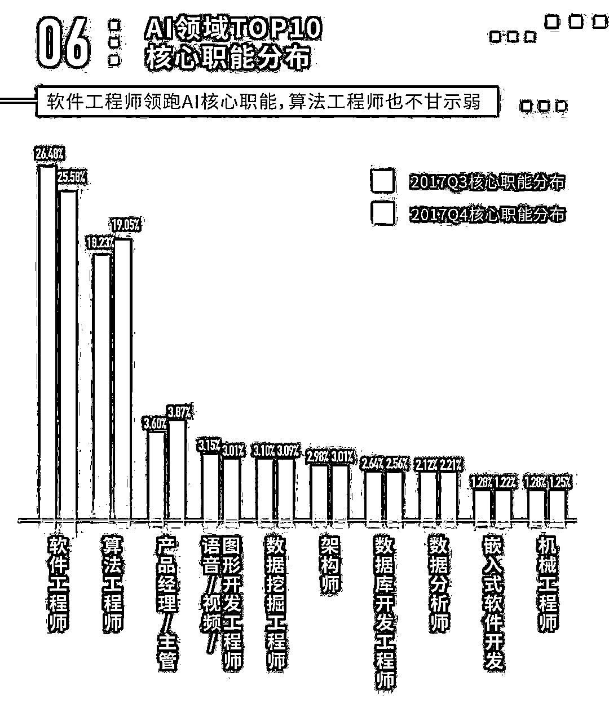

# 【前沿】AI 稳超互联网平均薪资，看看哪些细分领域最受追捧？

> 原文：[`mp.weixin.qq.com/s?__biz=MzAxNTc0Mjg0Mg==&mid=2653287846&idx=1&sn=4056e1535bd63fc3db2c8227a452c645&chksm=802e37b3b759bea5989ede5f96d761620398921cfa0f36fcaa8f4a55bfd69075f36a7955bd3b&scene=27#wechat_redirect`](http://mp.weixin.qq.com/s?__biz=MzAxNTc0Mjg0Mg==&mid=2653287846&idx=1&sn=4056e1535bd63fc3db2c8227a452c645&chksm=802e37b3b759bea5989ede5f96d761620398921cfa0f36fcaa8f4a55bfd69075f36a7955bd3b&scene=27#wechat_redirect)

**量化投资与机器学习**

为中国的量化投资事业贡献一份我们的力量!

 

来源：AI 科技大本营 

数据：猎聘大数据研究院

人工智能在经历了 2017 年的迅速发展之后，逐步迎来了落地应用。AI 领域的人才需求也发生调整。近日，猎聘联合 GMIC 发布了《 2018 AI 人才竞争力报告》，本次报告研究了猎聘平台 550 万个相关行业的经理人样本，并结合猎聘近期覆盖超 13000 职场人的问卷调查，得出相关数据和结论。**报告指出，AI 领域从业者平均薪资高于互联网行业平均薪资，最高季度平均年薪达 33 万元，高出互联网平均年薪近 5 万元。**

### 

******************************************************************▌********************************************************************自动驾驶、语音识别，晋升为热度最高职位**

报告显示，2017 年三季度，在 AI 的六个核心领域 “ 自动驾驶、计算机视觉、语音识别、自然语言处理、机器学习、知识推理 ” 中，**机器学习**的竞争热度最高，竞争热度指数为 8.28 ；其次是自动驾驶，竞争热度指数为 8.24。



（数据来源：猎聘大数据研究院）

同年四季度，自动驾驶的竞争热度指数最高，为 8.47 ；其次是语音识别，竞争热度指数为 8.40 。整体来看，在 2017 年下半年两个季度中，自动驾驶竞争热度指数都表现较高。自动驾驶和语音识别受到热捧跟行业热点事件不无关系，2017 年，百度李彦宏乘坐自动驾驶汽车参加百度 AI 开发者大会，多家企业相继发布智能音响硬件，一度使得自动驾驶和语音识别领域的关注度激增。

### 

******************************************************************▌********************************************************************AI 年薪比互联网年薪高出近 5 万余元**

AI 的发展与互联网密不可分，报告将 AI 从业人员的薪资和互联网从业人员薪资做了对比。

报告显示，所调查的六个季度中，AI 领域从业人员的平均年薪均高于互联网从业人员的平均年薪。其中，在 2017 年三、四季度，AI 平均年薪和互联网平均年薪都达到了峰值：AI 平均年薪在 2017 年三季度达到峰值，为 32.95 万元，同比上升 10.79%；互联网平均年薪峰值在 2017 年四季度达到峰值，为 28.16 万元，同比上升 11.26% 。AI 平均年薪峰值比互联网平均年薪峰值高 4.79 万元。

 

（数据来源：猎聘大数据研究院）

报告显示，在六个季度中，互联网行业年薪处于稳步增长的过程中，在 2017 年四季度达到峰值。AI 领域年薪在 2017 年二、三季度达到峰值，四季度出现降温的趋势，薪资有所下降，但仍高于互联网年薪 3 万余元。

### 

******************************************************************▌********************************************************************软件、算法工程师领跑 AI 核心职能**

2017 年三、四季度，在排名前十的 AI 核心职能分布（核心职能需求占比）中，软件工程师和算法工程师占比最高，名列第一和第二。两种职能在三四季度的占比差别并不大，三季度软件工程师占比稍高于四季度；而算法工程师的占比则是四季度略高于三季度。



（数据来源：猎聘大数据研究院）

人工智能的迅猛发展得益于“互联网+”的大力发展，后者形成了庞大数据的沉淀，进而也促进了算法的突飞猛进。因而，软件工程师和算法工程师作为核心职能，所占比重最高。

其他核心职能的占比相对较低，在 1.22%-3.87% 之间。值得注意的是，具有明显互联网属性的职能——产品经理在 AI 核心职能中名列第三，可见 AI 领域对于落地转化为产品的重视。机械工程师也跻身前十，虽然是第十位，但是这足以证明 AI 和机械制造已经有了更多的交集和深度融合。

### 

****************************************************************▌******************************************************************本科毕业生仍是 AI 领域的主力军**

AI 的高科技属性决定了它具有较高的学历门槛。从 2016 年三季度到 2017 年四季度的六个季度中，AI 对核心职能的需求在不同的学历中表现为：本科生仍是 AI 领域的主力军，但整体需求略有下降，2017 年四季度本科职位需求占比为 77.42%，同比下降 4.92%。



（数据来源：猎聘大数据研究院）

与此同时，AI 领域的职位对博士和硕士的需求总体呈逐年上升的趋势，2017 年四季度对硕士和博士的需求占比分别为 20.78%、1.80%，分别同比上升 17.14%、116.87%。2017 年三季度 AI 领域对博士学历人才的需求达到了这六个季度的峰值，为 2.92%。

在猎聘近期上万人的问卷调研中，人们描述 AI 提起频率最多的三个形容词是“尖端”“精准“快捷”，选择这三个词的人占比为 72.30%、63.20%、46.00%，这三个词也从另一方面代表了人们对 AI 的认知更偏向高科技。AI 的发展融合了众多学科的前沿成果，高学历在这个领域将越来越受欢迎。

### 

****************************************************************▌******************************************************************AI 人才占据互联网半壁江山**

纵观 2016 年三季度到 2017 年四季度，AI 人才在全行业均有不同程度的分布，其中在互联网行业中分布最多，各个季度都超过六成；其次是电子通信、机械制造和金融行业。



（数据来源：猎聘大数据研究院）

在这六个季度中，AI 人才在互联网行业的分布整体下降，四季度比三季度有所回升。在电子通信、机械制造和金融行业，AI 人才的分布总体明显上升，显示了 AI 人才在互联网行业为主导的前提下向其他行业渗透，逐步开始有更多的行业应用。

加之政策的大力支持，在今年召开的 2018 年全国科技工作会议中，科技部部长万钢在介绍 2018 年科技工作重点时指出，强化人工智能技术突破和应用示范，推进互联网、大数据、人工智能和实体经济深度融合，培育壮大共享经济、数字经济、智能经济等新的经济形态。

### 

****************************************************************▌******************************************************************京沪深三地汇集了 60% 的 AI 人才**

2017 年三、四季度在 AI 人才分布的 Top10 城市及其排名都一样，同一城市在不同的季度占比差别微小。在这两个季度，北京、上海、深圳的 AI 人才分布占比名列前三，总共汇集了全国超过 60% 的 AI 人才，仅北京就占了全国几乎三分之一的 AI 人才。这几个城市都是互联网、高科技创业公司的重镇，为 AI 提供了良好的发展土壤。



（数据来源：猎聘大数据研究院）

值得注意的是，杭州 AI 人才在两个季度的排名都跟一线城市广州不相上下，位居二线城市之首。这跟杭州具备良好的互联网发展环境和 AI 产业基础密切相关。

在这两个季度中，西安 AI 人才供给占比均排在第 11 名，三季度占比为 0.88% ，四季度为 0.94% ，是西北地区唯一跻身 AI 人才分布前 20 的城市。西安近年来加大了人才引进力度，尤其是该市自 2017 年以来不断升级人才新政，同时降低落户门槛，大力引进各类领军人才，其中包括科技创新人才，为 AI 人才的发展创造了政策优势。

### 

****************************************************************▌******************************************************************AI 人才在私企分布最多**

在 AI 人才的企业分布中，私企比重最多，2017 年下半年两个季度都超过了 70%。其次是外企，占比超过 10% ，而其他性质的企业和机构占比均不超过 10%。



（数据来源：猎聘大数据研究院）

2017 年四季度，私企 AI 人才的分布为 73.72% ，比同年三季度高出 2.75% 。私企近年来在国内相当活跃，诞生了一大批具有雄厚实力的高科技公司，如阿里、百度、今日头条等公司，对致力技术发展的人才具有强大的号召力。

在猎聘近期开展的超万人的问卷调研中，85.90% 的参与者表示有兴趣进入 AI 公司工作。猎聘职场高级顾问认为，AI 的发展势不可挡，无论人们对 AI 抱何种态度，都应开展对新领域的了解和学习；只有把握行业发展的最新潮流，才能为自己寻找到更合适的定位和更好的发展轨迹。

****