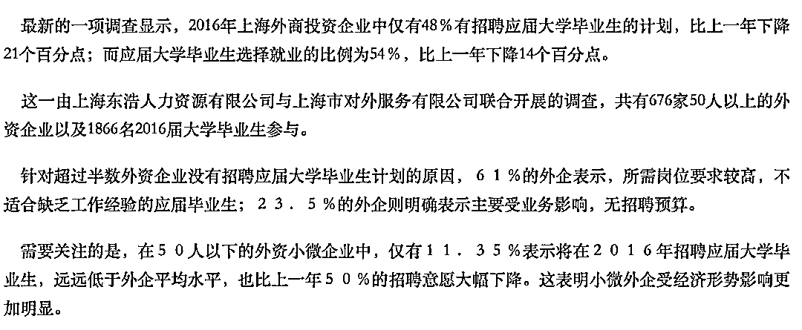
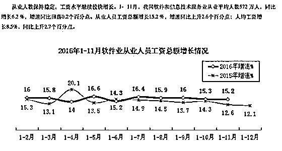
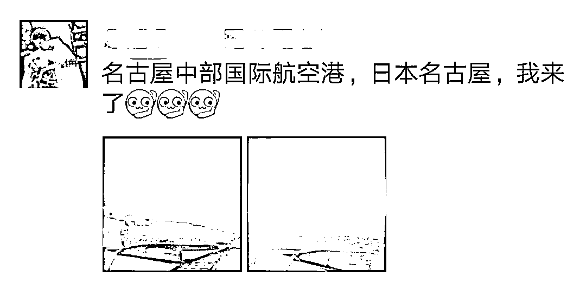
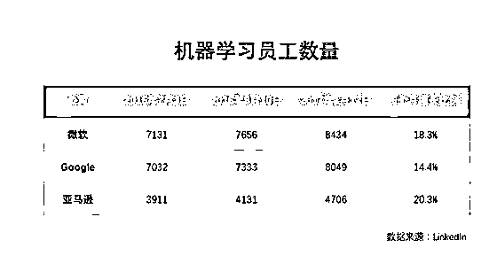
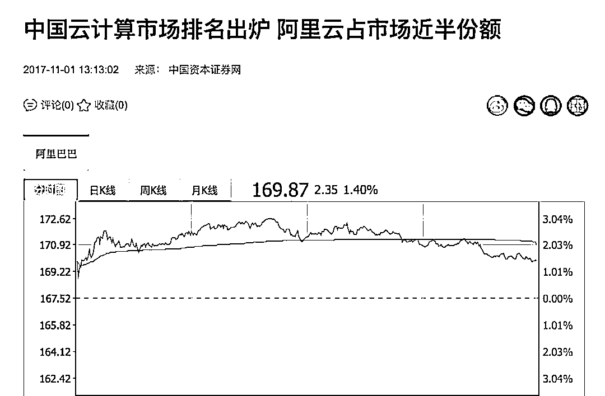
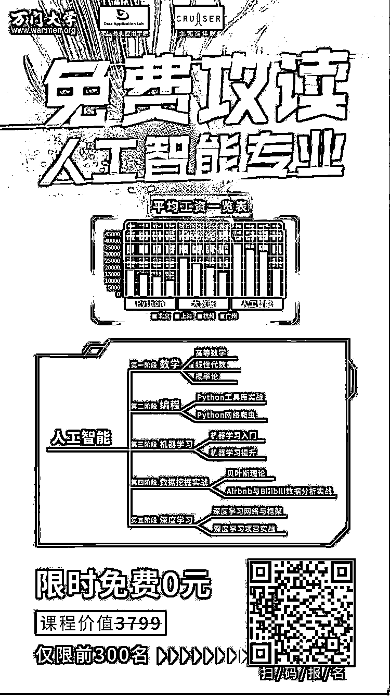

# 你还在笑码农土吗？他们可能就是你朋友圈里的真土豪

> 原文：[`mp.weixin.qq.com/s?__biz=MzAxNTc0Mjg0Mg==&mid=2653287842&idx=1&sn=6ec7c8a43ab37679f23d23631c1eb462&chksm=802e37b7b759bea1676ccfdea08d7b0cc24f089831943898b87da801e3429e791384fa791d15&scene=27#wechat_redirect`](http://mp.weixin.qq.com/s?__biz=MzAxNTc0Mjg0Mg==&mid=2653287842&idx=1&sn=6ec7c8a43ab37679f23d23631c1eb462&chksm=802e37b7b759bea1676ccfdea08d7b0cc24f089831943898b87da801e3429e791384fa791d15&scene=27#wechat_redirect)

**我说，你还在笑码农土吗？他们可能就是你朋友圈里的真土豪。**

**01**

这几天你想的最多的什么？估计就是想放假、想着年终奖，还想着新一年的职业规划和新机会。可是现实呢？在**我们周围接触的人里，可能有人正面临着被裁员的危险，特别是那些曾经带着光环的外企。**

就最近的来说，1 月 18 日，甲骨文传出裁员消息，位于亚特兰大的研发中心基本全员被裁，奥斯汀裁员 100 多人，加州裁员数也有几百人，涉及到国内的，也有原来从 Sun 收购来的 Solaris 相关部门不到 200 人的岗位进行调整。

**如果说这些是全球数据，那么再来看看国内的情况。**

中国国家统计局的数据显示，外企在国内务工人员从 2013 的 1566 万人降低到 2015 年的 1446 万人，**这意味着两年内有 7.6%的人已经离开外企**。

而在另一项统计中，外企最密集的上海，2016 年外商投资企业中仅有 48%有招聘应届大学毕业生的计划，比上一年下降 21 个百分点。而在近 500 家受访外企中，约 40% 2015 年收入较 2014 年减少或持平，在 2015 年实现财务盈利的企业比例跌至 64%，为五年来最低。

我有一个朋友，他的太太在一家德企工作。企业最风光的时候，普通前台招待福利也好得让人羡慕。然而经过 08 年金融危机，而且在 15 年以后，互联网大变革时代的到来，企业利润越来越少，他太太几次转岗都不成功，如今收入锐减，今年干脆直接被解聘离职。

**02**

**显然，外企也已经不再是高薪和前途的代名词。借锤子科技罗永浩的一句话：“未来这十几年，年轻人找工作尽量少考虑外企，因为属于中国企业的时代很快就要来了。**

那么，重点来了，在中国干啥最挣钱？

**答：干 IT。**

毕竟在这个连金融和银行都裁员的时代，IT 是难得逆市飘红的领域。

**随手翻了一下工信部官方数据，**2016 年前 11 个月，软件和信息技术服务业同比增长 14.8%，全行业实现利润 5254 亿元，同比增长 19.8%。

今年年前，我有一次在刷朋友圈的时候，看到我大学舍友晒出他在日本名古屋旅游的照片，才知道同为学中文的他早在前几年就已经自学转行 IT，公司也特地给他安排一个大 50 平左右的公寓，收入也是之前的好几倍，一想到都是在一个大学同一个专业毕业，最后收入却差那么多，这让我感到很不是滋味。

**是的，第四次工业革命——互联网大数据时代的到来，入 IT 行业成为就业的一个香饽饽。**

**看看这两年大热的几个领域。2016 年中国云计算市场依然保持增长，**而 LinkedIn 数据也显示，微软、Google 和亚马逊，非常重视机器学习，相关技能的员工在最近 6 个月里分别增加的 18.3%、14.4%和 20.3%。

**这样的增长速度，放在任何一个行业，都是会增加人员需求的，更何况是 IT 这种智力密集型的产业。**

你看，就业机会就在这里，如果你面临职业转型，来投身云计算吧，如果你是个应届毕业生，那么恭喜你，你赶上了弯道超车的好机会。

在清明节假期的时候，去深圳旅游，我大学组织里的搭档开着特斯拉来接我。他作为计算机科技与应用专业的学生，对于 JAVA 的应用可以非常纯熟，可惜，JAVA 的市场已经饱和，且 JAVA 程序员刚进厂的薪资大约是七八千左右。他在深圳呆了三个月迟迟找不到工作，后来参与了大数据与人工智能这块的三个月培训，虽然培训花费了不少费用，但如今在深圳，已经找到了一家非常不错的互联网大厂，刚刚进去工资就 12K。

平常看他在朋友圈不显山不露水的，没有想到现在他已经生活的如此潇洒。让我无限戒坛，都生发想转行 IT 的冲动。

**03**

**既然云计算是个好的选择，那么论待遇和机会哪家强？**我想，阿里云应该是不错的选择——国内第一家做云计算的企业，独占国内公有云过半的市场份额，而且阿里云的财报亮瞎眼，早就不是什么秘密了。

阿里巴巴最新公布的 2017 财年第二季度财报里，阿里云营收同比增长 130%，达到 14.93 亿元，连续第六个季度增幅领跑全球，付费用户数量也同比增 108%至 65.1 万。

**可以说，阿里云是中国云计算的黄埔军校。**

**而说到待遇，阿里绝对是国内土豪第一梯队的**。2016 年阿里校园招聘，对技术类应届毕业生的薪资是 13k~18k,而且全年 15 薪，这可能比很多工作了三五年的人还挣得多。

更厉害的是，码农一不小心还有可能当上合伙人。

比如在阿里和知乎都赫赫有名的“多隆“蔡景现，不担任任何管理岗位，一直在一线做 coding，绝对的资深码农，但是却成了 2014 年阿里上市时，以”淘宝初创团队三个开发工程师之一“成了阿里巴巴的合伙人。

**05**

写到这，我想起了今年 10 月在杭州的那场云栖大会，阿里云向人们展示了一个超级庞大的生态体系，仅仅是第一天到场参会的合作伙伴，就超过了 4 万人。而其他城市巡回的云栖大会，也基本上都是超过万人的级别。

有些人说，阿里云这是因为做云计算做的早，有先发优势。可是亲，从一个更客观的角度来说，支撑阿里云地位的其实是它背后的人才啊。

比如，云栖大会每月一次，在不同城市巡回，每次阿里云都能展示出在当地的标杆性创新项目或重磅合作。试问，有几个公司，可以每个月都拿出像样新产品、新技术或者新理念？

**再比如在人工智能领域，**年初的时候，阿里云的 AI 机器人能展示的不外乎语音识别、图片识别，最大的应用就是每场会议的速记。

不光如此，阿里云的码农和他的小伙伴们，还做了很多神奇的事情：支撑世界最大的天文望远镜 Fast 观测浩瀚宇宙。

而在我们的日常里，阿里云做的更多，调度饿了么外卖员，调度我们的快递物流，还有卫星定位服务等等。

**所以，一个普通的码农可以有多大的发展空间，也许会变成码神、也许变成合伙人，变成大家羡慕的土豪。可是真正厉害的是，没有码农，我们现在的一切便利生活就得变得一团糟，从这个角度来说，普普通通的码农已经拯救了全世界。**

你还嘲笑码农土吗？

**如果你想转行 IT 领域，可以报名我们的课程《免费攻读人工智能课程》，只限 300 个名额。**

如果你按照我们的课程步骤一步步扎实学习的话，相信你最终一定在人工智能方面小有成就，学完找到这类工作也会容易得多，**而且****薪水不会低。**

**为什么我们有信心开设这次人工智能专业学习课程？**

**一切归属于强大的导师团****。**为了开设人工智能课程，我们专门挖来了巴黎高师、以色列理工大学和美国数据应用学院的资深大咖来教授这门专业课程。

**限额前 300**，课程培训报名方式见下图

↓↓↓↓

