# 用 Numpy 实现优化算法比较

> 原文：[`mp.weixin.qq.com/s?__biz=MzAxNTc0Mjg0Mg==&mid=2653287834&idx=1&sn=20cdf4af9d851164199d0d9ff090f64d&chksm=802e378fb759be993daff21920e47265d5a8a5a0e940d370a2780959e7d9638515e63e689b21&scene=27#wechat_redirect`](http://mp.weixin.qq.com/s?__biz=MzAxNTc0Mjg0Mg==&mid=2653287834&idx=1&sn=20cdf4af9d851164199d0d9ff090f64d&chksm=802e378fb759be993daff21920e47265d5a8a5a0e940d370a2780959e7d9638515e63e689b21&scene=27#wechat_redirect)

**量化投资与机器学习**

为中国的量化投资事业贡献一份我们的力量!

 

I wanted to make this post for a long time, since not only I wanted to implement different kinds of optimization algorithms but also compare them to one another. And it would be bit boring to only compare the ‘traditional’ optimization so I will add in three more, the list of all optimization method is shown below.

**要比较的优化算法列表**

> a. Stochastic Gradient Descent (One Line)
> b. Momentum
> c. Nesterov accelerated gradient
> d. Adagrad
> e. Adadelta
> f. RMSprop
> g. Adam
> h. NAdam
> i. Google Brain’s Gaussian Additive Noise 
> j. Noise Training
> k. Noise Training + Gaussian Additive Noise
> l. Adam Noise Training

The final three methods is me playing around, simple noise training adding Gumbel noise rather than gradient descent. Also, please note that I won’t provide screen shot of back propagation process for EVERY optimization algorithms (since there are quite a lot) Rather I will cover few that are bit different from one another.

**训练数据/超参数**

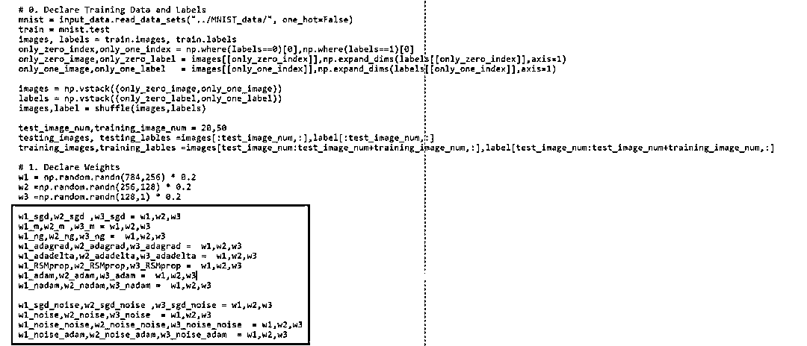

与平常一样，我们将使用 MNIST 数据集仅对 0 和 1 的图像进行分类。 同时请注意我们为每个测试用例声明 Green Boxed 的权重区域，为了公平，我们将它们初始化为相同权重。

**Network Architecture**

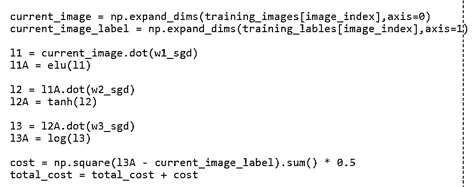

Now all of the networks share same architecture, where they have three layers and each of layers have activation functions as elu(), tanh() and log(). Which is logistic sigmoid function.

**Back Propagation — Nesterov Accelerated Gradient**

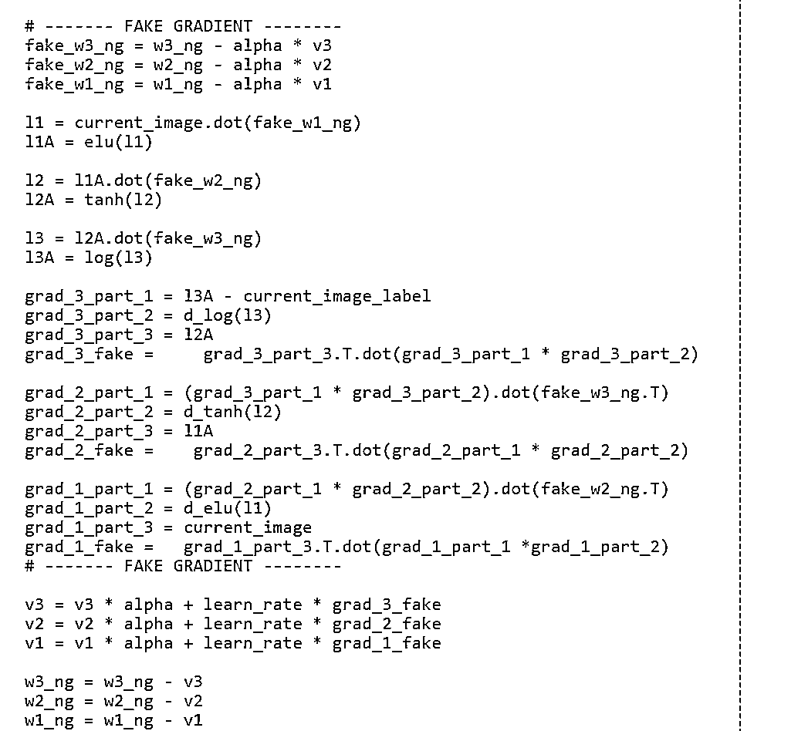

Back propagation on Nesterov accelerated Gradient was one of the weirdest back propagation I ever saw LOL. But the idea made so much sense, taking one more step to see the future and change direction accordingly.

**Back Propagation — RMSProp**

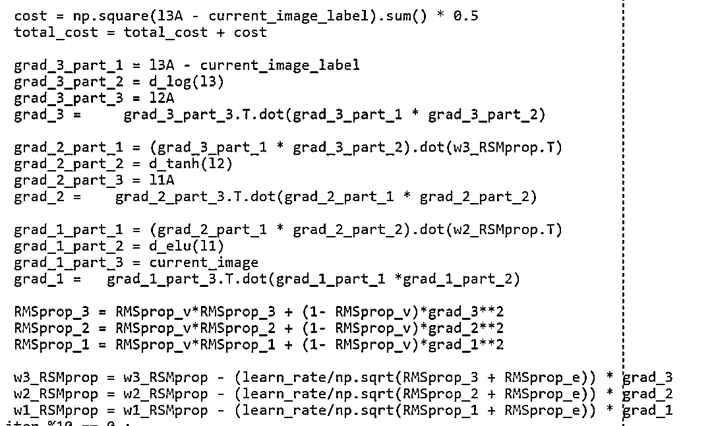

RMSProp was very interesting optimization method since it was not published and made independently from Adadelta. It felt like as a rule of thumb it is a good idea to have decaying learning rate as well as velocity (momentum), when training NN.

**Back Propagation — NAdam**

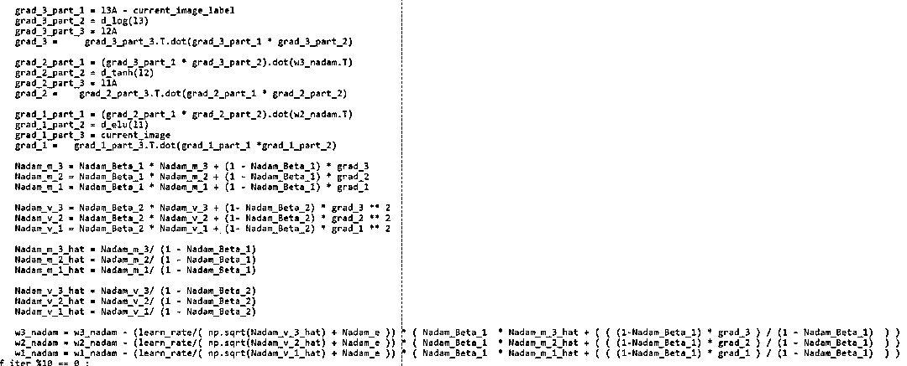

This was one of the most coolest yet, complex solution I saw. Idea of combining Nesterov accelerated gradient and Adam is very cool. Kudos to Timothy Dozat again for thinking this idea.

**Back Propagation — Google Brain’s Gaussian Additive Noise**

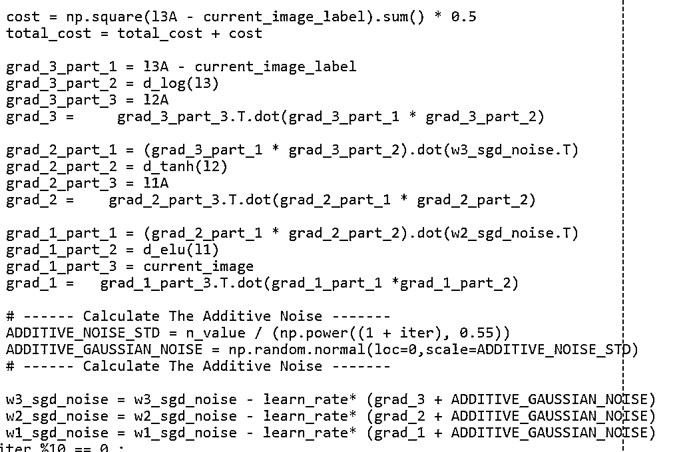

Here we have very simple yet powerful solution, just adding Gaussian noise to gradient. I am still wowed by how this simple method improves overall accuracy.

**Back Propagation — Noise Adam**

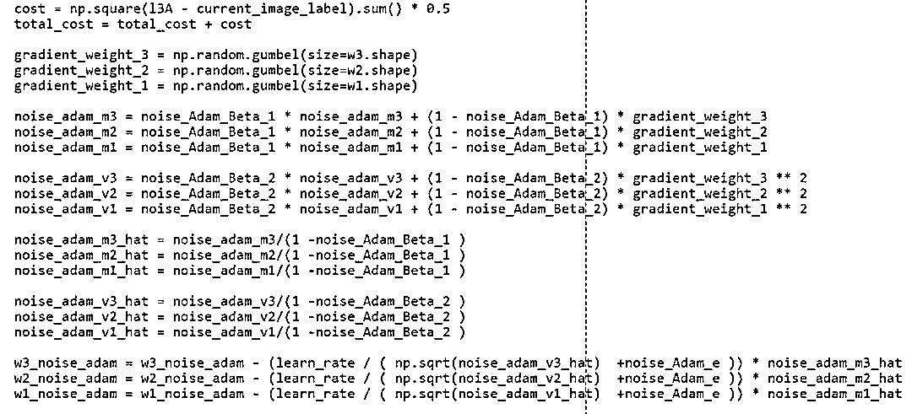

Building the idea of Noise Training, I incorporated the idea of decaying previous gradient as well as momentum. Also, please do note for Noise Training methods I set the learning rate as 0.00001.

**训练结果**

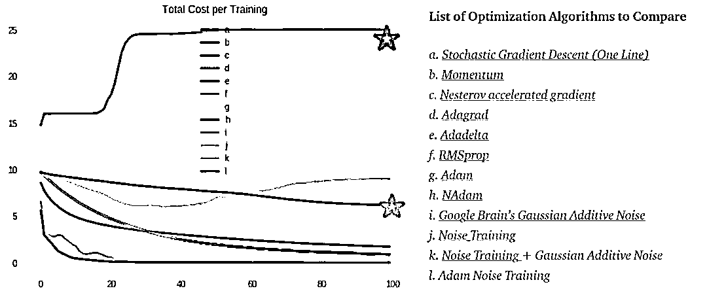

Above image is trained result from running the code on Google Colab (Greatest invention of man kind.). I was mostly amazed by two things. The Red Star → Where Adadelta’s cost have started going crazy and went to point of no return. 

Brown Star → Where Adam Noise optimization method actually started to show signs of convergence. It is truly amazing to see how this is even possible.

Also, please note the reason why you can’t see Noise Training results (j) is because Noise Training and Gaussian Additive Noise almost have identical cost values, so one is overlay-ed by another.

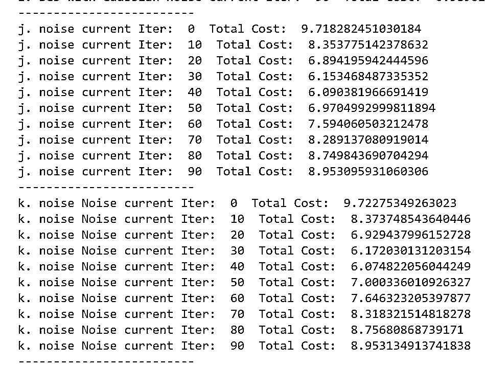

以上你可以看到两种优化方法的 cost values 是非常接近的。

**Interactive Code**

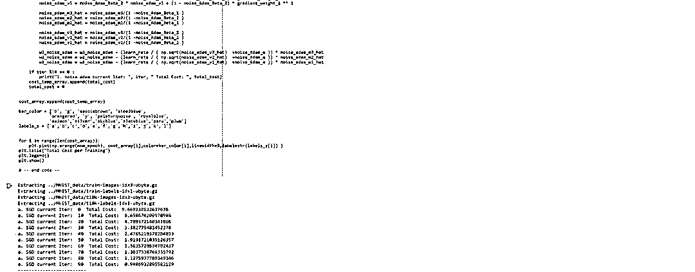

I moved to Google Colab for Interactive codes! So you would need a google account to view the codes, also you can’t run read only scripts in Google Colab so make a copy on your play ground. Finally, I will never ask for permission to access your files on Google Drive, just FYI. Happy Coding!

To access the interactive code, please click here.

*https://colab.research.google.com/notebook#fileId=1Xsv6KtSwG5wD9oErEZerd2DZao8wiC6h*

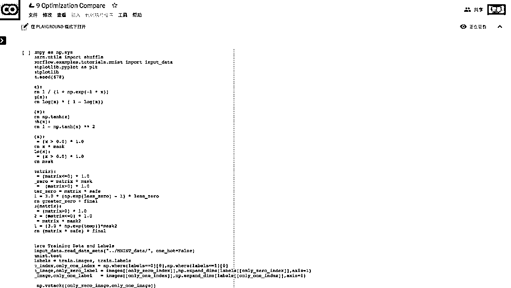

**参考**

1、Sutton, R. S. (1986). Two problems with backpropagation and other steepest-descent learning procedures for networks. In Proceedings of Eightth Annual Conference of the Cognitive Science Society, 1986.

2、Qian, N. (1999). On the momentum term in gradient descent learning algorithms. Neural networks, 12(1), 145–151.

3、Attouch, H., & Peypouquet, J. (2016). The Rate of Convergence of Nesterov’s Accelerated Forward-Backward Method is Actually Faster Than 1/k². SIAM Journal on Optimization, 26(3), 1824–1834.

4、Duchi, J., Hazan, E., & Singer, Y. (2011). Adaptive subgradient methods for online learning and stochastic optimization. Journal of Machine Learning Research, 12(Jul), 2121–2159.

5、Zeiler, M. D. (2012). ADADELTA: an adaptive learning rate method. arXiv preprint arXiv:1212.5701.

6、Ruder, S. (2018, January 19). An overview of gradient descent optimization algorithms. Retrieved February 04, 2018, from http://ruder.io/optimizing-gradient-descent/index.html#fn:24

7、http://www.cs.toronto.edu/~tijmen/csc321/slides/lecture_slides_lec6.pdf

8、Neelakantan, A., Vilnis, L., Le, Q. V., Sutskever, I., Kaiser, L., Kurach, K., & Martens, J. (2015). Adding gradient noise improves learning for very deep networks. arXiv preprint arXiv:1511.06807.

9、Seo, J. D. (2018, February 01). Only Numpy: Noise Training — Training a Neural Network without Back Propagation with Interactive… Retrieved February 04, 2018, from https://medium.com/@SeoJaeDuk/only-numpy-noise-training-training-a-neural-network-without-back-propagation-with-interactive-ad775f04cad6

10、Dozat, T. (2016). Incorporating nesterov momentum into adam.

11、Kingma, D. P., & Ba, J. (2014). Adam: A method for stochastic optimization. arXiv preprint arXiv:1412.6980.

原文：https://towardsdatascience.com/only-numpy-implementing-and-comparing-gradient-descent-optimization-algorithms-google-brains-8870b133102b

****