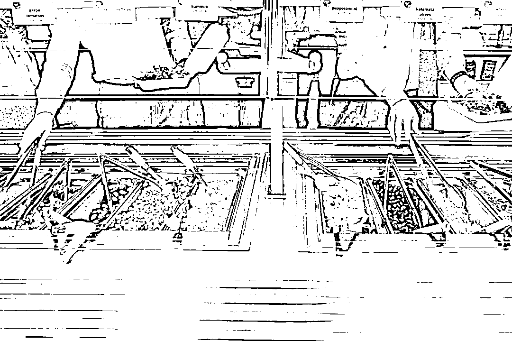

# IT 界 PK 投资界，你会给你们公司的食堂打几分？

> 原文：[`mp.weixin.qq.com/s?__biz=MzAxNTc0Mjg0Mg==&mid=2653287818&idx=1&sn=e16a7e72681bbf3caec61a84b44c741e&chksm=802e379fb759be899ef69cd0ea7cfbddfb67e9ce462a5fa233b5b70358d259748a60acac1224&scene=27#wechat_redirect`](http://mp.weixin.qq.com/s?__biz=MzAxNTc0Mjg0Mg==&mid=2653287818&idx=1&sn=e16a7e72681bbf3caec61a84b44c741e&chksm=802e379fb759be899ef69cd0ea7cfbddfb67e9ce462a5fa233b5b70358d259748a60acac1224&scene=27#wechat_redirect)

**量化投资与机器学习**

为中国的量化投资事业贡献一份我们的力量!

 

佛系**美少女/美少年**每日三省：

**早餐吃什么、午餐吃什么、晚餐吃什么**

就在你打开外卖 APP 一筹莫展

（然后点了和昨天一样的单）的时候

**这些公司的员工食堂已经进军网红界了**

今天，编辑部带你围观

**那些绝对不能错过的公司食堂**

（排名不分先后，图片源自网络，版权属于原作者）

来源：UniCareer

01

网易：入职再小心，也会胖 5 斤

食堂完全自助，一日三餐+夜宵，**全部免费；****每天菜单都不一样**，冬天有火锅，夏天有烧烤。凑齐 6 个小伙伴即可申请火锅（正宗**北京铜火锅、重庆鸳鸯锅**随便挑）

占地约 5000 平米的食堂

定期有火锅专场

*来源：知乎用户霓姑娘*

每天 11 点左右出今日菜单，基本不重样

**员工点评：**就是肉太多，吃多了会腻，所以经常要去外面改善伙食。

02

阿里巴巴：食堂才是我们的核心竞争力

一共**4 个食堂，风格不重样**，从中餐到西餐，从江浙沪小炒到北方杂粮面点样样齐全。**每人每天 13 元午餐补贴，每月一次性打入支付宝。**还有不吃就会消失的“**时间券**”：每晚 6 点和 9 点，员工卡里存入**晚餐券**和**夜宵券**，过了时间没有使用就会自动消失。

超低价格

**员工点评：**有次身体不舒服本来想请假回家，**想想公司食堂，还是算了**_(:3」∠)_ ——网友陆飞帆

03

华为：美食就该和家人一起分享

入口即化的牛魔王、肥而不腻的胸口肉，肥瘦搭配、肉质鲜美的吊龙肉让人欲罢不能。

**每天上班最大的乐趣就是去各个区、各个餐厅寻找美食**，而且总是有惊喜~

并且华为还有**Family Open Day**，每到这个时候，餐厅里布置得像个游乐场，充满童心的氛围，到处都是小孩子的身影。

**员工点评：**外卖 APP？不存在的。

04

京东：6 层食堂每日 400+菜品

据说东哥准备建食堂时只有一个要求：“**一定要让我的员工吃饭的时候，看到窗外的风景。**”

于是，京东的食堂长这样👇

图片标注处就是食堂。**对。全部都是食堂。从 2 楼到 6 楼。都是食堂  ：）**每层风味不同，共占地 2 万多平米，**整个风格就是花样宠爱员工的霸道总裁风。**

**一天换一层，一星期可以不重样：**川菜、粤菜、淮扬菜、北方风味、南方风味、岭南风味、境外美食多达 400 个品类，还有咖啡厅、茶餐厅、面包房、果蔬店，满足一切需求。

看到这你是不是想问**1 楼呢，1 楼是什么？**

严格来说，**1 楼更像一个高档商场：**咖啡厅、茶餐厅、果蔬屋、品牌小商品店一应俱全，**据说还有美甲店…**

每天都会有餐补，价格可以说是很便宜了，然而京东还有一个丧心病狂的福利——**中午 13 点之后全场 7 折**……哦对，晚餐 18：50 开餐，免费供应

**员工点评：**要是哪天没好好写代码，都不好意思吃饭！——知乎用户二驸马

05

万达：自家基地供应食材，保证新鲜

每天每顿凉菜、热菜、水果、酸奶样样不少，当然都是免费。重要的是，**食材全部来自万达的基地特供**，每天 3 点左右，农场的员工起床采摘，大概 5 点钟从延庆的有机农场出发，**7 点前再送到万达集团总部，绝对新鲜！**

食堂每周都会开关于菜单设置的沟通会，**由大家投票决定下周的菜单。**随意上个菜单你们感受一下👇

万达食堂的微信公众号，**每天 9 点 40 左右，就会给员工发送菜单。**如果不喜欢当天的菜可以直接出去吃，喜欢的话还可以参考高峰时间表，挑人少的时候去。

据说，有员工在食堂官方微信回复说，**想吃麻辣香锅了**，结果食堂的厨师**一个月内做了三次麻辣香锅！**

**员工点评：**坚决不能告诉你，我是为了吃食堂才留下来加班的……

06

苹果：厨艺和产品一样有逼格

苹果的食堂**不是免费的，但是都很便宜**，同样的价格在外面基本只能买麦当劳。（主要是不用给小费啊！）**苹果和水是免费的，晚餐对工程师免费。**

Infinite loop 是最大的食堂，**据说里面的寿司师傅是乔布斯当年从他喜欢的店里挖的。**另外还有 pizza、smoothie、墨西哥菜、亚洲菜、salad bar、burger 等等。亚洲菜有中餐、韩国菜、马来西亚菜，不算太正宗但是也都挺好吃。

除了向公众开放的主餐厅外，Cupertino 还有一些较小的**苹果自助餐厅。**

**员工点评：**就是中餐不太正宗。

07

谷歌：将创新进行到底

位于美国加利福尼亚州的**谷歌总部食堂**享有“**全球最牛公司食堂**”的美誉，拥有**100 多名专业厨师**，提供中餐、日餐、印度菜、意大利披萨、甜品等诸多品种的美食。**最关键的是，全部免费！**

谷歌将“不创新会死”的理念一直延续到其后厨。据不完全统计，**谷歌的厨师们短短三年内，光是甜品，就开发了 3000 多种。**创新往往来自于碰撞，在谷歌也是如此，中点师傅和西点师傅一起工作，还创造出**提拉米苏驴打滚**这样一道点心。

**员工点评：**“今天吃什么”这种终极问题还是要思考的，**好吃的太多了也很难办啊……**

08

Facebook：好吃又炫酷

Facebook 的食堂已经不仅仅是一个餐厅那么简单了，**而是有整整一条美食街，**街上有十几个餐厅：咖啡店、甜品店、烧烤店、汉堡店、甜品店、沙拉吧应有尽有。每天离开自己的办公室，推开门，就来到了另一个露天的世界，**可以一边享受阳光，一边享受美食。**

除了外驻餐厅，自家的两个员工食堂都是**免费提供一日三餐**，**经常更换菜单。**为了让员工吃得更健康，**选用的食材有 75%是有机食品。**

在 Quora 上，有人提问在 Facebook 吃到的最棒的一道菜是什么，一位员工这样回答：“我想起吃过的一份简单的**炸薯条**，好吃到我当时马上打电话给我妈问她是否真的爱我，因为她**从来没有给我们做过这么好吃的东西。**”

**员工点评：**感（bu）兴（pa）趣（si）的同学可以通过 Facebook 关注一下这个账号”Facebook Culinary Team”，**每天菜单都在里面更新……**

09

麦肯锡：在大众点评上有点评专档

很赞，窗外风景很好，布置非常经典有品位。而且没有菜单，**完全看厨师心情上菜**。不过菜式很多，**差不多能囊括新天地所有餐厅的经典菜品。每周五是员工自助，**可以说非常幸福了~

*来源：大众点评*

**员工评价：**遗憾的是，大部分麦府人并不能经常享受自家逼格满满的餐厅。因为我们**要么吃飞机餐，****要么在吃客户的食堂…**

10

BCG 纽约：内部咖啡馆、免费健身房

波士顿咨询集团纽约办事处位于曼哈顿西区，每一层都有自己的厨房和餐厅，在这里吃完饭也可以直接在餐桌上开始工作。

员工们可以来 High Line Cafe 享用 Joe Coffee，同时和工作伙伴们友好交谈。

如果你不想跑到 High Line Cafe 喝咖啡的话，**还可以跟老师学习自己做咖啡！**

**员工点评：**加班其实是为了消化晚餐。

12

高盛：提供美食也提醒你健康饮食

高盛在伦敦的办公室**拥有三家 Danny Meyer 餐厅和一家内部自助餐厅**，提供一日三餐。早餐多种多样：华夫饼、新鲜水果、各式饮料，煎蛋卷、酸奶应有尽有。

午餐虽然不免费，但是**在非高峰时间购买会有折扣。**

午餐还有披萨、寿司、烧烤、沙拉、自助餐等等。

大家都很喜欢的披萨，不仅制作新鲜，而且**可以自己选择配料，自由组合！**

为了让员工吃得更健康，高盛会**通过夹子的颜色来提醒大家：****绿色表示想吃多少吃多少；黄色表示要控制摄入量；红色意味着少吃为妙。**

**员工点评：**除了食堂，我们还有健身房和干洗房。

13

摩根士丹利：有自己的星巴克

摩根士丹利(Morgan Stanley)位于纽约时代广场(Times Square)的新餐厅在 2013 年 12 月开业，座位超过 200 人。

餐厅内部根据食品类型划分不同区域，有**面食站、沙拉站、寿司站、甜品站、榨汁站**等等，员工可以自由选择。

沙拉是最受欢迎的食物之一，旁边还有榨汁和寿司。自助餐厅也供应早餐，包括煎蛋卷、熏肉、水果、酸奶等等。**员工还可以先在网上预订，再去餐厅领取，可以节省很多时间。**

**员工点评：**工作虽然辛苦，但是生活真的很方便。

 /mp/newappmsgvote?action=show&__biz=MzAxNTc0Mjg0Mg==&supervoteid=467721194#wechat_redirect 

****