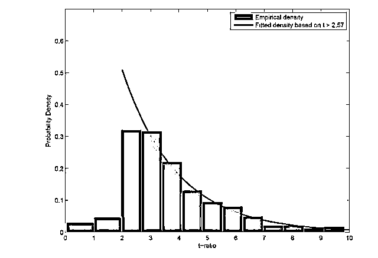
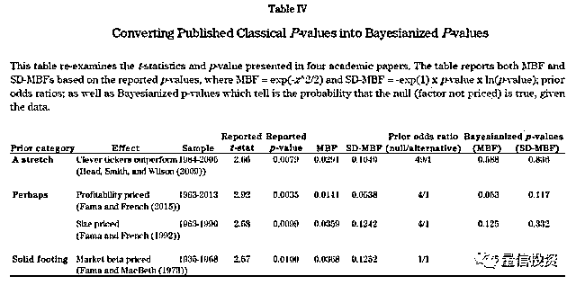

# 在追逐 p-value 的道路上狂奔，却在科学的道路上渐行渐远~~~

> 原文：[`mp.weixin.qq.com/s?__biz=MzAxNTc0Mjg0Mg==&mid=2653287813&idx=1&sn=68ef26c574ceca9bc3a8e1884a93c644&chksm=802e3790b759be86b67a6dfe0a8c7449881ef1957c15e382efab8c397b69b15a9b5ec84a45ff&scene=27#wechat_redirect`](http://mp.weixin.qq.com/s?__biz=MzAxNTc0Mjg0Mg==&mid=2653287813&idx=1&sn=68ef26c574ceca9bc3a8e1884a93c644&chksm=802e3790b759be86b67a6dfe0a8c7449881ef1957c15e382efab8c397b69b15a9b5ec84a45ff&scene=27#wechat_redirect)

**量化投资与机器学习**

为中国的量化投资事业贡献一份我们的力量!

 

作者 | **石川** **公众号特约作者** | 清华大学学士、硕士，麻省理工学院博士；精通各种概率模型和统计方法，擅长不确定性随机系统的建模及优化。

最近读了美国金融协会（AFA，American Finance Association）前主席 Campbell Harvey 于 2017 年协会年会上做的题为《The Scientific Outlook in Financial Economics》的主席报告，感触颇深，醍醐灌顶。

以一个学者应有的科学态度和操守，Dr. Harvey 深刻剖析了近年来西方学术界在**收益率风险多因子模型**研究中的一个错误趋势：

**为了竞逐在顶级期刊上发表文章，学者们过度追求因子在原假设下的低 p-value 值（即统计意义上“显著”）；不幸的是，由于有意或无意的数据操纵、使用不严谨的统计检验手段、错误地解释 p-value 传达的意义、以及忽视因子本身的业务含义，很多在功利心驱使下被创造出来的收益率因子在实际投资中根本站不住脚。**

**学者们在追逐 p-value 的道路上狂奔，却在科学的道路上渐行渐远。**

看完之后产生了深深的共鸣：难怪我在顶级期刊上以及卖方的研究报告中看到的很多因子，仅仅是在报告中“看起来有效”。在这个急功近利的时代，Dr. Harvey 大声呼吁学术界应该后退一步（take a step back），重新审视一下学术氛围和文化，真正做到以推动人们对金融经济学的正确认知为己任。这无疑是量化投资领域的福音。此外，Dr. Harvey 还提出了贝叶斯 p-value 的概念，它可以正确地评价因子的有效性。

今天就把这篇主席报告中的要点分享给大家。

**何为 p-value？**

先来看看什么是 p-value，以及它在因子分析中的作用。（本节内容是我加的。）

假设我们有一个因子 A，在学术界研究预测收益率的风险多因子模型时，一般的流程如下：

> 1\. 首先提出**原假设（null hypothesis）：因子 A 对于解释股票（或者其他投资品）的超额收益没有作用。**
> 
> 2\. 使用因子 A 对股票的超额收益率进行统计分析，这时通常有两种做法：
> 
>     2a. 按照股票在因子 A 上的暴露大小把它们分成 10 份，然后统计每份中股票的平均收益率是否显著不为 0，显著性用 p-value 表示。
> 
>     2b. 使用历史数据对因子 A 和股票的超额收益进行回归分析，统计因子的系数（即线性回归的斜率）是否显著不为 0，显著性用 p-value 表示。
> 
> 3\. 比较上面分析得到的 p-value 是否小于给定的显著性水平，从而决定是否拒绝原假设。拒绝原假设意味着拒绝“因子 A 对解释股票的超额收益没有作用”。

可见，p-value 在上述过程中至关重要。p-value 是 probability value 的简称。**在统计检验中，假设统计模型对应的原假设是 H，该模型观测到的随机变量 X 的取值为 x，则 p-value 代表着在原假设 H 下随机变量 X 取到比 x 更加极端的数值的条件概率，即**：

> **对于右尾极端事件：p-value = prob(X ≥ x|H)；**
> 
> **对于左尾极端事件：p-value = prob(X ≤ x|H)；**
> 
> **对于双尾极端事件：p-value = 2 × min{ prob(X ≥ x|H), prob(X ≤ x|H)}。**

*“The null hypothesis is usually a statement of no relation between variables or no effect of an experimental manipulation. The p-value is the probability of observing an outcome or a more extreme outcome if the null hypothesis is true (Fisher 1925).”*

对于股票收益率因子模型领域，因为我们希望找到可以带来超额正收益的因子，所以 p-value 一般指的是上面第一种定义，即 p-value = prob(X ≥ x|H)。例如，当 p-value = 0.05 时，我们说在原假设 H 下观测到不小于 x 的超额收益的条件概率为 5%；当 p-value = 0.01 时，我们说在原假设 H 下观测到不小于 x 的超额收益的条件概率仅有 1%。**显然，p-value 越小说明在原假设 H 下观测到不小于 x 的超额收益的可能性越低，即发生“不小于 x 超额收益”这个事件和原假设 H 越不相符，我们越倾向于拒绝原假设。**

当“因子 A 对解释股票超额收益没有作用”这个原假设被拒绝时，人们便会推论出“因子 A 能够解释一部分股票的超额收益”。**如此，人们习惯把“p-value 越低”和“因子 A 在解释超额收益上越有效”等价起来了。这就是为什么我们都喜欢低的 p-value。****但它们俩真的等价吗？**别急，看完本文你自会有答案。

**低的 p-value 仅仅是某个因子有效的必要条件；但是它远不是充分条件。有意或者无意的数据操纵（data manipulation）以及不完善的统计检验所得到的低的 p-value 在说明因子是否有效方面毫无作用。**

**在追逐 p-value 的道路上狂奔**

好了，现在我们已经知道了 p-value 在因子模型中的作用：要想说明某个因子有效，最起码得有个低的 p-value；否则免谈。**在这种暗示下，学术界便自上而下的刮起了一股追求超低 p-value 之风。**

以下就是因子模型 p-value 在学术界的因果关系链：

> **“p-value 越低意味着因子越显著。" -> “因子越显著，研究成果越吸引眼球。” -> “成果越吸引眼球越有可能得到更高的引用。” -> “高引用的文章越多，期刊的影响因子越高。” -> “期刊的影响因子越高，期刊的学术声望越高。”**

为了提升期刊的声望，编辑们都更倾向于录用低 p-value 因子的文章；为了在更高水平的期刊上发文，学者们更倾向于找到低 p-value 的因子。在美国绝大多数学校里，如果能在 Journal of Finance 发表一篇文章，一个教授就有可能得到终身教职（tenure）。

在如今的金融经济学领域，这样的做法无奈的导致了一种发**表偏差（publication bias）**：学者们更愿意把时间和精力花到可以利用各种手段来找到低 p-value 的因子上，只愿意发表“看上去最显著”的研究成果。他们不愿意冒险来研究“无效的因子”。

**从推动学科发展的角度，“无效的因子”和“有效的因子”同样重要。**如果我们能够确切的证明某个因子就是无法带来超额收益，那么它对实际中选股也是非常有价值的（我们可以放心的避开该因子）。然而，在追求超低 p-value 之风下，学者不愿意进行这样的研究，因为顶级期刊上鲜有它们的容身之处。

下图出自 Harvey, Liu, and Zhu (2016)。他们分析了 1963 年到 2012 年间发表在金融领域最顶级期刊上的 300 多个因子模型的 t-statistics（可以简单的理解为 p-value 越低，其对应的 t-statistics 越高）的分布情况。这个分布清晰地说明了学术界的发表偏差。比如，t-statistics 取值在 2 到 2.57 的文章数和 t-statistics 取值在 2.57 到 3.14 的文章数十分接近。要知道，t-statistics = 2.57 对应的 p-value 大概是 0.005；而 t-statistics = 3 对应的 p-value 则是 0.001！显然，找到 p-value = 0.001 的因子要比找到 p-value = 0.005 的因子要困难得多，但它们的文章数量却大致相当。这只能说明在顶级期刊发表文章时，学者们倾向于更低的 p-value。

**“硬科学”与“软科学”**

看到这里，人们不禁要问怎么会有这么多低 p-value 的因子？这可以从“硬科学”和“软科学”的角度来解释。

法国著名的哲学家奥古斯特 • 孔德将科学分成不同的等级（Comte 1856）。像数学、物理这类的“硬科学”位于等级的上方，而社会学（包括今天所说的经济学或者哲学）这类“软科学”位于等级的下方。**千万不要误解，这里“硬”和“软”并不是“好”与“坏”之分。**

**在“硬科学”中，人的痕迹几乎可以不存在，从数据可以直接得到结论、无需任何人工解释，且结论是高度可归纳的。**比如数学上的四色问题，一旦证明成立那就是成立；又如物理上的引力波，一旦发现那就是说明它的存在，这些都是确切的。**反观“软科学”中，人的痕迹便会更加明显，研究成果依赖于提出怎样的假设，如何处理数据，以及如何分析、解释结果。这些都和研究者自身的声望、利益、个人偏好有关，因此结果往往是无法归纳的。**金融学中的多因子模型无疑是软科学，因子选取、原假设的构建、以及数据分析都会因人而异。

比如“使用过去 50 年的数据还是过去 30 年的数据？”“使用美股还是其他国家的股票？”“使用日收益率还是周收益率？”“使用百分比收益率还是对数收益率？”“是否以及如何剔除异常值？”“使用线性回归还是逻辑回归？”“使用截面回归还是时间序列回归？”“因子对 500 个公司有效但是对 1000 个公司无效，因此发文时仅提及那 500 个公司。”……在追逐超低 p-value 的背景下，学者在面临这些选择做决定时会“非常微妙”，一切阻碍超低 p-value 诞生的数据都会被巧妙的避开。**Dr. Harvey 将为了追求超低 p-value 而在因子研究中刻意选取的数据处理方法称为 p-hacking。**

在科学研究中，我们往往先观察事物是如何运作的，然后提出一个假设并通过数据来验证其是否成立，可谓“先有假设再有结果”。**然而，p-hacking 却可能使我们本末倒置，“先有结果再有假设！”（Hypothesizing after the results are known，称为 HARKing）**。比如我们的假设是变量 Y 和 X1 相关。为此我们设计了一个实验，并控制了 X2 到 X10 其他 9 个变量，来考察 Y 和 X1 的关系。但是实验结果表明 Y 却和 X7 相关。因此，我们就会轻易地（不负责任地）把假设改为“Y 和 X7 相关”，而忘记了研究的初衷。由于数据分析的成本很低，HARKing 在因子模型研究中非常普遍。

所有这一切对超低 p-value 的追逐都源于人们的一个**误解：“p-value 越低”等价于“因子 A 在解释超额收益上越有效”**。下面来看看 p-value 到底意味着什么。

**正确认识 p-value 的含义**

**人们对 p-value 的正确含义充满了误解**。为了说明这一点，Dr. Harvey 给出了一个假想的例子。假设一个选股因子为董事会的规模。由此我们把上市公司分为两类：小型董事会的公司和大型董事会的公司。原假设 H 是：董事会规模与超额收益无关。比较这两类股票的收益率均值，我们得到该因子的 p-value 小于 0.01。那么，下面 4 种关于 p-value 的陈述哪些是正确的呢（原文中是 6 个陈述，为了简化讨论这里只包含其中 4 个）？

1、我们证明了原假设是错误的。

2、我们找到了原假设为真的概率，即 prob(H|D)。

3、我们证明了小型董事会的公司比大型董事会的公司有更高的超额收益。

4、我们可以推断出“小型董事会的公司比大型董事会的公司有更高的超额收益”为真的概率，即 prob(H^c|D)。

怎么样？你觉着上面四个陈述中有几个是正确的？答案是：**它们都是错的**。

p-value 代表着原假设下观测到某（极端）事件的条件概率。以 D 代表极端事件，则 p-value = prob(D|H)。**从它的定义出发，p-value 不代表原假设或者备择假设是否为真实的。**因此，上述中的 1 和 3 都是错的。

*“P-value is a statement about data in relation to a specified hypothetical explanation, and is not a statement about the explanation itself.”*

译：P-value 是关于数据和指定假设之间关系的陈述；而非关于假设本身的陈述。

**再强调一遍：p-value 是原假设 H 成立下，D 发生的条件概率，即 prob(D|H)；它不是 prob(H|D)，即 D 发生时 H 为真的条件概率。**因此 2 也是错的。同理，p-value 也和 p(H^c|D)——H^c 代表备择假设——没有任何关系，因此 4 也是错的。

> **prob(D|H) ≠ prob(H|D)**
> 
> **prob(D|H) ≠ prob(H|D)**
> 
> **prob(D|H) ≠ prob(H|D)**

**在这个例子中，最重要的信息就是 p-value 等于 prob(D|H)；而人们往往把它和 prob(H|D) 混淆，这是因为我们太想知道 prob(H|D) 了，因为它告诉我们原假设 H 在 D 发生时为真的条件概率。然而 p-value 不等于它。****把 prob(D|H) 当成 prob(H|D) 是一个非常严重的错误。**来看一个形象的例子（出自 Carver 1978）：

> 定义两个事件：人死了，记为 D；人上吊，记为 H。那么，prob(D|H) 表示人因为上吊而死的概率。这个概率可能是很高的，比如 0.97。让我们把 D 和 H 的位置调换一下，即 prob(H|D)，则问题变成了在人死了的前提下，他是因为上吊而死的条件概率。怎么样？在这个问题中，因为我们知道人的死法有很多种，比如上吊、跳楼、服毒、割腕……我们不会将 prob(D|H) 的取值等价于 prob(H|D) 而脱口而出 0.97。在这个问题中，**prob(D|H) ≠ prob(H|D) **显而易见。然而当我们解释因子分析的 p-value 时，却总绕不过弯，总将它俩混为一谈。

最后，来看美国统计协会（American Statistical Association）关于 p-value 的 6 个准则（Wasserstein and Lazar 2016）：

***1\. P-values can indicate how incompatible the data are with a specified statistical model.***

译：P-value 可以表示数据和给定统计模型的不兼容程度。

***2\. P-values do not measure the probability that the studied hypothesis is true, or the probability that the data were produced by random chance alone.***

译：P-value 不表示所研究的假设为真的概率；同时，它也不表示数据仅由随机因素产生的概率。

***3\. Scientific conclusions and business or policy decisions should not be based only on whether a p-value passes a specific threshold.***

译：科学结论和商业或政策决策不应只根据 P-value 是否通过给定的阈值而确定。

***4\. Proper inference requires full reporting and transparency.***

译：全面的分析报告和完全的透明度是适当的统计推断的必要前提。（这说的就是要摒除 p-hacking 的问题。）

***5\. A p-value, or statistical significance, does not measure the size of an effect or the importance of a result.***

译：P-value 或统计上的重要性并不能衡量效用的大小或结果的重要性。（这是我们通常说的统计上显著未必具有重要的经济意义——economic significance）

***6\. By itself, a p-value does not provide a good measure of evidence regarding a model or hypothesis.***

译：关于模型或者假设是否有效，p-value 本身并不提供足够的证据。

相信上面这 6 点一定会帮助我们更好的理解 p-value 的意义。

**失真的 p-value**

如前所述，p-value 用来说明某种效用（effect）是否在统计上显著（因子可以解释股票的超额收益率就可以理解为一种效用）。**当待检验的效用非常罕见时，统计检验得到的 p-value 往往是失真的。**

在医学中，这样的例子屡见不鲜。假设我们要测试一种罕见的疾病（疾病就是效用，罕见说明它本身出现的概率非常低）。原假设就是病人没有得病。

假设这种疾病的发病率为 1%。我们使用某种测试手段对 1000 名志愿者进行筛查。该测试手段的正确率为 90%（即对于确实患病的患者，该测试结果为阳性的概率为 90%）；此外，该测试手段的误诊率为 10%（即，对于没有得病的志愿者，它误诊为阳性的概率为 10%）。

根据 1% 的发病率和 1000 名志愿者，我们假设他们中间有 10 名真正患者和 990 名正常。对于这 10 名患者，该检测手段成功的找到 9 名患者；而对于剩下 990 名非患者，它误诊了 99 名。因此，一共有 108 名志愿者被诊断为患病，但其中仅有 9 名是真正的患者。换句话说，这个测试的 Type I error（false positive rate）高达 92% (= 99 / 108)，远高于该测试手段 10% 的误诊率。

**在统计检验中，false positive 代表着原假设为真但被错误拒绝的概率。**

上述讨论对金融经济学有什么启示？**这里的核心是，如果一个效用本身越不可能发生，我们越要小心，因为会有大量的 false positive**。令 π 代表在现实中我们找到一个真实因果关系的概率（即一个真实的因子），α 代表原假设为真时的显著性水平，β 表示备择假设为真时检验正确的拒绝原假设的概率。从上面这个例子中可以归纳出，由于效用的罕见性，我们能够预期的 false positive rate 等于：

当 β = 1 时，上述 false positive rate 有理论的最小值。当找到真实因子的概率很低时，π 相对于 α 很低，该 false positive rate 近似为 1。**因此，如果发现有效因子本身这件事是一个极小概率事件，则无论我们得到了多低的 p-value，我们错误的拒绝原假设的概率（即 false positive rate）也是非常高的。**

**不幸的是，发现真实有效的因子本身就是一个极小概率事件。因此，大量发表于顶级期刊上的收益率因子都会在将来被证伪。**Bartsch et. al. (2017) 就提供了这样的证据。他们采用了一个多重检验框架，检验了学术界的 100 个收益率预测模型，得到的结论是**模型中的预测能力全部来自数据迁就（data snooping，即 p-hacking），这些模型在新测试框架下的预测准确性均无法战胜历史均值。**

**先验的重要性，做贝叶斯的信徒**

上一节的论述传递出一个重要的观点：**我们需要对效用本身发生的概率（例如找到真实收益率因子的概率）有一个正确的****先验****判断，并用它和 p-value 一起计算出一个****后验概率****，并以此判断是否应该拒绝原假设。**

在生活中，先验概率对于我们判断一个效用是否真的有效至关重要。来看下面三个例子。

> 第一个例子：有一个音乐家声称可以完美的区分莫扎特和海顿的乐谱。我们将 10 张乐谱给他辨识，他全部正确。第二个例子：有一个常年喝茶的老妇人，她声称可以说出一杯加了奶的热茶中，奶是先于茶还是后于茶加入杯中的。同样，我们将 10 杯请她辨识，她全部正确。第三个例子：有一个酒馆老板，号称酒精赐予他预测未来的神力。我们让他猜扔硬币的正反面，结果他也是 10 次全对。
> 
> 在这三个实验中，p-value 都远低于 0.001（ 2 的 -10 次方）。**然而同样的 p-value 在这三个例子中带给我们的认知却截然不同。**在第一个例子中，我们知道对方是一个音乐家，他分辨乐谱应该易如反掌。我们的先验信仰就是他能够成功，实验的结果只不过确认了这一点。在第二个例子中，我们也许心存怀疑（先验），不相信老妇人能够成功（原假设是她没有分辨奶加入茶杯顺序的能力），然而 10 次全对（超低 p-value）的结果让我们倾向于推翻自己的先验认知，即拒绝原假设，并认为她确实有这个能力。在第三个例子中，我们会认为这个人就是骗子（酒精能够预测未来？），因此打从心底完全不屑（原假设是酒精不能预测未来），在这种情况下，即便他猜对了 10 次，我们也不会推翻原假设（因为“酒精能够预测未来”这件事的先验概率太低了），而仅仅认为他是运气好罢了。

怎么样，从这三个例子中看出先验在解读 p-value 时起到的作用了吗？这就是贝叶斯框架的强大之处。

**Dr. Harvey 将传统的 p-value 嵌入到贝叶斯框架中，提出了贝叶斯化 p-value（Bayesianized p-value）的概念，它是一个****后验概率****。**

**贝叶斯化 p-value 由最小贝叶斯因子（minimum Bayes factor，MBF）和先验概率（prior odds）构成**。贝叶斯因子是在原假设下观测到效用的似然性与在备择假设下观测到效用的似然性之间的比值。由于备择假设中，效用的概率分布未知，因此贝叶斯因子的取值有个范围。这个范围的下限就称为最小贝叶斯因子。**它代表着贝叶斯框架下，我们拒绝原假设的倾向性（MBF 越小，我们越倾向拒绝原假设）。**

具体的，后验贝叶斯化 p-value 的表达式如下：

其中，MBF 的计算方法有两种，分别根据统计检验中的原始 p-value 和其对应的 t-statistics 求出。以下仅给出具体表达式，而不去探讨具体数学细节。

贝叶斯 p-value 的强大之处在于，它是一个后验概率，它回答了那个我们真正关心的问题：**在（极端）事件发生的前提下，原假设为真的条件概率是多少，即我们梦寐以求的 ****prob(H|D)****。**

使用后验贝叶斯 p-value，Dr. Harvey 对学术界的一些知名因子进行了分析（下表）。具体的，他考虑了三类不同的先验情况：a stretch（罕见的，假设因子有效的先验概率为 2%），perhaps（有可能，假设因子有效的先验概率为 20%），solid footing（业务基础扎实，假设因子有效的先验概率为 50%）。

在第一类（a stretch）中，考察的因子叫 clever tickers（可以理解为聪明的股票代码），即有些股票代码比另一些更让投资人喜欢，因此这些股票有超额收益（这一听就不靠谱）。在贝叶斯框架下，其后验贝叶斯 p-value 为 0.836，这意味着该因子对解释超额收益完全没有作用。值得一提的是，在研究出该因子的文章中，它的 p-value 可是仅有 0.0079，暗示着 clever tickers 用来选股能获得超额收益。**贝叶斯框架完美的逆转了这个错误的结论。**

在第二类（perhaps）中，考察的因子是 Fama 和 French 提出的盈利因子和规模因子。在原著中， Fama 和 French 的研究显示这两个因子都有超低的 p-value。然而，它们的后验 p-value 分别为 0.117 和 0.332。其中，盈利因子的后验 p-value 仍然比较低（虽然比原著中的高很多），但是规模因子的后验 p-value 却很大，说明它不能很好的解释超额收益。

在第三类（solid footing）中，考察的因子是市场因子。它的后验 p-value 为 0.111（在另一种 MBF 的计算方式下，其后验 p-value 更是仅有 0.035）。这说明市场因子确实是一个能够解释股票超额收益的因子。这也完全符合人们的预期。

这三个例子完美的说明了当我们有一个手段来回答正确的问题时（即 prob(H|D)），我们能够得到更加有效的结论。**解释股票超额收益率的因子不是不存在，但他们应该非常稀有，数量远远少于顶级期刊上刊登的那些伪因子。**

**科学的愿景，研究应该能被复现**

在过去的 10 年、20 年里，金融经济学领域的学者们都在追逐 p-value 的道路上狂奔。然而，这么做的结果是人类在科学的道路上渐行渐远。

科学研究的目标是为了推动人们对该学科的理解。**为了实现它，我们应该确保所有的发现——不管是有效因子还是无效因子——都是可以复现的，成果应该是可以被其他学者复制的。**这意味着，在摒除了所有 p-hacking 的数据操纵之后，一个因子的效用仍然经得起考验，并且它在样本外也同样有效（或同样无效）。

在顶级期刊中，只有 Journal of Finance 要求被录用的文章提供计算机代码；没有任何一个期刊要求作者提供数据（所以很多 p-hacking 的行为根本无法被发现）。可喜的是，最近一个新的期刊 Critical Finance Review 做了很多工作，正逐渐使成果能够被复现成为学术界的主流。

**不论是什么领域，如果一篇学术论文提出的模型和得出的结论不能被其他学者或业界复现，那发表这样的文章就无异于耍流氓。**

我曾经联系过多篇文章的作者，提及被他们文章中因子的表现所震撼、想要自己在样本外复现他们的发现，因此询问一些数据和程序上的细节。但是这样的文章几乎全部石沉大海。唯一良心的回复是“当年的代码写的很乱，可读性已经很差了”。我想，大概这些作者也根本无法再现它们当时取得的神奇结果吧。

**除此之外，学术界和顶级期刊应该鼓励学者们尝试“高风险”的研究项目。**“高风险”意味着学者需要费时费力费金钱以收集和处理数据，且得到的结论不一定显著（没有令人称奇的 p-value）。但是，这样的研究成果才是最根本的，才是真正能够推动金融经济学阔步向前的创造性工作。

金融经济学的科学前景深深的植根于学术界的研究和发表环境中。不可否认，如今学术界的研究质量仍然是很高的。但是本文提出的问题不关乎当下，而是着眼于未来。为了保证金融经济学的发展，学者们应该时刻保持学者的操守，并创造一个健康的研究氛围。不要试图寻找捷径，而是脚踏实地的走曲折的道路，无论荆棘与坎坷。不忘初心，砥砺前行，金融经济学的科学前景势必一片光明。

参考文献

Bartsch, Dichtl, Drobetz, and Neuhierl (2017). Data Snooping in Equity Premium Prediction. Available at SSRN: https://ssrn.com/abstract=2972011

Campbell (2017). Presidential Address: The Scientific Outlook in Financial Economics. AFA 2017 Annual Meeting.

Carver (1978). The case against statistical significance testing. Harvard Educational Review, 48, 378 – 399.

Comte (1856). The Positive Philosophy of Auguste Comte, translated by Harriett Marineau (Calvin Blanchard, New York). Vol. II.

Fisher (1925). Statistical Methods for Research Workers. Oliver and Boyd Ltd, Edinburgh.

Harvey, Liu, and Zhu (2016). … and the cross-section of expected returns. Review of Financial Studies, 29(1), 5 – 68.

Wasserstein and Lazar (2016). The ASA's Statement on p-Values: Context, Process, and Purpose. The American Statistician, 70(2): 129 – 133

****