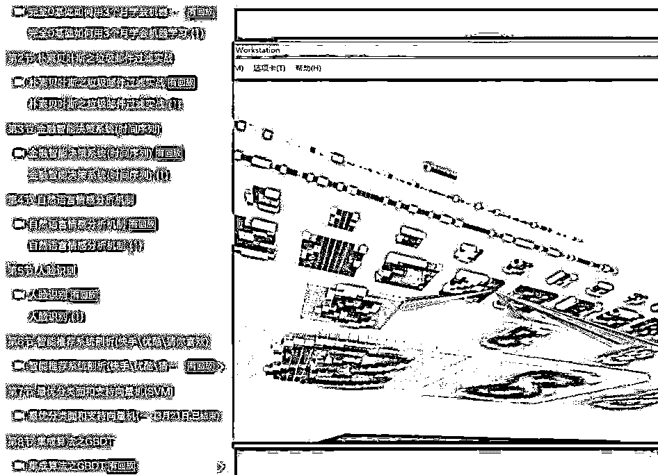

# 【理论+代码】公开课全免费，手把手带你进入人工智能领域

> 原文：[`mp.weixin.qq.com/s?__biz=MzAxNTc0Mjg0Mg==&mid=2653287801&idx=1&sn=17c87dc14d2629c6af35faad7ac5da1c&chksm=802e376cb759be7a31af6d401b55c8356b72dfbd8d30f26c70a10255d8be7b319f9f1825d05a&scene=27#wechat_redirect`](http://mp.weixin.qq.com/s?__biz=MzAxNTc0Mjg0Mg==&mid=2653287801&idx=1&sn=17c87dc14d2629c6af35faad7ac5da1c&chksm=802e376cb759be7a31af6d401b55c8356b72dfbd8d30f26c70a10255d8be7b319f9f1825d05a&scene=27#wechat_redirect)

**量化投资与机器学习**

为中国的量化投资事业贡献一份我们的力量!

 

人工智能(AI)，2017-2018 年最火的词汇之一，无论是横扫围棋界高手的 AlphaGo，还是百度的无人驾驶系统 Apollo，只要是和人工智能相关的事件，总能在第一时间登上头版头条。2017 年更是首次写进**政府工作报告**，人工智能正在席卷全球，引发第 4 次工业革命，而 AI 的核心技术是**机器学习**和**深度学习**。 

目前，机器学习已广泛应用于数据挖掘、量化金融、自动驾驶、计算机视觉、自然语言处理、搜索引擎、语音和人脸识别、医学诊断以及电商的搜索和推荐当中。无论是科技巨头还是创业公司，都在战略布局人工智能。

如今 AI 发展如饥似渴，人才供给却显得力不从心。中国人工智能人才缺口超过 500 万人，AI 人才培养跟上产业发展需求迫在眉睫，熟练的 AI 人才更是年薪 50 万起步。

为了让大家更全面体系的进入 AI 行业及了解**量化交易**怎么**跟 AI 结合**，特推荐两位机器学习科学家及他们的教程给大家：

*   陈梦翔。**清华大学计算机博士后**，数据科学家，主要研究方向为：机器学习、模式识别、深度学习。2013 年-2015 年在意大利举办的国际在线指纹识别竞赛中获得**冠军**，拥有 5 个中国专利和 1 个美国专利，是推荐系统、NLP、点击率预估、图像识别领域实战派专家。

*   Pierre(皮尔)何，**中国科学院博士**，曾作为访问学者公派到法国国家科学院任职，在 ICML、SDM 等顶级会议以及 JMLR 等 AI 等期刊发表多篇学术论文，国家自然科学基金 NLP 基金技术顾问，在机器学习/数据挖掘/NLP/知识图谱/数学建模 领域方面有着丰富的实战经验。

他们现在在做机器学习\深度学习培训，对**机器学习**和**量化交易**、**金融智能决策**、深**度学习**感兴趣的朋友可以找他们聊聊，不仅可以交流技术还可以免费听课，部分公开课如下(**全免费**)：

> 【第 1 期】SVM 车牌识别系统
> 
> 【第 2 期】朴素贝叶斯分类垃圾邮件过滤
> 
> 【第 3 期】深度学习算法处理 OCR 字符识别
> 
> 【第 4 期】NLTK 自然语言处理套件使用
> 
> 【第 5 期】用 CNN 构建简易版 AlphaGo 围棋 AI
> 
> 【第 6 期】构建深度学习无人车驾驶系统
> 
> 【第 7 期】金融智能决策系统(时间序列)
> 
> 【第 8 期】深度学习之人工神经网络
> 
> 【第 9 期】最优分类面和支持向量机
> 
> 【第 10 期】集成算法之 GBDT
> 
> 【第 11 期】自然语言情感分析机制
> 
> 【第 12 期】人脸识别
> 
>   不定期更新......

公开课每期都有 2 个多小时，全部是理论+实践，干货满满，有图有真相：

**金融智能决策+时间序列：**

**可视化卷积神经网络+人脸识别**

**SVM+车牌识别系统**

**智能推荐系统+快手推荐+优酷推荐+猜你喜欢**

**深度学习+OCR 字符识别**

**朴素贝叶斯之垃圾邮件过滤**

**部分代码截图**

**时间序列**

**人脸识别之神经网络**

**垃圾邮件过滤实战之朴素贝叶斯**

**集成学习**

有需要认识大咖及听课的小伙伴，可以扫一扫下面二维码，注明：**学习**。除此之外，还可以**免费体验 5 次机器学习 VIP 课程及视频**，价值**2980**元，先到先得！

