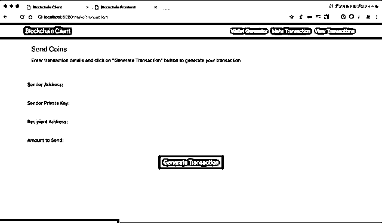

# 用 Python 实现一个基于 RSA 算法的区块链客户端（区块链系列 4）

> 原文：[`mp.weixin.qq.com/s?__biz=MzAxNTc0Mjg0Mg==&mid=2653287789&idx=1&sn=395b879ad475272ec0bb194d2a204083&chksm=802e3778b759be6eaab5dc77f18f57a092ed4e98f2de3020e48b046b564099b893ac642fc89d&scene=27#wechat_redirect`](http://mp.weixin.qq.com/s?__biz=MzAxNTc0Mjg0Mg==&mid=2653287789&idx=1&sn=395b879ad475272ec0bb194d2a204083&chksm=802e3778b759be6eaab5dc77f18f57a092ed4e98f2de3020e48b046b564099b893ac642fc89d&scene=27#wechat_redirect)


**量化投资与机器学习**

为中国的量化投资事业贡献一份我们的力量!

 

编译 | 晚君、Molly、蒋宝尚

来源 | BlockChange 

区块链作为比特币和其他加密货币的核心技术，在最近几年引起了全世界的注意，但是各国这一颠覆性的技术态度不一，因为其去中心化的分布式结构，可以使用户之间直接进行交流，无需中心节点参与的这种技术模式对银行、证券等机构带来了极大影响。 

## 在本篇文章，抛开介绍区块链的技术特点和应用场景，手把手的教大家如何用 python 实现一个基础的区块链，和一个区块链的客户端。

我们实现的区块链有如下几个特性：

*   可以向区块链中添加多个节点。

*   工作量证明（PoW）。

*   简单的节点间冲突解决机制。

*   使用 RSA 加密进行交易。

我们的区块链客户端有如下几个功能：

*   使用公钥/私钥加密技术生成钱包。（基于 RSA 算法）。

*   使用 RSA 加密算法生成交易。

我们还实现了 2 个展示界面：

*   挖矿者使用的“区块链前端”

*   用户生成钱包和发币的“区块链客户端”

我在原始代码的基础上进行了一些改动，向交易中加入了 RSA 加密，并实现了钱包生成和交易加密，两个界面使用 HTML/CSS/JS 实现。

完整的项目代码：

*https://github.com/adilmoujahid/blockchain-python-tutorial*

请注意，这个实现是用于教学目的，所以它不适用于生产环境。因为它保密性不够，且缺乏一些重要的特性。

> **区块链客户端实现**

你可以从终端启动区块链客户端。进入 blockchain_client 文件夹，并输入命令：python blockchain_client.py。

在浏览器中打开*http://localhost:8080*，接下来你会看到如下展示界面。


展示界面导航栏有 3 个标签:

*   钱包生成器:使用 RSA 加密算法生成钱包(公钥/私钥对)。

*   生成交易：生成交易并将其发送到区块链节点。

*   查看交易：查看区块链上的交易。

要想生成交易或查看交易，至少需要一个区块链节点在运行（将在下一节中介绍）。

blockchain_client.py 文件代码中一些重要部分的说明：我们定义了一个 Python 类，我们命名了 4 个属性字段：sender_address，sender_private_key，recipient_address，value。

这是发送方创建交易所需的 4 个信息。

to_dict()方法返回一个 Python 字典格式交易信息（没有发件人的私钥）。

sign_transaction()方法接收交易信息（没有发件人的私钥），然后使用发送者的私钥进行签名。

```py
class Transaction:
    def __init__(self, sender_address, sender_private_key, 
            recipient_address, value):
        self.sender_address = sender_address
        self.sender_private_key = sender_private_key
        self.recipient_address = recipient_address
        self.value = value

    def __getattr__(self, attr):
        return self.data[attr]

    def to_dict(self):
        return OrderedDict({'sender_address': self.sender_address,
                            'recipient_address': self.recipient_address,
                            'value': self.value})

    def sign_transaction(self):
        """
        Sign transaction with private key
        """
        private_key = RSA.importKey(binascii.
        unhexlify(self.sender_private_key))
        signer = PKCS1_v1_5.new(private_key)
        h = SHA.new(str(self.to_dict()).encode('utf8'))
        return binascii.hexlify(signer.sign(h)).decode('ascii')
```

下面是初始化一个 Python Flask 应用的代码行, 我们将用它来创建不同的 API 来与区块链及其客户进行交互。

```py
app = Flask(__name__)
```

下面我们定义了 3 个返回 HTML 页面的 Flask 路径，其中每个标签都有一个 html 页面。

```py
@app.route('/')
def index():
  return render_template('./index.html')

@app.route('/make/transaction')
def make_transaction():
    return render_template('./make_transaction.html')

@app.route('/view/transactions')
def view_transaction():
return render_template('./view_transactions.html')
```

下面我们定义一个生成钱包（私有/公钥对）的 API。

```py
@app.route('/wallet/new', methods=['GET'])
def new_wallet():
  random_gen = Crypto.Random.new().read
  private_key = RSA.generate(1024, random_gen)
  public_key = private_key.publickey()
  response = {
    'private_key': binascii.hexlify(private_key.exportKey(format='DER')).decode('ascii'),
    'public_key': binascii.hexlify(public_key.exportKey(format='DER')).decode('ascii')
  }
  return jsonify(response), 200
```


下面我们定义一个 API，将 sender_address, sender_private_key, recipient_address, value 字段作为输入，并返回交易（没有私钥）和签名。

```py
@app.route('/generate/transaction', methods=['POST'])
def generate_transaction():
  sender_address = request.form['sender_address']
  sender_private_key = request.form['sender_private_key']
  recipient_address = request.form['recipient_address']
  value = request.form['amount']
  transaction = Transaction(sender_address, 
  sender_private_key, recipient_address, value)
  response = {'transaction': transaction.to_dict(), 
  'signature': transaction.sign_transaction()}
  return jsonify(response), 200
```



> **区块链的实现**

你可以从终端启动区块链节点，通过进入 blockchain 文件夹，并输入命令：python blockchain_client.py 或 python blockchain_client.py -p <PORT NUMBER> 。如果你未指定端口号，则会默认端口号为 5000。在浏览器中打开*htt**p://localhost:<PORT NUMBER>*可以看到区块链前端展示界面。


展示界面导航栏有两个标签：

*   挖掘：用于查看交易和区块链数据，以及挖掘新的交易区块。

*   配置：用于配置不同区块链节点之间的连接。

下面是 blockchain.py 文件代码中一些重要部分的说明。

我们首先定义一个具有以下属性的 Blockchain 类：

*   **transactions**：将被添加到下一区块的交易列表。

*   **chain**：实际的区块链，也就是一个区块数组。

*   **nodes**：一个包含节点 URL 的集合。区块链使用这些节点从其他节点中检索区。

*   块链数据并且在检查到它们没有同步时更新其区块链。

*   **node_id**：一个标识 blockchain 节点的随机字符串。

这个 Blockchain 类还实现了以下方法：

*   **register_node(node_url):** 将新的区块链节点添加到节点列表中。

*   **verify_transaction_signature(sender_address, signature, transaction)**: 检查提供的签名是否与通过公钥（sender_address）签署的交易相符。

*   **submit_transaction(sender_address, recipient_address, value, signature)**: 如果签名通过验证，则将交易添加到交易列表中。

*   **create_block(nonce, previous_hash):**向区块链添加一个交易块。

*   **hash(block)**: 创建一个区块的 SHA-256 散列。

*   **proof_of_work()**：工作算法的证明。寻找满足挖掘条件的随机数。

*   **valid_proof(transactions, last_hash, nonce, difficulty=MINING_DIFFICULTY)**:检查散列值是否满足挖掘条件。该函数在 proof_of_work 函数中使用。

*   **valid_chain(chain)**: 检查区块链是否有效。

*   **resolve_conflicts()**:通过用网络中最长链代替链的方法解决区块链节点之间的冲突。

```py
class Blockchain:
    def __init__(self):
        self.transactions = []
        self.chain = []
        self.nodes = set()
        #Generate random number to be used as node_id
        self.node_id = str(uuid4()).replace('-', '')
        #Create genesis block
        self.create_block(0, '00')

    def register_node(self, node_url):
        """
        Add a new node to the list of nodes
        """
        ...

    def verify_transaction_signature(self, sender_address, 
           signature, transaction):
        """
        Check that the provided signature corresponds to transaction

        signed by the public key (sender_address)
        """
        ...

    def submit_transaction(self, sender_address, 
       recipient_address, value, signature):
        """
        Add a transaction to transactions array if the signature verified
        """
        ...

    def create_block(self, nonce, previous_hash):
        """
        Add a block of transactions to the blockchain
        """
        ...

    def hash(self, block):
        """
        Create a SHA-256 hash of a block
        """
        ...

    def proof_of_work(self):
        """
        Proof of work algorithm
        """
        ...

    def valid_proof(self, transactions, last_hash, nonce, 
       difficulty=MINING_DIFFICULTY):
        """
        Check if a hash value satisfies the mining conditions. 
        This function is used within the proof_of_work function.
        """
        ...

    def valid_chain(self, chain):
        """
        check if a bockchain is valid
        """
        ...

    def resolve_conflicts(self):
        """
        Resolve conflicts between blockchain's nodes
        by replacing our chain with the longest one in the network.
        """
        ...
```

下面这一行，我们初始化了一个 Python Flask 应用，用于创建和区块链交互的 API。

```py
app = Flask(__name__)
CORS(app)
```

下面，我们初始化一个区块链对象。

```py
blockchain = Blockchain()
```

下面我们定义了 2 种返回我们区块链前端展示界面 html 页面的 Flask 路线。

```py
@app.route('/')
def index():
    return render_template('./index.html')

@app.route('/configure')
def configure():
return render_template('./configure.html')
```

下面我们定义了 Flask API 来管理交易和挖掘区块链。

此 API 将'sender_address', 'recipient_address', 'amount' 和 'signature' 作为输入，并且如果签名有效，则将交易添加到将添加到下一个块的交易列表中。

*   **'/transactions/get'**:此 API 返回所有将会添加到下一个块的交易。

*   **'/chain'**:此 API 返回所有区块链数据。

*   **'/mine':** 此 API 运行工作算法的证明，同时添加新的交易块到区块链。

```py
@app.route('/transactions/new', methods=['POST'])
def new_transaction():
    values = request.form
    # Check that the required fields are in the POST'ed data
    required = ['sender_address', 'recipient_address', 'amount', 
    'signature']
    if not all(k in values for k in required):
        return 'Missing values', 400
    # Create a new Transaction
    transaction_result = blockchain.submit_transaction(values
    ['sender_address'], values['recipient_address'], values['amount'], 
    values['signature'])
    if transaction_result == False:
        response = {'message': 'Invalid Transaction!'}
        return jsonify(response), 406
    else:
        response = {'message': 'Transaction will be added to Block '+
         str(transaction_result)}
        return jsonify(response), 201

@app.route('/transactions/get', methods=['GET'])
def get_transactions():
    #Get transactions from transactions pool
    transactions = blockchain.transactions
    response = {'transactions': transactions}
    return jsonify(response), 200

@app.route('/chain', methods=['GET'])
def full_chain():
    response = {
        'chain': blockchain.chain,
        'length': len(blockchain.chain),
    }
    return jsonify(response), 200
@app.route('/mine', methods=['GET'])
def mine():
    # We run the proof of work algorithm to get the next proof...
    last_block = blockchain.chain[-1]
    nonce = blockchain.proof_of_work()
    # We must receive a reward for finding the proof.
    blockchain.submit_transaction(sender_address=MINING_SENDER, 
    recipient_address=blockchain.node_id, value=MINING_REWARD, 
    signature="")
    # Forge the new Block by adding it to the chain
    previous_hash = blockchain.hash(last_block)
    block = blockchain.create_block(nonce, previous_hash)
    response = {
        'message': "New Block Forged",
        'block_number': block['block_number'],
        'transactions': block['transactions'],
        'nonce': block['nonce'],
        'previous_hash': block['previous_hash'],
    }
return jsonify(response), 200
```


下面我们定义 Flask API 来管理区块链节点。

*   **'/nodes/register'**:此 API 将节点 URL 列表作为输入，同时添加 URL 到节点列表。

*   **'/nodes/resolve'**:此 API 通过使用网络中最长的可用链替代本地链的方式解决区块链节点间的冲突。

*   **'/nodes/get'**:此 API 返回节点列表。

```py
@app.route('/nodes/register', methods=['POST'])
def register_nodes():
    values = request.form
    nodes = values.get('nodes').replace(" ", "").split(',')
    if nodes is None:
        return "Error: Please supply a valid list of nodes", 400
    for node in nodes:
        blockchain.register_node(node)
    response = {
        'message': 'New nodes have been added',
        'total_nodes': [node for node in blockchain.nodes],
    }
    return jsonify(response), 201

@app.route('/nodes/resolve', methods=['GET'])
def consensus():
    replaced = blockchain.resolve_conflicts()
    if replaced:
        response = {
            'message': 'Our chain was replaced',
            'new_chain': blockchain.chain
        }
    else:
        response = {
            'message': 'Our chain is authoritative',
            'chain': blockchain.chain
        }
    return jsonify(response), 200
@app.route('/nodes/get', methods=['GET'])
def get_nodes():
    nodes = list(blockchain.nodes)
    response = {'nodes': nodes}
return jsonify(response), 200
```


> **结论**

在此篇文章中，我们介绍了涉及区块链背后一些核心概念，并且学习如何用 Python 实现一个区块链。为了简单起见，此文没有涉及一些技术细节，例如：钱包地址和 Merkle 树。如果你想了解有关该主题的更多信息，我建议阅读比特币白皮书原著，并跟着比特币维基和 Andreas Antonopoulos 的优秀书籍学习：掌握比特币:编程开放区块链。

原文链接：

http://adilmoujahid.com/posts/2018/03/intro-blockchain-bitcoin-python/?utm_source=wanqu.co&utm_campaign=Wanqu+Daily&utm_medium=website

****