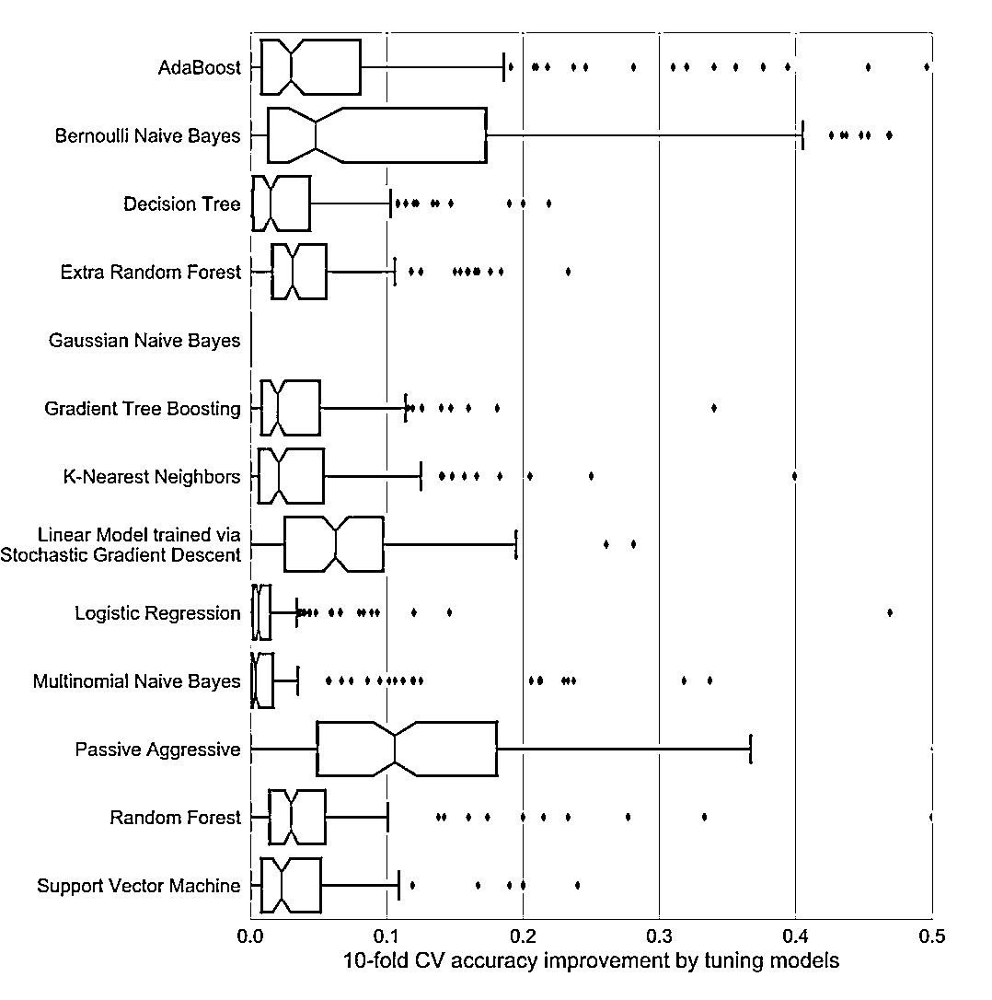

# 比较 13 种算法在 165 个数据集上的表现，你猜哪个最好？

> 原文：[`mp.weixin.qq.com/s?__biz=MzAxNTc0Mjg0Mg==&mid=2653287785&idx=1&sn=c0ebdecd496375ea6a5b8724a9e11e1c&chksm=802e377cb759be6af16c2fe92e966821cfae280b5d5a000f39b46e1f9388b5a67724e3570edc&scene=27#wechat_redirect`](http://mp.weixin.qq.com/s?__biz=MzAxNTc0Mjg0Mg==&mid=2653287785&idx=1&sn=c0ebdecd496375ea6a5b8724a9e11e1c&chksm=802e377cb759be6af16c2fe92e966821cfae280b5d5a000f39b46e1f9388b5a67724e3570edc&scene=27#wechat_redirect)

**量化投资与机器学习**

为中国的量化投资事业贡献一份我们的力量!

 

作者 |  Jason Brownlee 

编译 | 公众号编辑部

**你应该使用哪种机器学习算法？**

这是应用机器学习中的一个让大家很捉急的问题。

在 Randal Olson 和其他人最近的一篇论文中，他们试图去回答它，并给出一个指导关于算法和参数。

在这篇文章中，你将展开一项研究和评估许多机器学习算法通过大量的机器学习数据集。并且得到对这项研究的一些意见。

**论文**

2017 年，Randal Olson 等人发表了一篇标题为***“Data-driven Advice for Applying Machine Learning to Bioinformatics Problems” ***的论文。

论文下载地址：*https://arxiv.org/abs/1708.05070*

他们的工作目标是解决每个从业人员在开始预测建模问题时所面临的问题，即：

**我应该使用什么算法？**

作者将此问题描述为 choice overload，如下所示：

> *Although having several readily-available ML algorithm implementations is advantageous to bioinformatics researchers seeking to move beyond simple statistics, many researchers experience “choice overload” and find difficulty in selecting the right ML algorithm for their problem at hand.*

他们通过在大量机器学习数据集的样本上运行其算法样本来解决这个问题，以了解通常哪些算法和参数最适合。

论文描述为：

> *… a thorough analysis of 13 state-of-the-art, commonly used machine learning algorithms on a set of 165 publicly available classification problems in order to provide data-driven algorithm recommendations to current researchers*

**机器学习算法**

A total of 13 different algorithms were chosen for the study.Algorithms were chosen to provide a mix of types or underlying assumptions.The goal was to represent the most common classes of algorithms used in the literature, as well as recent state-of-the-art algorithms The complete list of algorithms is provided below.

下面提供了完整的 13 种算法列表：

*   Gaussian Naive Bayes (GNB)

*   Bernoulli Naive Bayes (BNB)

*   Multinomial Naive Bayes (MNB)

*   Logistic Regression (LR)

*   Stochastic Gradient Descent (SGD)

*   Passive Aggressive Classifier (PAC)

*   Support Vector Classifier (SVC)

*   K-Nearest Neighbor (KNN)

*   Decision Tree (DT)

*   Random Forest (RF)

*   Extra Trees Classifier (ERF)

*   AdaBoost (AB)

*   Gradient Tree Boosting (GTB)

scikit-learn 库被用来实现这些算法。

每个算法具有零个或多个参数，并且针对每个算法执行合理参数值的网格搜索。

对于每种算法，使用固定的网格搜索来调整超参数。

下面列出了算法和超参数评估表：

使用 10 倍交叉验证和平衡准确性度量来评估算法。

交叉验证没有重复，可能会在结果中引入一些统计噪音。

**机器学习数据集**

研究选择了 165 种标准机器学习问题。

许多问题来自生物信息学领域，尽管并非所有数据集都属于这一研究领域。

所有的预测问题都是两类或更多类的分类问题。

> *The algorithms were compared on 165 supervised classification datasets from the Penn Machine Learning Benchmark (PMLB). […] PMLB is a collection of publicly available classification problems that have been standardized to the same format and collected in a central location with easy access via Python.*

数据集来自 Penn 机器学习基准（PMLB）集合，你可以在 GitHub 项目中了解关于此数据集的更多信息。地址：*https://github.com/EpistasisLab/penn-ml-benchmarks*

在拟合模型之前，所有数据集均已标准化。

**结果分析**

> *The entire experimental design consisted of over 5.5 million ML algorithm and parameter evaluations in total, resulting in a rich set of data that is analyzed from several viewpoints…*

对每个数据集对算法性能进行排名，然后计算每个算法的平均排名。

这提供了一个粗略和容易理解每一种算法在平均情况下好或不好活的方法。

结果表明，**梯度提升**（Gradient boosting）和**随机森林**（random forest ）的排名最低（**表现最好**），**朴素贝叶斯**（Naive Bayes）平均得分最高（**表现最差**）。

> *The post-hoc test underlines the impressive performance of Gradient Tree Boosting, which significantly outperforms every algorithm except Random Forest at the p < 0.01 level.*

通过这张图，展示了所有算法的结果，摘自论文。

没有单一的算法表现最好或最差。

这是机器学习实践者所熟知的，但对于该领域的初学者来说很难掌握。

你必须在一个给定的数据集上测试一套算法，看看什么效果最好。

> *… it is worth noting that no one ML algorithm performs best across all 165 datasets. For example, there are 9 datasets for which Multinomial NB performs as well as or better than Gradient Tree Boosting, despite being the overall worst- and best-ranked algorithms, respectively. Therefore, it is still important to consider different ML algorithms when applying ML to new datasets.*

此外，选择正确的算法是不够的。你还必须为数据集选择正确的算法配置。

> *选择正确的 ML 算法并调整其参数对于大多数问题是至关重要的。*

结果发现，根据算法和数据集的不同，调整算法可将该方法的性能从提高至 3%——50％。

> *The results demonstrate why it is unwise to use default ML algorithm hyperparameters: tuning often improves an algorithm’s accuracy by 3-5%, depending on the algorithm. In some cases, parameter tuning led to CV accuracy improvements of 50%.*

本图表展示了参数调整对每种算法的改进情况。

并非所有算法都是必需的。

结果发现，在 165 个测试数据集中的 106 个中，五种算法和特定参数的性能达到 Top1％。

推荐这五种算法:

*   Gradient Boosting

*   Random Forest

*   Support Vector Classifier

*   Extra Trees

*   Logistic Regression

> *The paper provides a table of these algorithms, including the recommend parameter settings and the number of datasets covered, e.g. where the algorithm and configuration achieved top 1% performance.*

**实际结果**

本文有两个重要的发现对于从业者是有价值的，尤其是对那些刚开始学习机器学习算法或者对此有困惑的人。

1、使用 Ensemble Trees

The analysis demonstrates the strength of state-of-the-art, tree-based ensemble algorithms, while also showing the problem-dependent nature of ML algorithm performance.

2、Spot Check and Tune

没有人可以看到你的问题，并告诉你使用什么算法。

你必须为每种算法测试一套参数，以查看哪些方法更适合你的特定问题。

> *In addition, the analysis shows that selecting the right ML algorithm and thoroughly tuning its parameters can lead to a significant improvement in predictive accuracy on most problems, and is there a critical step in every ML application.*

这个问题的讨论请查看这个链接：*https://machinelearningmastery.com/a-data-driven-approach-to-machine-learning/*

**进一步阅读**

如果你希望深入了解类似问题，这里提供了有关该主题的更多资源：

*   Data-driven Advice for Applying Machine Learning to Bioinformatics Problems（*https://arxiv.org/abs/1708.05070*）

*   scikit-learn benchmarks on GitHub（*https://github.com/rhiever/sklearn-benchmarks*）

*   Penn Machine Learning Benchmarks（*https://github.com/EpistasisLab/penn-ml-benchmarks*）

*   Quantitative comparison of scikit-learn’s predictive models on a large number of machine learning datasets: A good start（*https://crossinvalidation.com/2017/08/22/quantitative-comparison-of-scikit-learns-predictive-models-on-a-large-number-of-machine-learning-datasets-a-good-start/*）

*   Use Random Forest: Testing 179 Classifiers on 121 Datasets（*https://machinelearningmastery.com/use-random-forest-testing-179-classifiers-121-datasets/*）

原文：*https://machinelearningmastery.com/start-with-gradient-boosting/*

****