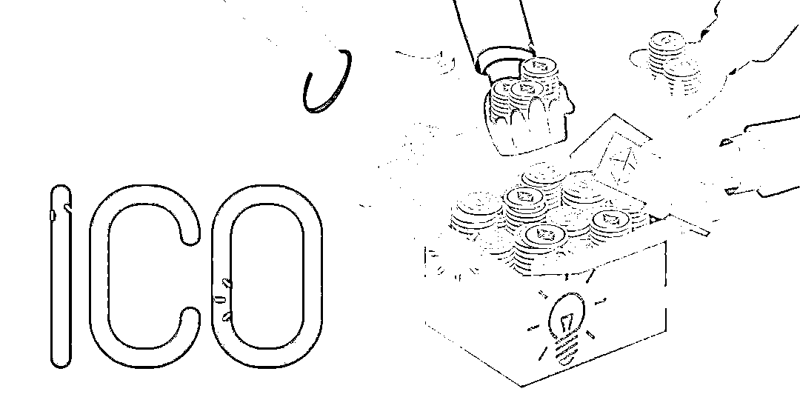
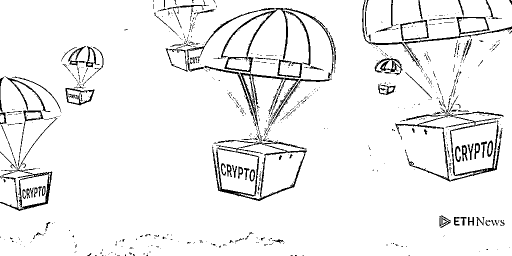
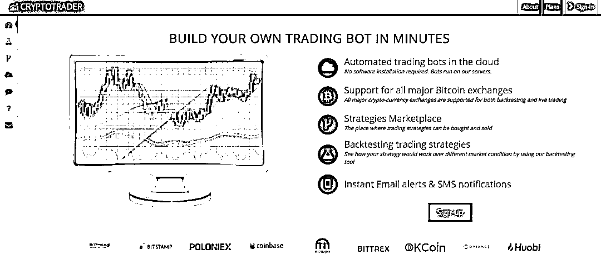

# 十一、个加密货币交易技巧，助你成为百万富翁！

> 原文：[`mp.weixin.qq.com/s?__biz=MzAxNTc0Mjg0Mg==&mid=2653287725&idx=1&sn=22059c1b551a31b24efcb26a14745557&chksm=802e3738b759be2ed1ef0b5dd090e9166904286a586a25043bcaa040b2f8462505f7f606dd9c&scene=27#wechat_redirect`](http://mp.weixin.qq.com/s?__biz=MzAxNTc0Mjg0Mg==&mid=2653287725&idx=1&sn=22059c1b551a31b24efcb26a14745557&chksm=802e3738b759be2ed1ef0b5dd090e9166904286a586a25043bcaa040b2f8462505f7f606dd9c&scene=27#wechat_redirect)

**量化投资与机器学习**

为中国的量化投资事业贡献一份我们的力量!

 

今天为大家带来一篇关于加密货币的好文章！

**What affects the price of a cryptocurrency?**

Cryptocurrencies are volatile by nature. Bitcoin is the oldest coin on the market, and it has only been around since 2009\. There are number of things that can affect cryptocurrency.

**Regulation: **If a government makes a statement or pushes for a particular regulation that affects cryptocurrencies, the market dips. When China banned ICOs, the price of Ethereum fell by 41% in 15 days (from$386.83/ETH to $228.06).

**Media influence: **Just like government regulation, media exposure greatly affects a cryptocurrency price. Whenever a public figure makes a statement regarding cryptocurrencies or a major retailer starts accepting cryptocurrency as a form of payment, you will see the market respond.

**Changes to the technology:** When a cryptocurrency core technology is affected, the cryptocurrency price is also affected.

Bitcoin is extremely volatile and same with altcoins. So, feed your brain with our tips to grow your investment.

**1、Say No to pumps and Dumps**

Never! Never participate in pumps and dumps. This is one of the quick and easiest way to lose all your money. Generally, investors with huge amount of BTC (known as whales) participate in these pumps and they tend to dump all their coins on us. So bad right? Say No to pumps and dumps.

**解读：****永远不要参与 pumps and dumps。**

**小知识**：Pump and Dump 是一个古老的计划，它可以迅速提高一项毫无价值的资产的价值，然后出售它以从价格上涨中获利。Pump and Dump 虽然非法，但在区块链技术、加密货币和数字资产的世界中非常受欢迎。

Pump and Dump 是非法的，甚至被 CFTC 认定为欺诈。在大多数受监管的市场，比如伦敦证券交易所(London Stock Exchange)和纽约证券交易所(New York Stock Exchange)，它们也是非法的。CTFC 甚至还提供了 10- 30%的悬赏给 pump and dump 的告密者，只要他们能帮助 CTFC 实行不低于 100 万美元的货币制裁。

然而，在加密货币交易中，Pump and Dump 并不是非法的。加密货币交易不受监管;立法机构中没有关于加密货币交易的条款。所以即使 Pump and Dump 是不道德的，它也不是完全非法的。

**2、Look for promising Initial Coin Offerings**

While investing or planning to invest in ICO’s you need to look at the project where you are putting your money and trust. The main and foremost thing to look at is their Whitepaper. There are lot of ICO’s which started and then made a huge decline from their ICO price value. So always invest in promising ICO’s with great team and mentors on board.

**解读：****投资 ICO 时，最重要的是仔细看看他们的白皮书，同时要有专人的指导。**

https://www.innovecs.com/ideas-portfolio/initial-coin-offering-investments-biggest-risks-prospects-ico/

**3、Look for upcoming NEWS and announcements**

News is always the important element for a sudden price increase in altcoins. So if you want to invest in any currency look at their future milestones and invest in promising one’s. You do make a lot of money.

**解读：****时刻关注有关加密货币的最新资讯。**

**4、Fear Uncertainty Doubt(FUD) NEWS**

This is the most familiar name in crypto world. There are lot of incidents that if there is a FUD news in any of the currencies or blockchain technology as a whole, there is a high probability that you will see a decline in the prices of bitcoins and other altcoins. If you come across any FUD news you need to sell your BTC to your Fiat currencies and again enter the market at dips.

**解读：****FUD 新闻对投资的重要性。**

**小知识**：FUD 就是恐惧（Fear）、不确定（Uncertainty）、怀疑（Doubt）的缩写，是行业垄断巨头对付比弱小竞争对手时使用的竞争手段之一。通过直接吓唬对手及胆敢与对手合作的公司，同时利用各种手段动摇竞争对手客户的信心，使其产生先动摇，进而怀疑的心理，从而挤掉质量和技术优于自己的产品，难以有效形成市场力量，确保独家垄断。使得用户无法得到最佳的产品和服务，整个行业的创新也被阻碍。公司越强大，效果越佳。

**5、Correlation between altcoins and bitcoin price**

If there is a decrease or increase in the price of bitcoin. The general pattern is that all the ALTCOINS will dip from the current price until bitcoin stabilizes. So, if you see bitcoin price to be decreasing or increasing suddenly then always sell your altcoins and convert it into BTC.

**解读： ****altcoins and bitcoin 的关系，sell your altcoins and convert it into BTC。**

**6、Airdrops**

It’s just free coins for you. Whenever a team announces free airdrops to its token holders then there is a high probability to see a price increase of that coin. So, if you find news on Airdrops just jump in at the coin at dip and sell at heights. It’s so easy right.

**解读：****空投，预示着可能加密货币的价格要上涨。**

**小知识****： **空投（airdrop）是一种数字货币的派发方式，我们知道比特币派发本质上只有一种，那就是挖矿。但是后来在出现的山寨币、分叉币的派发方式，却不只挖矿一种，比如还有空投派发。

https://hackernoon.com/all-you-need-to-know-about-crypto-airdrops-aka-free-money-243e60b22493

什么是空投？正如字面意思——填上掉馅饼，开发团队白送你数字货币，币直接打到你的地址里，而不需要你挖矿、购买，或者分叉之前持有原币，可以没有任何条件白送你币。

一般山寨币里会有一些会采用空投的方式发币，比如 XNN、BTX、Stellar、OmiseGo、 Byteball Bytes 等等。

空投的规则由发行方来决定，可以是你注册了就送你一定数量的币，也有许多通过快照的方式派发。比如 XNN 币，它实际上是从 EOS 复制的一条区块链，很像是分叉币但又不是，因为它没有继承原币之前的记录。所以也不能通过分叉的方式派送糖果，而是对原币进行快照，然后按照原币的地址空投给你币。

发行方为什么要空投送币？说白了是一种营销方式，通过赠送东西来吸引用户的营销现在不少见吧？赠送币一方面可以提高投资者的热情，另一方面还可以分发筹码，加速流通，让币扩散的更远。加密货币这玩意，持有的人越多认同度才可能越高，才可能越有价值。

**7、Never put all eggs in one basket**

Always have a portfolio of coins for long and short-term investments. This is always important in the crypto world. Never put all in your money in one egg. NEVER do that. Have a portfolio tracker for your investment. PLEASE keep this in mind.

**解读：****永远不要把所有的鸡蛋放在一个篮子里（经典的经典）。**

**8、Join telegram groups**

Join telegram groups for signals and upcoming news on cryptocurrencies. Here are some of the best groups to follow:

https://t.me/cointrad

https://t.me/cryptoworldasia

https://t.me/BinanceSignnels

**解读：****最好的几个 telegram groups。**

**9、Automated bot trading**

The human mind can only follow several indicators at a given time. A Bitcoin (or other cryptocurrency) bot can follow and try all the indicators at any time on all the crypto coins. A Bitcoin bot doesn’t need sleep — a bot can be active at any time you wish. This allows you to have a better sound sleep, because you can be sure that the bot will trade if something crucial happens.

**解读：****使用程序化交易，严格执行和遵守制定的规则，避免人为的干扰。**

https://www.coinstaker.com/go.php?id=cryptotrader

**10、Always set Achievable goals**

Digital currency is not a scheme when you get rich in seconds. You can set the goals too big if you are a millionaire, for the others set realistic goals like 5%, 10%, 20% and so on and stick to it.

**解读：****先定一个小目标，然后再逐步实现更大的目标！**

**11、Don’t Panic and sell at the bottom**

Take the time and sit back. Research the most popular companies in the industry and study what’s going on in the market. Don’t make snap decisions.

**解读：****花时间去研究行业内最受欢迎的公司并研究市场上发生的事情。 不要鲁莽的做出决定。**

来自：https://medium.com/@praneethnagu/11-tips-on-cryptocurrency-trading-which-will-make-you-a-millionaire-2a06c26b0968

****