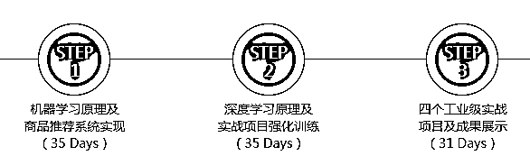

# 【强推】成为一名 AI 工程师，永远都不晚！

> 原文：[`mp.weixin.qq.com/s?__biz=MzAxNTc0Mjg0Mg==&mid=2653287713&idx=1&sn=2652ea5ee744fa58d50564a6086b6478&chksm=802e3734b759be2231c0b9d81a9049731905ba8f1808b28f97bb0b0052bd7aeca4ee0dd69b5e&scene=27#wechat_redirect`](http://mp.weixin.qq.com/s?__biz=MzAxNTc0Mjg0Mg==&mid=2653287713&idx=1&sn=2652ea5ee744fa58d50564a6086b6478&chksm=802e3734b759be2231c0b9d81a9049731905ba8f1808b28f97bb0b0052bd7aeca4ee0dd69b5e&scene=27#wechat_redirect)

**量化投资与机器学习**

为中国的量化投资事业贡献一份我们的力量!

 

从年初起，几家国际大厂的开发者大会，无论是微软 Build、Facebook F8 还是稍后的 Google I/O，莫不把“AI 优先”的大旗扯上云霄。 

如果这一波 AI 大潮只是空喊几句口号，空提几个战略，空有几家炙手可热的创业公司，那当然成不了什么大气候。**但风浪之下，我们看到的却是：**

> Google 一线的各大业务纷纷改用深度学习，落伍移动时代的微软则已拉起一支近万人的 AI 队伍。平均每 10.9 个小时诞生一家 AI 企业。而且众所周知：国内大量的、一线的互联网公司已经在布局机器学习团队，优化智能产品，在这样的背景下，不难想象，未来机器学习技术将会是技术人的新门槛和领域。

这一迹象，对于广大程序员来说，特别是对即将走向技术一线的准程序员而言，还是值得重点关注的。回顾一下移动互联网所带来的机遇，很容易就能算清，掌握深度学习能为一线工作带来怎样的优势。不过，跟移动开发不同，要求严苛的数学门槛，成本高昂的实战训练，令 AI 人才的培养周期猛增至 5 年以上……似乎没有硕士、博士的知识储备，就一定要跟 AI 相关的技术工作说再见了。实情果真如此吗？

 [`v.qq.com/iframe/preview.html?vid=s0515fw2a8h&width=500&height=375&auto=0`](https://v.qq.com/iframe/preview.html?vid=s0515fw2a8h&width=500&height=375&auto=0) 

来自 CSDN 出品人工智能工程师计划

基于以上，**C****SDN**出品了《人工智能工程师》**4 个月学习在线实训营**，致力于为人工智能行业培养大量的 AI 人才，在这里，你担忧的一切技术问题，一切基础问题，一切入门问题，一切高昂的成本问题（包括学习成本）都将得到解决！

> **AI 在线实训营目标是：**能让你从 AI 小白直接晋级为具备一年经验的人工智能工程师！

如果你想了解更多，想要从事人工智能研发，渴望系统学习，成为 AI 工程师，那么不妨和我们的课程聊聊，你的一切疑问将会得到专业的回答！

**不妨和课程老师聊一聊，预定实训营名额！**

“**人工智能工程师**”4 个月计划分为三个阶段，从机器学习再到深度学习到项目实战，循序渐进，层层深入。

以下为：你将在实训营里的课程大纲和项目实战

**1：机器学习原理项目实战**

> **知识点概览：**
> 
> 本阶段主要讲解机器学习的原理，包括常用算法、模型评估与选择、特征工程等机器学习必备知识，带您充分掌握机器学习的基本思路和流程。最后会实现一个商品推荐系统，组合各种特征工程技术和机器学习算法，提升使用算法、数据清洗和特征处理的能力，为工业实战奠定坚实的基础。

**加入课程第一阶段，挑战以下实战项目：**

**项目 1：房价预测案例；数据集探索**

**项目 2：房价预测案例 II**

**项目 3：电商商品分类案例**

**项目 4：人脸图像特征提取：PCA、ICA、NFM。电商用户聚类案例。**

**项目 5：商品推荐案例**

**项目 6：毕业项目 实现一个实际的商品推荐系统。**

**2：深度学习及实战项目强化训练**

> **知识点概览：**
> 
> 全面了解、掌握机器学习领域内的监督式学习、非监督式学习、强化学习和深度学习，并亲手挑战前沿应用项目。

**加入课程第 2 阶段，挑战以下实战项目：**

**项目 1：Mnist 手写数字识别**

**项目 2：用 CNN 实现手写数字识别（Mnist 数据集）；验证码识别**

**项目 3：20 种分类/11530 张图像数据集：图像检测任务**

**项目 4：33 万张图像数据集：图像语义分割任务。**

**项目 5：CNN+RNN 实现写诗机器人**

**3：四个工业级实战项目**

> **知识点概览：**
> 
> 本阶段将提供大量真实的数据集，从兴趣与自身实际情况出发，进行完整的实战项目设计。在项目实战过程中，对学员进行分组，小组成员自行商讨选择训练模型，并不断调整优化，最后进行项目成果展示。老师将根据具体项目情况进行点评，并提供指导意见。

**实战项目一览（可选）：**

**项目 1：****自然语言处理：文本分类。根据企业的注册、投资及经营范围等相关信息，对企业进行分类，为企业的估值提供参考。**

**项目 2：****广告点击率预测（CTR）预测用户浏览给定网页的广告点击率，提高广告投放精准度。**

**项目 3：****车辆检测及型号识别——用深度学习方法从图片中检测车辆并识别其型号。**

**项目 4：****看图说话机器人——用计算机视觉和深度学习方法分析图片内容，并对图片自动生成文字描述。**

如果在上学的时候，我们没能嗅到机器学习领域的机会，而是选择其他领域来学习和工作……如今却打算半路出家、改行机器学习，应该怎么做，才能做到跟这些人一样好？不妨和老师聊一聊。

**扫二维码，立即****预定实训营名额！**

↓↓↓ 点击"阅读原文" 【更多课程内容】