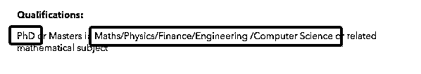
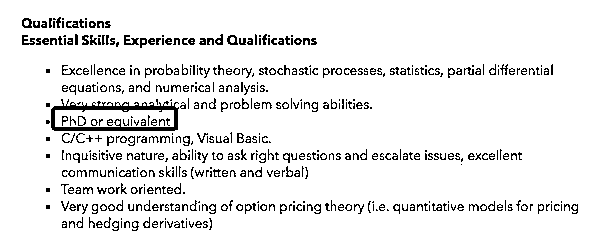
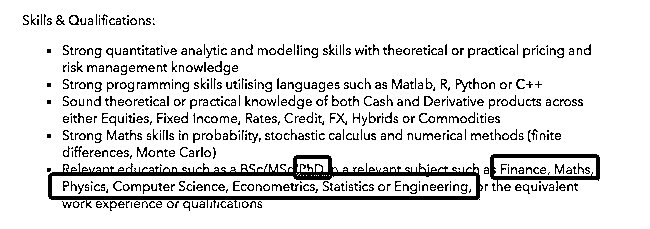
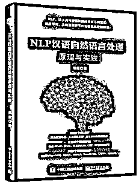

# 那些没成为物理学家的 PhD 们，后来都去了华尔街（第十三期免费赠书活动来啦！）

> 原文：[`mp.weixin.qq.com/s?__biz=MzAxNTc0Mjg0Mg==&mid=2653287698&idx=1&sn=13d047a5e41ee9917c8b95b94400f14d&chksm=802e3707b759be11acad780db3aac7cceb7d11908882efcaebc06cba00cb1dfb853143a48456&scene=27#wechat_redirect`](http://mp.weixin.qq.com/s?__biz=MzAxNTc0Mjg0Mg==&mid=2653287698&idx=1&sn=13d047a5e41ee9917c8b95b94400f14d&chksm=802e3707b759be11acad780db3aac7cceb7d11908882efcaebc06cba00cb1dfb853143a48456&scene=27#wechat_redirect)

**量化投资与机器学习**

为中国的量化投资事业贡献一份我们的力量!

 

部分内容来自 UniCareer。

**2018 年 3 月 14 日，当代最伟大的物理学家史蒂芬·霍金于剑桥的家中逝世，他的观点塑造了现代宇宙学，激励了全球数百万名读者。这一颗科学天空中最明亮的星，陨落在他的 76 岁。这一天，亦是爱因斯坦诞生 139 年的纪念日。**

开个脑洞，如果霍金没有搞物理 

他还有可能去做什么？

**这个答案很有可能就是：Quant**

高智商和高收入的 Quant

传说是一水的斯坦福/MIT 物理 PhD

今天编辑部就来为大家解读：

**1.为什么华尔街偏爱物理 PhD？**

**2.非相关专业，如何进入 Quant 岗位？**

**3.做 Quant，需要哪些技能？**

01

**为什么量化岗偏爱理工科学生？**

曾有一位华尔街量化大佬表示：**“如果你没有计算金融、物理、工程或者统计等等偏 Quant 的硕士或者博士学位 ，几乎是不可能在顶级 quant trading 公司找到工作。”**

**以下是一些投行量化岗位的招聘要求：**

> **花旗银行**

> **JP Morgan:**

> **德意志银行：**

**量化分析师是近几年金融求职圈最火的职位，**主要从事风险管理、优化投资组合、设计开发金融产品、财务分析、销售与交易等工作。去投行做量化也是很多人读 MFE 的目标。但现实中，面到最后一轮，**各大投行券商都只要“各类理工科 PhD”**。

> *高盛 HR 曾说：“我们对 phd 和 master 很公平的，不存在偏袒与否，但最后通过面试的也的确是 phd 为多。”*

一般来说，**物理背景比经管出身的数学、计算机能力强，在逻辑思维、数据分析上具有一定优势。**因为资产价格的变动和物理学家研究的物体运动是有相似之处的，所以善于建模,而且相对缺钱的物理学家就多多转战华尔街了。**不少 buy side 的顶尖 quant team 至今只招理工 PhD。**

其实很多 Quant 人，都是来自数学、物理等背景，所以他们看到这样的背景会觉得很亲切。面试官喜欢数学和物理背景的人，**也是因为 Quantitative Skill 大多非常扎实。**

02

**无相关背景如何进入 Quant 岗位？**

正如前文所说，**很多**顶级 quant trading 公司只招理工科 PhD******，**那么背景是 academia，engineering 以及 software development 的学生都想在华尔街求得一份 quant 职位，该怎么做呢？

**Quant 岗位主要有以下三个方向：**

*   quant trader

*   financial engineer (quant analyst) 

*   quant developer

对于学生来说，**刚毕业就直接成为 quant trader 是很难的，因为这些工作需要的技能都必需在很长的工作经历里逐渐培养。**Financial engineering (i.e. derivatives pricing) 在 2007~2008 的经济危机时非常火热，直到现在依然有着很强的需求。**Quantitative developers 的职位开放依然很多，****但是它需要从业者掌握娴熟的 C++, C# or Java 技能。**

因此，想要从事 quant finance, 尤其是在投行做 quant，**一个非常基础的方法就是攻读 Masters in Financial Engineering (MFE) 。**因为大部分 MFE 课程内容涉及 derivatives pricing 还有 portfolio/risk management 以及一些 software development。

03

**想做 quant，不能只靠 MFE**

一位在华尔街做 Quant 的导师表示：“Sell side 的 quant 本身技术含量要稍低于 buy side，有些门槛可能更多的是在金融和经济的知识上，**因此 MFE 专业也有机会拿到 offer。**”

但是只靠 MFE 真的够吗？

此前在文章：《[起薪 70 万，人才缺口 20 万的量化研究岗最深入调研](https://mp.weixin.qq.com/s?__biz=MzAxNTc0Mjg0Mg==&mid=2653287589&idx=1&sn=b36ec96c1e2d3eec7adbebdd554bb1e7&chksm=802e36b0b759bfa6b63521882d0c6b6d90373f52172df79d791b658c74ea7d829052d143ed15&scene=21#wechat_redirect)》中也说到，来自 Top MFE 项目的毕业生基本可以保证一份投行的工作。 当然，也仅限于凤毛麟角的几个大学（如卡内基梅隆、哥大、普林斯顿）。**这些项目要么声誉够好，要么学校资源、Career Service 够好，要么校友给力。**这些项目的毕业生无论在北美还是回国，发展都很好。

小编为大家提供一位资深 Quant 大牛的说法：

我当年 2005~2006 年找工作的时候，那个时候没有特别多的 MFE 的那些 program，现在大家去瞧瞧，**美国哪个学校没有 MFE 啊，而且现在越来越多中国年轻人为了短平快的找工作，都自费去读那些专业。**其实我们行内的都了解，读那些的基础不是特别好，开始可能就业比较容易，因为工作职位多，竞争也少，可是这些年积累下来，再加上那么多的 MFE 毕业生，街上的工作形势又那么差，所以很多 MFE 找不到好工作也是正常。**不过比较 Solid 的 PhD 还是很容易在街上找到工作的。**

04

**想进入投行做 Quant，请尽早准备**

一位在顶级投行做了 5 年 Quant 的大牛说：

“我曾经也是 MFE 的学生，但是学校的课程远远不够，**在过去 5 年的工作中，我更加证明了我的观点，那就是不遗余力的自学**！在这里我给大家介绍一些我的方法，如果你已经下定决定在投行做 Quant，请你尽早开始这样准备。” 

**1\. Absorb (almost) all publicly available information**

你需要深入了解这三个方向:

*   **Finance/Trading**

*   **Math (especially statistics) **

*   **Programming**

**没有你不需要的知识，只是有先后之分，广泛涉猎绝对没错。除此之外，你需要拥有许多技能才能进入投行的视线。**

*   **在 IT 方面：** Hadoop 显然是你必须要了解的一个重要工具。不过，从我的经历看，Hadoop 只在少数项目中能够用到；**定制环境（Custom Enviroments）——通常是基于 C/C++或者 Java 创建——仍然要相对重要一些。**

*   **在编程语言方面：**C/C++/Java 依旧是你最需要了解的，虽然同样高效的 Python 和 R 越来越多地出现在项目中。除了这些在大学里能够学到的技能，我认为**一****项核心的 IT 技能是结合和分析大规模互不相关数据集的能力，**例如结合金融数据和地理信息。

*   **在硬件方面：**很重要的一点是要记住投行业基本属于*nix 世界（比如 Linux，等等），所以了解这些系统是很必要的，**同时还要了解 SQL（在短期内还不会消失）和 NoSQL 数据库方面的知识。**

*   **其它软技能：**你必须有很强的好奇心和持续的兴趣，深入挖掘新想法和新技术，从而为不断出现的复杂问题寻求可能的解决方案。

**2\. Test and apply your knowledge**

**不停的尝试！**在应用和犯错中巩固你的知识。理解你要做的事情是什么，从而知道你做的每一步哪些有用，哪些没有用。

**3\. Meet and partner with others**

1+1=3。 **一定要找到自己的学习伙伴，或者找一位 mentor，在讨论和交流中发现自己思想上的局限。**一定不要羞于向别人展示你的成果，因为他人眼中的你，才是客观的。这有这样你才能不断进步。

**4\. Get a job at a trading firm**

**尽量多的去实习，盲目的学知识也没有用，很多技能都是在工作中掌握的。**

**加油**

**未来是属于你们的**

**也是给有准备的人的**

**赠书活动**

量化投资与机器学习公众号联合电子工业出版社送出**5 本****《NLP 汉语自然语言处理原理与实践》**

> 本书是一本研究汉语自然语言处理方面的基础性、综合性书籍，涉及 NLP 的语言理论、算法和工程实践的方方面面，内容繁杂。 本书包括 NLP 的语言理论部分、算法部分、案例部分，涉及汉语的发展历史、传统的句法理论、认知语言学理论。需要指出的是，本书是迄今为止系统介绍认知语言学和算法设计相结合的中文 NLP 书籍，并从认知语言学的视角重新认识和分析了 NLP 的句法和语义相结合的数据结构。这也是本书的创新之处。 本书适用于所有想学习 NLP 的技术人员，包括各大人工智能实验室、软件学院等专业机构。

**原价：98.00 元**

**截止 2018.03.24 12:00**

大家在本篇推文【写留言】处发表留言，**获得****点赞****数****前五****的读者，即可免费获赠此书**。届时，工作人员会联系五位读者，寄出此书。

****