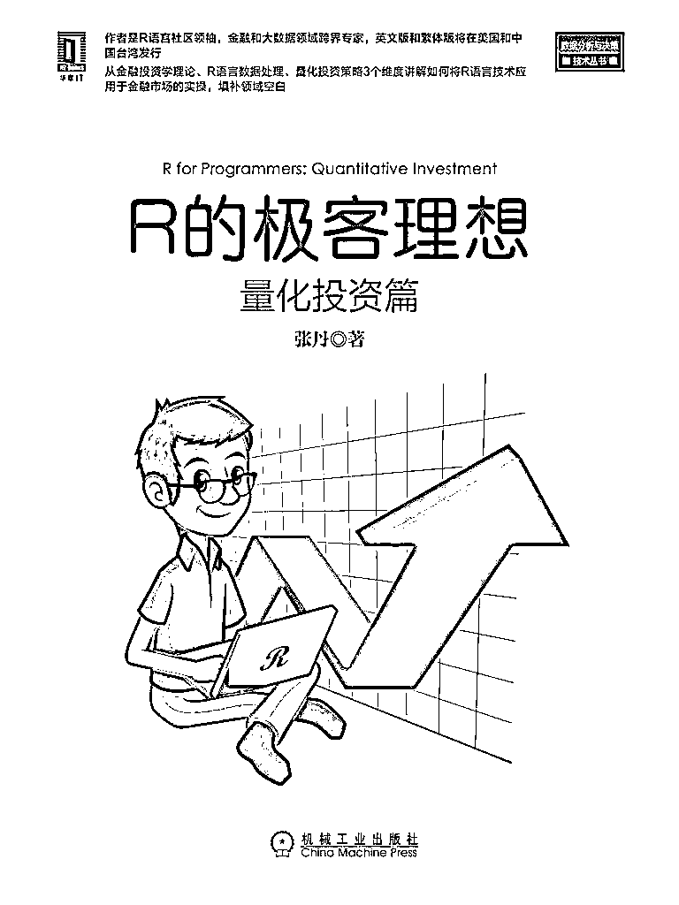

# 『量化投资』宽客挑战赛强势来袭（第二期）

> 原文：[`mp.weixin.qq.com/s?__biz=MzAxNTc0Mjg0Mg==&mid=2653287690&idx=1&sn=398f6aae4ee2565187e23dbf82aed76a&chksm=802e371fb759be09522a259c427e12372d30e99bdfb0badbec13b3cdd79a47da4867401cc859&scene=27#wechat_redirect`](http://mp.weixin.qq.com/s?__biz=MzAxNTc0Mjg0Mg==&mid=2653287690&idx=1&sn=398f6aae4ee2565187e23dbf82aed76a&chksm=802e371fb759be09522a259c427e12372d30e99bdfb0badbec13b3cdd79a47da4867401cc859&scene=27#wechat_redirect)

**量化投资与机器学习**

为中国的量化投资事业贡献一份我们的力量!

 **『量化投资』****宽客挑战赛**

**第二期**

**这期的挑战有点难度哦**

**全答对****算你厉害**

本期为我们出题的大咖是

**张丹 **

**张丹  **资深 R 语言技术专家，在国内 R 语言技术社区的领军人物。10 年以上互联网应用架构经验，在 Java、NodeJS、大数据、统计、数据挖掘算法等方面有深厚的积累。金融大数据专家，精通量化投资交易策略，熟悉中国金融二级市场、交易规则和投研体系。获得 10 项 SUN 及 IBM 技术认证，2017 年被微软评为 MVP。多次在互联网和数据分析相关技术大会中担任演讲嘉宾。

著有《R 的极客理想：量化投资篇》、《R 的极客理想：工具篇》、《R 的极客理想：高级开发篇》，英文版图书被 CRC 出版集团引进，在美国发行。个人博客：http://fens.me（Alexa 全球排名 70k。）

****本期福利****

****丹哥亲自编写的量化书籍****

******R 的极客理想：量化投资篇******

********

****每一期挑战赛****

****我们都会有**福利**赠送****

 ********规则******** 

******1、请点击文末**写留言**，将答案发送至后台。******

******2、我们会根据后台用户提交答案的**时间顺序**，选出**全部回答正确**的**前 5 位**用户，并免费赠送这本丛书。******

******3、我们会在**2017.03.19—07 点**公布答案（第一条置顶留言）******

 **********答题开始********** 

*******1、black-litterman 的统计学算法基础是？ *******

*****a. 均值方差模型*****

*****b. 贝叶斯模型*****

*****c. arima 模型*****

*****d. 神经网络*****

*******2、哪个包是 R 语言中，用于计算技术指标的？ *******

*****a. xts*****

*****b. WindR*****

*****c. quantmod*****

*****d. TTR*****

*******3、基于 APT 理论进行配对交易时，错误配对方法是？*******

*****a. 沪深 300 指数基金，IF 股指期货合约*****

*****b. 铜 CU1804 合约，铜 CU1805 合约*****

*****c. A 股工商银行，H 股工商银行*****

*****d. 国债指数，回购 GC001*****

*******4、可转债的负溢价率套利，正确的描述是？*******

*****a. 正股价格大于可转债价格*****

*****b. 正股价格小于可转债价格*****

*****c, 转股价值大于可转债价格*****

*****d, 转股价值小于可转债价格*****

*******5、2 个人 a 和 b 合伙投资炒股，开始各入金 50w 股权各占 50%，6 个月后赚了 50w，b 继续追加投资 60w，问 a 和 b 的股权比例？*******

*****a. a:b=5:12*****

*****b. a:b=5:11*****

*****c. a:b=5:9*****

*****d. a:b=5:7*****

*******6、对线性回归模型进行调优进时，不需要看指标是？*******

*****a. AIC*****

*****b. ROC*****

*****c. p-value*****

*****d. R-squared*****

*******7、某只指数跟踪的量化基金，其 beta 合理取值为？*******

*****a. 0.5*****

*****b. 1*****

*****c. 1.5*****

*****d. 2*****

*******8、期货交易时，人为降杠杠的方法是？*******

*****a. 用现货对冲*****

*****b. 只用 1/n 的资金交易，留有大部分现金，n 为杠杠倍数*****

*****c. 同时开多单和空单，双向操作*****

*****d. 要求期货公司开通不加杠杠的通道*****

*******9、股票分红时，10 派 10 转 10，错误的描述是？*******

*****a. 转 10，是指公司用资本公积金对于股东每 10 股转增 10 股。*****

*****b. 派 10，是指公司用未分配利润每 10 股现金分红 10 元。*****

*****c. 你有 100 股，分红后，你将变成 200 股和 100 元现金*****

*****d. 分红后，股票价格会下降*****

*******10、用机器学习的方法建模，回测很好为什么实盘会不好？*******

*****a. 过拟合*****

*****b. 未来函数*****

*****c. 滑点*****

*****d. 以上都有可能*****

*******11、假设赌局: 你赢的概率是 60%，下注 1 元，赢时可获得 2 元，输时下注的 1 元就没了。你的本金是 100 元，赌局可无限次，根据凯里公式最优的仓位比例是多少？*******

*****a. 10%*****

*****b. 20%*****

*****c. 40%*****

*****d. 60%*****

*******12、****标普 500 的期望收益率是 12%，无风险利率为 5%，下面投资组合回报率最高的是哪个？*******

*****a. beta=0.2*****

*****b. beta=0.5*****

*****c. beta=1.1*****

*****d. beta=1.4*****

*******2017.03.19—07 点**公布答案（第一条置顶留言）*****

> *****我们也欢迎有兴趣的个人或者机构来为出题。*****
> 
> *****联系方式请添加小编微信：**zxlgglr**【备注：出题】*****