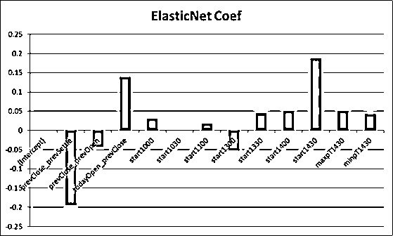
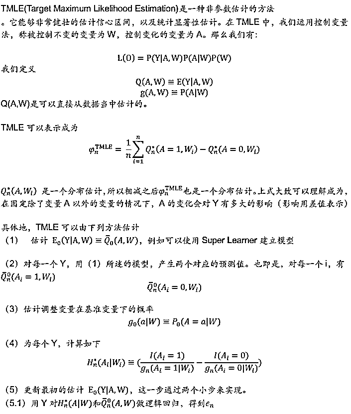

# 特征重要性在量化投资中的深度应用【系列 56】

> 原文：[`mp.weixin.qq.com/s?__biz=MzAxNTc0Mjg0Mg==&mid=2653287672&idx=1&sn=9f59afb57b99cab6692367578c0aaa70&chksm=802e36edb759bffbd644791bb16bbe1ee0042ac3118421976e13141b807f90ae1f3d752c3450&scene=27#wechat_redirect`](http://mp.weixin.qq.com/s?__biz=MzAxNTc0Mjg0Mg==&mid=2653287672&idx=1&sn=9f59afb57b99cab6692367578c0aaa70&chksm=802e36edb759bffbd644791bb16bbe1ee0042ac3118421976e13141b807f90ae1f3d752c3450&scene=27#wechat_redirect)

**量化投资与机器学习**

为中国的量化投资事业贡献一份我们的力量!

 

前五期传送门：

【系列 55】[机器学习应用量化投资必须要踩的那些坑](https://mp.weixin.qq.com/s?__biz=MzAxNTc0Mjg0Mg==&mid=2653287642&idx=1&sn=a7c71f89c3ad6f60590585b1bf016780&chksm=802e36cfb759bfd9a629eae57fc430ff457753a138d053cb7666d55cd41f91809d821285a521&scene=21#wechat_redirect)

【系列 54】[因子的有效性分析基于 7 种机器学习算法](https://mp.weixin.qq.com/s?__biz=MzAxNTc0Mjg0Mg==&mid=2653287512&idx=1&sn=14ee62549dab3c64468f78b3dbfd39a5&chksm=802e364db759bf5bb5abffc6a50f72d0e31722c178e01ce11a3d48fb28386055e741c9ecce8d&scene=21#wechat_redirect)

【系列 53】[基于 XGBoost 的量化金融实战](https://mp.weixin.qq.com/s?__biz=MzAxNTc0Mjg0Mg==&mid=2653287481&idx=1&sn=dcb1dda1e2362d8297ae1a97845cf02e&chksm=802e362cb759bf3a3aaea75af824451a3dba7345ecc73e27facc4b917792835fdd2878403c8c&scene=21#wechat_redirect)

【系列 52】[基于 Python 预测股价的那些人那些坑](https://mp.weixin.qq.com/s?__biz=MzAxNTc0Mjg0Mg==&mid=2653287306&idx=1&sn=9f374874636e7d6d52a9b3d92d6aa81b&chksm=802e319fb759b8896acf2ed9529da88a8fda0d76d6a3b816854e9ad5eeecfd6f4af75dd65804&scene=21#wechat_redirect)

## 【系列 51】[通过 ML、Time Series 模型学习股价行为](https://mp.weixin.qq.com/s?__biz=MzAxNTc0Mjg0Mg==&mid=2653287197&idx=1&sn=9630389a52c7d0be4c1feaf3a534c2ce&chksm=802e3108b759b81ed11174f71b23fb73abe5c4ebad0f9d480b6efbd8f7e644de6b2232dc63fa&scene=21#wechat_redirect)

今天，继续我们的机器学习应用量化投资系列。本期我们再介绍一篇杨勇团队撰写的研究报告。希望大家在写策略注意这些问题。

**前言**

**从 IC、IR 到另类线性归因**

基于 IC、IR 的单因子分析是传统多因子分析的基石。但是 IC、IR 分析出却不能考虑到多因子模型中因子与因子之间的相互影响。因此我们以之前报告介绍的标准神经网络回归为例，用另类线性归因对因子进行了分析。

**从线性归因到非线性归因**

所有线性归因都是基于因子单调性（线性）的强假设。但是在机器学习的非线性世界中，这个强假设不复存在。非线性的机器学习算法需要非线性的归因方式。

**从相关性到因果性**

所有的传统归因方式都是基于相关性的而非因果性。因果分析也是机器学习未来的一个重点。我们以 TMLE 为例介绍机器学习下的因果性分析。

**机器学习归因的意义**

对于传统模型，例如 logit 或者决策树而言，输入（自变量）和输出（因变量）的关系是非常明显的。你可以非常清楚的明白为什么一些样本被错误划分了，例如，比如输入因子中某个因子太小了。同样的，对于决策树，同样可以根据决策树每个分叉的逻辑（例如因子 A>某个常数）向下推演，得出错误划分的原因。但是对于其他大多数的模型，由于它们的高维和非线性，要直观的理解是非常困难的。

尽管如此，让机器学习一个非常有前景的科技让人觉得处于黑箱的状态是非常不明智的。不透明性增加了误用的概率。亚马逊的算法，决定了大多数人今天在读什么书；NSA 的算法决定了谁是潜在的恐怖分子；气候变化模型决定了二氧化碳排放量的安全范围。人不能干预和控制人所不明白的事情，这是什么要单独将机器学习归因的作为一篇报告的原因。

**特征工程与特征重要性**

机器学习的特征在量化投资当中也被称为因子。

**2.1\. 特征工程**

特征工程是用某些领域内的知识来构造特征的过程。

如果世界上有无穷的数据，和一个 universal function approximator（一个可以表达任何事情的模型），那么就没有特征工程存在的必要。这正是目前在图像识别领域发生的事情，卷积神经网络直接学习每个像素点，然后对图像内容进行识别，而不借助任何人手制的特征。

> Coming up features isdifficult, time consuming, requires expert knowledge. “Applied machinelearning” is basically feature engineering.                    
> 
> ——AndrewNg, Machine Learning and AI via Brain simulations

正如吴恩达所述，应用机器学习主要是特征工程。而金融领域的特征获取往往有两种方式。一种是从主观看盘经验来或者从经济学或者金融学的论文来；另一种是纯数据挖掘。后者经常被人诟病容易过度拟合而导致亏损。但是事实上事情可能并没有这么可怕。举例而言 WorldQuant 号称有四百万的 Alpha 因子，结合 Alpha101 来看，很多因子非常可能是数据挖掘出来的，但是从公开业绩来看，它的投资表现还是尚且可以令人满意的。

**2.2\. 特征重要性**

在构造出特征之后，我们需要了解这个特征究竟对我们的预测有没有用，这就需要了解特征重要性。

特征重要性的另一作用是可以进行特征选择，例如选出前五重要性的特征作为模型输入，剩下的可以舍弃。

**传统线性归因**

传统量化投资是基于线性的世界，在这个世界中，衡量因子的重要度是 IC、IR 等等指标。除了 IC，IR 之外，还有一些值得介绍的传统线性归因的方法。

**3.1\. 逐步回归**

逐步回归的基本想法是，将变量逐个引入，引入变量的条件是偏回归平方和经检验是显著的，同时每引入一个新变量后，对已选入的变量要进行逐个检验，将不显著变量剔除，这样保证最后所得的变量子集中的所有变量都是显著的。这样经若干步以后便得“最优”变量子集。

**3.2\. Ridge, Lasso,Elastic Net**

在线性回归中，损失函数定义为：

也即 RSS。

线性回归的目标在于找到一组系数(w1, w2, . . . , wd)使得 RSS 最小，但使用 RSS 作为损失函数可能会导致过拟合，尤其当训练集不够或者特征数量过多时（一个典型的例子是多重共线性），表现为即使实际解释力弱的特征，由于过拟合，它的系数值也较大。为了解决这个问题，在损失函数中对系数加入惩罚项：

以上式最小为目标来寻找系数的方式就叫做 RidgeRegression。其中 Lambda 为调节参数，其大小标志着对系数的惩罚力度。 Lambda 越大，系数就越小。但问题是，系数只能够趋近于 0，当特征个数很多的时候，对那些本来系数就非常小的特征没什么影响，不能减小模型复杂度。

于是，将损失函数修改为：

以上式最小为目标来寻找系数的方式就叫做 LassoRegression。损失函数在收敛的过程中会使一些系数变为 0。变为 0 的权重对结果影响较小，即对应的特征相对不重要。因此 LassoRegression 可以筛选特征，有效减小线性模型的复杂度。

Elastic Net 实际上式 Ridge，Lasso 的综合，其损失函数表示为：

其中 L1 正则项（Lasso）产生稀疏的系数向量，减小模型复杂度。L2 正则项（Ridge）减小过拟合，消除一定的 L1 稀疏性，以产生 groupeffect，稳定 L1 正则项的路径。

所以从以上介绍可以看出，Ridge, Lasso，Elastic Net 前面的正则化的系数的绝对值大小直接代表了该特征的重要性。下图代表了随着惩罚系数的增加，特征前面的系数也随之缩小。

特征系数与惩罚系数关系

下图是之前上一篇标准神经网络回归策略的因子（特征）重要性排名，绝对值越大越重要，正负代表方向。

Lasso Regression 的系数

Ridge Regression 的系数 

ElasticNet 的系数

变量间线性关系、非线性关系

例如，在上图左中，变量之间的关系是线性的，而在右图中，线性归因显然是不能反映出真实的变量之间的相关关系。

为了在非线性的世界中衡量因子的重要性，一系列不同的算法被开发出来了。

** 随机森林系列**

**4.1\. 随机森林**

随机森林属于集成学习，可以视为是 bagging 算法在决策树上的运用。

机器学习中决策树主要用于分类和回归，树中的每一个节点表示某一特征的判断条件，其分支表示符合节点条件的对象。叶子节点表示对象所属的预测结果。

随机森林则由许多决策树构成，每棵决策树都由随机的部分样本的部分特征进行训练，它只接受了部分的训练数据，因此每棵决策树都是一个弱学习器。然后，通过 bagging 所有的弱学习器——决策树，比如投票（分类问题）或者取均值（回归问题），得到一个强学习器——随机森林。

由于每一棵树的输入样本不是全部的样本，每一棵树的特征不是全部特征，基于此基础上进行集成，预测结果相对不容易出现过拟合。并且由于训练的样本是随机、独立地进行选取，对各棵树的训练可以并行进行，训练速度相对快。

用随机森林计算因子重要性的方法有很多种，下面介绍其中一种

1：对于随机森林中的决策树 i,使用相应的 OOB(Outof Bag 袋外数据)数据来计算它的袋外数据误差，记为 errOOB1i。

2：随机地对袋外数据 OOB 所有样本的特征 X 加入噪声干扰(例如可以把 X 重新打乱顺序，常见的方法是就可以随机的改变样本在特征 X 处的值)，再次计算它的袋外数据误差，记为 errOOB2i。  

随机森林计算因子重要性-打乱 X 前

随机森林计算因子重要性-打乱 X 后

3：假设随机森林中有 Ntree 棵树,那么对于特征 X 的重要性为

之所以可以用这个表达式来作为相应特征的重要性的度量值是因为：若给某个特征随机加入噪声之后,袋外的准确率大幅度降低,则说明这个特征对于样本的分类结果影响很大,也就是说它的重要程度比较高。下图是随机森林计算因子重要性的结果图。

随机森林计算因子（特征）重要性

**4.2\. Burota**

Boruta 是一种特征选择算法。精确地说，它是随机森林周围的一种延伸算法。

下面是 Boruta 算法运行的步骤：

1、首先，它通过创建混合副本的所有特征（即阴影特征）为给定的数据集增加了随机性。阴影特征就是把许多打乱后的特征作为新的特征。

2、然后，它训练一个随机森林分类的扩展数据集，并计算特征重要性，以评估的每个特征的重要性，越高则意味着越重要。

3、在每次迭代中，它检查一个真实特征是否比最好的阴影特征具有统计显著的更高（低）的重要性（即该特征是否比最大的阴影特征得分更高），如果是，则确认（拒绝）。它会删除它视为拒绝的特征，然后回到第 1 步。

4、最后，当所有特征得到确认或拒绝，或算法达到随机森林运行的一个规定的限制时，算法停止。

下图是之前上一篇标准神经网络回归大盘择时策略的因子（特征）重要性排名，从左到右依次从重要到不重要。

标准神经网络回归大盘择时策略的因子（特征）重要性排名

**遗传算法**

遗传算法主要应用于优化问题，来源于种群进化的想法。首先需要确定题解的形式，一般为向量形式(x1,x2,...,xd)。开始时，随机生成大量的向量，作为初始种群。然后从该种群中挑选出最优题解，形成新的种群。然后，对它们做出修改，重新挑选出最优题解，依此反复进行这一过程。

修改题解的方法有变异和交叉：变异是对一个既有题解进行微小、简单、随机的改变，比如随机修改向量中一个元素 Xi；交叉则是选取 2 个最优题解，将它们按某种方式结合，比如 X1…Xi 来自 a 向量，而…来自 b 向量，组成新的向量 c。

变异如下图：

新的种群是通过对上一种群中的最优解，进行随机的变异和交叉构造出来的，它的大小通常与旧种群相同。这一过程会一直重复进行，达到指定的迭代次数，或者经数代后题解没有得到改善，结束整个过程。

遗传算法的归因往往需要结合特定的算法。举例来说，如果要从 m 个特征中，选出 n 个特征，使得一个线性回归的拟合效果最好。除了用(m,n)`的遍历方法之外，就可以用遗传算法来减少运算量。

**TMLE**

传统的机器学习模型往往是考虑相关性，但是不考虑因果性。相关性单纯指出 A 和 B 是有联系的，而因果性会指出是由于 A 导致了 B 还是由于 B 导致了 A。

更复杂的因果性可以从下图看到，气温升高导致了冰淇淋的销量和啤酒的销量的增加，两者是因果性的关系。冰淇淋的销量和啤酒的销量的增加虽然有强相关，但是两者都是受气温驱动，两者没有因果联系。

同样的，在大盘择时策略中，我们也可以提出下列问题，昨日价格变化这个因子是否部分决定了今日高开低开幅度和 15:00 价格/14:30 价格-1？今日高开低开幅度和 15:00 价格/14:30 价格-1 是不是只有相关性，没有因果性？

因此我们需要用全新的方法去解决因果性的问题。

大盘择时策略的因子重要性归因

在之前的标准神经网络回归大盘择时策略当中，如果我们对“今日高低开幅度（昨日收盘价/昨日开盘价-1）”因子做 TMLE，调用 R 包：

https://github.com/chizhangucb/tmleCommunity

可以得到如下结果：

**TMLE：-0.059**

**95%信心区间：[-0.0605,-0.0577]**

所以可以说明这个因子是有效的。

杨勇团队

分析师：周袤

联系方式：18601798125

****