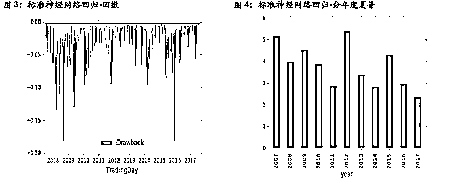
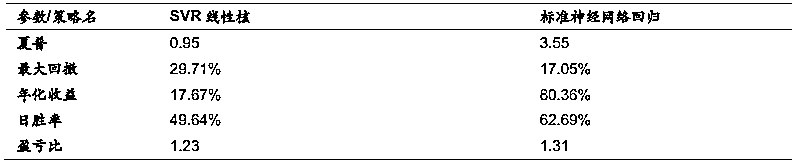
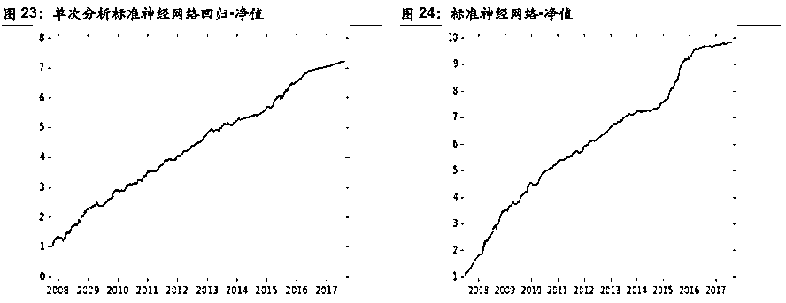
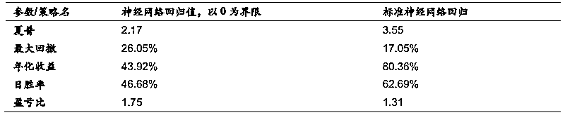

# 【必看】机器学习应用量化投资必须要踩的那些坑（系列 55）

> 原文：[`mp.weixin.qq.com/s?__biz=MzAxNTc0Mjg0Mg==&mid=2653287642&idx=1&sn=a7c71f89c3ad6f60590585b1bf016780&chksm=802e36cfb759bfd9a629eae57fc430ff457753a138d053cb7666d55cd41f91809d821285a521&scene=27#wechat_redirect`](http://mp.weixin.qq.com/s?__biz=MzAxNTc0Mjg0Mg==&mid=2653287642&idx=1&sn=a7c71f89c3ad6f60590585b1bf016780&chksm=802e36cfb759bfd9a629eae57fc430ff457753a138d053cb7666d55cd41f91809d821285a521&scene=27#wechat_redirect)

**量化投资与机器学习**

为中国的量化投资事业贡献一份我们的力量!

 

前四期传送门：

【系列 54】[因子的有效性分析基于 7 种机器学习算法](https://mp.weixin.qq.com/s?__biz=MzAxNTc0Mjg0Mg==&mid=2653287512&idx=1&sn=14ee62549dab3c64468f78b3dbfd39a5&chksm=802e364db759bf5bb5abffc6a50f72d0e31722c178e01ce11a3d48fb28386055e741c9ecce8d&scene=21#wechat_redirect)

【系列 53】[基于 XGBoost 的量化金融实战](https://mp.weixin.qq.com/s?__biz=MzAxNTc0Mjg0Mg==&mid=2653287481&idx=1&sn=dcb1dda1e2362d8297ae1a97845cf02e&chksm=802e362cb759bf3a3aaea75af824451a3dba7345ecc73e27facc4b917792835fdd2878403c8c&scene=21#wechat_redirect)

【系列 52】[基于 Python 预测股价的那些人那些坑](https://mp.weixin.qq.com/s?__biz=MzAxNTc0Mjg0Mg==&mid=2653287306&idx=1&sn=9f374874636e7d6d52a9b3d92d6aa81b&chksm=802e319fb759b8896acf2ed9529da88a8fda0d76d6a3b816854e9ad5eeecfd6f4af75dd65804&scene=21#wechat_redirect)

## 【系列 51】[通过 ML、Time Series 模型学习股价行为](https://mp.weixin.qq.com/s?__biz=MzAxNTc0Mjg0Mg==&mid=2653287197&idx=1&sn=9630389a52c7d0be4c1feaf3a534c2ce&chksm=802e3108b759b81ed11174f71b23fb73abe5c4ebad0f9d480b6efbd8f7e644de6b2232dc63fa&scene=21#wechat_redirect)

今天，继续我们的机器学习应用量化投资系列。本期我们介绍一篇杨勇团队撰写的研究报告。希望大家在写策略注意这些问题。

**前言**

**从高频到低频**

机器学习在高频量化策略上应用更加容易。

**从线性到非线性**

机器学习下的非线性比线性更能榨取数据的价值，但也更容易过度拟合，因此需要合理使用。

**从单次分析到推进分析**

推进分析更加符合实盘状态下盘后更新模型的实际情况。

**从分类到回归**

回归经常能优于简单的分成两类。

**预测值相关**

好的预测值不一定带来好的交易信号。

**标准神经网络回归大盘择时策略**

**1.1\. 设想和目标**

运用机器学习对过去的模式进行识别，并预测未来。也即，用当前实时数据与过去所有数据进行模式匹配，若过去模式显示会大概率上涨下跌，则相应做多做空，否则不做操作。原本该模型是为日内策略设计的，也就是收盘平仓，但由于目前平今仓手续费昂贵，所以改为第二天开盘平。

**1.2\. 理论、方法及数据源**

和所有量化策略相似，研究假设过去发生的事情未来会重复发生（也即挑战市场弱有效的假设）。另一重要假设是指数现货和指数期货之间相关性很高，接近 1。这个假设是合理，因为在流动性充足的市场，如果现货和期货之间的任何偏差都可以造成套利机会。故可以用现货做期货。方法为传统的深度学习方法。数据源来自天软、万得，主要是中证 500 指数，沪深 300 指数，以及对应的期货主力合约。

**1.3\. 交易成本与策略执行**

在此策略的历史数据回测中，成交成本假设为日内单边千分之一，隔日单边万分之 3。也即在成交中假设 1.5 个指数点的冲击成本。这样的假设充分包含了目前股指期货低流动性的现实。

**1.4\. 算法和模型**

该算法共有 7 个模型，分别对应 10:00,10:30,11:00,13:00,13:30,14:00,14:30 的决策时间点。每个模型的本质是相似的，唯一的不同只在于越向后的模型，所能拥有的供机器决策数据越多。例如在 10:30 做决策会比 10:00 做决策多出半小时的数据。每个模型本身都是监督式学习。用价量指标来预测收益。若基于机器学习的预测值触及多头开仓阈值，则做多；若基于机器学习的预测值触及空头开仓阈值，则做空。反之维持原来仓位。

**1.5\. 结论**

在日内单边千分之一，隔日单边万分之 3 的成交假设下，策略表现如下：

> 夏普：3.55
> 
> 最大回撤：17.05%
> 
> 胜率：62.69
> 
> 盈亏比：1.31
> 
> 年化：80.36%

**1.6\. 策略因子归因**

用前述的策略因子归因方法，可以看出一些非常重要的特点。

可以从图中看到，开盘的前一个小时行情数据产生的因子和收盘最后一个小时行情数据产生的因子是非常重要的，如 14:30 到 15:00 的收益。这与人的主观经验是一致的，开盘前一小时交投最活跃，基本能反应当天的市场情绪和主导全天的走势。而收盘最后一小时由于经常是对第二天情绪的猜测，所以从它的走势经常能推断出第二天市场的方向。

另外，盘中两个小时交投最不活跃，随机性也越大。单独用盘中两个小时作为因子去预测未来收益相对来说效果会差一些。

**1.7\. 风险点及未来的改进方向**

风险点主要有：

（1）期货和现货突然性的暂时偏离（在当前负基差的情况下和低成交量下，尤其可能发生）

（2）市场结构发生了深刻的变化（投资者类型，投资者风险偏好等等），导致过去的数据不再能预测未来。例如去年股灾期间国家队的大规模救市。

（3）市场流动性不足，导致成交需要付出巨大成本或者无法成交。以中证 500 为例，本模型单笔收益大约在千分之三左右，如果买卖价差长期超过 5 个指数点，将对策略的盈利能力造成毁灭性的打击。目前股指期货受限以来买卖价差大约为 1-2 个指数点。

（4）没有合适的报撤单逻辑。如果出现单边市场，简单的用限价单的报撤会导致以最不利的价格成交。

**从低频到高频**

为了比较高频分钟线与日线策略的区别，我们也设计了一个日线策略。这个策略是基于传统技术指标做特征，例如昨日收盘价相对于过去几日的均线的位置，以及高开低开情况等等。去预测未来的一日的收益。

**2.1\. 算法和模型**

该算法每日决策一次，每个模型本身都是监督式学习。用价量指标来预测收益。若基于机器学习的预测值触及多头开仓阈值，则做多；若基于机器学习的预测值触及空头开仓阈值，则做空。反之维持原来仓位。

**2.2\. 结论**

在日内单边千分之一，隔日单边万分之 3 的成交假设下，策略表现如下：

> 夏普：0.68
> 
> 最大回撤：36.92%
> 
> 胜率：53.21
> 
> 盈亏比：0.99
> 
> 年化： 19.02%

**1.3\. 高频背后的一些逻辑**

**2.3.1\. 数据**

通常来说，对机器学习模型，数据量越大越好。在假设能反映出目前市场的前提下，尽可能多的增加训练集的长度，对机器学习的模型算法收敛和模型稳定性是大有裨益的。假设是日线，以每年 250 个交易日为例，那么 2010 年到 2017 年就是大约 1700 个数据点。但如果是分钟线，同样是每年 250 个交易日，每个交易日 240 根分钟线，那么一共就有 1700*240=408,000 的数据点。显然后者就比前者多了好几个数量级。

但是并不是数据量的增加可以无限的，数据量的增加会收到其他客观条件所约束，如运算速度和交易成本。

****2.3.1.1**. 运算速度**

举例期货的例子来说，交易所每 500 毫秒推送一个 tick，所以理论上，2010 年到 2017 年就可以有 49,000,000 个数据点。如果假设交易策略是简单的每 500 毫秒预测一次，那么数据点的增加在实盘中就并没有什么用处。因为在 CPU 下，神经网络的计算用时不太可能在 500 毫秒之内。所以在一个决策时间点内没有算完，就已经进入了下一个决策时间点，实盘当中根本交易不到。

**2.3.1.2. 交易成本**

同样上一个期货的例子。如果是非做市类策略，那么算上冲击成本后的交易成本通常双边至少要达到千分之一。在 500 毫秒乃至更长一些的时间尺度，由于时间时间尺度偏短，波动很难非常大，所以这是一个非常难覆盖交易成本。

**2.3.1.3. ****日内消息面**

国内股市实行每日交易时间是四份小时。四个小时内出现基本面新消息的概率较小。而隔日的话，各种消息面容易打破股价自身的运行规律。使得预测的准确性大幅降低。

**2.3.1.4.** 行为金融

人的行为在短期内是比较固定的。比如日内短线的追涨杀跌等等，这些都是由人性所决定的。但是随着时间的拉长，特别是两个交易日之间，人会冷静下来，情绪会淡化。

**从线性到非线性**

为了比较线性模型与非线性模型的区别，我们也设计了一个线性模型。这个策略是基于传统线性核函数的支持向量机回归，使用标准的神经网络回归策略一样的因子和预测目标。

**3.1\. 算法和模型**

算法与模型基本和标准的神经网络回归策略一样，不同的是，神经网络被替换成了线性核函数的支持向量机回归。

**3.2\. 结论**

在日内单边千分之一，隔日单边万分之 3 的成交假设下，策略表现如下：

> 夏普：0.95
> 
> 最大回撤：29.71%
> 
> 胜率：49.64
> 
> 盈亏比：1.23
> 
> 年化：17.67%

**3.3\. 非线性背后的一些逻辑和讨论**

**3.3.1\. 金融市场大概率是非线性的**

金融市场大概率是非线性的，举例而言，业内研究发现，不是高开幅度越大，当日的后续走势就越向上。如果当日高开 0~0.5%左右，那么当日大概率是上扬的，但是如果高开的过大，当日就容易高开低走。

**3.3.2.  Bias-VarianceTrade off**

Dropout 算法

如上图所示，被舍弃的神经元用 X 表示出来了。所有指向它和从它发出的有向箭头都被斩断。

**3.3.3\. 人的理解方式经常是线性的**

正向线性思维的特点是，思维从某一个点开始，沿着正向向前以线性拓展，经过一个或是几个点，最终达到思维的正确结果。举例而言，经常有人会认为，如果过去 100 年平均每年的生产力提升是一千亿，那么未来一年统计上的期望生产力提升也是一千亿。这里就犯了一个常见错误。人类生产力的提升经常是指数级别上升的，所以未来一年统计上的期望生产力提升应该不止一千亿。

正是因为人的思维方式是线性的，在理解非线性的时候会直观上比较困难。为了增加读者对非线性的直观理解，我们将在下一篇中重点阐述。

**从单次分析到推进分析**

**4.1\. 算法和模型**

算法与模型基本和标准的神经网络回归策略一样，不同的是，我们这次要比较第一篇报告中写了单次分析和推进分析。

下面是单次分析的常见方法：

上图给了一个单次分析的实例。实际上单次分析就是把整个样本分为互不重叠的两个部分。白色的是样本内，灰色的是样本外。首先用样本内的数据训练机器学习模型，然后用这个建立好的机器学习模型直接放入样本外数据进行检验，如果在样本外的数据依然说明该模型效果很好，那么在一定程度上说明该模型可以处理实际的问题而推进分析的样本内外常常变化。

上图是一种推进分析的方法。推进分析有个最为明显的特点，就是样本外的交易长度仅为一个交易周期。同样的，首先用样本内的数据训练机器学习模型，然后用这个建立好的机器学习模型直接放入样本外数据进行检验。在 T1 时刻，用 0~T1 的数据训练模型，然后在 T1~T2 的数据去检验模型；在 T2 时刻，用 0~T2 的数据训练模型，然后在 T2~T3 的数据去检验模型；在 T3 时刻，用 0~T3 的数据训练模型，然后在 T3~T4 的数据去检验模型，以此类推。最后将所有灰色框内的检验结果汇总，就是推进分析下总的样本外结果。

**4.2\. 结论**

在日内单边千分之一，隔日单边万分之 3 的成交假设下，策略表现如下：

> 夏普：2.66
> 
> 最大回撤：17.24%
> 
> 胜率：57.56
> 
> 盈亏比：1.22
> 
> 年化：56.38%

**4.3\. 单次分析和推进分析的逻辑讨论**

在逻辑上，推进分析更接近实盘。因为在实盘中，经常地，模型会每日在盘后更新。所以如果是这样，在回测时候，也应该假定，在 T 日末，模型会被重新训练，也即是站在 T 日的模型和站在 T+1 的模型也应当是不一样的。这样做的显著好处是，不论是回测还是实盘，每个模型都能用到站在当前时点上最新的数据。坏处也很显著，在回测时候，对历史上的每一天都要建立一个模型，这样的计算量是巨大的。

另外推进分析也有不同的方法。

上图是另一种推进分析的方法（Rolling）。与之前推进分析的方法不同，在 T2 时刻，用 0~T2 的数据训练模型，然后在 T2~T3 的数据去检验模型；在 T3 时刻，我们并不像之前一样，用 0~T3 的数据训练模型，而是用 T1~T3 的数据训练模型，然后同样的在 T3~T4 的数据去检验模型，以此类推。最后将所有灰色框内的检验结果汇总，就是推进分析下总的样本外结果。

使用全样本做推进分析和使用过去 n 期样本做推进分析之间没有优劣之分。选择时候大体上要遵循两个基本原则，一个是数据要具有对当前市场状态的代表性，另一个数据量要尽可能多。使用过去 n 期样本通常能对当前市场状态的代表性，使用全样本做推进分析。

**从分类到回归**

**5.1\. 算法和模型**

算法与模型基本和标准的神经网络回归策略一样，不同的是，预测目标不再是某段时间的收益，而是一个二分类。也即，大于 0 的时候是上涨分类，小于 0 的时候是下跌分类。

**5.2\. 结论**

在日内单边千分之一，隔日单边万分之 3 的成交假设下，策略表现如下：

> 夏普：1.66
> 
> 最大回撤：25.30%
> 
> 胜率：49.72%
> 
> 盈亏比：1.39
> 
> 年化：30.91%

**5.3\. 分类与回归的逻辑讨论**

分类的逻辑是，市场的状态是离散可分的。如果按照上例，涨 0.1%和涨 10%都会归结到上涨一栏。但是事实上，涨 0.1%和涨 10%是截然不同的，前者很可能是随机扰动，而后者一定是市场情绪的体现。但是随机扰动与市场情绪的分界点是很难确定的，涨 0.1%是随机扰动，但是涨 0.5%是不是随机扰动呢？所以分类有个天生的问题，以什么标准来划分类，如何划分类？我们也曾经尝试过划分成 5 类，7 类，但是由于划分的类过多，效果也不及二分类。

**预测值相关**

**6.1\. 算法和模型**

算法与模型基本和标准的神经网络回归策略一样。在标准神经网络回归，我们只有当大于一个阈值的时候，做多。小于一个阈值的时候做空。但是在该策略中，再算出预测值后，直接预测值大于 0 就做多，小于 0 就做空。

**6.2\. 结论**

在日内单边千分之一，隔日单边万分之 3 的成交假设下，策略表现如下：

> 夏普：2.17
> 
> 最大回撤：26.05%
> 
> 胜率：46.68%
> 
> 盈亏比：1.75
> 
> 年化：43.92%

**6.3\. 预测值相关的逻辑**

预测值可以从上述的回测看到，预测值如果按照简单的大于 0，小于 0 交易，效果并不是特别出色。目前业内比较公认的结论是，预测值的强度代表方向的概率。举例而言，如果一个预测值是 0.1%，一个是 1%，那么后者实际上涨的概率大于前者。因此，选择一个合适的阈值变的至关重要。可能的确定阈值的方法可以是，历史上预测值的平均数加上一个历史上预测值的标准差作为看多阈值；历史上预测值的平均数减去一个历史上预测值的标准差作为看空阈值。

一个绝对值较大的预测阈值容易漏掉一些真正的上涨机会（统计上的 Type II error），而一个绝对值比较小的预测阈值容易错误的开多仓（统计上的 Type I error）。同时，绝对值预测阈值越小，越容易达到阈值，越容易触发交易，交易频率就越高，交易成本就越高。反之交易就越不频繁，交易成本就越低。

杨勇团队

分析师：周袤

联系方式：18601798125

****