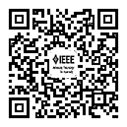

# 想要变得优秀，你得先知道「优秀」是什么样的！

> 原文：[`mp.weixin.qq.com/s?__biz=MzAxNTc0Mjg0Mg==&mid=2653287596&idx=1&sn=88bc245e566b8f8e8ddaf86a89be20aa&chksm=802e36b9b759bfafe1c7a3ea6d3f658bfc40385d7eef98e3a5f836bf6669ee4fb7739519f613&scene=27#wechat_redirect`](http://mp.weixin.qq.com/s?__biz=MzAxNTc0Mjg0Mg==&mid=2653287596&idx=1&sn=88bc245e566b8f8e8ddaf86a89be20aa&chksm=802e36b9b759bfafe1c7a3ea6d3f658bfc40385d7eef98e3a5f836bf6669ee4fb7739519f613&scene=27#wechat_redirect)

**量化投资与机器学习**

为中国的量化投资事业贡献一份我们的力量!

 

成为一个优秀的技术人，不是一个简单的目标。一方面，想要变得优秀，意味着你知道「优秀」是什么样的；另一方面，你要知道自己该怎么做。

想要变得优秀，少不了优质的内容和有效的学习方式，为此，我们为你遴选了几个精品微信公众号，为你的提升助力！

**TGO 鲲鹏会**

**ID: egonetwokrs**

TGO 鲲鹏会是极客邦科技 / InfoQ 旗下，面向高端技术领导者的微信公众号。每日分享最全面的技术管理干货与一线大咖专访文章及演讲实录，致力于帮助技术人持续学习成长。现在关注即可免费获得「 CTO 技能图谱 」一份。

**开源中国**

**ID: oschina2013**

开源中国 www.oschina.net 是目前中国最大、最具影响力的开源技术社区，拥有超过 200 万的开源技术精英。我们传播开源的理念，推广开源项目，为 IT 开发者提供一个发现、使用、并交流开源技术的平台。开源中国微信公众平台将每天为您送上精选开源资讯早点，更有开源软件推荐、热门干货分享、OSChina 乱弹等你哦！

**数据猿**

**ID: datayuancn**

数据猿（ www.datayuan.cn ）是大数据产业的创新服务媒体。聚焦 "大数据 + 产业"的应用落地及纵深发展前景。我们关注大数据领域前沿资讯、最新动态，报道行业标杆企业和创新创业公司。目前已拥有：大数据 24 小时、大咖专访、大数据创投罗盘等多个原创优质品牌栏目；并通过数据猿官网、微信公众号、今日头条、百度百家等 11 大自媒体平台，构建完整的媒体传播矩阵；数据猿已成为大数据领域颇具影响力的科技服务媒体，通过定期举办线上、线下行业培训、研讨沙龙、组织大型行业峰会，为"数据价值的产业落地"搭建融通与交流平台。

**优达学城 Udacity**

**ID:** youdaxue

优达学城 Udacity 是谷歌无人车之父 Sebastian Thrun 创立的在线硅谷大学，全球 900W 工程师通过 Udacity，跟随 Google 、Facebook 技术大佬，掌握机器 / 深度学习、无人车等黑科技，打破年薪天花板。关注后回复“学习资料”，获取【机器学习和大数据就业指南】。

**马哥 Linux 运维**

**ID: magedu-Linux**

****

马哥 Linux 运维是由 Linux 布道师马永亮和他的小伙伴们共同运营，致力于提供最具深度的 Linux 运维和 Python 自动化干货文章。这里集中了 13 位 BAT 高级工程师的工作经验和人生智慧，大量社群活动、高端职位内推，7 万小伙伴等你一起来玩！关注领取时长 100+ 小时 Linux 及 Python 入门视频！

**THU 数据派**

**ID: datapi**

依托清华大学独特的师资和生源优势,旨在提供大数据产业链的思维碰撞与资源对接平台。发布全球大数据资讯，定期组织优质线下活动，分享前沿产业动态。

**Python 中文社区**

**ID:python-china**

全球 Python 中文开发者的精神部落，由阿橙发起建立，社区目前覆盖各大主流媒体，拥有来自全球十多个国家和地区数万名登记会员，全平台近 20 万关注者。数十个金融科技、量化交易、数据分析、网络爬虫、自然语言处理、树莓派、智能硬件、游戏开发、云计算、区块链与数字货币、自动化运维、Web  开发、网络安全攻防等线上线下技术社群。

**IEEE 电气电子工程师学会**

**ID:IEEE_China**

网罗全球科技前沿动态，为科研创业打开脑洞。

**量化投资与机器学习**

**ID:ZXL_LHTZ_JQXX**

作为微信全网量化 & 量化投资、关键字搜索排名第一的技术类公众号。编辑部汇集了一群来自清华、北大、复旦、人大、中科大、上交、华中科技大、同济、武大、北邮、川大、上财、东财、央财、西财、中大、暨大、华师、华工、LSE 、NUS 等海内外优秀院校毕业的博士、硕士和相关研究从业人员。为大家带来关于量化投资和机器学习相关的知识和干货。版块语言分为：Python 、MATLAB 、R 。涉及领域有：量化投资、机器学习、人工智能。

**100offer 说**

**ID:shuo100offer**

100offer 专注于分享互联网人职业发展干货，掌握一手互联网圈跳槽资讯。职业发展、跳槽薪资、公司内部信息，都在 100offer 说。