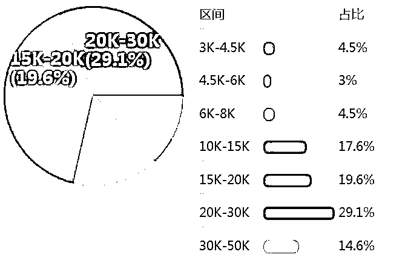
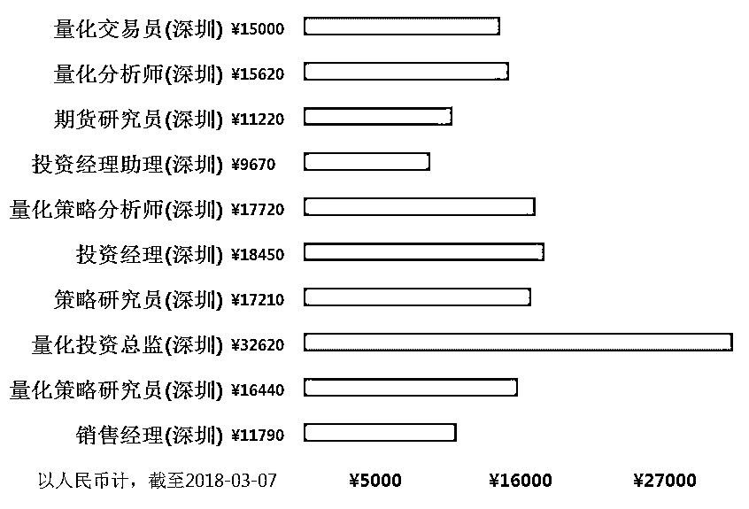

# 【重磅】起薪 70 万，人才缺口 20 万的量化研究岗最深入调研（附第十二期赠送活动&公众号福利）

> 原文：[`mp.weixin.qq.com/s?__biz=MzAxNTc0Mjg0Mg==&mid=2653287589&idx=1&sn=b36ec96c1e2d3eec7adbebdd554bb1e7&chksm=802e36b0b759bfa6b63521882d0c6b6d90373f52172df79d791b658c74ea7d829052d143ed15&scene=27#wechat_redirect`](http://mp.weixin.qq.com/s?__biz=MzAxNTc0Mjg0Mg==&mid=2653287589&idx=1&sn=b36ec96c1e2d3eec7adbebdd554bb1e7&chksm=802e36b0b759bfa6b63521882d0c6b6d90373f52172df79d791b658c74ea7d829052d143ed15&scene=27#wechat_redirect)

**量化投资与机器学习**

为中国的量化投资事业贡献一份我们的力量!

 

部分内容来自 UniCareer（微信 ID：UniCareer）和编辑部整理。

**2017 至 2018 年，券商急招量化人才**

3 个人的量化团队可以做出一个亿的利润

让几乎所有的自营交易部眼睛瞪得发直

**有消息称，2018 年，这个岗位将大幅扩招**

**金融工程和金融数学**

正是进入量化岗最常见的两个专业

九大投行和券商量化岗位的要求都会明确要求：

MFE 俗称金工，不只是镶了金边的码农。

**Top MFE 基本可以帮你保证一份投行的工作，买方 Hedge Fund 最爱招 MFE 的毕业生做 Quant，MFE 毕业的学生第一年薪资平均高达 11 万美金。**

那么，**哪些学校的 MFE 专业含金量最高？传说中毕业能进投行的是哪个学校的 MFE？美国各名校的 MFE 金融工程专业分到底设置了哪些课程，其录取条件和就业形势如何呢？**小编为大家吐血整理了这篇 MFE 专业大全。

**我们先看看国内情况**

（数据来自职友集）

01

**上海**

上海量化研究员平均工资：

**¥ 21580/月**

取自 363 份样本，较 2016 年，增长 97%。

## 历年工资变化趋势

## 按工作经验统计

## 相似岗位工资收入

02

**北京**

北京量化研究员平均工资：

**¥18150/月**

近 1 年 223 份样本。

## 按工作经验统计

## 相似岗位工资收入

03

**深圳**

深圳量化研究员平均工资：

**¥18160/月**

近 1 年 199 份样本。

## 按工作经验统计

## 相似岗位工资收入

04

**广州**

工作量化研究员平均工资：

**¥12620/月**

近 1 年 105 份样本。

## 按工作经验统计

## 相似岗位工资收入

**我们再看看国外情况**

01

**传说中毕业进投行的 Top MFE**

***Top MFE***

毕业生基本可以保证一份投行的工作。 当然，也仅限于凤毛麟角的几个大学。这些项目要么声誉够好，要么学校资源、Career Service 够好，要么校友给力。这些项目的毕业生无论在北美还是回国，发展都很好。

来源：知乎

***Tier 2 MFE ***

以下项目比 Top 相较有些短板，不能保证在美国毕业后的工作，主要还是靠内推和海投。

来源：知乎

***Tier 2 以下的不推荐读***

以上是 MFE 毕业的学生在行业和求职过程中总结出来的**美国金融工程项目含金量**。关于美国金融工程硕士排名，目前比较主流的排名体系有 QuantNet 和 TFE，近日 QuantNet 公布了最新的 2018 排名，一起来看一下吧！

02

**美国 MFE 项目排名大全及项目详解**

QuantNet 根据 GRE 成绩、起薪、本科 GPA、录取率、就业率等条件对美国的 MFE 进行了排名：

（点击图片看大图）

**Carnegie Mellon **

|   |   |
| 项目名称 | Master of Computational Finance  |
| 开设院系 | Tepper 商学院 |
| 课程介绍 | 学制为 16 个月，三个学期。开学日期：每年 8 月末。课程特点：**1\. 同学可以参加由德意志银行组织的 Deutsche Trading Competition，获胜者可以得到现金奖励及在德意志银行实习的机会。****2\. MSCF 项目顾问团队成员全部来自 Wall St 的投行。** |
| 录取要求 | 要就读卡内基梅隆大学 (匹兹堡) 需要雅思或托福成绩，要求雅思成绩总分为 7，要求托福成绩总分为 100，申请该专业就读需要 2 年的时间，需要本科工程方向背景：数学、计算机、工程学、经济学。需要熟悉计算机应用：C, C++，有相关工作经验优先。 |
| 就业前景 | MSCF 的毕业生主要从事 Derivatives Pricing and Trading, Risk Management, Research, Structured Products, Quantitative Portfolio Management and Analytics Software Development。其学生毕业后三个月的就业率为：2011 年毕业生录取率为 92%，2010 年为 88%，2009 年为 83%，2008 年为 96%。 |

**UC Berkeley **

|   |   |
| 项目名称 | Master of Financial Engineering Program |
| 开设院系 | Berkeley 主校园东南侧的 Haas 商学院 |
| 课程介绍 | Berkeley 的 MFE 要求修满 28 个学分的课程，一个学分对应 15 个课时，这其中**包括 Morgan Stanley 的应用金融项目**。全部课程应该在一年内完成，对于一个全日制硕士学位而言，强度很大。 |
| 录取要求 | Berkeley 的 MFE 项目每年大约招 60-80 人左右，申请的过程和 MSF 等其他经管类或计算机类的 Master 项目区别不大，但是对申请人有一些很特别的要求，其中包括：1. 熟练掌握一门编程语言，最好是 C 和 C++，而且对算法和数据结构的掌握的比较好。2. 熟练掌握统计和计量经济学方法，并能用软件解决相关问题。3\.  很强的数学背景，包括：微积分、线性代数、概率论、微分方程等：这些数学课程对中国的理工科学生而言应该不是难事。4.具有工作经历。 |
| 就业前景 | 金融工程这个专业由伯克利分校哈斯商学院独自承办，依托了商学院得天独厚的校友网络资源，使得该专业不但在加州，在美国西海岸，而且在世界上都享有极大的声誉。  我们拿 2015 级毕业生来举例子，实习生月薪平均有 7,088 刀， 2014 级毕业的学生留美第一年，注意，只是第一年平均年收入在 146,424 刀左右，其中在美国工作的平均年收入约 144,213 刀，美国以外工作的平均年入 163,742 刀。 |

**Princeton University **

|   |   |
| 项目名称 | Master in Finance |
| 开设院系 | 普林斯顿大学的 Bendheim 金融中心 |
| 课程介绍 | 普林斯顿大学提供的金融硕士项目，侧重金融经济学、金融工程和计算算法。核心必修课提供数理、经济学、概率论和统计学方面的技能。而且有专门的 Summer Intern 给学生提供实习机会。 |
| 录取要求 | 这个项目与其他 MFE 不太一样，非常重视金融方面 (不光是数理），所以很难申请，班里只有 30 人左右，必须是各方面都极为优秀的人才有机会，大部分有工作经历。在学校官网上有明确说：In 2013, we received 694 applications and offered admission to 28  applicants. In 2012, we received 815 applications and offered admission to 48  applicants (5%), with 43 enrolling (89 percent acceptance rate)。 |
| 就业前景 | 该硕士项目为学生拓宽了就业渠道，完全可以在金融行业内外就业，包括金融工程、风险管理、定量资产管理、宏观经济学、金融预测和应用研究。该项目并不要求申请人有在金融行业的经历，但在近两年的申请中，有一部分的申请人有金融行业的从业经历或实习经历。**Bendheim 中心对毕业生提供广泛的结业服务，包括实习机会和就业岗位。** |

** New York University **

|   |   |
| 项目名称 | Master of Science in Mathematical Finance |
| 开设院系 | NYU Tandon School of Engineering |
| 课程介绍 | 1.5 年的项目，数学味很浓厚，课程基本是固定的没选择性，没有奖学金。该项目共 33 学分，专业开设的专业方向如下：公司财务与金融市场 (Corporate Finance and Financial Markets)、计算金融 (Computational Finance) 、风险金融 (Risk  Finance)、金融技术与算法 (Technology and Algorithmic Finance）。 |
| 录取要求 | 只招 30 人左右，因此这个项目的竞争的申请难度不比普林斯顿低。据说为了选拔出最优秀的申请者，筛到最后剩下的一批人基本都是 GPA>3.7，GRE>320，然后用个人陈述定胜负。这个项目非常重视申请人的数学背景。 |
| 就业前景 | 纽约大学与金融产业界联系紧密，毕业生就业率好的不能再好。这也是它超级抢手的原因之一。另外，据说 NYU 的项目 director 十分好人，**经常给学生联系业界的关系去找实习，找工作**，也就是说，他们的学生经常会有很多非网申能拿到的面试和 networking 的机会，这样“中签”的几率也就大很多。据统计，过去的几年内，毕业生都基本在纽约的金融行业就业，85%的学生在 3 个月内找到工作。 |

**Columbia University **

|   |   |
| 项目名称 | Master of Science in Financial Engineering (MSFE) |
| 开设院系 | 工程与应用科学学院的工业工程与运筹研究 IEOR 系下 |
| 课程介绍 | 8 月份入学，是学制一年的项目，要求 36 学分。课程包含五个方向：Computation &  Programming 计算&编程；Finance  & Economics 金融&经济；Derivatives 衍生品；Asset Management 资产管理；Computational Finance  & Trading Systems 计算金融&交易系统，对于专业方向的设置学校很大程度上参考了金融行业发展的需要。 |
| 录取要求 | 1\. 硬件要求： 要求 TOEFL 最低 100，GRE 没有最低要求，GMAT 不接受，项目对于同学们的硬件要求还是比较高的。从往年的录取数据来看，同 GPA3.5，TOEFL110，GRE325+申请才具有竞争优势。2.申请背景：比较青睐申请者是工程、数学、计算机科学、统计、经济学、金融或者其他类似的定量背景，前提课程要求学过概率、微积分和线性代数。项目对同学们的数学背景要求比较严格。3\. 工作经验：对工作经验无要求，但是学校建议申请者能者能够有一定的专业经验，无论是全职或者是兼职都可。 因为面试环节申请人的 career goal 也是重点考察对象，寻找机会到大型金融投资机构实习，提升对于金融行业的认识，是非常必要的。 |
| 就业前景 | 之前这个一年制的项目饱受争议，主要就是课程压力大，学生没有时间找工作。从 2011 年开始，哥大通过调整课程设置课程减轻学生的课业压力，提供更多的实习时间。同时哥大也整合了就业资源，给 MSFE 的同学们提供了更多的渠道，比如更往届校友的交流会，会定期举行，让在校生可以更及时了解各大投行的需求，调整自己的求职计划。目前官方统计的就业率是 95%，**其中 45%能通过暑期实习签下高盛、摩根史丹利等美国境内企业；60%以上学生均是在纽约找到工作**，毕业生年薪在$50，000- $120，000 之间。 |

** Cornell University **

|   |   |
| 项目名称 | Master of Engineering——Financial  Engineering Option |
| 开设院系 | School of Operations Research and Information Engineering |
| 课程介绍 | 1.5 年，有奖学金机会，课程有工科味道。 |
| 录取要求 | 要求申请人具有一定数学能力和编成能力，部分人会有面试，申请时个人陈述要重视，推荐信尽量找教数学、统计、计算机的教授写。三封里面至少两封是学术方面的推荐信 |
| 就业前景 | 康奈尔地处偏辟的乡间，与纽约市有 4 小时车程，因此 ORIE 系在曼哈顿有一个 OR 办公室，**会在项目中间给学生寻找纽约的实习机会**。另外，它跟普林斯顿和哥伦比亚同样是 Ivy，而且离纽约市也不太远，又有 Summer Intern，所以毕业生就业很不错 |

**Stanford University**

|   |   |
| 项目名称 | Computational and Mathematical Engineering |
| 开设院系 | 这个项目设在数学系下 |
| 课程介绍 | 1.5 年，没有奖学金，课程非常理论化，偏重研究，例如可以选斯坦福商学院里 Duffie 教授的博士生课，此人是资产定价理论的世界级大师。这个项目每年招 30 个人，而且一小部分面向斯坦福的本科生。 |
| 录取要求 | 世界闻名的斯坦福大学，有着与其极高的声望所相当的录取门槛。 斯坦福的竞争虽然不是最激烈的，但是录取标准是最严格的，申请人数理基础要非常好，而且又要对金融实业有很好的理解。被它拒过的人有的还得到了竞争更激烈的学校的录取，可见斯坦福的严格。 |
| 就业前景 | 据悉，**斯坦福大学金融工程毕业生起薪：$140,972**。就业率：75.6%。 |

**University of Chicago**

|   |   |
| 项目名称 | Master of Science in Financial  Mathematics |
| 开设院系 | Department  of Mathematics |
| 课程介绍 | 拥有着美国最多的诺贝尔奖得主的芝加哥大学，是美国研究型大学的典范，并且号称世界经济学和金融学研究的圣地。但是这个项目是设在数学系下的，而且课程非常理论化，数学味极浓(这与芝加哥大学的研究性特点很相符)，1 年的没有奖学金，这意味着没有实习的时间 |
| 录取要求 | 学士学位，GPA 平均 3.5 分，芝加哥大学对 TOEFL 成绩要求是美国最变态的 (新 TOEFL 各项 26 以上)，而且这个项目要求 GRE 数学 sub 考试(而很多人没有)，所以能申请的人不多，竞争不是太激烈，今年拿到他家录取的人不少。另外值得注意的是，有的人可以免数学 sub 考试，甚至可以达不到 TOEFL 单项的要求，但具体还看条件托福。 |
| 就业前景 | 据该项目的 program  director 说就业率还是不错的，毕竟是在北美第二大金融中心。**芝加哥大学金融工程毕业生起薪：$133,424 **就业率：82.1%。 |

03

MFE 专业就业前景与薪资

***就业前景：***

以下是最新的 2017 年 Baruch MFE Employment Report，统计了 MFE 专业的学生去往的公司和职位。

从就业报告中可以看出，毕业生的目标行业集中在投行，对冲基金，金融机构，咨询，资产管理等。**2015-2017 年，54%的毕业生去往投行，31%的学生去往买方金融机构****。**具体工作方向以 Quant，Risk，Trading 居多。

***Quant，量化岗***

量化分析师是近两年金融求职圈最火的职位，主要从事风险管理、优化投资组合、设计开发金融产品、财务分析、销售与交易等工作。去投行做量化也是很多人读 MFE 的目标。但现实中，面到最后一轮，**各大投行券商都只要“各类理工科 PhD”**。

> 高盛 HR：“我们对 phd 和 master 很公平的，不存在偏袒与否，但最后通过面试的也的确是 phd 为多”

***Risk，风险管理岗***

金融工程的本科在各大投行、基金、券商的风控岗都很吃香。相反，金融工程硕士可能有一些 Over-qualified，有同学参加纽约 JP Morgan 的 Risk 面试，面试官曾明确表明，“ Risk 这种东西，本科生就足够了，没必要招个 Master 进来”。

***Trader，交易岗***

投行交易岗的最佳背景就是金融本科+MFE，懂金融、还要要懂编程和数学。

*** 毕业薪资***

在美国，**金融工程专业平均年薪为$80,000+**, 比其他工作的平均薪酬水平**高 31%**；**Quants 的平均年薪为$118,000**，比其他工作的平均薪酬水平**高 67%**。而且工作时间和年限越长，薪资会越高。

金融工程师让人羡艳的待遇自然让很多人跃跃欲试，国内还是国外，金融工程专业都是属于热门的专业之一。高能力配得上高薪资，该专业的门槛只会只高不低，所以它又是热门专业中很难申请的专业。

04

**MFE 毕业生，怎样才能进投行/券商量化岗？**

***证书：***

金融工程作为热门专，选择人数多，所以类似 CFA（Chartered Financial Analyst）和 FRM (Financial Risk Manager) 这类证书可以帮助你从竞争者中脱颖而出。

 ***数据语言：***

作为对数据挖取、分析及结果可视化要求很高的领域，Python/C++/Java/C#/R 这类编程语言的熟练应用是很不错的加分项，熟练使用数据统计类通用工具（例如 matlab）也是必要技能。另外了解机器学习、数据挖掘，有相关经验则是非常有竞争力的为加分项。

 ***Gpa: ***

要进入九大或知名券商，3.5/4.0 为佳，很多公司的 HR 表示更看重高等数学、建模等有关数理逻辑能力的相关课程的成绩。

 ***学位：***

作为研究方向明确，专业知识更加专精的硕士及以上学历者为佳。

 ***实习经验：***

作为交叉学科金融工程的毕业生，有金融背景实习（风险管理，证券投资，金融衍生品相关等）或数据编程方向（机器学习，数据可视化等）实习是大部分 HR 看中的宝贵经验。没有任何相关实习经验，即使是 Top MFE 毕业生也很难进投行。

**福利一****（点击标题）**

**量化投资干货****（公众号精选）**

*   [2016 年全年所有券商金工研报第 1 部分](http://mp.weixin.qq.com/s?__biz=MzAxNTc0Mjg0Mg==&mid=2653284668&idx=1&sn=1d099b61ac8a378f39ef99203cfb85af&chksm=802e2b29b759a23f1ce824e84ab55601f8da41ace7877cac3fe97900f1a7147c97a732481841&scene=21#wechat_redirect)

*   [2016 年全年所有券商金工研报第 2-4 部分](http://mp.weixin.qq.com/s?__biz=MzAxNTc0Mjg0Mg==&mid=2653284678&idx=1&sn=0c29d884ada86f565b5849057fe5cdb6&chksm=802e2b53b759a245db87fe77c211e8f987464d0d188305808b412fb2d36cbc9f4bb707fedde9&scene=21#wechat_redirect)

*   [2016 年全年所有券商金工研报第 5-9 部分](http://mp.weixin.qq.com/s?__biz=MzAxNTc0Mjg0Mg==&mid=2653284702&idx=1&sn=c150e541adb6f852459b085a086bf97f&chksm=802e2b4bb759a25de30c981d25e8db6c90e409e0c8ec5303ad0b3fa673abfc01fd4832842c16&scene=21#wechat_redirect)

*   [国外优秀量化投资书籍推荐](https://mp.weixin.qq.com/s?__biz=MzAxNTc0Mjg0Mg==&mid=2653285014&idx=1&sn=7b008dd3b3c6362e2c8176e87934fc43&chksm=802e2883b759a195d086130716f83b01f88ed702b3db0dfc3bb0a30a0c3aae141ec823fcc5b6&scene=21#wechat_redirect)

*   [以色列神秘 AI 研究力量：深度学习的四大失败（视频+论文+ppt 下载）](https://mp.weixin.qq.com/s?__biz=MzAxNTc0Mjg0Mg==&mid=2653285299&idx=1&sn=cef320cbac5c9155868a12c3e374613e&chksm=802e29a6b759a0b0527fac1276cdce6646484fe101d525e0373b58ab925074456faadc81b323&scene=21#wechat_redirect)

*   [高频交易（18 篇论文）+（15 本书籍）+（9 篇研报）](https://mp.weixin.qq.com/s?__biz=MzAxNTc0Mjg0Mg==&mid=2653285360&idx=1&sn=e90f550136b74dc8490a9d48886cdd71&chksm=802e29e5b759a0f3288d7c0434e46e2c7f116f21d056401de19df7b4aefda80434d6e509919c&scene=21#wechat_redirect)

*   [文本挖掘在量化投资中的应用之（28 篇最全券商研报）+（2 个策略程序）](https://mp.weixin.qq.com/s?__biz=MzAxNTc0Mjg0Mg==&mid=2653285408&idx=1&sn=a21c1ba55f954cf8875a45b736977645&chksm=802e2e35b759a72314dda71191036327642ebf168e1bb161ec37f6f56a563c73cc73d72fefda&scene=21#wechat_redirect)

*   [2017 上半年所有券商金工研报（一）](https://mp.weixin.qq.com/s?__biz=MzAxNTc0Mjg0Mg==&mid=2653286032&idx=1&sn=f931e3de55ba425049553d524173b57e&chksm=802e2c85b759a5935002ab01161a92be5ba6c7a5ba64ad12d8be55490fa328973835008ab2dc&scene=21#wechat_redirect)

*   [2017 上半年所有券商金工研报（二）](https://mp.weixin.qq.com/s?__biz=MzAxNTc0Mjg0Mg==&mid=2653286039&idx=2&sn=b6fda2baaff0af634531e3d2928755e0&chksm=802e2c82b759a59496553894c6e3a90e8a47622a228276d61c6c84a3b593b8a81e989926fb5c&scene=21#wechat_redirect)

*   [2017 年 7 月全部券商金工研报汇总](https://mp.weixin.qq.com/s?__biz=MzAxNTc0Mjg0Mg==&mid=2653286133&idx=1&sn=c8ef7e2df827698971c71c270ec08a65&chksm=802e2ce0b759a5f63de0fb7f635e8959c4f25a5c761d165a0a2312d08e48e48e408dde572642&scene=21#wechat_redirect)

*   [2017 年 8 月全部券商金工研报汇总](https://mp.weixin.qq.com/s?__biz=MzAxNTc0Mjg0Mg==&mid=2653286262&idx=1&sn=8fe879fc4a5189cf027b7496da82681f&chksm=802e2d63b759a47535c7a0dfe279672f10821edcdeb49c6f099a7388feef39e8faeb2aaf30e3&scene=21#wechat_redirect)

*   [2017 年 9 月全部券商金工研报汇总](https://mp.weixin.qq.com/s?__biz=MzAxNTc0Mjg0Mg==&mid=2653286383&idx=1&sn=7c6b9f54ee5727ede261042510daa401&chksm=802e2dfab759a4ec6a3eb346d6e27fceae852aefae361bd93320ba4ffab7a2859899b28ace19&scene=21#wechat_redirect)

*   [2017 年 10 月全部券商金工研报汇总](https://mp.weixin.qq.com/s?__biz=MzAxNTc0Mjg0Mg==&mid=2653286510&idx=1&sn=b64aab20dc1ba2e56776aa34090d361d&chksm=802e327bb759bb6d558caf6a2aaf4e86bfaf31a3558573f58c7f5f24d1526756ec0ac1d3a820&scene=21#wechat_redirect)

*   [2017 年 11 月全部券商金工研报汇总](https://mp.weixin.qq.com/s?__biz=MzAxNTc0Mjg0Mg==&mid=2653286510&idx=1&sn=b64aab20dc1ba2e56776aa34090d361d&chksm=802e327bb759bb6d558caf6a2aaf4e86bfaf31a3558573f58c7f5f24d1526756ec0ac1d3a820&scene=21#wechat_redirect)

*   [2017 年 12 月全部券商金工研报汇总](https://mp.weixin.qq.com/s?__biz=MzAxNTc0Mjg0Mg==&mid=2653286510&idx=1&sn=b64aab20dc1ba2e56776aa34090d361d&chksm=802e327bb759bb6d558caf6a2aaf4e86bfaf31a3558573f58c7f5f24d1526756ec0ac1d3a820&scene=21#wechat_redirect)

*   [有关行为经济学的（10 多本书籍）+（130 多篇论文）](https://mp.weixin.qq.com/s?__biz=MzAxNTc0Mjg0Mg==&mid=2653286392&idx=1&sn=f3dd6c7926a797f6111701146d78b529&chksm=802e2dedb759a4fb8fd7806f820f874223246a8cf040e394b98a7333857be8ab39a88870cd66&scene=21#wechat_redirect)

*   [Quantitative Finance 杂志关于量化交易领域排名前十的文章](https://mp.weixin.qq.com/s?__biz=MzAxNTc0Mjg0Mg==&mid=2653286500&idx=1&sn=106e28d25e413c816193005ef64c479d&chksm=802e3271b759bb67f5088e176153a51dc945abb373d7eabc5c089adb2ecdd207138bfb667631&scene=21#wechat_redirect)

*   [最全 LSTM 在量化交易中的应用汇总](https://mp.weixin.qq.com/s?__biz=MzAxNTc0Mjg0Mg==&mid=2653286702&idx=1&sn=e4416e23c8b5ab7955a258e1077153e3&chksm=802e333bb759ba2dea0b46da08d0d7b6268090033d6af98b2f72b14909e2935c1e7fbe4bec69&scene=21#wechat_redirect)

*   量化投资初级——高阶资料

*   [【海通证券】 研报大放送（百篇）](http://mp.weixin.qq.com/s?__biz=MzAxNTc0Mjg0Mg==&mid=2653284202&idx=1&sn=f94bdefe70ddcb538ca463ba1c5e5205&chksm=802e257fb759ac69899d8544937600c22637697591fce25d1ed1b72414d975eeeba7cc58c9d8&scene=21#wechat_redirect)

*   [【广发证券】 研报大放送（最全）](http://mp.weixin.qq.com/s?__biz=MzAxNTc0Mjg0Mg==&mid=2653284199&idx=1&sn=4ec9cac078f8057744349c9c953decb2&chksm=802e2572b759ac6438362451289132ab4bb631da5b41e9f2b2545eb5efe50e0d14d6bd3d3015&scene=21#wechat_redirect)

*   [【国泰君安】 研报大放送（精华）](http://mp.weixin.qq.com/s?__biz=MzAxNTc0Mjg0Mg==&mid=2653284196&idx=1&sn=85245caf9148fb965df1c56c963984ba&chksm=802e2571b759ac6772582aea40781bddd6f148f144edc9b8b08606749f3c2c012b907441d59d&scene=21#wechat_redirect)

*   [各大券商研报](http://mp.weixin.qq.com/s?__biz=MzAxNTc0Mjg0Mg==&mid=2653283773&idx=1&sn=d4604682da0c5563be9da16717d11bf9&scene=21#wechat_redirect)（一）

*   [各大券商研报](http://mp.weixin.qq.com/s?__biz=MzAxNTc0Mjg0Mg==&mid=2653283257&idx=2&sn=49c78925e7f3535b9cad95bf91574519&scene=21#wechat_redirect)（二）

**福利二**

**赠书活动**

量化投资与机器学习公众号联合博文视点 Broadview 送出**5 本****《区块链核心算法解析》**

> 《区块链核心算法解析》主要介绍区块链中超级重要的概念：共识在各种应用场景中的实现机制。本书是目前已面世书籍中对共识概念解析中至权威、至全面的一本。目标读者为区块链学习及研究人员，以及实际开发区块链系统的工程人员。本书中的主要概念将独立成章。每一章都以一个小故事开始，从而引出该章节的内容。算法、协议和定义都将以形式化的方式描述，以便于读者理解如何实现。部分结论会在定理中予以证明，这样读者就可以明白为什么这些概念或算法是正确的，并且理解它们可以确保实现什么。其他的大部分内容将以评论的方式出现。这些评论将讨论各种各样非正式的思考，并且为后续内容做好铺垫。就算不阅读这些评论，读者们也可以掌握章节的精髓。此外，为了便于读者寻根溯源，每一章也会讨论相关技术的发展历史。不管怎样，希望你在本书中找到乐趣！

**原价：59.00 元**

**截止 2018.03.10 12:00**

大家在本篇推文【写留言】处发表留言，**获得点赞数****前五****的读者，即可免费获赠此书**。届时，工作人员会联系五位读者，寄出此书。

****