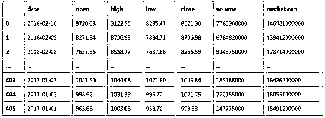
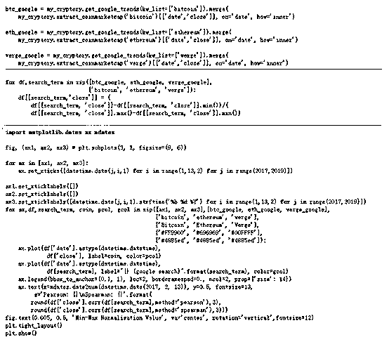

# 【精选】使用 Cryptory 分析影响加密货币价格的因素（区块链系列 3）

> 原文：[`mp.weixin.qq.com/s?__biz=MzAxNTc0Mjg0Mg==&mid=2653287564&idx=1&sn=0cae25a8fd7052b52f0dbc21dca9e1d5&chksm=802e3699b759bf8fb9e7be589a5904974cbb6885e9213dd71abe263ed4e266eb60b60ca54e2e&scene=27#wechat_redirect`](http://mp.weixin.qq.com/s?__biz=MzAxNTc0Mjg0Mg==&mid=2653287564&idx=1&sn=0cae25a8fd7052b52f0dbc21dca9e1d5&chksm=802e3699b759bf8fb9e7be589a5904974cbb6885e9213dd71abe263ed4e266eb60b60ca54e2e&scene=27#wechat_redirect)


**量化投资与机器学习**

为中国的量化投资事业贡献一份我们的力量!

 

作者：David Sheehan

编译：编辑部

机器学习应用区块链系列的**第三篇**文章

前 2 期文章传送门

## [【系列一】如何开发一套自己的智能合约系统](https://mp.weixin.qq.com/s?__biz=MzAxNTc0Mjg0Mg==&mid=2653287256&idx=2&sn=483e71c66e863aec424ff0c1936411c6&chksm=802e314db759b85b505f7fd1ed0cb0cacf10ed4bbbf86cc50c7bbc9d07d4ac0fed3b783b2278&scene=21#wechat_redirect)

## [【系列二】多维 LSTM 网络预测比特币价格](https://mp.weixin.qq.com/s?__biz=MzAxNTc0Mjg0Mg==&mid=2653287287&idx=1&sn=a4efd248d74afa7360f2e32751066b5d&chksm=802e3162b759b8748907f4d889d648d89acd54837041a8f94cde00740b5a867012ae48fa1f5d&scene=21#wechat_redirect)


我们可以设计两种模型。

1、一个更复杂的模型（更多的隐含层）

2、一个可以识别更多输入信息数据源的模型。

虽然很容易把注意力放在第一个模型上，但 garbage-in-garbage-out 的原则依然存在。

考虑到这一点，我为大家创建了一个名为 cryptory 的新 Python 包（https://github.com/dashee87/cryptory）。它集成了各种包和协议，以便你可以在一个地方获得历史密码和更广泛的经济/社会数据。

**安装**

cryptor 可以在 PyPi 和 GitHub 上使用，因此很容易运行 pip install cryptory 在你的 command line/shell 中。


下一步是将包装加载到工作环境中。 具体来说，我们将导入 Cryptory 类。

```py
# import package
from cryptory import Cryptory
```

假设没有返回任何错误，那么你现在可以开始提取一些数据。 但在此之前，值得一提的是，你可以通过运行 help 功能来检索有关每种方法的信息。

```py
help(Cryptory)

Help on class Cryptory in module cryptory.cryptory:

class Cryptory
 |  Methods defined here:
 |  
 |  __init__(self, from_date, to_date=None, ascending=False, fillgaps=True, timeout=10.0)
 |      Initialise cryptory class
 ...
```

现在我们将创建我们自己的加密对象，我们将其称为 my_cryptory。 你需要定义要检索数据的开始日期，同时还有一些可选的参数。例如，你可以设置结束日期，否则它将默认为当前日期 - 有关更多信请输入 help(Cryptory.__init__)。

```py
# initialise object
my_cryptory = Cryptory(from_date="2017-01-01")
```

**加密货币价格**

首先我们将获取一些比特币的历史价格（从 2017 年 1 月 1 日开始）。 cryptory 有几个选项对于这些数据种类：

```py
# initialise object
my_cryptory = Cryptory(from_date="2017-01-01")
# for readability, reduce number of rows shown by default
import pandas as pd

pd.options.display.max_rows = 6

# get prices from coinmarketcap
my_cryptory.extract_coinmarketcap("bitcoin")
```



```py
# get prices from bitinfocharts
my_cryptory.extract_bitinfocharts("btc")
```


这些单元说明如何从 coinmarketcap 和 bitinfocharts 中提取比特币价格。 每种方法返回的价格差异都可以通过计算每日价格的不同方法来解释（例如 bitinfocharts 代表当天的平均价格）。 出于这个原因，我不建议组合不同的价格来源。

你还可以通过 extract_bitinfocharts。例如， 交易费用。请参阅帮助（Cryptory.extract_bitinfocharts）以获取更多信息。

```py
# average daily eth transaction fee
my_cryptory.extract_bitinfocharts("eth", metric='transactionfees')
```


你可能已经注意到每种方法都会返回一个 pandas dataframe。事实上，所有的加密方法都会返回一个 pandas dataframe。这很方便，因为它允许你使用常见的 pandas 技术来处理输出。例如，我们可以轻松合并两个 extract_bitinfocharts 来结合每日 bitcoin 和 ethereum 的价格。

```py
my_cryptory.extract_bitinfocharts("btc").merge(
my_cryptory.extract_bitinfocharts("eth"), on='date', how='inner')
```


extract_poloniex 提供了加密价格的另一个来源，它从 public poloniex API（https://poloniex.com/support/api/）中提取数据。例如，我们可以检索 BTC / ETH 汇率。

```py
# btc/eth price
my_cryptory.extract_poloniex(coin1="btc", coin2="eth")
```


我们现在可以对加密货币价格进行一些基本分析。


当然，上图并没有什么意义。 你不能只比较每个币的单位价格。 你需要考虑总供给和市值。 这就好像说日元与美元相比，美元被低估了。但我并不担心。这里更重要的是自 2017 年以来价格的相对变化，我们可以通过 pandas magic (pct_change)：


这些币是在 bitinfocharts 上提供的，它们倾向于代表较旧的传统币。例如，从 2017 年表现最佳的硬币是 Reddcoin。它从 2017 年开始，市值不到 100 万美元，但是完成价值约 2.5 亿美元，到 2018 年 1 月初达到 7.5 亿美元的高峰。你会注意到每个币都显示出相同的一个趋势：3 月至 6 月持续上涨，随后在 12 月再次飙升，并在 2018 年 1 月出现明显的抛售。 

在 pandas 的帮助下，我们可以生成密码价格关联图：


它不像股市。以太坊和比特币没有 Facebook 和通用汽车那么不同。尽管股票价格与实现财务目标（即季度收益报告）和更广泛的宏观经济因素有关，但大多数密码（可能全部）目前都是围绕区块链技术在展开。这并不是说币偶尔不会逆市上涨，例如 ripple (xrp)在十二月初。然而，过度表现之后往往是市场的表现不佳（例如 2018 年 1 月的波动）。 

我承认我迄今为止所做的一切都是突破性的。你可以从 Quandl api（https://www.quandl.com/tools/python）中获得类似的数据（我打算将 quandl API 调用集成到 cryptory 中）。当你想要将加密价格与其他数据源结合时，加密的真正好处 cryptory 就来了。

**Reddit Metrics**

如果你熟悉密码，你很可能会意识到他们关联 reddit 的页面。 这就是加密投资者来讨论不同区块链实施的优点，剖析当天的主要话题和发布有趣的 gif，它主要是 GIF（https://www.reddit.com/r/Bitcoin/comments/7v438b/the_last_3_months_in_47_seconds/）。通过加密技术，您可以将 reddit 指标（订阅者总数，新订户，一分为二地被刮掉从 redditmetrics 网站（http://redditmetrics.com/）或与其他加密数据结合起来。


让我们来看看 iota 和 eos; 两个币于 2017 年 6 月出现，并于 2017 年底实现强劲增长。Their corresponding subreddits are r/iota and r/eos, respectively.

```py
my_cryptory.extract_reddit_metrics("iota", "subscriber-growth")
```


现在我们可以分析价格和 subreddit 之间的关系。


直观来看，价格和子分币成员增长之间显然存在某种相关性（y 轴使用传统的 min-max 比例进行归一化）。 尽管两个币的 Spearman 等级相关性都相似，但是 iota 的 Pearson 相关系数显着更强，突出显示了不依赖单一测量的重要性。在撰写本文时，iota 和 eos 的市值都在 50 亿美元左右（总体为第 11 和第 9），但 iota subreddit 的用户数量比 eos subreddit（分别为 105k 和 30k）多 3 倍以上。虽然这并不能确定价格和 reddit 之间的关系是否具有预测性，但确实表明 reddit 指标可能是某些币有用的模型特征。

**Google Trends**

Google Trends 你会注意到在 11 月下旬和 12 月初，iota 和 eossubreddits 的用户几乎同时激增。 这是更广泛的加密趋势的一部分，大多数币经历了前所未有的收益。 领先的是比特币，价格在 11 月 15 日和 12 月 15 日之间涨了两倍。 作为 nocoiner 最知名的加密技术，比特币（以及更广泛的区块链行业）在这次牛市期间受到了相当多的主流关注。据推测，这吸引了很多新的加密投资者，推高了价格。

通过 cryptory，你可以轻松地将常规加密指标与 Google Trends 数据结合起来。 你只需要确定好你想要搜索术语。 如果你以前使用过 Google Trends，那么你会注意到你只能检索最多 90 天的数据。 get_google_trends 方法将重叠搜索拼接在一起，以年计算。

```py
my_cryptory.get_google_trends(kw_list=['bitcoin'])
```


现在我们可以查看加密价格和谷歌搜索流行度之间的关系。




A few words on Verge (xvg): eccentric (i.e.crazy) crypto visionary John McAfee recommended (i.e. shilled) the unheraldedVerge to his twitter followers (i.e. fools), which triggered a huge surge inits price. As is usually the case with pump and dumps, the pump (from whichMcAfee himself potentially profitted) was followed by the dump. The sorry storyis retold in both the price and google search popularity. Unlike bitcoin andethereum though, you’d need to consider in your analysis that verge is also acommon search term for popular online technology news site The Verge (tronwould be a similar case).

无论如何，回到 cryptory，你可以提供一个以上的关键字，使你可以看到不同条

款的相对流行度。让我们比较自 2013 年以来 Kim Kardashian 和比特币的历史人气：


根据谷歌趋势，比特币在 2017 年 6 月成为一个更受欢迎的搜索词。也就是说，比特币从未在 2014 年 11 月 13 日达到 Kim Kardashian 的高度。

**股票市场价格**

加密货币有点类似于传统的公司股票。 当然，主要区别在于你不可能通过投资股市来支付 lambo。尽管如此，股票市场可能会提供有关总体经济表现如何的线索，甚至可能提供具体行业如何应对区块链革命的线索。

cryptory 包含一个 get_stock_prices 方法，该方法基于雅虎财务并返回历史数据。请注意，你需要在雅虎金融网站上找到相关的公司/索引代码。

```py
# %5EDJI = Dow Jones
my_cryptory.get_stock_prices("%5EDJI")
```


你可能会注意到前一个收盘价格会在股市关闭的几天（例如周末）结转。你可以选择关闭此功能（请参阅 help(Cryptort.__init__)）。

在 pandas 的帮助下，我们可以将比特币相对于某些特定股票和指数进行可视化操作。


该图显示如果你在 1 月 3 日投资，你将收到的回报。由于比特币涨幅最大（> 10 倍回报），客观上它是最好的投资。但 AMD 和 NVIDIA（以及英特尔在某种程度上）是特殊情况，因为这些公司生产的显卡支持密码挖掘的工作。 柯达（不要与 2012 年前破产柯达相混淆），因为他们在 2018 年 1 月初宣布他们打算创建他们自己的“以照片为中心的加密货币”

和以前一样，通过 pandas，你可以创建一个比特币股市的相关图。


**商品价格**

尽管比特币最初被设想为替代支付系统，但高额交易费和不断上涨的价值阻碍了其作为合法货币的使用。 这意味着比特币及其继任者已经演变成另一种价值储备 - 一种容易丢失的互联网黄金(http://uk.businessinsider.com/nearly-4-million-bitcoins-have-been-lost-forever-study-says-2017-11)。因此，调查比特币与更传统的价值储备之间的关系可能会很有趣。

cryptory 包含一个 get_metal_prices 方法，可以检索各种贵金属的历史价格。

```py
my_cryptory.get_metal_prices()
```


我们可以轻松地绘制 2017 年和 2018 年商品的变化情况。


看看 2017 年和 2018 年慢慢升值的黄金，因此代表着稳定的财富储备。如前所述，我们可以绘制一个价格相关矩阵。


不出所料，各种贵金属呈现出显着的相关性，而比特币价值看起来完全没有关联。 我认为，负相关可以提供证据表明人们正在摆脱传统的价值储备，但几乎没有证据支持这一理论。

**外汇汇率**

比特币背后的动机之一是创造一种不受任何中央政府控制的货币。 当美国中央银行在 2007 年金融危机后通过印刷数万亿美元的新货币来支撑经济不景气时，美国中央银行可能贬值美元。因此，美元汇率和货币与加密货币之间可能存在关系。

cryptory 包括一个 get_exchange_rates 方法，用于检索特定货币对之间的历史每日汇率。

```py
my_cryptory.get_exchange_rates(from_currency="USD", to_currency="EUR")
```


正如你所看到的，美元在过去的一年中已经跌破至欧元。

**原油价格**

全球经济实力（如中国的需求）和地缘政治不稳定性（如中东，委内瑞拉）强烈影响油价。 当然，还有其他一些因素（页岩，走向可再生能源等），但你可能想要在你的加密价格模型中使用油价格来使用这些因素。

cryptory 包括一个 get_oil_prices 方法，可以检索历史日常原油价格。

```py
my_cryptory.get_oil_prices()
```


自 2017 年初以来，原油价格已上涨约 20％。


**更多有关资料**

1、twitter statistics (specifically JohnMcAffee’s!!!)

2、media analysis (number of mainstreamarticles, sentiment, etc.- example)

3、more Asian-centric data sources (Japan andSouth Korea are said to account for 40% and 20% of global bitcoin volume,respectively)

4、more financial/crypto data (integrateQuandl api)

原文代码链接：https://github.com/dashee87

****