# 把握市场趋势和波动——基于 EMD 算法的日内趋势策略

> 原文：[`mp.weixin.qq.com/s?__biz=MzAxNTc0Mjg0Mg==&mid=2653287516&idx=1&sn=393d105c06352d55ea1e6d5668cc988f&chksm=802e3649b759bf5fa5b5689ca878cc872c7d4832aef4a03dafc70428b3562f781951190390ba&scene=27#wechat_redirect`](http://mp.weixin.qq.com/s?__biz=MzAxNTc0Mjg0Mg==&mid=2653287516&idx=1&sn=393d105c06352d55ea1e6d5668cc988f&chksm=802e3649b759bf5fa5b5689ca878cc872c7d4832aef4a03dafc70428b3562f781951190390ba&scene=27#wechat_redirect)


**量化投资与机器学习**

为中国的量化投资事业贡献一份我们的力量!

 


## **前言**

本文主要基于广发证券研报《经验模态分解下的日内趋势交易策略》的思路进行实证研究，本文的主要内容包括：

1）EMD 算法及数值实验。
2）EMDT 策略及参数确定。
3）策略回测及评价。

## **一、EMD 算法及数值实验**

经验模态分解（Empirical Mode Decomposition，EMD）方法是由美国航空航天局（NASA）的黄锷院士提出的一种处理非平稳和非线性信号的分析方法。与一般的信号处理方法不同，EMD 是一种自适应的分析方法，即依据数据自身的时间尺度特征来进行信号分解。简单地说，EMD 是一种去除噪声和短期波动的算法，具有算法简单、延迟性低等特点。

#### **1.1 EMD 算法简介**

经验模态分解假设任何复杂的信号都是由一些不同的“波动项”和一个“趋势项”组成。这些波动项被称为本征模态函数（IMF），即复杂信号


其中 IMF 需满足以下两个条件：

*   函数的局部极大值和局部极小值的数目之和与零点的数目相等或者只能差 1，即一个极值之后必需马上接一个零点。

*   在任何时间点，局部最大值所定义的上包络线与局部极小值所定义的下包络线，取平均要接近于零。

算法步骤：

输入：原始信号 s。
输出：本征模态函数 IMF1，IMF2，…，IMFn 和趋势项 r。

*   step1：找出 s 中的所有局部极大值和局部极小值。

*   step2：利用三次样条插值函数，分别将局部极大值串联成信号的上包络线，局部极小值串联成下包络线。

*   step3：求出上下包络线的平均值 m1,。

*   step4：令 h1=s-m1，检查 h1 是否满足 IMF 条件，如未满足则用 h1 替代原始信号 s，回到 step1，直到 hk 满足 IMF 条件。

*   step5：将 hk 作为 IMF1，令 r1=s-IMF1，判断 r 是否单调，如不单调则以 r1 作为原始信号回到 step1，直到 rn 单调为止，从而获得趋势项。

#### **1.2 关于 EMD 算法的数值实验**

本部分关于 EMD 算法效果的实验分为单 IMF 信号、多 IMF 信号和带噪多 IMF 信号三个部分进行。

###### 1）单 IMF 信号

取趋势项 y1=0.5*x，周期项 y2=sin(x)，复合信号 z1=y1+y2，分别如下图所示：

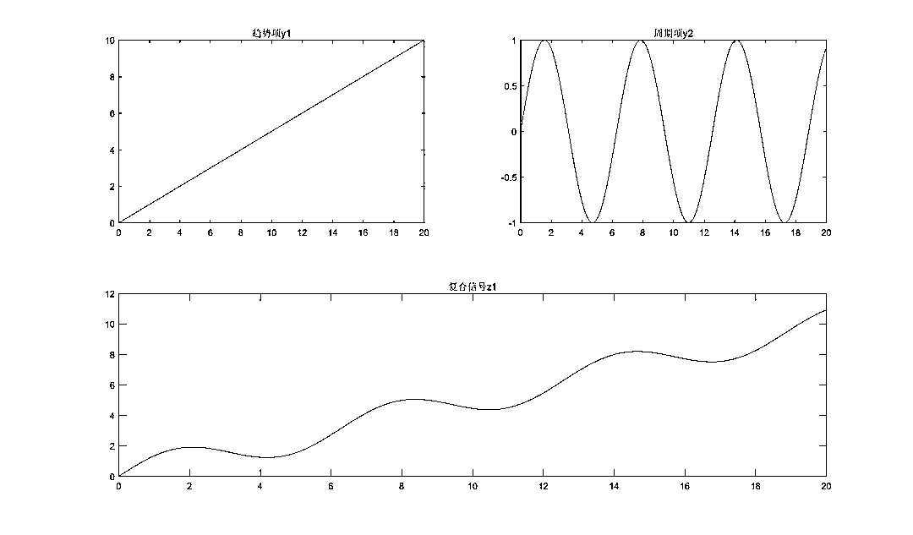

经 EMD 算法提取的本征模态函数 IMF 和趋势项 r 分别如下图所示：

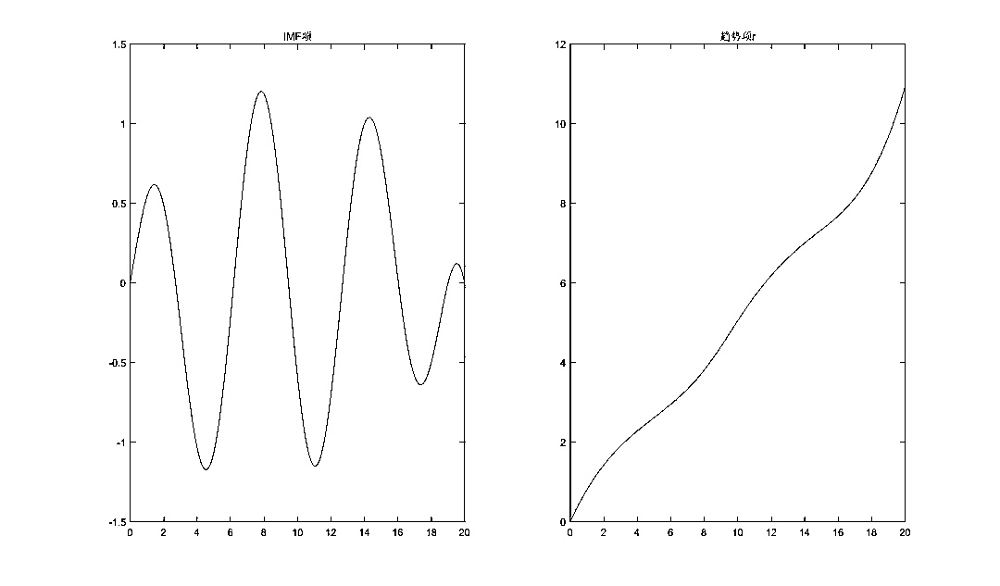

从结果上看，虽然与实际信号存在一定的出入，但 EMD 算法还是较好地分离了趋势信号和周期信号。另外，关于实验需要说明的是：由于 IMF 的第二个条件要求 h 的上下包络线的均值在任意位置都接近于 0，关于该条件在程序中的量化，笔者考虑为上下包络线均值的最大值小于 h 绝对值均值的某一阈值 alpha。上图是当 alpha 取 0.1 时的结果，此时 h 发生了 5 次迭代（过程数据未给出，感兴趣的读者可自行实验），直观上，alpha 取值越小，信号的分解可能会越精确，但相对地，计算代价也会越大，对此，需要使用者根据实际情况进行权衡。

###### 2）多 IMF 信号

在 1）的情况下增加周期项 y3=cos(2*x)，即复合信号 z2=z1+y3，如下图所示：

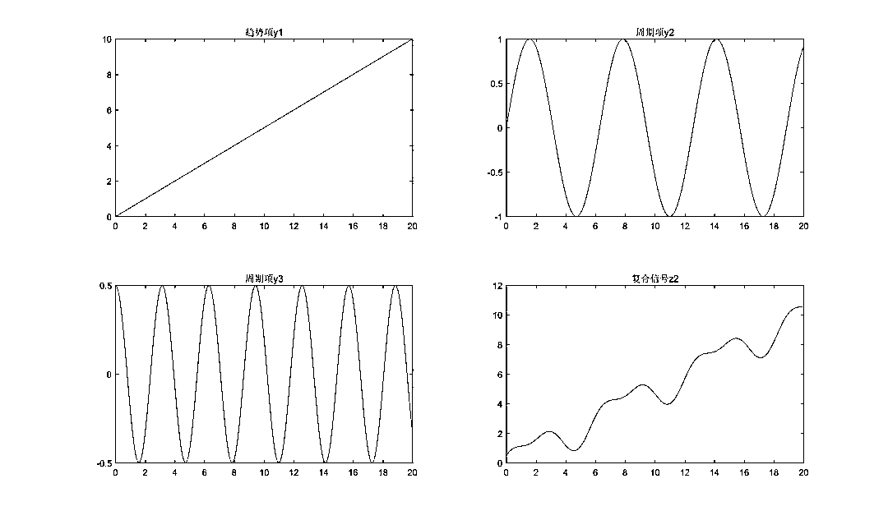

使用 EMD 算法分解后的 IMF 项和趋势项 r 分别如下所示：

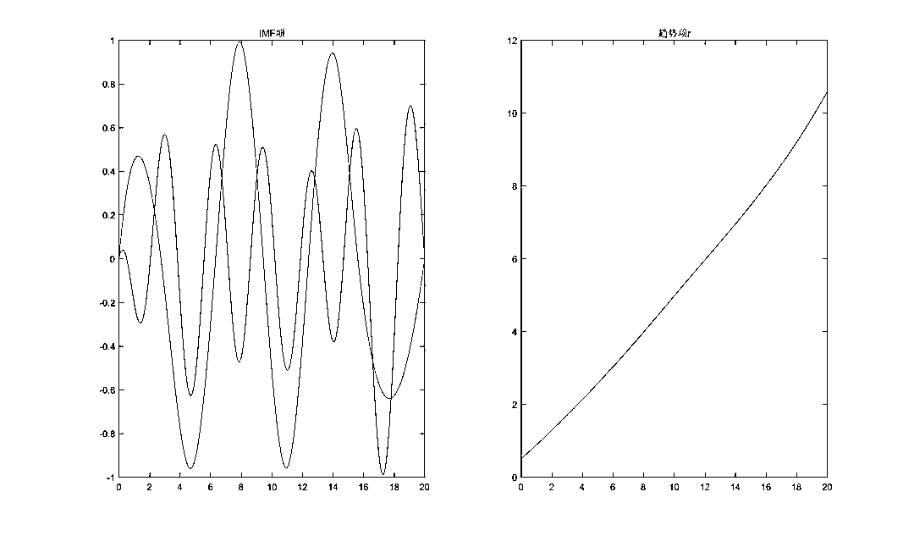

总的来说，算法对于三种信号的还原还是比较准确的。

###### 3）带噪的多 IMF 信号

在原 z2 的信号中增加噪声信号 n1，噪声强度为 0.5 倍的标准正态分布，即复合信号 z3=z2+n1，如下图所示。

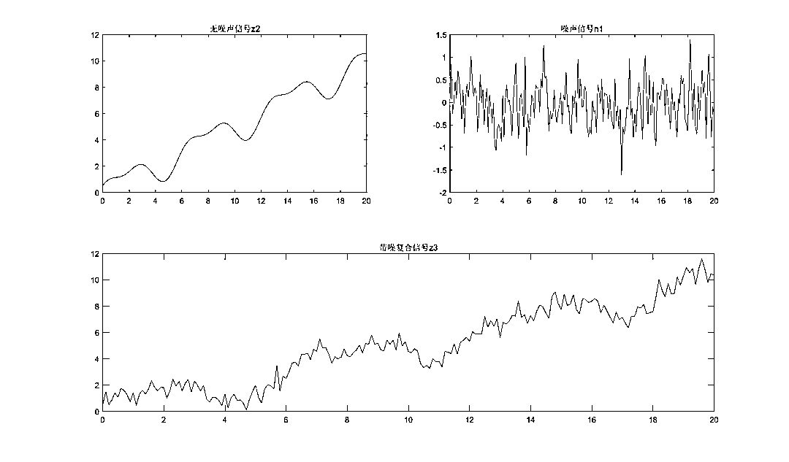

EMD 算法的结果如下图：

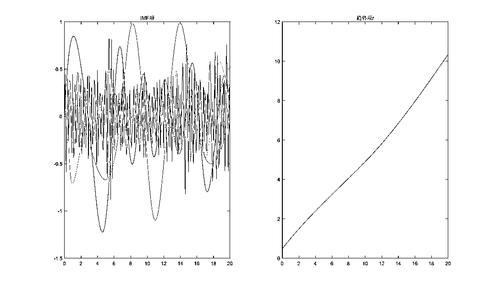

从结果上看，①趋势项依然较好地得到了分离。②尽管实际中只有两个周期信号，但算法却分解出了 5 个 IMF，其中除了两个主要的 IMF 以外，其他的都近似于噪声水平。表明算法受噪声的影响还是比较大的。从算法上进行解释的话主要的原因在于算法终止条件要求最终的趋势项 r 是严格单调的，这一点在噪声较大时有时会显得过于苛刻。对此，在实际应用中笔者认为可以考虑两种处理方式：一是不要求 r 完全单调，而改为基本单调（通过设定阈值使得当大部分数值单调时就退出循环）；二是直接限定 IMF 的最大阶数，例如研报中便直接将 IMF 的阶数设定为 4。本文接下来的部分也采用这种方法进行。

另外，关于 h 的计算过程中，由于现实数据的离散性，有可能出现连续的零值，届时在 IMF 条件的判定中将陷入死循环，因此本文接下来的实证中也限定了 h 的最大迭代次数。（在研报中则直接忽略了 IMF 条件的判定，不过这点对结果的影响其实并不大。）

###### **本部分主要代码**

###### **（本文代码太长，请点击阅读原文，查看全部）**

###### 1）EMD 算法：

```py
function [imfset,r]=emd(s)
% 输入：原始信号，输出：本征模态函数集、趋势项
% tic;
alpha=0.1;
imfset={};
k=1;
% while k<=4  % 设定 IMF 的最大阶数为 4
while true  % 不限定 IMF 的阶数
   imf=getimf(s,alpha);
   imfset{1,k}=imf;  %#ok<AGROW>
   r=s-imf;
   flag=ismon(r);  % 判断 r 是否单调
   if flag==1
       break;
   end
   k=k+1;
   s=r;
end
```

2）数值实验代码：

```py
% emd 算法的数值实验
clear;clc;
%% 单 IMF 信号
x=0:0.1:20;
y1=0.5*x;  % 趋势项
y2=sin(x);  % 周期项 1
z1=y1+y2;  % 实验函数 1
figure;
subplot(2,2,1);plot(x,y1);title('趋势项 y1');
subplot(2,2,2);plot(x,y2);title('周期项 y2');
subplot(2,2,[3,4]);plot(x,z1);title('复合信号 z1')
[imfset1,r1]=emd(z1');
n=size(imfset1,2);
figure;
subplot(1,2,1);
for i=1:n
   plot(x,imfset1{i});
   hold on;
end
```

## **二、EMDT 及参数确定**

#### **2.1 EMDT 策略**

EMDT 策略的基本思路：使用 EMD 算法对价格序列进行分解得到趋势项和波动项，通过比较两者相对能量的强弱判断当日行情的趋势是否明显，如趋势强烈则相应建仓直到当日临收盘时平仓。具体地说：
取开盘若干分钟（下文均取 30 分钟）的价格序列 s 通过 EMD 算法分解得到趋势项 r，定义波动和趋势的能量比为：


显然当趋势越强时 R 越小，那么基于开盘半小时数据计算得到的指标 R 能在多大程度上与一天的趋势强度相关联呢？若以一天 K 线中实体部分的占比来度量当天的趋势强度，即


其中 open，close，high 和 low 分别代表一天的开盘价、收盘价、最高价和最低价。

则基于沪深 300 股指期货主力合约（IF0000）20110101-20161231 期间共计 1458 个交易日的数据计算得到的 R 和 K 的相关系数为-0.1055，可以说是相关性比较强的一个因子了。进一步地，我们考察该相关性的时间敏感性，下图给出了两者在连续的 250 个交易日里的相关系数，在我们的样本时间里，该相关系数始终小于 0，最高时能超过 0.2，尽管随时间波动较大，但对照同期 IF 合约的走势来看该相关关系的变化似乎与大行情的震荡或趋势并无明显关系。

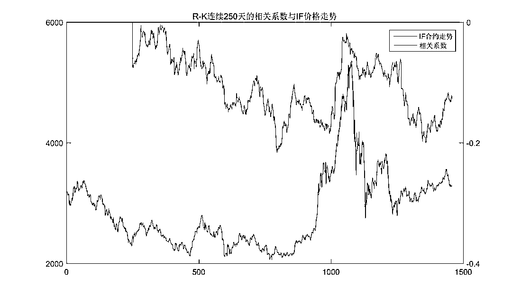

#### **2.2 策略参数确定**

基于上述信息，我们可以选取某一阈值 beta，当 R 小于 beta 时则根据涨跌情况建立多头或空头仓位，除非触发止损条件否则持有至临收盘时平仓。研报中对于该参数的选取采用的是过去 k 日的平均值，该方法简单易行却显得过于主观，本节则尝试着基于历史数据探讨 beta 的可能规律，然后尽量给出一种较为客观的参数选取规则。

###### 1）参数的初步确定

基于 IF0000 合约 20110101 至 20161231 期间的历史数据，我们测试了 beta 自-1.5 至 1.5 间隔的策略效果。如下图所示，左轴表示策略的累积收益（在不考虑止损和交易费用的情况下）、右轴表示策略的胜率。从测试的结果来看，随着 beta 的增大，收益明显增加，直到 beta=0.3 时达到最大值，随后递减。而胜率则随着 beta 的增加一路递减，并最终稳定在 0.5 左右。

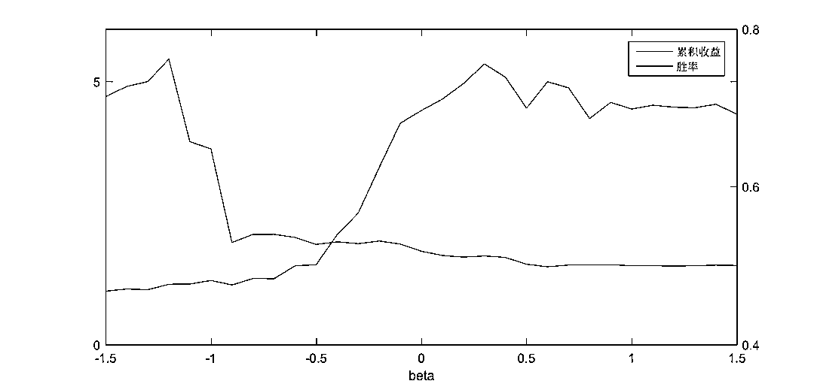

从上图中可以看出 beta=0.3 这点显示出了较好的极值特性，如果仅看这点似乎 0.3 是最佳参数，但需要注意的是**过拟合问题，即过于迎合历史数据的拟合结果可能并不适应于未来的情况**。但是另一方面，**一个具有普适性的策略应该在过去也有较好的表现**（虽然通常并不是最好的），因此大体上我们可以将参数范围限定在-0.1~0.9。接下来我们对该范围的参数进行时间敏感性测试。

2）参数的时间敏感性测试

下面两张图给出了 beta 取值从-0.1~0.7 之间时，策略在连续 250 天和 500 天里的累积收益的变动情况。大体上可以看出几点：

1、当大行情处于震荡时，较小 beta 的业绩较好，尤其是在损失控制方面。

2、趋势行情是本策略的主要盈利点，在此行情中较大的 beta 业绩较好。

3、几乎在任何时刻 beta>0.3 的业绩都未能比 beta=0.3 更好，如果考虑交易成本，可以预见这点会更加明显。

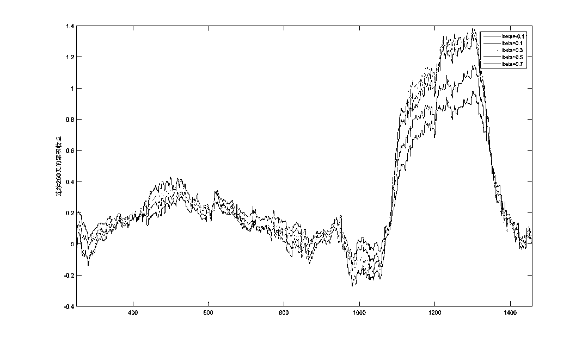

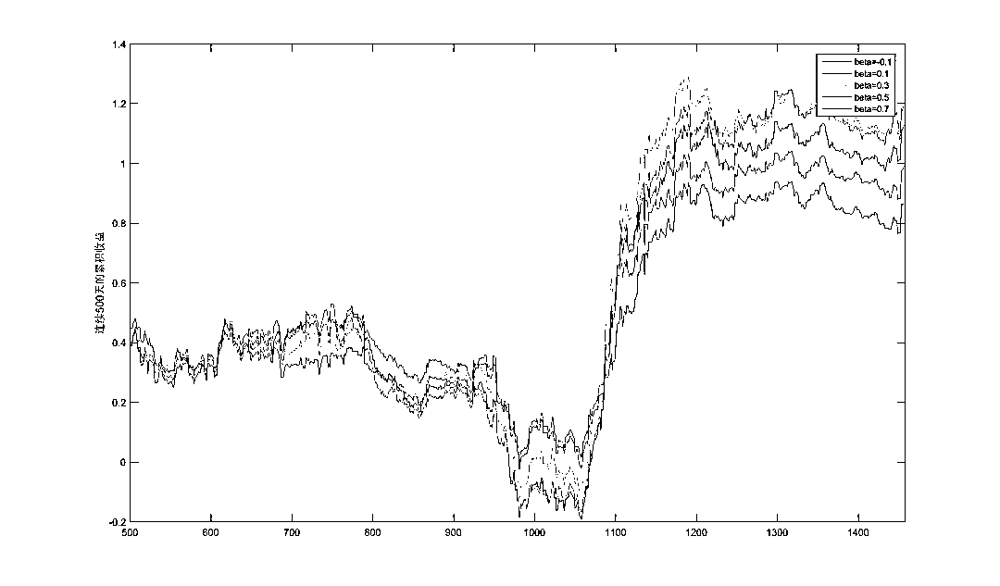

如果要进一步测试参数对样本的敏感性程度，还可以采用自助抽样法（Bootstrapping），通过产生随机样本进行多次模拟以确保参数的可靠性。本文暂时不就此展开。

## **三、策略回测及评价**

如果仅从历史数据考虑，无疑 beta=0.3 是最佳选择，但假如该策略要在现在执行，考虑到当前及短时间的未来不太可能出现大行情，那么 beta 应取较小为宜。故本次回测中，beta 取-0.1，同时止损点设为 0.03，手续费率取万分之二，不使用杠杆的情况下样本内（2011-2016）和样本外（2017）的回测结果如下所示。

#### **策略代码**

##### 具体策略代码请点击**阅读原文**

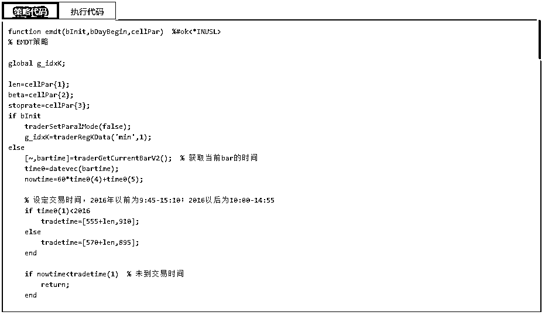

**回测详情**

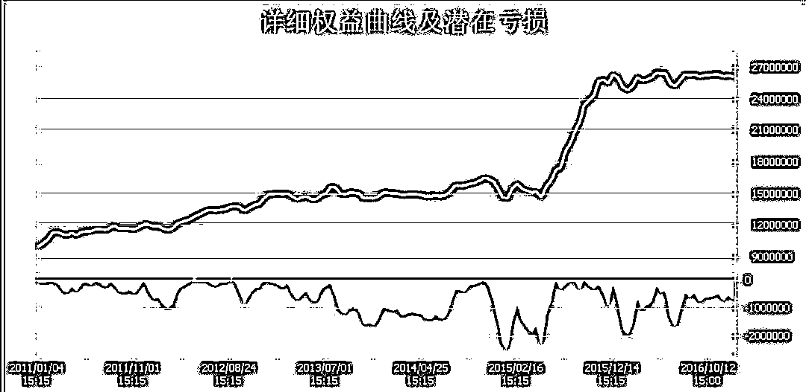

**主要指标：** 

年化收益：18.03%

最大回撤：16.65%

夏普比率：1.15

Calmar 比率：0.96

胜率：51.83%。

2017 年的回测由于软件问题无法给出权益曲线，从指标上来看收益率 2.21%，最大回撤 4.76%，但胜率依然能有 51.85%，总体上讲由于 17 年市场较为沉寂鲜有较大的行情，这对于主要靠趋势盈利的策略来说很难有所作为，因此业绩表现差强人意，该情形同样也出现在 13 年和 16 年。

**策略评价**

1、做为一种通过日内趋势获利的策略，其适用于趋势性较强的期货品种，尽管本文的研究基于股指期货而展开，但其并不一定是本策略最适宜的投资品种。

2、本策略接近 52%的胜率在趋势型策略中算是比较高的，而且长期来看都比较稳定，因此即使行情不利，也很少出现特别大的亏损，表明算法还是具有一定的可靠性。

3、若要进一步改善策略笔者考虑可以从两个方面进行：

一是当判定行情趋势性不强时，在日内使用震荡型策略的操作方式做为补充。

二是同时在日频数据上使用 EMD 算法判定大行情的趋势性强弱，进而采取动态参数或动态选择交易对象等。

****