# 因子的有效性分析基于 7 种机器学习算法【系列 54】

> 原文：[`mp.weixin.qq.com/s?__biz=MzAxNTc0Mjg0Mg==&mid=2653287512&idx=1&sn=14ee62549dab3c64468f78b3dbfd39a5&chksm=802e364db759bf5bb5abffc6a50f72d0e31722c178e01ce11a3d48fb28386055e741c9ecce8d&scene=27#wechat_redirect`](http://mp.weixin.qq.com/s?__biz=MzAxNTc0Mjg0Mg==&mid=2653287512&idx=1&sn=14ee62549dab3c64468f78b3dbfd39a5&chksm=802e364db759bf5bb5abffc6a50f72d0e31722c178e01ce11a3d48fb28386055e741c9ecce8d&scene=27#wechat_redirect)

**量化投资与机器学习**

为中国的量化投资事业贡献一份我们的力量!

 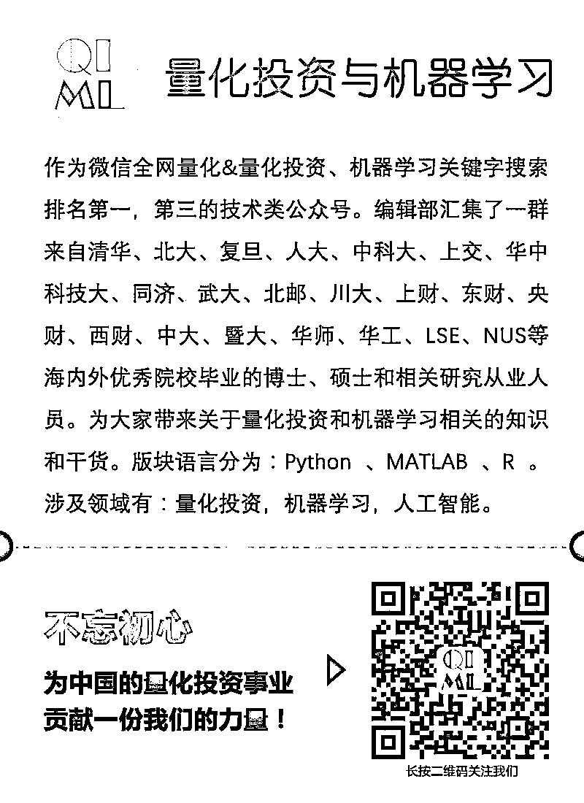

前三期传送门：

【系列 53】[基于 XGBoost 的量化金融实战](https://mp.weixin.qq.com/s?__biz=MzAxNTc0Mjg0Mg==&mid=2653287481&idx=1&sn=dcb1dda1e2362d8297ae1a97845cf02e&chksm=802e362cb759bf3a3aaea75af824451a3dba7345ecc73e27facc4b917792835fdd2878403c8c&scene=21#wechat_redirect)

【系列 52】[基于 Python 预测股价的那些人那些坑](https://mp.weixin.qq.com/s?__biz=MzAxNTc0Mjg0Mg==&mid=2653287306&idx=1&sn=9f374874636e7d6d52a9b3d92d6aa81b&chksm=802e319fb759b8896acf2ed9529da88a8fda0d76d6a3b816854e9ad5eeecfd6f4af75dd65804&scene=21#wechat_redirect)

## 【系列 51】[通过 ML、Time Series 模型学习股价行为](https://mp.weixin.qq.com/s?__biz=MzAxNTc0Mjg0Mg==&mid=2653287197&idx=1&sn=9630389a52c7d0be4c1feaf3a534c2ce&chksm=802e3108b759b81ed11174f71b23fb73abe5c4ebad0f9d480b6efbd8f7e644de6b2232dc63fa&scene=21#wechat_redirect)

今天，继续我们的机器学习应用量化投资系列。本期我们介绍一篇研究报告，详细的介绍了 7 中机器学习算法在因子有效性上的展现。希望给大家在写策略时做一些参考借鉴。

**前言**

**逻辑依旧明了，机器学习并非黑箱** 

谈到机器学习，大家最忌讳的便是黑箱问题。其实不必，理解机器学习算法，逻辑实则简单，比如相同的因子特征将会有相同的表现。在实战中，我们发现， 该逻辑十分有效，在我们的机器学习选股模型中，该逻辑连续十几年不曾被打破。 

**Adaboost 最稳定，朴素贝叶斯收益最高** 

全市场选股，市值中性选股等权加权，行业中性选股等权加权五种情况下， AdaBoost 年化波动率基本在 5%左右，表现非常稳定。朴素贝叶斯，年化收益分别达到 15.50%，15.75%， 12.89%，15.63%， 10.23%。

 **全市场训练明显优于市值中性或行业中性** 

分别在全市场、等市值组（按市值大小分 20 小组）、行业内部进行了训练预测。研究发现，在市值中性情况下，全市场训练得到的因子明显优于市值内部训练的因子；在行业中性情况下，全市场训练得到的因子亦优于行业内部训练得到的因子。 

**机器学习因子单调性十分显著** 

把机器学习训练得到的个股相对强势值进行排序，按大小分成 5 组， 研究发现排名靠前的小组明显优于排名靠后的小组，且单调性十分显著。 20090105 到 20171231， 前二组年化收益在 25%以上，而第四组收益不到 20%，最后一组收益不到 10%。 

**人工智能有比较快速的自适应调整能力** 

20090105 到 20171231 期间，任何一年的月度平均 IC 均大于 0，且近一半的年份平均 IC 大于 8%，期间所有月度平均 IC 为 5.78%。虽然 IC 有负的情况，但在动态的训练中，人工智能模型能够快速的调整以适应市场。以 2017 年为例，前几个月 IC 几乎为负，但在后半年，模型迅速反应， IC 基本为本。 

**人工智能选股模型策略(Logistic 为例)** 

以传统因子滚动 12 个月值为特征值，个股下一期按收益大小排序， 排名前 30%作为强势股，排名靠后 30%作为弱势股。用机器学习算法进行训练预测。用当期因子作为输入，预测未来一个月个股相对走势的强弱。根据个股的相对强势，我们把排名靠前 20%的作为多头，排名后 20%的作为空头进行了研究， 样本外 20090105 到 20171231 期间， 行业中性等权年化多空收益差为 16.45%， 年化波动率为 7.34%， 最大回撤为 10.84%。

人工智能从自诞生以来，理论和技术日益成熟，应用领域也不断扩大，金融领域也是将其改革的一大领域。谈到人工智能机器学习，大家最忌讳的便是黑箱问题，其实不必，理解机器学习算法，逻辑实则简单，比如相同的因子特征将会有相同的表现，以此简单的逻辑，我们实证中发现效果比较显著。人工智能机器人将能够自动生成研究报告替代分析师，发明策略替代主动基金经理进行投资等等，虽然这些目前来说不太普及，不是很成熟，但机器学习人工智能作为工具，为我们提高工作效率是毫无疑问的，并且随着技术的发展，金融领域将可能迎来颠覆性的改革。

本文主要尝试分类算法在投资中的运用，所以在此把文中涉及的分类算法都进行简单介绍。

**一、相关分类算法概述**

**1\. Logistic**

Logistic 回归是研究二分类观察结果与一些影响因素之间关系的一种多变量分析方法。通常的问题是，研究某些因素条件下某个结果是否发生。根据线性回归可以预测连续的值，对于分类问题，我们需要输出 0 或者 1。

**2. KNN**

邻近算法，或者说 K 最近邻(kNN，k-NearestNeighbor)分类算法是数据挖掘分类技术中最简单的方法之一。所谓 K 最近邻，就是 k 个最近的邻居的意思，说的是每个样本都可以用它最接近的 k 个邻居来代表。kNN 算法的核心思想是如果一个样本在特征空间中的 k 个最相邻的样本中的大多数属于某一个类别，则该样本也属于这个类别，并具有这个类别上样本的特性。该方法在确定分类决策上只依据最邻近的一个或者几个样本的类别来决定待分样本所属的类别。 kNN 方法在类别决策时，只与极少量的相邻样本有关。通常情况下，k 的取值为样本数量的开方。

**3. AdaBoost**

Adaboost 是一种迭代算法，其核心思想是针对同一个训练集训练不同的分类器(弱分类器)，然后把这些弱分类器集合起来，构成一个更强的最终分类器(强分类器)。其算法本身是通过改变数据分布来实现的，它根据每次训练集之中每个样本的分类是否正确，以及上次的总体分类的准确率，来确定每个样本的权值。将修改过权值的新数据集送给下层分类器进行训练，最后将每次训练得到的分类器最后融合起来，作为最后的决策分类器。使用 adaboost 分类器可以排除一些不必要的训练数据特征，并放在关键的训练数据上面。

**4. SVM**

使用 SVM 算法的思路：（1）简单情况，线性可分情况，把问题转化为一个凸优化问题，可以用拉格朗日乘子法简化，然后用既有的算法解决；（2）复杂情况，线性不可分，用核函数将样本投射到高维空间，使其变成线性可分的情形，利用核函数来减少高纬度计算量。

**5. 朴素贝叶斯**

贝叶斯定理也称贝叶斯推理，早在 18 世纪，英国学者贝叶斯(1702～1763)曾提出计算条件概率的公式用来解决如下一类问题：假设 B[1],B[2]…,B[n]互斥且构成一个完全事件，已知它们的概率 P(B[i]),i=1,2,…,n,现观察到某事件 A 与 B[1],B[2]…,B[n]相伴随机出现，且已知条件概率 P(A/B[i])，求 P(B[i]/A)。朴素贝叶斯即特征条件相互独立。

**6.  决策树**

决策树主要步奏（ID3）:1.对当前例子集合，计算属性的信息增益；2.选择信息增益最大的属性 Ai；3.把在 Ai 处取值最大的例子归于 Ai 子集，Ai 有几个属性就有几个子集;4.对依次对每种取值情况下的子集,递归调用建树算法，即返回 1;5.若子集只含有单个属性，则分支为叶子节点，判断其属性值并标上相应的符号，然后返回调用处。其中，1）信息熵其实是信息量的期望。2）熵：表示随机变量的不确定性。3）信息增益：在一个条件下，信息不确定性减少的程度。

**7. 随机森林**

随机森林顾名思义，是用随机的方式建立一个森林，森林里面有很多的决策树组成，随机森林的每一棵决策树之间是没有关联的。在得到森林之后，当有一个新的输入样本进入的时候，就让森林中的每一棵决策树分别进行一下判断，看看这个样本应该属于哪一类（对于分类算法），然后看看哪一类被选择最多，就预测这个样本为那一类。

**二、各分类算法的是与非**  

本文中，我们主要使用了七大分类算法进行个股打分分类，这七大算法基本涵盖了目前主流的比较成熟的传统机器学习分类算法，当我们实际使用时，可能会比较困惑，或者不知道哪个分类算法更适合我们，为此，我们把各大分类算法进行梳理。

首先，考虑一个算法是否符合我们的需求，我们需要明确自己的使用环境，我们的训练样本的数量如何？特征空间的维数如何？我们的分类是否是线性可分离呢？各因子特征是否相互独立？过度拟合是否将成为一个问题？对我们的系统在速度、性能、内存占用方面要求如何？对我们自己的需求有了个完整的了解之后，我们才可选择合适的算法。以下是各大分类算法的优与缺，是与非。

**1\. Logistic**

逻辑回归是一种具有很好表现的分类算法，它抗噪声干扰能力强，并且你可以通过使用 l2 和 l1 正则化的方法来对特征进行选择从而避免过度拟合。适合当你需要一个概率框架（例如，通过简单的调整分类阈值，来得知不确定区间或置信区间 confidence intervals）或者如果你希望将来能在训练集中加入更多的数据并很快的融入你的模型。缺点：1、容易欠拟合，一般准确度不太高；2、只能处理两分类问题，且必须线性可分。

**2. KNN**

思路简单，理论成熟，既可以用来做分类也可以用来做回归，可用于非线性分类，训练时间复杂度为 O(n)，准确度高，对数据没有假设，对 outlier 不敏感。缺点是计算量大，消耗很多内存，因为要存储所有的实例，对低维空间效果更好，不适合高维空间。当样本不平衡时，如一个类的样本容量很大，而其他类样本容量很小时，有可能导致当输入一个新样本时，该样本的 K 个邻居中大容量类的样本占多数。该算法只计算“最近的”邻居样本，某一类的样本数量很大，那么或者这类样本并不接近目标样本，或者这类样本很靠近目标样本，可以采用权值的方法（和该样本距离小的邻居权值大）来改进。样本容量较小的类域采用这种算法比较容易产生误分。

**3\. AdaBoost**

Adaboost 是一种有很高精度的分类器，容易实现，分类准确率较高，没有太多参数可以调，不会过拟合，可以使用各种方法构建子分类器,Adaboost 算法提供的是框架，当使用简单分类器时，计算出的结果是可以理解的。而且弱分类器构造极其简单，不用做特征筛选，不用担心 overfitting(过度拟合)。缺点是容易受到噪声干扰，这也是大部分算法的缺，训练时间过长，执行效果依赖于弱分类器的选择，对 outlier 比较敏感。

**4\. SVM**

原始的 SVM 只比较擅长处理二分类问题，可用于线性/非线性分类，也可以用于回归；低泛化误差；容易解释；计算复杂度较低。Support Vector Machines (SVMs) 使用与 LR 不同的损失函数（Hinge）。他们的解释也不相同（最大间距）。实际上，一个使用线性核的 SVM 与前面介绍的逻辑回归没有太大的区别。使用 SVM 代替逻辑回归的主要原因是因为你的问题可能不是线性可分的。这种情况下，你可能必须要使用一个 SVM 并且使用一个非线性的核（例如，RBF）。实际上，逻辑回归同样可以使用不同的核，但是重点是你可能在实际使用中发现 SVM 更好用。另一个使用 SVM 的原因是如果你的数据是在一个高维空间中。高精度、对过拟合有较好的理论保证，并且使用一个合适的核可以得到较好的效果，甚至你的数据在特征空间里不是线性可分的。特别是在高维空间的像文本识别的问题中效果好。SVMs 的主要缺点是它的费劲、低效率的训练过程,对参数和核函数的选择比较敏感,当你有很多训练样本时，我不推荐你使用 SVM 来处理。

**5\. Nbayes（朴素贝叶斯）**

表现简单，不能做丰富的假设,相互独立的属性的假设限制太多，不能学习不同特征之间的相互作用。如果假设的 Nbayes 条件相互独立性成立，那朴素贝叶斯比其他辨别模型如逻辑回归要快，你只需要较少的训练数据即可。并且即使假设条件不成立，朴素贝叶斯分类器在实际使用中也通常有较好的效果。如果你的训练集很小，高偏离/低方差的分类器（例如，朴素贝叶斯）比低偏离/高方差的分类器（如，KNN-K 近邻）有着很大的优势，因为后者容易过拟合。但是低偏离/高方差的分类器随着你的训练集的增大变得越来越有优势（他们有很小的渐近误差），因为高偏离的分类器不能提供高精度的模型。

**6\. 决策树**

决策树模型可读性好，理解和解释起来简单，具有描述性，有助于人工分析；效率高，决策树只需要一次构建，反复使用，每一次预测的最大计算次数不超过决策树的深度。决策树模型可以想象,需要准备的数据量不大，决策树算法的时间复杂度(即预测数据)是用于训练决策树的数据点的对数,使用白盒模型，如果给定的情况是在一个模型中观察到的，该条件的解释很容易解释的布尔逻辑，可能使用统计检验来验证模型，这是为了验证模型的可靠性。缺点是决策树算法学习者可以创建复杂的树，但是没有推广依据，这就是所谓的过拟合，为了避免这种问题，出现了剪枝的概念，即设置一个叶子结点所需要的最小数目或者设置树的最大深度，决策树的结果可能是不稳定的，因为在数据中一个很小的变化可能导致生成一个完全不同的树，这个问题可以通过使用集成决策树来解决,有一些概念是很难的理解的，因为决策树本身并不难很轻易的表达它们，比如说异或校验或复用的问题，决策树学习者很可能在某些类占主导地位时创建有有偏异的树，因此建议用平衡的数据训练决策树。

**7\. 随机森林**

随机森林是建立在决策树的基础上，决策树在分类时是选择所有变量，而随机森林则是产生很多决策树，然后每根决策树选择不同的变量，进行分析，最后选取决策树中的众数，作为最终结果。优点可以作用在高维数据中，具有很好的抗干扰能力,可以并行处理等。与逻辑回归相比有不同的优势。一个主要的优势就是它们不期望线性的特征或者相互之间有线性作用的特征。我在讲逻辑回归时没有提到的一点是，逻辑回归能很好的应对二值得特征（即绝对的特性，要么零，要么一）。随机森林里因为有许多的决策树组成，可以很好的处理连续型的特征。其它的主要优点是，因为它的结构组成（使用装袋或加速），这类算法可以很好的处理高纬空间的大数量的训练样本。随机森林在处理很多分类问题时效果更好可能会过拟合，可能会陷入局部最小值的情况，所以需要集（ensembles）来帮助降低变量，另一缺点是可能有很多相似的决策树，掩盖了真实的结果，对小数据或者底维数据可能不能产生最好的分类执行数据，虽然比 bossting 等快，但比单只决策树慢多了。

  **三、策略概述**  

谈到机器学习，大家最忌讳的便是黑箱问题。其实不必，理解机器学习算法，逻辑实则简单，比如相同的因子特征将会有相同的表现。在实战中，我们发现，该逻辑十分有效，在我们的机器学习选股模型中， 首先构建机器学习因子，然后根据个股的相对强势即机器学习因子，我们把排名靠前 20%的作为多头，排名后 20%的作为空头进行回测；进一步，我们把相对强势分成 5 组，以考察这一指标的单调性，发现效果十分显著。同样，为了去除市值和行业的影响，我们也分别测试了市值中性及行业中性的情况下的表现。

 **3.1 机器学习因子构建**

Step1：以传统的成长因子，盈利因子，财务因子，市场因子，估值和规模因子等最近历史 12 个月（即滚动一年）为特征值。 

Step2：把未来一期个股收益的大小排序，选取排名前 30%的作为强势股，标签为 1，选取排名靠后 30%的作为弱势股，标签为 0。 

Step3：用 knn,Logistic,svm 等七大机器学习分类算法进行训练预测。 

Step4：用最新一期因子作为特征输入，通过机器学习算法预测得到个股未来一期相对强势值，即机器学习因子。 

Step5：分别在全市场、等市值中（按市值大小分 20 小组）、行业内部进行了训练预测。

 **1) 数据预处理**

a. 没满一年的新股不进行机器学习因子计算： 因为需要用最近历史一年的数据作为训练。

 b. 对于缺失值，用平均值代替，当缺失达到 10%，则该因子丢弃。

 c. z-score 标准化，要求原始数据的分布可以近似为高斯分布，否则效果不好。 

对 a_value,turnover_1 等这一类不不符合高斯分布因子，需要用 ln(t1/t0）（同一个股当期与上期比值的对数）进行处理，才近似高斯分布。 但对 sec_return_1,MACD 等这一类变化率等相关因子，直接用原始值便可以，因为他们本身已经近似符合正态分布。 

预处理之所有没有处理掉极值和去掉涨跌停个股因子，原因是因为此处只是训练特征， 而不是最终选股。再次，我们所选的因子是经过人工核对的，基本没有太多相似性，故也没有降维这一步。

 **2) 中性化处理**
中性化处理我们包含二层含义，一是市值中性化，二是行业中性化。 

首先， 我们都知道， 市值因子对个股的影响十分显著， 如果不考虑市值带来的干扰，则我们的策略可能被市值因子带来严重的影响。为此，我们市值分成 20 组，分别在不同市值组各选取 20%作为策略多头与空头， 使多头与空头有相同的市值分布，以消除市值可能带来的影响。 

其次， 众所周知，不同行业，因子特征可能差异明显， 放在一起可能不具备可比性。为了去除行业带来的影响，我们也分别在不同行业选取 20%作为我们的空头与多头， 使多头与空头保持同样的行业暴露， 以消除行业带来的影响。

 **3.2 策略计算**

在进行策略计算时，考虑了以下几种情况：

 a. 当期单个因子在全市场缺失达 40%时，则该因子丢弃，不进行计算。
b. 调仓当天停牌，涨停，跌停个股剔除。
c. 新股一个月之内不能作为候选股（上市小于 20 个交易日） 。 

在 20090105 到 20171231 期间，我们分别进行了全市场选股，市值中性选股，行业中性选股，五种情况表现如下：

 相关说明：
1） 所用因子：全市场训练得到的个股未来相对强势值。

 2） L/S：全市场选股多空收益差净值。相对强势值排名靠前 20%作为多头，相对强势值排名后 20%作为空头。

 3） aL/Se：市值等权多空收益差净值。分 20 小组，分别在组内选前 20%作为多头，后 20%作为空头，最后各组等权。

 4） aL/Sw：市值加权多空收益差净值。分 20 小组，分别在组内选前 20%作为多头，后 20%作为空头，最后各组以市值组权重加权得到多空组合。

 5） iL/Se：行业等权多空收益差净值。在中信一级行业，分别在行业内选前 20%作为多头，后 20%作为空头，最后各行业以等权到多空组合。

 6） iL/Sw：行业加权多空收益差净值。在中信一级行业，分别在行业内选前 20%作为多头，后 20%作为空头，最后各行业以沪深 300 行业内权重加权得到多空组合。  

**四、 AdaBoost、 knn 最稳定， Bayes 表现最好**   

经过实证研究， logistic， knn， AdaBoost， svm， Nbayes，随机森林，决策树七大分类算法表现虽然总体来说比较接近，但差别也比较明显，以下是实证得到的多空收益差表现。

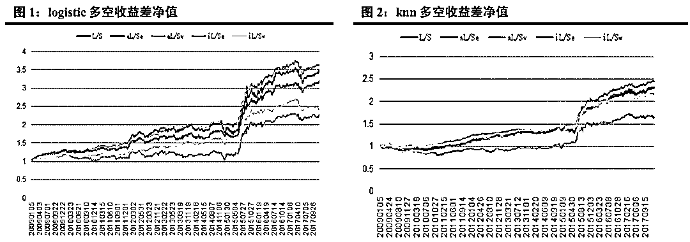

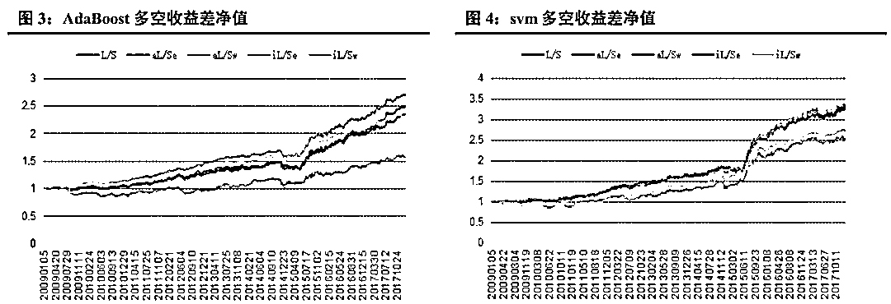

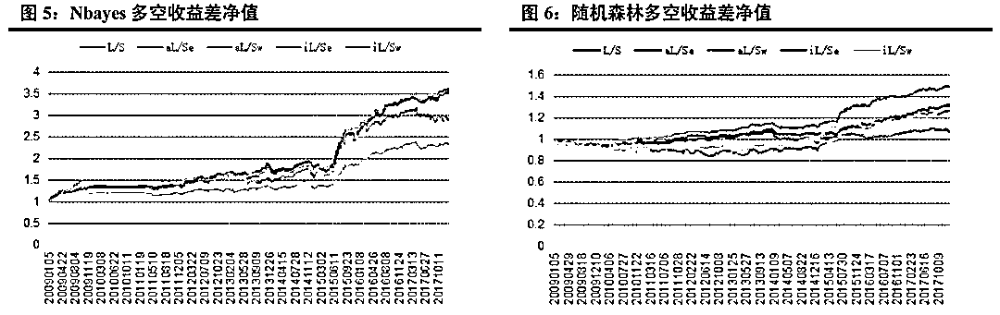

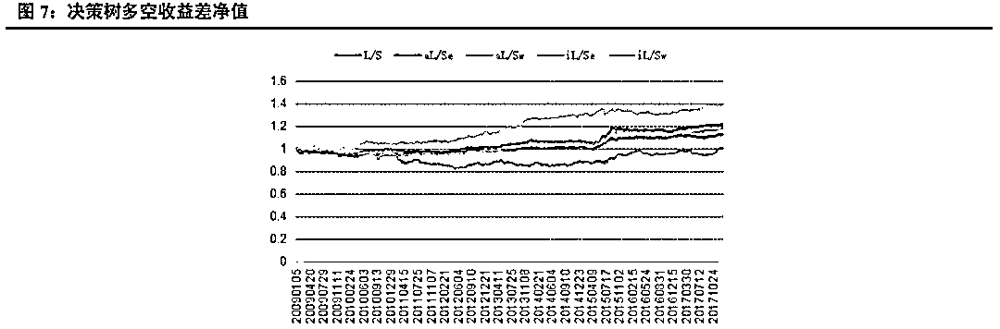

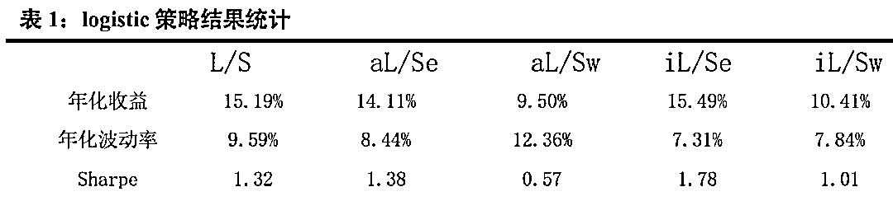

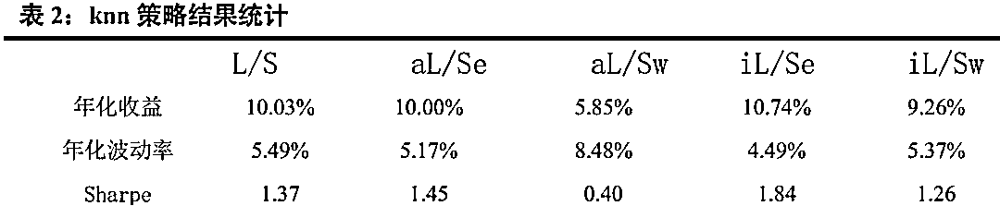

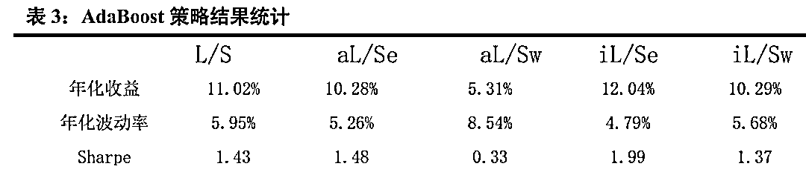

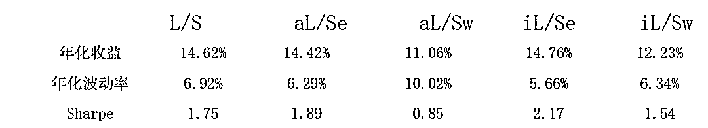

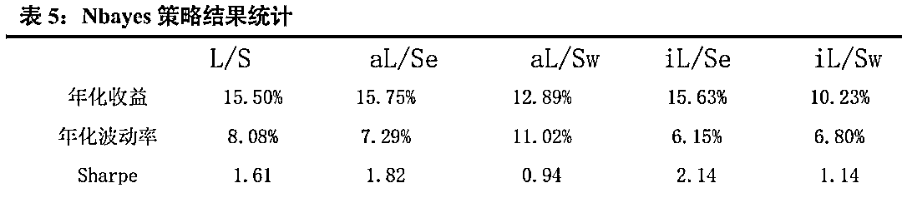

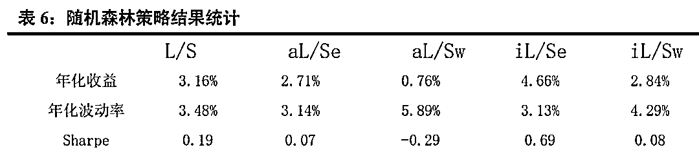

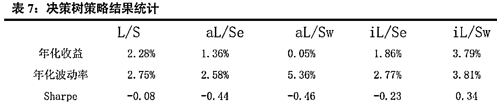

从以上结果可以看出， 在收益年化 10%以上的算法中， 在全市场选股，市值中性选股等权加权，行业中性选股等权加权五种情况下， AdaBoost 与 knn 算法年化波动率基本在 5%左右，表现非常稳定；而朴素贝叶斯则表现最好，年化收益分别达到 15.50%， 15.75%， 12.89%， 15.63%， 10.23%，在所有算法中，唯一的五种情况年化收益超过 10%的策略。 Logistic 表现非常接近朴素贝叶斯， svm 表现也较优， 而决策树和随机森林则表现不佳，年化收益基本在 3%左右。

**五、 人工智能有比较快速的自适应调整能力**  

七大分类算法中，我们分别计算出其月度 IC（即每个月因子排序与未来期个股收益排序的相关系数），统计各年度 IC 平均值，发现分类算法中除了决策树以外，其余算法得到的机器学习因子对个股未来收益皆有比较显著的相关性，且年度月 IC 均值都大于为 0，表示正相关性非常稳定。

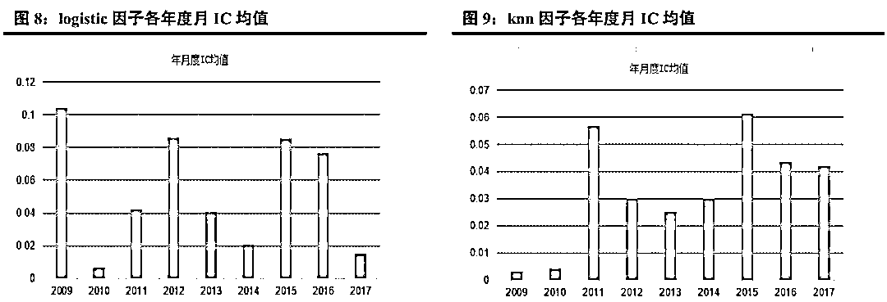

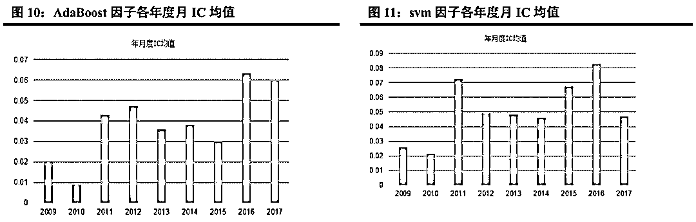

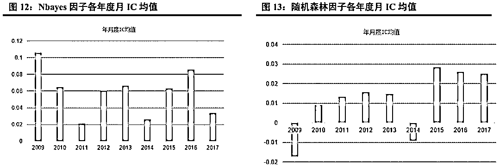

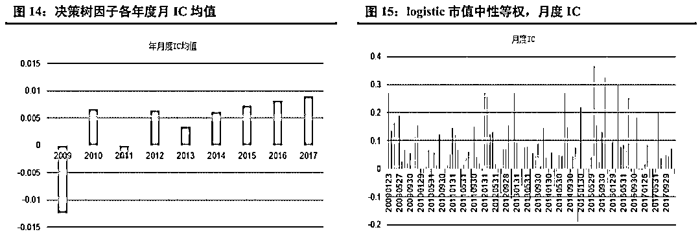

20090105 到 20171231 期间， logistic， knn， AdaBoost， svm， Nbayes 五大算法任何一年的月度平均 IC 均大于 0；其中， 朴素贝叶斯期间月度平均 IC 最高，达到 5.88%，且年度月度平均 IC 几乎都大于 6%， logistic 近一半的年份平均 IC 等于 8%左右，期间所有月度平均 IC 为 5.31%。而决策树期间月度平均 IC 最低，为 0.36%且所有年度月度平均 IC 均小于 1%，说明预测性相对较差，几乎没有关联性。 

动态的训练中，人工智能模型能够快速的调整以适应市场。以 2017 年 logistic 市值中性等权为例，前几个月 IC 几乎为负，但在后半年，模型迅速反应， IC 基本为本，且该年度平均月度 IC 依旧达到正的 1.49%。 

**六、 全市场训练明显优于市值中性或行业中性**  

前面讲道过，我们训练分 3 种情况， 即在全市场、等市值中（按市值大小分 20 小组）、行业内部进行了训练，分别得到相关的机器学习因子。以下我们分析哪种训练效果比较好。

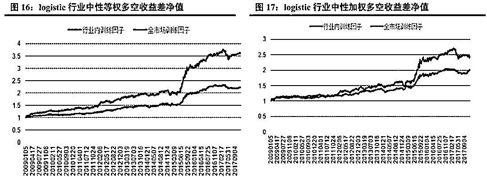

1） 行业内训练因子等权：表示该因子为中信一级行业内训练得到；在中信一级行业，分别在行业内选前 20%作为多头，后 20%作为空头，最后各行业以等权得到多空组合。 

2） 全市场训练因子等权：表示该因子为全市场训练得到；在中信一级行业，分别在行业内选前 20%作为多头，后 20%作为空头，最后各行业以等权得到多空组合。 

3） 行业内训练因子加权：表示该因子为中信一级行业内训练得到；在中信一级行业，分别在行业内选前 20%作为多头，后 20%作为空头，最后各行业以沪深 300 行业内权重加权得到多空组合。 

4） 全市场训练因子加权：表示该因子为全市场训练得到；在中信一级行业，分别在行业内选前 20%作为多头，后 20%作为空头，最后各行业以沪深 300 行业内权重加权得到多空组合。 

相关说明如下：

 1）等市值内训练因子等权：表示该因子为全市场按市值大小排序后分 20 小组，在组内训练得到；在 20 小组内，分别选前 20%作为多头，后 20%作为空头，最后各小组以等权得到多空组合。

 2）全市场训练因子等权：表示该因子为全市场训练得到；在 20 小组内，分别选前 20%作为多头，后 20%作为空头，最后各小组以等权得到多空组合。 

3）等市值内训练因子加权：表示该因子为全市场按市值大小排序后分 20 小组，在组内训练得到；在 20 小组内，分别选前 20%作为多头，后 20%作为空头，最后以各小组市值加权得到多空组合。 

4）全市场训练因子加权：表示该因子为全市场训练得到；在 20 小组内，分别选前 20%作为多头，后 20%作为空头，最后以各小组市值加权得到多空组合。

从以上结果分析，可以看到，分别在全市场、等市值组、行业内部进行了训练预测。在市值中性情况下，全市场训练得到的因子明显优于市值内部训练的因子；在行业中性情况下，全市场训练得到的因子亦优于行业内部训练得到的因子。我觉得原因有二点：一是同市值或者同行业，因子特征相对不太明显； 二是分组后，样本明显减少，导致训练不够充分，降低了区分度。

**七、 机器学习因子相关性较高**  

为了考察这七大类因子的相关性，我们分别统计了各自之间的相关系数及协方差矩阵。 

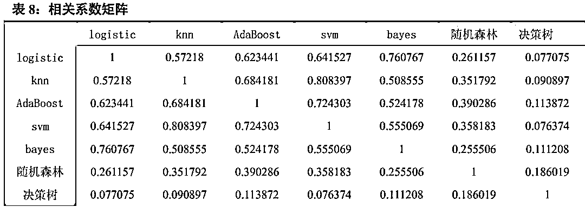

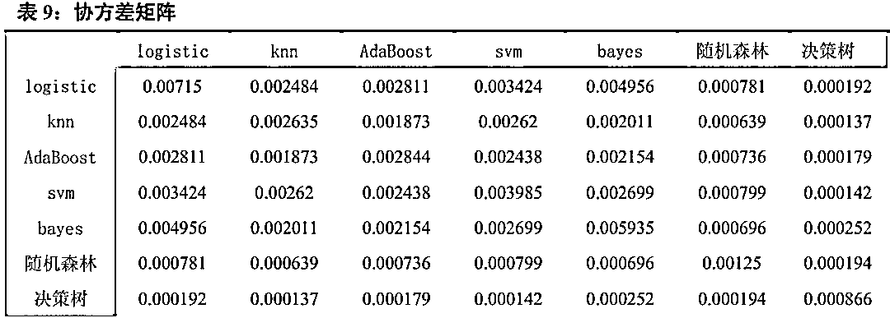

从相关系数矩阵可以看到，所有的相关系数皆为正，说明七大分类算法都是正相关，但除了决策树和随机森林，其它五大算法 logistic， knn， AdaBoost， svm，朴素贝叶斯相关系数基本是 60%以上，说明这五大算法相关性非常高，也说明这五大算法分类得到的结论比较一致，这也间接证明了这几大算法分类的正确性。

 从协方差矩阵也可以看出， 所有的协方差皆为正，也说明七大分类算法都是正相关。

 **八、 机器学习因子单调性十分显著**

从前面知道，几大分类算法相关性非常高，所以此处以 logistic 算法为代表，来展示机器学习因子的单调性。我们把机器学习训练得到的个股相对强势值进行排序，按大小分成 5 组，发现排名靠前的小组明显优于排名靠后的小组，且单调性十分显著。 20090105 到 20171231， 前二组年化收益在 25%以上，而第四组收益不到 20%，最后一组收益不到 10%。 

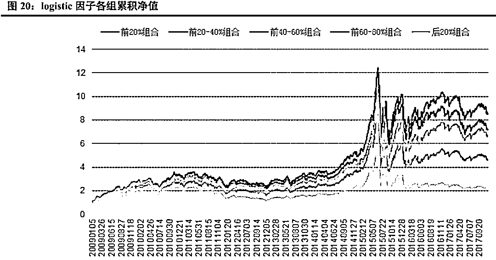

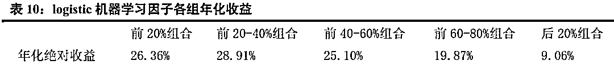

**九、 总结**

人工智能从自诞生以来，理论和技术日益成熟，应用领域也不断扩大，金融领域也是将其改革的一大领域。谈到人工智能机器学习，大家最忌讳的便是黑箱问题， 其实不必，理解机器学习算法，逻辑实则简单，比如相同的因子特征将会有相同的表现，以此简单的逻辑，我们实证中发现效果比较显著。 人工智能机器人将能够自动生成研究报告替代分析师，发明策略替代主动基金经理进行投资等等，虽然这些目前来说不太普及，不是很成熟，但机器学习人工智能作为工具，为我们提高工作效率是毫无疑问的，并且随着技术的发展，金融领域将可能迎来颠覆性的改革。

 人工智能时代正在到来，这种颠覆性的改变将为金融行业带来巨变。 传统量化投资主要包括量化选股、量化择时、股指期货套利、商品期货套利、统计套利、算法交易，资产配置，风险控制等。传统的量化投资研究的数据来源一般是公司的财务指标、 交易行情数据、 政策宏观方面的投资信息等。 而随着量化投资这一领域的快速发展，这些传统数据中所包括的大部分投资信息已经被专业投资者所挖掘，想要从这些信息中获取收益难度将越来越大。我们将利用人工智能机器学习来提升投资能力。

 谈到机器学习，大家最忌讳的便是黑箱问题。其实不必，理解机器学习算法，逻辑实则简单，比如相同的因子特征将会有相同的表现。在实战中，我们发现，该逻辑十分有效，在我们的机器学习选股模型中， 首先构建机器学习因子，然后根据个股的相对强势即机器学习因子，我们把排名靠前 20%的作为多头，排名后 20%的作为空头进行回测；进一步，我们把相对强势分成 5 组，以考察这一指标的单调性，发现效果十分显著。同样，为了去除市值和行业的影响，我们也分别测试了市值中性及行业中性的情况下的表现。

 **人工智能有比较快速的自适应调整能力**

七大分类算法中，我们分别计算出其月度 IC（即每个月因子排序与未来期个股收益排序的相关系数），统计各年度 IC 平均值，发现分类算法中除了决策树以外，其余算法得到的机器学习因子对个股未来收益皆有比较显著的相关性，且年度月 IC 均值都大于为 0，表示正相关性非常稳定。 

**人全市场训练明显优于市值中性或行业中性**

分别在全市场、等市值组、行业内部进行了训练预测。在市值中性情况下，全市场训练得到的因子明显优于市值内部训练的因子；在行业中性情况下，全市场训练得到的因子亦优于行业内部训练得到的因子。我觉得原因有二点**：**一是同市值或者同行业，因子特征相对不太明显；二是分组后，样本明显减少，导致训练不够充分，降低了区分度。

**机器学习因子相关性较高**

从相关系数矩阵可以看到，所有的相关系数皆为正，说明七大分类算法都是正相关，但除了决策树和随机森林，其它五大算法 logistic， knn， AdaBoost， svm，朴素贝叶斯相关系数基本是 60%以上，说明这五大算法相关性非常高，也说明这五大算法分类得到的结论比较一致，这也间接证明了这几大算法分类的正确性。 

从协方差矩阵也可以看出，所有的协方差皆为正，也说明七大分类算法都是正相关。

 **机器学习因子单调性十分显著**

从前面知道，几大分类算法相关性非常高，所以此处以 logistic 算法为代表，来展示机器学习因子的单调性。我们把机器学习训练得到的个股相对强势值进行排序，按大小分成 5 组，发现排名靠前的小组明显优于排名靠后的小组，且单调性十分显著。 20090105 到 20171231， 前二组年化收益在 25%以上，而第四组收益不到 20%，最后一组收益不到 10%。 

本报告中，我们先后介绍了人工智能与量化投资的关系，接着介绍了我们这次模型用到的分类算法，共包括 logistic， knn， AdaBoost， svm， Nbayes，随机森林，决策树七大分类算法。 分别简单介绍了相关概念，描述了他们的适用范围及优缺点。然后用在 A 股实证， 结论与我们分析的基本一致。 Adaboost 是一种有很高精度的分类器， 容易实现，分类准确率较高，没有太多参数可以调， 不会过拟合， KNN 虽然计算量大， 但准确度也高，对 outlier 不敏感。 所以 Adaboost 与 knn 分类得到的结果比较稳定， 在收益年化 10%以上的算法中，在全市场选股，市值中性选股等权加权，行业中性选股等权加权五种情况下， AdaBoost 与 knn 算法年化波动率基本在 5%左右，表现非常稳定。 而朴素贝叶斯只需要较少的训练数据即可有比较优秀的表现，在本研究中， 我们以一年为周期，训练数据量相对较小，且虽然朴素贝叶斯要求特征相互独立， 但即使假设条件不成立也能有比较好的表现，故朴素贝叶斯表现最好，年化收益分别达到 15.50%， 15.75%， 12.89%， 15.63%， 10.23%。决策树容易过拟合， 分类结果不稳定，精确度较低， 表现最差， 所以决策树表现不佳，年化收益基本在 3%左右，而随机森林是建立在决策树的基础上，决策树在分类时是选择所有变量，而随机森林则是产生很多决策树，然后每根决策树选择不同的变量，进行分析，最后选取决策树中的众数，作为最终结果， 所以表现比单个决策树好，但分类本质还是决策树，故不如别的分类算法。 

提示：
1） 该文的分类算法所有若涉及到参数问题，皆默认参数，故不存在参数调整问题，也不存在最优问题，故相关算法皆比较有代表性。

 2） 因为此研究主要考查各分类机器学习因子的有效性，故没有考虑手续费等问题。

****