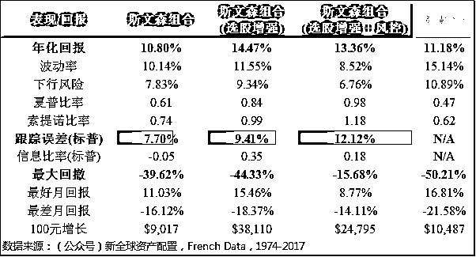

# 【重磅】少踩坑多赚钱，全球资产配置最强研究！

> 原文：[`mp.weixin.qq.com/s?__biz=MzAxNTc0Mjg0Mg==&mid=2653287486&idx=1&sn=55e1bd4110731e1fdec6fe109d3dcf86&chksm=802e362bb759bf3d1b1191c9b0c384febe8353428296926a74865718a6e23004475bbe5f04d8&scene=27#wechat_redirect`](http://mp.weixin.qq.com/s?__biz=MzAxNTc0Mjg0Mg==&mid=2653287486&idx=1&sn=55e1bd4110731e1fdec6fe109d3dcf86&chksm=802e362bb759bf3d1b1191c9b0c384febe8353428296926a74865718a6e23004475bbe5f04d8&scene=27#wechat_redirect)

**量化投资与机器学习**

为中国的量化投资事业贡献一份我们的力量!

 

**前言**

昨天，我们介绍了公众号特约编辑**王圣元**关于一篇关于机器学习应用量化投资的文章。今天，我们又要介绍一位公众号重量级的好伙伴——**徐杨**。

一直以来，徐杨都很想再写一篇关于如何做全球资产配置的长篇文章，希望能够以翔实的文字和可靠的数据，在投资的路上，为大家填坑。所以借着春节假期，花了 5 天的时间，写下了这篇**2 万字**的**【新全球资产配置白皮书】**。**（PDF 版本，****文末****下载）**

**正文**

文中的内容，是根据我很多年资产管理的经验和实证研究得出的。我和几个合伙人在美国为高净值客户、家族办公室和机构管理和咨询超过几十亿美元的资产，这么十多年做下来，都是以数据为基础、量化为手段、传统金融学和行为金融学为旁征，力求做到【基于事实】的资产管理。

资产配置应该是【大部分投资人】最应该要做的事：不管你的可投资资产是 10,000 元，还是 100,000,000 元，虽然做法肯定会不一样，但是道理都是相通的。特别是在过去的十几年间，伴随着中国经济的快速发展，投资人的财富累积效应十分明显。随着财富的增长，合理的保值和增值，就会越来越重要。

但这是一个【信息大爆炸】的时代，每天报纸、头条、微信、电视、电台，各种渠道的信息，小到獐子岛的扇贝跑了，大到大洋彼岸的美股大跌，投资人面对着严重的信息过载。这也是一个【信息廉价】的时代，互联网上随便一搜，各种投资秘籍、智能投顾、阿尔法狗、小道消息满天飞，投资人也无从下手。

还得挤时间吃鸡，所以各种乱七八糟的事情加起来，使得投资人做资产配置的困难增加。其实【做好全球资产配置】这个问题，应该分为两个部分。第一个部分是：投资人通过学习，建立资产配置的逻辑。第二部分是：基于理论和逻辑，具体的执行。

我这篇文章讲述的就是第一部分，通过 45 年的数据、回测和图表（由于海外市场的数据比较长，所以本文中大部分的数据都来自美国和发达国家市场，有少部分是基于中国市场），在基于事实的基础上，回答以下五个核心问题：

1.  为何需要做资产配置？

2.  如何做资产配置？

3.  如何提高资产配置的回报？

4.  如何降低资产配置的风险？

5.  为什么还是有人不相信或者无法坚持资产配置？

作为一个投资人，你有必要花时间和精力，通过学习和研究，搭建一个属于自己的资产配置理论和实践框架，做到【知己知彼，百战不殆】。我相信，通过我的这篇文章，能够让你对全球资产配置有一个更加深入的了解，成为自己财富的掌门人。

**为何需要做资产配置？**

我们问：为何需要做资产配置？大部分投资人可能都会有一些概念：因为资产配置能够降低风险。但实际上，资产配置到底能降低什么风险呢？很多投资人可能也没有具体的感受，只是道听途说的知道【配置能够降低风险】。实际上，离我们最近的一次全市场系统性危机，已经过去了快 10 年了（08 年美国金融危机，09 年中国经济危机），很多经历过这两次事件的投资人，切肤之痛早已愈合。

对于大部分投资人而言，由于投资周期不明确，很难用较长的投资周期（20 年以上）抵御投资风险。而在较短的投资中，投资人面临的最大风险，就是【最大回撤】。什么是最大回撤呢？其实就是历史上这个股票或者是资产，所出现过的最大跌幅。很多学术研究表明，一般的投资人在面临 40%左右的浮亏时，心理防线基本会被击破，最后被迫割肉离场。那么我们先来看看，历史上持有单一股票或者是单一资产，会有多大的最大回撤。

**投资于单一股票的风险**

其实喜欢炒股，应该是件好事：通过自己对公司的分析，买入持有（或者做空），获得回报。对于好的公司，持有这个公司的股票也是对这个公司的认可，投资人可以跟随着公司一起成长，分享公司持续发展的红利。理想是非常美好的，但现实却是非常骨感。

我不知道大家，反正我在十几年前炒股的时候，就基本没怎么干公司基本面分析的正经事，每天都把时间花在看新闻和 K 线分析上了。抱着一夜暴富的心态，今天这个跟随主力，明天那个金叉银叉的。反正我最后在一只股票上，亏了 60%，割了肉，出了场。是，我不是牛散，我承认我技术不行。如果你是牛散、K 线王，那么就不用浪费时间看下面的文章了。

后来一直从事量化资产管理，通过数据，我才知道了购买单一股票有多大的风险。下面的图是基于美国市场 1980 年-2015 年的数据，我将时间段分成了两部分：1980-1997，1998-2015。在每个时间段中，我选取了美国市场上市值最大的前 3000 只股票，然后计算了这个 3000 只股票在 5 年投资周期上的最大回撤。也就是说我计算了这个 3000 只股票，历史上任意投资 5 年的周期，所经历过的最大回撤。

横轴为 5 年期最大回撤水平，从负 100%到 0%，纵轴为最大回撤分布。让我们看看这些让人不寒而栗的数据：

1.  1980 年至 1997 年，有 58%的股票，跌幅曾经超过 50%。只有 6 只股票，最大跌幅在 10%以内。

2.  1998 年至 2015 年，在这个时间段里，由于美国经历了 2 次系统性的危机，有超过 86%的股票曾经跌幅超过 50%。只有 2 只股票，最大跌幅在 15%以内。

这，就是实实在在的持有单一股票的风险。有的投资人说：行，那我多选几个股票好了。没错，【多选几个】确实是比较好的做法。不过大部分的投资人，平心而论，很少有持仓超过 10 只以上的时候吧？如果只持有 10 只或者 10 只以下的股票的时候，除非你真的每只股票都从每个不同的行业中选取，力求降低组合的相关性，要不然你这个组合面临的最大回撤风险，也很难特别有效的被降低。

而且有的时候，随意的增加和减少持仓头寸，都会导致投资风险的大幅上升，详情请参考文后的延伸阅读。

**投资于单一资产的风险**

如果投资于单一股票的风险大，那我可以去投资股指（整个股票市场）呀。没错，逻辑是正确的，从纯理论的角度来说，投资于股指的风险比投资于单一股票的风险要小。但是，像股指这类单一资产的最大回撤，也是很高的。那么我们来看看一些主要资产历史上的最大回撤。

1972 年-2017 年，我选取了标普 500 指数、美国房地产指数和美国 10 年期国债指数。根据这 3 个资产的期间表现，将它们出现过的最大回撤用面积图显示了出来。

看起来是不是毛骨悚然、血淋淋的样子？越看我越觉得渗得慌。 

在过去的半个世纪，标普 500 曾经跌超过 50%，美国房地产指数跌超过 60%，而就算是被誉为低风险资产的美国 10 年期国债，也跌超过 20%。这 3 大类资产的最大回撤下跌时间都超过了 1 年，如果投资人持有任何一种资产，在持续下跌的市场中，如何能做到镇定自若？

跌幅大、跌势长不说，跌完了涨回前高的时间也是非常的长。特别是 08 年金融危机后，标普 500 花费了 3 年的时间，才涨回了前高，而房地产指数更是花费了超过 40 个月。试想一下，如果有的投资人刚好在 09-10 年间退休，面对的资产大幅缩水的局面，还要忍受 3 年之久的恢复期，是何等的痛苦。

A 股市场上也是如此，而且由于中国股市历来有牛短熊长的特点，加上处于经济结构发展和转型中，股市的波动幅度非常之大。

这看起来比美股还毛骨悚然，简直就是一副中国股民的血泪史，大家自行脑补。 A 股最大的回撤还是在 1992 年的那次股灾中，经过 15 个月的时间，上证跌去了 75%，后来花费了快 3 年的时间才涨回来。

而且通过上面的回撤面积图我们可以看到，在 08 年的那次经济危机中，上证也差不多跌了 70%，而这一次，是名副其实的长熊：上证从 07 年中开始下跌，跌到 08 的谷底后，一直到现在都没有涨回来，十年了啊。

当然了，有的投资人会说，那我要是在谷底买了不就赚翻了？是的，你这个逻辑我无法反驳，可在系统性风险前，跌到 40%的时候，你敢说那一定是底？你真敢进场吗？

**短时间内的大幅下跌**

上面列举的都是长时间的系统性大幅回撤，而市场还存在短时间的大幅下跌，这类事件统称为【黑天鹅事件】。黑天鹅事件的主要影响是：时间短、强度大，投资人根本来不及止损。我大概找了 5 个事件，其实不管是 A 股还是美股，单日跌幅超过 3%的情况，还不能说是非常不多见，只不过很多时候投资人过了一阵子就忘记了伤痛。 

美股市场上的黑色星期一是人皆知晓的，29 年那次 2 天跌了 23%，87 年跌了 24%。上证在 15 年那次黑天鹅事件中 2 天跌了 15%，出现千股跌停的奇观。

而离我们最近的 18 年 2 月的美股黑色星期一，股指崩了 4%，但基于波动率的 CBOE VIX 指数爆涨了 116%，结果导致这个指数的反向 ETN：XIV，跌了 95%，一夜间很多投资者巨亏，就连发行此 ETN 的瑞信，也宣布此产品会在 2 月底之前清盘。

看完上面的数据，你要是不觉得后背发凉，那么只有两种情况：1）你胆子巨大，老子不怕！ 2）你巨有钱，有无限的弹药。

投资单一股票和单一资产的风险是非常大的，难道我们就不投资了吗？这绝对不可能，人有多大胆，地有多高产的革命精神还是要有滴。作为投资人，我们肯定是希望投资风险低+预期回报高，但这个目标显然是不太理性的，因为天下没有这种免费的午餐。

而如果投资人的目的是：在控制和降低风险的情况下，取得与风险相匹配的适当的回报这种投资目标，则是完全可以达到的。全球资产配置，就是取得这一目标的【几乎免费的午餐】。

**如何做资产配置？**

现代资产组合理论（均值-方差组合）的鼻祖-马科维茨教授，早在 1952 年就用优雅的数学公式告诉我们：分散投资可以降低组合的整体风险，甚至增加经风险调整后组合的整体回报。 

简单来说，马科维茨教授告诉我们：通过合理的资产配置方式，可以达到 1+1 大于 2 的效果。好比说我们做奶油千层饼，正确的做法是一层饼加一层奶油，你这么一层一层的加下去就能做出美味的奶油千层饼。饼和奶油是不相关的两种食材，简单的、合理的相加，就能做出人间美味。但如果你跟我一样二，先大饼铺个 10 层，再往上抹个几斤奶油，那最后你只能做出来一个奶油大煎饼。

所以说，投资是一门艺术，做资产配置，需要有匠心精神：研究、选材、搭配，一样都不能少。

**研究+选材：大师们的全球资产配置**

**耶鲁怎么做的？**

如果我一上来就告诉你我是怎么做全球资产配置的话，估计你也不信，毕竟我不是大湿嘛。投资界中确实有很多资产配置大师，最出名的、可能也是大家最熟悉的一位大师，就是耶鲁捐赠基金的掌门人了：大卫-斯文森。在斯文森先生的带领下，耶鲁捐赠基金在过去的 20 年间，实现了 12.1%的年化收益率。斯文森先生不仅术业专精，在人才上更是培养出了像高瓴资本创始人张磊先生这样的投资家。

根据耶鲁捐赠基金 2017 年发布的报告，耶鲁 2018 年的目标组合如下。

耶鲁捐赠基金专注于投资 8 大类资产，其中目标头寸最大的是绝对收益（25%），第二大的是风险投资（17%），第三大的是境外股票（15.5%），这前三大头寸已经占据了整个组合的 57%。虽说耶鲁捐赠基金是资产配置的黄金标杆，但是对于大部分投资人来说，要去投绝对收益产品和风险投资产品，是非常有难度和挑战的。

这两种产品要求的专业度可不是一点两点，加上较长的锁定期和较高的管理费用，如果你没有像耶鲁捐赠基金一样的人力物力资源，其实你很难选出便宜又好的产品，最后可能会花了大量的精力却得不偿失。

在剩下的 43%的组合里，有杠杆收购（14%）和自然资源（7%）这 2 种资产，对于大部分投资人来说，也很难实现。就算是专业的资产管理人或者是投资顾问，也很少会碰到帮客户投资这两类资产的情况。

大部分投资人能做的，可能就是美国本土股票（4%），债券和现金（7.5%），房地产（10%）和境外股票（15.5%）了。

**其他著名的资产配置模型**

耶鲁捐赠基金说到底只是个例，这么大的市场，其他著名的资产配置大师，他们推荐的组合是什么样的呢？我在之前的文章中，收集了市场著名的 9 种资产配置模型。其中还包括了耶鲁捐赠基金掌门人斯文森先生自己所推荐的组合。

我这里所选取的资产和权重，都是这些大师们活生生的研究成果。从左到右，模型的复杂度依次上升。 

上面 9 种组合的投资标的和耶鲁捐赠基金里面普通人能够投资的标的，加起来一共超过了 22 种。其实按照大类资产整合一下，实际上也就是这 3 大类资产： 

1.  **股票类**：本土股票、境外股票

2.  **实物资产类**：房地产、大宗商品

3.  **债券类**：短期货币、中长期债券

要知道，耶鲁捐赠基金从 2012 年开始，其本土股票（美国股票）的头寸就平均只有 4.5%，而同期标普 500 可是年化 17%的在涨，大部分号称高收益的对冲基金都达不到这个表现。所以你想，耶鲁捐赠基金大部分的收益，大部分都是从普通投资人很难接触到的投资标中来的。

除非你自己能力超强，或者能建立一个像耶鲁捐赠基金一样的团队，那么大部分人能投资的、能够触碰到的投资标的，才是你的首选。说白了，世界上最好的食材，不一定适合你吃；最漂亮的车，也不一定适合你开。

而大部分投资人【能够触碰到的】、【便捷的】投资头寸，就是股票、债券和实物资产了。这三大头寸的风险敞口也都可以从二级市场上的标准化产品中获得，比如公募基金、ETF 等。这么做，不仅省时省力，而且标准化产品有个好处就是流动性比非标准产品好，费率也较低，产品选择多，通过普通的证券、基金账户，就可以进行投资。

**底层资产的历史回报**

那好，既然我们有了大类资产的方向，那么在做资产配置前，我们肯定要看看这些大类资产的历史回报如何吧。在每个大类资产中，我按照大师们的推荐，选取了最有代表性的底层标的，都是二级市场中的指数。

1.  **股票类**：标普 500 指数，美国小盘股指数，发达国家股票指数，新兴市场股票指数

2.  **实物资产类**：黄金指数，大宗商品指数，美国房地产指数 

3.  **债券类**：美国短期货币指数，美国通胀保护指数，美国 10 年期国债指数，美国 30 年期国债指数

**这些底层资产过往 45 年的表现如何呢？**

从回报上：股票类的年化收益在 10%，债券类在 7%，实物资产类在 8%左右。最高的是美国房地产，接着是新兴市场股票和小盘股。

从风险上：债券类的风险最小，年化波动率远低于股票类和实物类。而股票和实物类，虽然不同标的，但其实风险不相上下。波动率最高的是黄金和大宗商品期货，然后是小盘股和新兴市场股票。

最大回撤上：债券类资产明显具有较小的回撤。股票类紧随其后，平均在 55%。而实物资产类则表现出了明显的较大的最大回撤：平均在 70%。

经风险调整后的夏普比率：股票类平均在 0.35，实物资产类在 0.27，债券类也在 0.35，大家其实都没差太多。

这就非常有意思了。这些底层标的，你非要挨个来看的话，有的表现实在是拿不上台面。比如这个大宗商品指数，年化才不到 6%，而最大回撤有 80%，波动率有 20%，夏普比率全场最低只有 0.15。这种表现的标的，放在一堆资产里，正常人都不会想投它吧？

可是马科维茨教授不这么认为，根据他的理论，你把这些资产组合在一起，就有可能达到 1+1>2 的效果。这里面有什么玄机呢？

**资产间的相关性是关键**

在资产配置里，投资标的间的相关性，是一个非常重要的因素，也是资产配置管用的最根本原因。我们肯定都听说过一个叫【美林投资时钟】的东西。虽然这个框架出现在几乎每一篇的资产配置书籍中，很多人听到这名字就吐了，但是它确实能很好的总结资产配置中关于投资标的选取的精髓。 

根据美林投资时钟，经济分为 4 个大的周期，“过热期”，“停滞期”，“衰退期”和“复苏期”，而投资人为了最大程度的避免经济周期所带来的影响，有两种做法。

第一种，是投资人去预测经济周期，然后根据周期的不同而选取在相应周期中表现较好的投资标的，也就是战略资产配置。

第二种，大部分的投资人很难去预测经济周期，那么干脆在投资的时候，从每个周期选取 1、2 个投资标的，这样就把所有的周期都覆盖了。

当然了，我们不能完全的直接套用美林投资时钟，因为市场总是在变化的，美林投资时钟是一个静态的表现。其实如果我们可以动态的来看这些投资标的间的相关性的话，会有更加直接的认识。那么我以标普 500 作为基础资产，分别计算其它每种资产和标普 500 的 10 年期相关性。

不同的资产标的，跟标普 500 有着不同的相关性，所有资产标的相关性都表现出了一定的周期性，而根据大类资产的不同，同一个类别中的标的又表现出了趋同的形态。

股票类中，美国小盘股跟标普的相关性一直较高，平均在 83%；而发达国家股票和新兴市场股票，虽然都是股票类，但还是表现出了【在本土市场和非本土市场之间的风险分散】的潜在好处，在 2000 年之前，这 2 个标的和标普的相关性平均只有 50%。

债券类呢，明显的表现出了其相对于股票类的【逆相关性】，或者说是【无风险资产（risk-free asset）】的属性。短期货币和通胀保护，基本在负 5%左右。剩下的 10 年和 30 年国债，平均在 5%左右。需要指出的是，这里的债券都是政府背书，所以被称之为相对的【无风险资产】，如果你投的是高收益公司债，那就另当别论了。

实物资产类中的各个标的，由于其属性差别很大，所以与标普的相关性也非常的不同。黄金作为贵金属，相对于股票，有逆周期的属性。而房地产呢，高度的顺周期。剩下的大宗商品，也是比较逆周期，但是波动幅度很大。

我们经常打一个比方，就是鸡蛋不能放在同一个篮子中。所以大师们做的，就是找出这些不同的篮子。通过上面的数据和图表，我们基本可以下一个定论：大师们推荐的资产配置组合，都是分散在不大相同的资产标的中的，而且具有一定的负相关性和逆周期性。只有在不同的篮子中做配置，才有配置的意义。

**搭配：大道至简**

选好了食材，知道了为什么要选这些食材，那下一步就是要开始搭配了。在资产配置中，关于如何组合投资标的问题，业界和学术界其实一直争论不休。最早的时候，根据马科维茨教授的理论，不管你有多少个资产，给定一个目标（比如说夏普比率最大化），你总能在数学上找到一个搭配的最优解。根据均值-方差组合理论，我们需要根据资产标的过去的回报，来预测其未来的表现，从而得出组合模型的输入值。

但是在实际应用中，通过模型来预测某种资产未来的收益，是极其困难和不稳定的。所以在后来，基于均值-方差组合理论，也衍生出了像 Black-litterman 这样的不需要做预测的组合模型。但是对于大部分投资人来说，还是要做一系列非常复杂的模型运算。

最近 3 年，由于科技的发展，市场出现了一大批【机器人投顾】，国内也叫【智能投顾】，国外叫【Robo-Advisor】。比如像 Wealthnfront，Betterment 这样的公司，基本都是利用了马科维茨理论（或者其衍生和改进模型，比如 B-L）来构造基础的资产配置组合，然后根据客户的风险偏好，在风险给定的条件下，选择最优配置。这些公司通过科技的手段，为客户提供了非常便捷的解决方案，让相当一部分投资人享受到了以前只有私行客户才能拥有的待遇。

机器人投顾绝对是带来了更好的客户体验，但是从模型的角度来看，通过非常复杂运算得出来的资产配置模型，并不一定比【合理的简单搭配的】模型的结果要好。我之前引用过一篇伦敦商学院大牛 DeMiguel 博士的学术论文：《Optimal Versus Naive Diversification: How Inefficient is the 1/N Portfolio Strategy?》。

在此文中，他测试了各种非常复杂的资产配置模型，然后跟平均权重模型进行了比较。他发现不管是基于历史的数据，还是预测的数据，经风险调整后，复杂模型的表现并不比平均权重模型要好；而且在样本外测试中，复杂模型带来的额外收益往往会被其复杂的预测错误所抵消。

> *“Of the 14 models we evaluate across seven empirical datasets, none is consistently better than the 1/N rule in terms of Sharpe ratio, ..., out of sample, the gain from optimal diversification is more than offset by estimation error.”*

上图中划红线的结果就是将每种模型中的资产平均配比。比方说第一列的模型，是基于标普的 11 个行业进行配置，1/N 的意思就是平均投资于这 11 个行业中，而这个 0.1876 就是这种做法的出来的夏普比率。

最后的结果，只有 mv(in sample)的结果，大大好于 1/N。但这个 mv(in sample)是什么东西？这个其实就是均值-方差组合，但关键是这个 in sample，是样本内组合的意思，也就是【纸上谈兵】，一到样本外（紧接着 mv(in sample)下面的的 mv 那行），夏普比率就急剧下跌了。

其实，马科维茨教授自己也曾经说过：

> *"I should have computed the historical covariance of the asset classes and drawn an efficient frontier. Instead, I visualized my grief if the stock market went way up and I wasn't in it --- or if it went way down and I was completely in it. My intention was to minimize my future regret. So I split my contributions 50/50 between bonds and equities."*
> 
> *”我应该根据资产的历史回报计算协方差矩阵，然后寻找最优解。但是我无法想象自己能够忍受市场大幅上涨我却空仓，或者是市场大幅下跌时我却满仓的状况。我的目的是不让自己后悔，所以我就平均投资了股票和债券，每种资产各一半。“*

所以，复杂的模型，不一定能带来好的结果。

**大师们的历史回报**

我们看回这 9 种有名的资产配置模型，虽然都出自大师之手，但他们也没有过度的去寻求配比上的数学最优解，基本都是选了几个资产，提炼出了经典，道明哥曰：【简约而不简单】。 

那么这些基于大师们智慧和经验的模型，在历史上的表现如何呢，是否真的能够带来资产配置的好处？我将这些模型完全复制了一遍，用 1973 年到 2017 年的数据做了历史回测（每月再平衡，毛收益，没有考虑任何费用、市场冲击和税）。

在看结果之前，我们要先明确评判资产配置模型的三个基本标准：

1.  好的资产配置模型，必须能够降低【最大回撤】，因为单一股票和单一资产的投资，最大回撤很大，风险很高。

2.  好的资产配置模型，必须能够在降低【最大回撤】的基础上，提高【夏普比率】，也就是经风险调整后收益；并且降低【波动率】，平滑投资收益。

3.  在解决了风险上的问题后，如果还能提高【年化收益率】，那就是最好不过了。

**回测结果 - 最大回撤 **

资产配置的效果还是非常明显的，与单一投资于标普 500 相比，这 9 种资产配置模型，都降低了最大回撤。其中永久组合由于搭配了 25%的黄金，所以最大回撤只有 13%左右；而风险平价组合搭配了较大比例的债券（美国 10 年国债和公司投资债），外加只有 16%的股票类仓位，所以最大回撤也只有 16%左右。

除了常青藤组合和埃利安组合的效果不是非常明显外，还停留在 45%的回撤幅度，其余的模型都有较好的表现。所以通过简约而不简单的模型，基本都能降低最大回撤，我们的第一个评判标准就达到了：最大回撤降低。

**回测结果 - 夏普比率**

从经风险调整的角度来看呢，除了埃利安组合以外，其余的 8 个模型，相对于标普 500 同期的 0.43，都有较大幅度的提升，有 6 个组合的夏普比率都达了 0.5 以上。

我们的第二个评判标准也达到了：夏普比率提升。插一句，埃利安组合恰恰是这 9 个组合里面最为复杂的模型：11 个投资标的，标的的权重也比较特别。 

**回测结果 - 综合评判**

在最大回撤消减和夏普比率提升的基础上，我们再综合其它的各种指标看看到底这 9 个资产配置模型，相对于标普 500 的表现如何。从年化回报上来看呢，除了斯文森组合的 10.3%非常接近标普的 10.52%以外（姜还是老的辣），其它的组合都有不同程度的降低，特别是埃利安组合，只有 7.61%的年化收益。

但我们要理解，做资产配置的首要目的，是为了降低风险，所以从风险指标上来看，不管是最大回撤、下行风险、波动率还是最差月回报，通过【简约而不简单】的 9 个模型，都能被有效的降低。通过简单的配比，虽然损失一点点的年化收益率，但却带了风险较大幅度降低的好处，这真的是近乎于【免费的午餐】了。

经过以上详细的分析，我们其实是可以较为可靠的总结出一些道理的：

1.  投资单一股票和单一资产的风险巨大；

2.  如果你无法承担这种风险，合理的资产配置是不二之选；

3.  在选择配置的标的时，不能随意，必须选取能够平滑经济周期的多元资产；

4.  而在如何确定组合里各个资产的权重时，如果没有特别好的思路，那么平均权重绝对不会错；

**复杂的模型并不一定等于好的模型，简约而不简单，才是真理。**

**如何提高资产配置的回报？**

有了上述的理论、逻辑和数据垫底，我们其实已经在全球资产配置的道路上走了一半。人是有主观能动性的，虽然我们通过上述的测试，知道了资产配置够能降低投资风险，但是这 9 个资产配置模型的年化回报还是被降低了，我们肯定是不服气的。而且时间复利的威力是非常大的，如果连续投资 20 年，1.5%的年化差距通过时间复利，就会变成 35%。所以，如何在资产配置的基础上，增加组合的整体回报，是我们这一章的重点。

其实从理论上来说，我们有非常多的办法可以调高回测的年化收益，比如我根据历史表现去调权重啊、换资产啊，但这不就成了 data mining 了嘛，纯粹的纸上谈兵。作为通过用量化手段来做资产管理的我，是绝对不能自己给自己挖坑跳进去的。在这么多年的研究和实践中，我非常相信在系统性的框架下，结合传统金融学和行为金融学，通过量化模型来做选股，是可以提高长期收益的。通俗的来讲，因子投资【factor investing】，就是这么一条路。

我们学术上和业界中所称的【因子】，实际上就是一种股票特征的集合。比如小市值因子，就是选取一定数量的市值较小的股票，因为这类股票在历史上的表现，要好于大盘股和整个股票市场。那么投资人如果通过系统性的方式来选择和投资于小盘股股票，就有在长期取得超额收益的可能。

在传统金融学上，风险和回报是相匹配的，小市值的股票，流动性相对较差、破产风险较高，所以投资人购买这些股票时，需要更高的投资回报来补偿其所承担的额外风险；在行为金融学上，小盘股长期收益比大盘股高是因为投资人经常【非理性的】偏好大盘股，非理性的推高大盘股股价，从而导致未来回报下降。外加小盘股由于数量众多、投资者需求低，导致较少的分析师覆盖，因此造成投资者对大多数小盘股的基本面认知不够，给错误定价【mis-pricing】留出了更多的空间。

除开小市值这个被大家非常熟悉的因子，市场上还有一些其它比较出名的因子：低波动、高价值、高质量、高动量。

这些因子都是经过大量的学术研究和检验得出来的。当然了，学术上对各个因子的有效性也是争论不休。由于 Fama French 的三因子模型是最早的多因子模型，加上两位教授都得过诺贝尔经济学奖，德高望重，所以支持 Fama French 3 因子和 5 因子模型的学者，基本占据了学术界一半有多。

而另外一半，则是对市场有效性提出质疑的行为金融学学者（比如去年刚获诺奖的理查德塞勒教授）和对 Fama French 因子模型本身提出质疑的新一代的学者（比如 OSU 的张橹教授和他的 2 位同事，提出的 q-factor 模型）。 

**因子好坏？**

这里我就不深入讨论各个因子在学术上的研究结果了，因为太耗时了，而且学术界也一直没有定论，如果真要讨论起来，2 万字都不够。关于因子投资比较详细的介绍，可以看文章最后的延伸阅读。

在业界呢，大家更重视应用，上面的这 5 个因子，在业界的应用是非常多的。一个好的因子，应该具有以下 5 种特质：

1.  因子被测试的时间长，跨越多个市场周期；

2.  因子在多个市场中以及多种资产标的中被证实；

3.  因子可靠性好，传统金融学和行为金融学都能解释其存在；

4.  能够被实际应用；

5.  能够带来超额收益。

那么我们就来看看，通过这 5 种因子（选股方式），能否相对于大盘，提高收益率。以下的数据来自于 French Data Library，每种因子的回报都是基于平均持仓的，比方说你选择了市场上市值最小的前 30 只股票，然后平均持有这 30 只股票。毛收益，没有考虑任何费用、市场冲击和税。

**因子历史回报**

总的来说，这 5 个因子表现都不错，跑赢大盘的目的都达到了。

具体的回报和风险如下。特别是高价值和高动量，年化收益几乎跑赢大盘 100%。从夏普比率上来看，所有因子的经风险调整后表现都优于标普。 

有的朋友问题问：你做了这么久的量化因子投资，你觉得哪些因子最好？这里插一句，学术上和业界里，由于大家都有自己的研究，所以在因子构造上，大家也都不尽相同。比如价值因子，有的人就用 P/E，有的人用 P/B，那么这些价值因子的结果也就不同了。如何构造因子，是一门非常深的学问。

那么回到哪些因子好的这个问题，基于我自己的研究和经验，上面的这 5 种因子算是比较好的。而在这 5 种因子里，也有相对的好坏。比如小市值和高质量取得的超额收益，大部分是因为承担了额外的风险（破产风险、信用风险、竞争风险等），有隐含的回报杠杆。我们可以基于上面的数据，做个很快和简单的测试。

我们看到，小市值和高质量的年化波动率在 22%左右，而标普 500 的年化波动率在 15%。那如果假设风险（波动率）和回报（年化收益）是同比率增长的，我们把标普 500 的年化收益，按照波动率乘数（小市值波动率 除以 标普 500 波动率）放大，当标普 500 和小市值和高质量同风险的时候（相同的波动率，target-vol），标普 500 的年化回报会如何？

如果将标普 500 的年化收益按照波动率乘数成比例增加，加杠杆后的标普 500 年化回报，其实是要高于小市值和高质量的。这个测试当然是过于简单了，但是从更加复杂的信息比率【information ratio】上来看，小市值和高质量的信息比率只在 0.22 左右，而信息比率衡量的是单位主动风险下获得超额收益的能力，较低的信息比率反映出这个策略的超额收益可能不是因为其本身具有【无法被解释的能力（anomaly）】，而是承担了额外的风险而已。

那么低波动呢，这个因子比较特别，我们看它的波动率实际上比标普 500 还低，但是却带来了比标普 500 更高的年化收益，大方上是不错的，但是其信息比率也只有 0.26。另外，低波动这个因子在实践中不好操作，因为需要大量的 beta 运算，导致其实施成本【implementation cost】较高，在其年化收益率只比标普 500 高出 3%的情况下，执行这个策略有点不够实惠。

那么剩下的就是高价值和高动量了。我其实这么多年，一直做的是量化价值投资和量化动量投资，对这 2 个因子做了很多的研究，研究的越多，我越相信这个 2 个因子能够产生长期超额收益。

从上面的历史数据来看，高价值和高动量，不仅年化收益在 20%左右，而且信息比率也分别高达 0.59 和 0.58，表现出较强的无法解释的超额收益能力。就算是我们简单的把标普 500 的年化回报按照高价值和高动量的波动率乘数放大，还是有 4% - 5%的年化回报差距。

当然了，这也不是我一家之言。Harvey，Liu，Zhu 在 2015 年发表的《…and the Cross-Section of Expected Returns》论文中，一共检验了 316 种不同的因子，最后只有多空价值因子（HML），多空动量因子（MOM）和多空耐用消费品（DCG）因子比较管用，统计上显著。 

所以综合好因子的 5 个评判标准：

1.  因子被测试的时间长，跨越多个市场周期；

2.  因子在多个市场中以及多种资产标的中被证实；

3.  因子可靠性好，传统金融学和行为金融学都能解释其存在；

4.  能够被实际应用；

5.  能够带来超额收益。

价值因子和动量因子，确实是 2 个非常优秀的因子：经历了不同的市场、标的、周期的检验，也有非常长的数据可以验证；外加能够有传统金融学和行为金融学的理论支持；市场上有超过 20 年的相应的基金产品，确实能够带来超额收益。

**用因子替换股票类中的指数**

根据以上的数据和分析，在股票中按照因子策略来选股，是可以获得长期回报和赚取超额收益的，特别是价值因子【value factor】和动量因子【momentum factor】。那我们如何将这些因子应用到资产配置模型中？

价值因子和动量因子都是选股策略，那最简单和有效的方法，就是将资产配置模型中的股票头寸，更换为价值因子和动量因子。上面的 9 种模型中，风险平价组合、阿诺特组合和埃利安组合里面的股票头寸过少，而且组合本身较为复杂（有 7 种以上的资产），加之表现并不是很突出（年化回报平均在 8%），所以在以后的分析中，我把这 3 个模型剔除了。

替换股票投资标的后的 6 个组合，如下所示：

**选股增强后的资产配置模型历史回报**

最后结果如何呢？进行了选股增强后的模型表现会不会由于使用指数的被动型投资？结果还是非常惊艳的：所有资产配置模型在进行了选股增强后，年化收益率平均提高了 4%，而且都跑赢了大盘。

特别是像 60/40、托比和伯恩斯坦这种偏股型（股票类头寸大于 50%）的资产配置模型，年化收益率提升更加明显。在经风险调整后，所有模型的夏普比率也有较大的提升，最低的组合也有 0.7，远远高于标普 500 的 0.43。

而基于下行风险的索提诺比率也有较大的提升，最低的组合也有 0.78，也远远高于标普的 0.57。较高的索提诺比率可以理解为一个策略在承担相同下行风险时，具有较高的超额收益。

如果大家对年化收益 4%的提升没有直观感受的话，那么我把年化收益换成了 100 元净值增长。45 年的时间复利，加上选股后的年化收益提升，财富的增值效应明显。

**选股不是免费的午餐**

细心的朋友也应该发现了，虽然资产配置+选股，可以带来较大的年化收益的提升，但是风险也相对上升了：波动率和最大回撤都有所上升。波动率上升倒还好，但是最大回撤的上升，是我们最不想看见的。 

比如这 60/40 资产配置模型，增加了选股后，最大回撤已经快到 40%了。除了永久组合还保持在 15%左右，剩下的组合的最大回撤，不管有没有做选股，都在 40%-45%左右，最然比标普 500 低，但还是非常之高的。对于大部分投资人来说，40%和 50%的回撤，基本没有区别，心里防线基本在 40%就崩溃了。

那么有没有办法在【资产配置+选股】的基础，进一步降低风险呢？其实是有的。

**如何降低资产配置的风险？**

关我们通过上面的数据和栗子知道，其实做投资，最大的风险就是较大幅度的最大回撤（30%以上）。资产配置可以降低一定的风险，但是如何进一步降低最大回撤呢？我们首先来回想一下，一个正常的策略的较大幅度的回撤，基本都是出现在市场出现了系统性风险的时候，比如经济危机、金融危机、乌龙指等。

我在过去的这么多年，做了非常多的关于如何控制风险的研究，市场上关于风险控制的做法，一般都是用一定的指标，或者是主观臆断，去预测这个资产未来的走势，这种做法也俗称【左侧交易】。这种做法有 5 大类：

1.  基本面指标：宏观基本面、估值等，比方说我之前介绍过的 10 年期周期性调整市盈率（CAPE）；

2.  技术指标：基于价格、交易量等，比如布林线、MACD；

3.  市场情绪指标：经过计算的投资人信心、IPO 数量等；

4.  方差类指标：波动率，比如 VIX；

5.  综合指标：将上面的指标组合使用。

一个资产管理人，如果能说自己开发除了一套可以预测市场走势的系统，那应该是非常牛 x 的事了，肯定可以吸引无数的投资人。我也曾经在追寻【如何预测市场走势】的道路上费劲了心血，很可惜，鄙人不才，测过的所有模型在实践中都失败了：模型不稳定、过拟合、样本外不管用、执行异常困难。

我相信有很多自己动手做量化投资的朋友，也会有类似的经历。在这条道路上，我们不是自己在战斗，Goyal 和 Welch 在 2008 年发表的一篇论文《a Comprehensive Look at the Empirical Performance of Equity Premium Prediction》中，测试了 N 多种预测股票未来超额收益的方法，最后不尽感叹道：

> *“Our article comprehensively reexamines the performance of variables that have been suggested by the academic literature to be good predictors of the equity premium. We find that by and large, these models have predicted poorly both in-sample (IS) and out-of-sample (OOS) for 30 years now; these models seem unstable, as diagnosed by their out-of-sample predictions and other statistics; and these models would not have helped an investor with access only to available information to profitably time the market.”*
> 
> *“...我们发现大部分的模型在样本内和样本外的表现都非常差；这些模型样本外的预测结果非不稳定了；这些模型没有办法帮助只有有限信息的投资人去预测股票市场。”*

所以后来我也放弃了开发市场预测模型，转而潜心研究另外一种交易方式：【右侧交易】，也就是【顺势而为】。这类交易模型更多的关注于如何通过跟随市场趋势，做到熊市躲得过，牛市不错过。右侧交易因为其易用性和可回测性，被很多学者认可。这一章，我们就把精力放在右侧交易模型上。

我认为，一个有效的右侧交易系统应满足以下几个条件：

1.  模型本身简单可靠，信号完全基于资产价格，在学术界有一定的认可度。

2.  模型经得住样本外测试的考验：

a)模型参数不需要过度拟合、计算；

b)模型能够在大部分的标的上有效（股票、实物资产、债券）；

c)模型能够经受住跨周期的检验。

说到底，风险控制系统，也应该像资产配置一样，做到【简约也不简单】，这样才有可能带来较高的可靠性。在我的研究体系中，基于资产价格的移动平均【moving average】，正是一个这样的好系统。具体怎么做呢？其实很简单：每个月月底，计算这个资产过往 12 个月月底价格的平均数，如果资产的现价高于这个平均数，那么就继续持有这资产；否则，卖出，并且投资于短期货币市场。简单吧？

比方说现在是 1 月底，你手头持有 SPY（标普 500ETF），过往 12 个月（包括现在）的价格如下

有了这些价格后，你算出了平均价= $248.62。由于现价=$281.76，还是高于均价，那么二月份你就要继续持有 SPY。如果这个现价低于均价，那么你一月底就要卖出 SPY，二月份持有 BIL（巴克莱 1-3 个月期限货币市场 ETF）。 

**风险控制在单个资产上的表现**

为了研究这个系统的好坏，我们必须将其应用在多种资产上，如果能在多种资产上表现出降低回撤的效果，那么这个系统是会有非常大的潜力的，我们才有有信心去应用它。通过以上 15 种资产的测试，移动平均在绝大部分资产上，都表现出了良好的效果。

只要是风险资产（除了短期货币市场基金和通胀保护债券），最大回撤都被有效降低了，效果非常明显。比如国际期货指数，没有采用均线做风险管理时，最大回撤为 80%，采用 12 个月移动平均后，最大回撤降低为 57%；高价值股的最大回撤原本为 70%，采用均线后，降低为 27%。

除了通胀保护债券和高动量股外，所有资产的夏普比率和索提诺比例均有提高，增加了经风险调整后收益。虽然高动量股的夏普比率和索提诺比率有很小的下降，但是其最大回撤从 59%下降到了 33%。

年化收益上，大部分的资产有小幅度的下降，比如高动量股从 20.29%降 17.50%；有一小部分资产的年化收益反而有所上升，比如黄金从 5.71%上升到了 9.14%。

总的来说，简单的均线策略带来了【降低最大回撤】、【增加单位风险收益】好处，可谓是一剂副作用微小的良药。

**加入风险控制后的资产配置表现**

那么基于以上的测试，如果我们把均线风险控制系统加入到【资产配置】模型中，变成【资产配置 + 风控】呢？是否能在资产配置的基础上，有效的降低最大回撤？实证研究的结果表明，是可以实现的。 

经过均线系统控制了底层投资标的的风险后，这 6 种资产配置模型的表现有了明显的提升。

1.  在年化收益没有受到太大影响的基础上，所有模型的夏普比率都上升了，平均在 0.7-0.8 之间。

2.  最大回撤有了质的飞跃，有超过 50%的消减。比如 60/40 的最大回撤从 28%降到了 14%；常青藤组合的最大回撤从 47%下降到了 13%。

一个以风险为重的投资人，肯定会毫不犹豫的选择这 6 种模型的一种，就算是年化收益最低的永久组合（风控），虽然其年化收益只有 8.64%，但其最大回撤只有惊人的 7.52%。与标普 500 同期的年化收益 11.18%相比，确实低了 250 个基点，但是标普 500 同期最大回撤有 50%之多，风险非常高。

在资产配置的大框架下，通过配置多元投资标的，投资人把鸡蛋分散在了多个篮子中；然后通过简单可靠的风险控制系统，投资人可以进一步降低最大回撤，达到了一个比较理想的境地。但我们事情还没完呢。

**全球资产配置框架**

**【资产配置 + 选股 + 风控】**

资产配置、选股、风控，这三大法宝，我们通过前面的分析应该有了比较清楚的认识。既然资产配置能够分散风险、因子选股能够带来超额收益、风险控制能够减少最大回撤，那么我们当然要把这 3 大法宝有机结合起来。结果如何呢？ 

仔细看完上面数据的话，也真的不需要我多说了。资产配置 + 选股 + 风控带来的好处，不是一点半点：

1.  所有组合的最大回撤均控制在了 20%以内，特别是永久组合（选股+风控），最大回撤只有惊人的 10%。大幅低于标普同期的 50%。

2.  夏普比率也没有一个落下，全部都在 0.9 以上，大幅高于标普同期的 0.47。

3.  年化回报上，除了永久组合（选股+风控）略低于标普 500 以外，其余的组合平均高出 2.5%。

**为什么还是有人不相信**

**或者无法坚持资产配置？**

从开篇的资产配置理论，到后来应用 45 的历史数据来测试 6 种以上的资产配置模型、选股、风控，这个完整的全球资产配置框架，我个人觉得是有非常大的实践价值。在现实中，我接触过很多客户，中国美国的都有。让我们管理资产的客户中，相当一部分是做这种资产配置策略的。

这么多年下来，基本没有什么客户走，但是过程并不都是一帆风顺：客户有因为某段时间的回报不好而质疑的，有今天大盘涨了他的策略跌了而焦虑的。最终的核心问题就是：如果全球资产配置（多元资产+选股+风控）能带来这么好的效果，那么为什么投资人不信、或者是投了不能坚持？根据我的经验，有以下 3 个主要原因。

**忍受不了跟踪误差**

我们说全球资产配置（多元资产+选股+风控）有效，这个【有效】，不是绝对的。第一，投资人要明确资产配置的目的：控制回撤、分散风险、取得与较低的风险匹配的回报；不同的资产配置做法，对风险消减的效果是大不相同的。比如我们上面测试的，如果单纯的做资产配置而不做风控控制，虽然能降低一些最大回撤，比如从 50%降到 35%，有效果，但是 35%的回撤投资人还是会坚持不住。

相当一部分投资人，在自己还没有搞清楚资产盘配置的理念时，就盲目的听信一些投资顾问口中的“资产配置是王道”、“资产配置风险低”等销售口号，随意投资，导致自己的投资预期过高。

而现实中，资产配置绝不可能每时每刻都跑赢大盘，而且做主动管理的资产配置策略（选股、风控），会产生相当的跟踪误差【tracking error】，也就是说有可能大盘今年涨了 10%，而我的资产配置策略却亏了 5%。但是要想跑赢大盘，就要跟大盘不一样，这是必须承担的风险。

我们拿斯文森组合举个栗子。 斯文森组合出自大师之手，在没有做选股和风控之前，表现也不错。随着增加了选股和风控，模型的表现得到了进一步的提升，而且以标普为对象的跟踪误差，也随之升高。

选股带来了额外收益，风控降低了最大回撤，但代价是你模型偏离标普 500 的概率变大了。如果你【经常的】、【不理性的】将斯文森组合跟标普 500 这种单一资产做对比，那么你很有可能坚持不了这个策略的投资。

我以 5 年为滚动周期，计算了斯文森这 3 个组合历史上与标普 500 的相对表现，画了一个叠加面积图。这图什么意思呢？正的面积，代表的就是在某个点上，斯文森组合过往 5 年的平均年化回报高于标普的年化回报，也就是说这个组合在过去的 5 年间跑赢了标普 500；负的面积则反之。面积越大，差别越大。

我们看到，斯文森组合（选股）和斯文森（选股+风控）总体的年化收益均明显高于标普 500，但是以 5 年为周期的话，历史上还是有明显的 3 段时间没有跑赢：1989-1993，1996-2001，2013-2017。越主动的资产配置，跟踪误差就越大，就越有可能在一定周期内跑不过单一资产。

所以，作为一个理性的投资人，不能总想着赚钱就开心，一亏钱就跑路。要知道，今天跑不过大盘，未来才有可能跑过大盘，不经历风雨，怎么见阳光？除了庞氏骗局，几乎没有每时每刻都能跑赢大盘的策略。

**总是在寻求表现最好的模型**

人是有主观能动性的，也是有认知偏差【cognitive bias】的，投资人另一个失败的原因就是追逐表现【performance chasing】。由于各个不同的模型之间也有周期性的表现，所以投资人很容易在策略之间来回捣腾。我之前也曾经写过一篇文章，里面就讲述了投资人喜欢追逐过往表现好的基金经理，详情请参考文后的延伸阅读。

在更换基金经理的前 3 年，那些被解雇的经理人的三年累计超额收益（超过 benchmark 的部分）确实较低，只有 2.03%；但相比之下，那些被新雇佣的“明星”经理人，在过去三年有高达 11.55%的超额收益。但是，尴尬的事情发生了：在投资者更换经理人的后三年，【被解雇的】经理人回报却优于【刚被雇佣的】经理人。大部分情况下，盲目追逐表现好的策略、基金，是会得不偿失的。

举个例子。斯文森组合和托比组合在历史 45 年里有着差不多的年化收益率、差不多的夏普比率、差不多的最大回撤，2 者的相关性也有 90%。可以说 2 者在表现上是非常相似的。

但是这 2 个策略，如果以年为单位计算的话，也是有相对好坏的。比如说，1996 年到 1998 年的 3 年间，斯文森组合每年都跑赢托比组合，3 年下来一共跑赢了 10.57%。如果你这 3 年持有的是托比组合，那你一旦跟斯文森组合比较起来，肯定很难受，而且人家是耶鲁掌门人的模型的，肯定牛 x 的。

好，换！如果你 1998 年底抛弃了托比组合，换到斯文森组合，不好意思，被打脸了。1999 年托比组合跑赢斯文森 10%，一下子把之前 3 年跑输的都赚了回来，你这来回倒腾一下，损失了 10%的潜在收益。奔跑在寻找表现最好的模型的路上，真的很累。

【最好的模型】，这个词听起来非常美好，但在实际操作中，没有最好的模型，只有【最适合你的模型】和【你最坚信的模型】。

**底层资产费用过高**

大部分投资人做全资资产配置时，应该用二级市场的公募基金或者是 ETF 来做，这样既简单又便捷。但是现在市场上基金和 ETF 太多了，多到我好多都没见过没听过。那么投资人在寻找底层标的的时候，一定要注意基金管理费的问题。

这里也不是叫大家盲目的去使用低管理费的基金，因为毕竟市场上还有被动型基金和主动型基金之分（另外还有溢价、跟踪误差、流动性等角度），如果这个基金的理念和管理能力，对的起这个基金较高的管理费，那么我们也是服气的。

我们曾经有过客户，买过一只美国的公募基金（基金名为 Rydex S&P500 Fund），并且遵循巴菲特的长期投资理念，一直持有了快 7 年。

后来找到我们帮他做组合分析的时候发现：这个基金过往 7 年间的表现，与标普 500 的相关性高达 99.99%，而且平均还每年跑输标普 2.7%。后来才发现，这个公募基金每年的管理费高达 2.31%，我还是为是数据出错了！要知道同样追踪标普 500 指数的美国先锋基金的 ETF：VOO，它的年化管理费才 0.05%。

这么高的管理费，豁然解释了为什么这个基金每年跑输大盘 2.7%，因为光管理费就少了 2.31%啊。再加上一些跟踪误差，每年跑输 2.7%妥妥的！这么 7 年持有下来，100 块钱的投入，就会少赚 39 块，太坑了。 

所以回到资产配置中，如果你的底层资产标的贵的不合理，那么你辛辛苦苦通过资产配置得来的年化 10%～15%的回报，很有可能就会被拖累 1%-2%，甚至时 3%。长久的这么复利下来，损失就大了，到头来你一想，还不如买单一资产呢，那资产配置就废了。 

**写在最后**

将鸡蛋分散在不同的篮子中，是古老的智慧。从理论、实例、数据上，不管是拍脑门子，还是实证研究，都验证了多元资产配置是有效的。投资于单一股票和资产的风险巨大，所以在选择配置的标的时，不能随意，必须选取能够平滑经济周期的多元资产。比如简单的将资产分散在股票类、实物资产类和债券类中，就是一种行之有效的资产配置的最基本做法。

根据投资人的风险偏好、模型理解程度的不同，我们又可以进一步的改进基础模型。选股、风控，都是能够帮助投资人增强资产配置模型的良药。通过系统性的框架和可靠的策略，进行科学的搭配，基础的资产配置模型可以衍生出不同的优秀的组合。

如果你是市场有效性假说的拥趸，坚信市场上不存在超额收益，那么你就应该坚持用被动指数型的标的作为资产配置中的股票头寸，比如说标普 500、沪深 300 这类大指数；如果你相信市场有超额收益的空间，那么你可以选择量化因子投资，比如价值股策略、动量股策略；

如果你对风险消减有更多的要求，同时也愿意付出一点代价（较高的跟踪误差），那么你应该考虑使用均线系统进行风控；有更多时间和精力、而且认同【多元配置+选股+风控】的投资人，完全可以尝试自己动手来做配置。

学一学理论、试一试交易，其实没有你想象中的那么难。复杂的模型不一定等于好的模型，简约而不简单，才是真理。

我写这篇 2 万字的文章确实花费了不少时间和精力，希望这些数据和框架，能够帮助更多的投资人在全球资产配置的道路上，少踩坑，多赚钱。也给大家拜个非常晚的晚年，祝大家不管在什么年份，都是旺旺旺。

**请在后台回复**

**全球资产配置**

**即可获取**

****