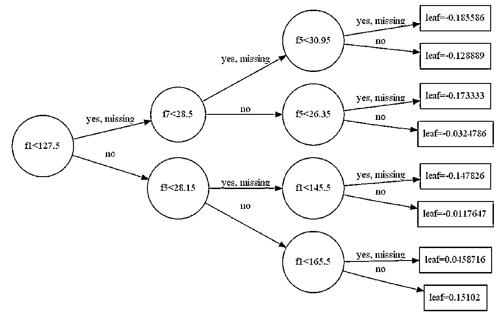
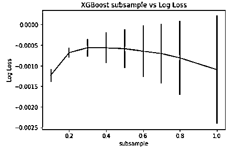

# 基于 XGBoost 的量化金融实战【系列 53】

> 原文：[`mp.weixin.qq.com/s?__biz=MzAxNTc0Mjg0Mg==&mid=2653287481&idx=1&sn=dcb1dda1e2362d8297ae1a97845cf02e&chksm=802e362cb759bf3a3aaea75af824451a3dba7345ecc73e27facc4b917792835fdd2878403c8c&scene=27#wechat_redirect`](http://mp.weixin.qq.com/s?__biz=MzAxNTc0Mjg0Mg==&mid=2653287481&idx=1&sn=dcb1dda1e2362d8297ae1a97845cf02e&chksm=802e362cb759bf3a3aaea75af824451a3dba7345ecc73e27facc4b917792835fdd2878403c8c&scene=27#wechat_redirect)


**量化投资与机器学习**

为中国的量化投资事业贡献一份我们的力量!

 


前两期传送门：

【系列 52】[基于 Python 预测股价的那些人那些坑](https://mp.weixin.qq.com/s?__biz=MzAxNTc0Mjg0Mg==&mid=2653287306&idx=1&sn=9f374874636e7d6d52a9b3d92d6aa81b&chksm=802e319fb759b8896acf2ed9529da88a8fda0d76d6a3b816854e9ad5eeecfd6f4af75dd65804&scene=21#wechat_redirect)

## 【系列 51】[通过 ML、Time Series 模型学习股价行为](https://mp.weixin.qq.com/s?__biz=MzAxNTc0Mjg0Mg==&mid=2653287197&idx=1&sn=9630389a52c7d0be4c1feaf3a534c2ce&chksm=802e3108b759b81ed11174f71b23fb73abe5c4ebad0f9d480b6efbd8f7e644de6b2232dc63fa&scene=21#wechat_redirect)

今天，我们介绍一篇**王老板**写的文章，关于极度梯度提升(XGBoost)应用量化金融方向的，而且知道几乎每个参加 Kaggle 比赛的人都会用它。用今天我们来预测借贷俱乐部 (Lending Club) 的贷款的良恶性。

获取数据集，请点击**阅读原文**。

**XGBoost 基础版**

```py
import numpy as np
import pandas as pd
import matplotlib.pyplot as plt
%matplotlib inline

from sklearn.model_selection import train_test_split
from sklearn.metrics import accuracy_score

from xgboost import XGBClassifier
```

首先调用本章需要通用的包，在之后每小节中额外需要的包会特别指出来。

*   numpy: 提供数组结构和辅助函数

*   pandas: 提供数据表结构来处理数据

*   matplotlib: 用来画图 

*   sklearn: 用来机器学习

*   xgboost: 极度梯度提升

此外

*   train_test_split 划分训练和测试集

*   accuracy_score 计算精度和得分

*   XGBclassifier 是 XGBoost 的分类器

整篇代码都用以下设置

```py
seed = 7
test_size = 0.33
```

用一个固定的 seed 为了重现结果，训练集和测试集的样例个数比例为 2 比 1。  

**1.1 模型初探**

学陌生东西上手最快的方式就是用例子。先不管 XGBclassifier 每个参数是什么，先用它的默认值跑跑看看结果如何。

本小节使用的数据是

**比马印第安人糖尿病 (Pima Indians Diabetes)** 

该数据根据医疗记录预测比马印第安人 5 年内糖尿病的发病情况。它是一个二元分类问题，一共有 768 个样例。该数据集包含了 8 个特征和 1 个类变量：

1.  怀孕次数

2.  2 小时的血浆葡萄糖浓度。

3.  舒张压

4.  三头肌皮肤褶层厚度

5.  2 小时血清胰岛素含量

6.  体重指数

7.  糖尿病家族史

8.  年龄

9.  类变量 (0 或 1）

**具体信息见参考文献 [1]**

**1.1.1\. 准备数据**

读取 csv 文件，并打印出头尾 3 行。**点击下图**发现该数据都是数值型，因此不用做任何转换。

```py
# load data
data = pd.read_csv('pima-indians-diabetes.csv')
data.head(3).append(data.tail(3))
```


**点击下图**查看每列特征的统计值，比如个数和均值，没有发现什么异常。

```py
data.describe()
```


定义函数 splitXy，划分 data 中的特征 X 和标记 y。通常

*   最后一列是 y，用 dataset[:, -1]

*   前面所有列是 X, 用 dataset[:, 0:-1]

```py
def splitXy( data ):
   dataset = data.values
   X = dataset[:,0:-1]
   y = dataset[:,-1]
   return X, y
```

划分出训练集 (X_train, y_train) 和测试集 (X_test, y_test)

```py
# split data into X and y
X, y = splitXy(data)
# split data into train and test sets
X_train, X_test, y_train, y_test =
train_test_split(X, y, test_size=test_size,
random_state=seed)
```

打印每个变量大小，确保集合划分正确。

```py
print( 'The size of X is', X.shape )
print( 'The size of y is', y.shape )
print( 'The size of X_train is', X_train.shape )
print( 'The size of y_train is', y_train.shape )
print( 'The size of X_test is', X_test.shape )
print( 'The size of y_test is', y_test.shape )
```

```py
The size of X is (768, 8)
The size of y is (768,)
The size of X_train is (514, 8)
The size of y_train is (514,)
The size of X_test is (254, 8)
The size of y_test is (254,)
```

**1.1.2\. 训练模型**

定义函数 fit 训练 XGBClassifier()。

```py
def fit( X, y ):
   model = XGBClassifier()
   model.fit(X, y)
   return model
```

在训练集上调用函数 fit 并打印模型，注意模型用 binary:logistic 作为目标，因为该问题是二元分类问题。

```py
model = fit(X_train, y_train)
print(model)
```

```py
XGBClassifier(base_score=0.5, colsample_bylevel=1, colsample_bytree=1,
     gamma=0, learning_rate=0.1, max_delta_step=0, max_depth=3,
     min_child_weight=1, missing=None, n_estimators=100, nthread=-1,
     objective='binary:logistic', reg_alpha=0, reg_lambda=1,
     scale_pos_weight=1, seed=0, silent=True, subsample=1)
```

**1.1.3\. 预测结果**

定义函数 predict 预测新示例并计算精度。

```py
def predict( model, X, y ):
   # make predictions for X
   y_pred = model.predict(X)
   predictions = [round(value) for value in y_pred]
   # evaluate predictions
   accuracy = accuracy_score(y, predictions)
   return predictions, accuracy
```

在测试集上调用函数 predict 并打印精度。

```py
_, accuracy = predict(model, X_test, y_test)
print("Accuracy: %.2f%%" % (accuracy * 100.0))
```

```py
Accuracy: 77.95%
```

**对于一个简单的没有经过调参的模型，在测试集上的 77.95% 精度还算不错。**

****1.1.4 保存和加载模型****

有时候训练一次模型会花很长时间，保存训练好的模型以便下次直接用可以节省很多时间和资源。首先引进 pickle 包。

```py
import pickle
```

用 dump 函数来保存模型，将 model 命名成 pima.dat。

```py
# save model to file
pickle.dump(model, open("pima.dat", "wb"))
```

用 load 函数来加载数据 pima.dat 命名为模型 pima_model。

```py
# load model from file
pima_model = pickle.load(open("pima.dat", "rb"))
```

最后检查模型，发现 pima_model 在测试集的精度为 77.95%，和上节的结果一样。

```py
_, accuracy = predict(pima_model, X_test, y_test)
print("Accuracy: %.2f%%" % (accuracy * 100.0))
```

```py
Accuracy: 77.95%
```

****1.1.5 可视化树****

安装并引入 graphviz 包里面的 Digraph 和 xgboost 包里面的 plot_tree 用于画出模型中的某一棵树。

```py
from graphviz import Digraph
from xgboost import plot_tree
```

比如你想看第 5 棵树是如何分裂的，设 num_trees = 4，注意 python 第一个对应的是 index 0。

```py
plot_tree(model, num_trees = 4)
plt.show()
plt.savefig('Tree from Top to Bottom.png')
```


对上图的一些解释：

*   f0, f1, ... f7 代表 pima 数据里的 8 个特征简写，其中 f1 对应着 “2 小时的血浆葡萄糖浓度”，树的根部一开始由这个特征在 127.5 的特征值上分裂。

*   XGBoost 可以自动处理缺失值，从上图可看出 missing 和 yes 归成一起。

此外你想看第 1 棵树是如何分裂的，并且喜欢树从左往右分裂，而不是从上往下 (默认方式) 分裂，只需设置 rankdir = 'LR'。

```py
plot_tree(model, num_trees=0, rankdir='LR')
plt.show()
plt.savefig('Tree from Left to Right.png')
```



**1.2 数据预处理**

先载入 LabelEncoder 和 OneHotEncoder

```py
from sklearn.preprocessing import LabelEncoder
from sklearn.preprocessing import OneHotEncoder
```

LabelEncoder (LE) 将字符转换成整数

    LE(猫, 狗, 鸡) = (0, 1, 2)

OneHotEncoder (OHE) 将字符转换成向量

    OHE(猫, 狗, 鸡) = [1,0,0; 0 1 0; 0 0 1]

**1.2.1\. 解码字符型输出**

****本小节使用的数据是****

******鸢尾花数据集 (Iris Flower)****** 

****Iris 以鸢尾花的特征作为数据来源，它是一个多元分类问题，一共有 150 个样例。该数据集包含了 4 个特征和 1 个类变量：****

1.  ****花萼长度****

2.  ****花萼宽度****

3.  ****花瓣长度****

4.  ****花瓣宽度****

5.  ****类变量：Iris Setosa (山鸢尾, Iris Versicolour (杂色鸢尾), Iris Virginica (维吉尼亚鸢尾)****

******具体信息见参考文献 [2]******

****该数据的类别是字符型变量，用 LabelEncoder。****

```py
**`data = pd.read_csv('iris.csv')
data.head(3).append(data.tail(3))`**
```

********

****用 fit_transform 函数将 (Iris-setosa, Iris-versicolor, Iris-virginica) 转换成 (0, 1, 2)。****

```py
**`# split data into X and y
X, y = splitXy(data)
# encode string class values as integers
label_encoded_y = LabelEncoder().fit_transform(y)
# split data into train and test sets
X_train, X_test, y_train, y_test 
= train_test_split(X, label_encoded_y, test_size=test_size,
random_state=seed)`**
```

****定义函数 fit_predict 整合 fit 和 predict 函数，并当 verbose 设置为 True 时打印模型和精度。****

```py
**`def fit_predict(X_train, y_train, X_test, y_test, verbose=True):
   model = fit(X_train, y_train)
   _, accuracy = predict(model, X_test, y_test)
   if verbose == True:
       print(model)
       print("Accuracy: %.2f%%" % (accuracy * 100.0))`**
```

****调用 fit_predict 函数得到 92% 的精度，而且注意该模型用 multi:softprob 作为目标，因为该问题是个多元分类问题，而且 XGBoost 内部自动将“类变量”作独热编码，要不然目标应该是 multi:softmax。****

```py
**`fit_predict(X_train, y_train, X_test, y_test)`**
```

```py
**`XGBClassifier(base_score=0.5, colsample_bylevel=1, colsample_bytree=1,
      gamma=0, learning_rate=0.1, max_delta_step=0, max_depth=3,
      min_child_weight=1, missing=None, n_estimators=100, nthread=-1,
      objective='multi:softprob', reg_alpha=0, reg_lambda=1,
      scale_pos_weight=1, seed=0, silent=True, subsample=1)
Accuracy: 92.00%`**
```

******1.2.2 独热编码分类型特征******

****本小节使用的数据是****

******肯特岗乳癌 (Breast + Cancer)****** 

****该数据集可用于进行患者乳腺癌治疗结果预测。它是一个二元分类问题，一共有 286 个样例。该数据集包含了 9 个特征和 1 个类变量：****

1.  ****age****

2.  ****menopause****

3.  ****tumor-size****

4.  ****inv-nodes****

5.  ****node-caps****

6.  ****deg-malig****

7.  ****breast****

8.  ****breast-quad****

9.  ****irradiat****

10.  ****类变量：复发，未复发****

******具体信息见参考文献 [3]******

****该数据的 9 个特征都是字符型变量，这里用 OneHotEncoder。****

```py
**`data = pd.read_csv('datasets-uci-breast-cancer.csv')
data.head(3).append(data.tail(3))`**
```

********

****从下表 unique 那行可看出每个特征的类数，比如 age 有 6 类，breast 有 2 类等。****

```py
**`data.describe()`**
```

********

****对每个特征 X 做独热编码，对类 y 做普通编码。****

```py
**`# split data into X and y
X, y = splitXy(data) X = X.astype(str)
# encode string input values as integers
columns = []
for i in range(0, X.shape[1]):
   feature = LabelEncoder().fit_transform(X[:,i]).reshape(X.shape[0], 1)
   onehot_encoder = OneHotEncoder(sparse=False)
   feature = onehot_encoder.fit_transform(feature)
   print("X[",i, "] shape ::", feature.shape)
   columns.append(feature)
# collapse columns into array
encoded_x = np.column_stack(columns)
print("X shape ::", encoded_x.shape)
# encode string class values as integers
label_encoded_y = LabelEncoder().fit_transform(y)
# split data into train and test sets
X_train, X_test, y_train, y_test = 
train_test_split(encoded_x, label_encoded_y,
test_size=test_size, random_state=seed)`**
```

```py
**`X[0] shape :: (286, 6)
X[1] shape :: (286, 3)
X[2] shape :: (286, 11)
X[3] shape :: (286, 7)
X[4] shape :: (286, 3)
X[5] shape :: (286, 3)
X[6] shape :: (286, 2)
X[7] shape :: (286, 6)
X[8] shape :: (286, 2)
X shape :: (286, 43)`**
```

****上面的结果有些奇怪，比如 X[4] 的大小是 (286, 3), 286 代表数据个数，3 代表类别个数，但是从前一张图得知这个特征是 node-caps，对应的 unique 数为 2。看了 csv 文件才知道，这一特征栏下面有缺失值，读进 pandas 的数据表中赋值为 NaN, 也当成了一类。****

****最后调用 fit_predict 函数得到 71.58% 的精度，结果不算太好，那是因为该数据中有不少缺失值，下节就来说明如何处理它们，即便 XGBoost 模型也可以自行处理。****

```py
**`fit_predict(X_train, y_train, X_test, y_test)`**
```

```py
**`XGBClassifier(base_score=0.5, colsample_bylevel=1, colsample_bytree=1,
      gamma=0, learning_rate=0.1, max_delta_step=0, max_depth=3,
      min_child_weight=1, missing=None, n_estimators=100, nthread=-1,
      objective='binary:logistic', reg_alpha=0, reg_lambda=1,
      scale_pos_weight=1, seed=0, silent=True, subsample=1)
Accuracy: 71.58%`**
```

******1.2.3 缺失值处理******

****本小节使用的数据是****

******病马**疝气症** (Horse Colic)****** 

****该数据集可用于进行患者乳腺癌治疗结果预测。它是一个二元分类问题，一共有 368 个样例。该数据集包含了 27 个特征 (其中有 30% 的缺失值) 和 1 个类变量。由于数据太多就一一列出，用这个数据集是为了测试 XGBoost 处理缺失值的能力。****

******具体信息见参考文献 [4]******

****该数据的类型都是数值型，其中符号 ? 代表缺失值。****

```py
**`data = pd.read_csv("horse-colic.csv")
data.head(3).append(data.tail(3))`**
```

********

****首先将缺失值用 0 来填充，填充完记得将 X 转化成 float 格式。****

```py
**`# split data into X and y
X, y = splitXy(data)
# set missing values to 0
X[X == '?'] = 0
# convert to numeric
X = X.astype('float32')
# encode Y class values as integers
label_encoded_y = LabelEncoder().fit_transform(y)`**
```

****该模型达到了 83.84% 的精度。****

```py
**`fit_predict(X_train, y_train, X_test, y_test)`**
```

```py
**`XGBClassifier(base_score=0.5, colsample_bylevel=1, colsample_bytree=1,
      gamma=0, learning_rate=0.1, max_delta_step=0, max_depth=3,
      min_child_weight=1, missing=None, n_estimators=100, nthread=-1,
      objective='binary:logistic', reg_alpha=0, reg_lambda=1,
      scale_pos_weight=1, seed=0, silent=True, subsample=1)
Accuracy: 83.84%`**
```

****接着我们做一下实验，将缺失值分别 1 和 NaN 来填充，得到的精度分别为 79.80% 和 85.86%。****

```py
**`X[X == '?'] = 1
X[X == '?'] = np.nan`**
```

******发现将缺失值设为独一的 NaN 最好，得到的精度最高，因为其独一性 XGBoost 把缺失值也当成“一类”。设为 0 或 1 都不太好，因为数据本身可能也含有一些 0 或 1。******

******1.3 交叉验证******

******本节用 Pima 的数据。******

****交叉验证在选取超参数时非常重要，首先载入 KFold, StratifiedKFold 和 cross_val_score。其中****

*   ****KFold 适用于二分类且类别平衡****

*   ****StratifiedKFold 适用于多分类或类别不平衡****

*   ****cross_val_score 计算一些指标****

```py
**`from sklearn.model_selection import KFold
from sklearn.model_selection import StratifiedKFold
from sklearn.model_selection import cross_val_score`**
```

****这里用 5 折交叉验证，分别用 KFold 和 StratifiedKFold 来跑。**** 

```py
**`# CV model for binary class or balanced class
kfold = KFold(n_splits=5, random_state=7)
results = cross_val_score(model, X, y, cv=kfold)
print("Accuracy: %.2f%% (%.2f%%)" % (results.mean()*100, results.std()*100))`**
```

```py
**`Accuracy: 76.44% (5.09%)`**
```

```py
**`# CV model for multi-class or inbalanced class
kfold = StratifiedKFold(n_splits=5, random_state=7)
results = cross_val_score(model, X, y, cv=kfold)
print("Accuracy: %.2f%% (%.2f%%)" % (results.mean()*100, results.std()*100))`**
```

```py
**`Accuracy: 76.57% (3.74%)`**
```

****该数据有 768 个，其中 268 正类 500 反类，属于不平衡的二分类问题，从上面结果来看，的确****

*   ****StratifiedKFold 的精度 76.57% 比 KFold 的精度 76.44% 要高****

*   ****StratifiedKFold 的标准差 3.74% 比 KFold 的标准差 5.09% 要低****

******1.4 特征选择******

******本节用 Pima 的数据。******

****特征选择是一个重要课题，由于 XGBoost 包含随机森林的性质，因此也可以用来排序特征重要性并选择特征。****

****首先载入 plot_importance 和 SelectFromModel。****

```py
**`from xgboost import plot_importance
from sklearn.feature_selection import SelectFromModel`**
```

******1.4.1 特征重要性******

****训练好的模型会给特征打分，用 feature_importances_ 属性查看其分数。****

```py
**`# feature importance
print(pima_model.feature_importances_)
# feature
feature = data.columns.tolist()[0:-1]
print(feature)`**
```

```py
**`[ 0.07094595  0.1858108   0.08952703  0.08445946  0.07263514  0.16047297
 0.12837838  0.20777027]
['Number of times pregnant ', 'Plasma glucose concentration', 'Diastolic blood pressure', 'Triceps skin fold thickness', 'Serum insulin', 'BMI', 'Diabetes pedigree function', 'Age ']`**
```

****一图胜万字，手动画图可看出年龄 (灰色柱体) 特征最重要，怀孕次数 (蓝色柱体) 特征最不重要。****

```py
**`# mannually plot
df = pd.DataFrame(data=model.feature_importances_, index=feature).T
df.plot.bar(figsize=(12,6));`**
```

********

****别傻了，这年头谁还手动画图，直接用 XGBoost 自带函数 plot_importance 就可以了。(虽然方便，但是丑，有没有颜色区分，而且特征都用没有实际意义的 f0, ..., f8 代表)****

```py
**`# Using the XGBoost built-in function to plot
plot_importance(pima_model)
plt.show()`**
```

********

****查查 Pima 数据的特征名字，发现 f7 对应着是年龄，f0 对应着是怀孕次数。****

******1.4.2 特征选择******

****计算出特征重要性后就可以选择特征了。用 SelectFromModel 将特征重要性作为阈值 (threshold)，得到一个 X_train 和 X_test 在特征维度上的子集，然后重新训练并打印出精度。****

```py
**`thresholds = np.sort(pima_model.feature_importances_)
for c in thresholds:
   selection = SelectFromModel(pima_model, threshold=c, prefit=True)
   select_X_train = selection.transform(X_train)
   select_X_test = selection.transform(X_test)
   # train model
   selection_model = fit(select_X_train, y_train)
   # eval model
   _, accuracy = predict(selection_model, select_X_test, y_test)
   print("Threshold = %.3f, n = %d, Accuracy: %.2f%%" % (c, select_X_train.shape[1], accuracy*100.0))`**
```

```py
**`Threshold = 0.071, n = 8, Accuracy: 77.95%
Threshold = 0.073, n = 7, Accuracy: 76.38%
Threshold = 0.084, n = 6, Accuracy: 77.56%
Threshold = 0.090, n = 5, Accuracy: 76.38%
Threshold = 0.128, n = 4, Accuracy: 76.38%
Threshold = 0.160, n = 3, Accuracy: 74.80%
Threshold = 0.186, n = 2, Accuracy: 71.65%
Threshold = 0.208, n = 1, Accuracy: 63.78%`**
```

****从上面结果可知，一般特征个数越多，精度越高，但是 n = 4 对应着 76.38% 的精度不比 n = 8 对应着 77.95% 的精度低很多。权衡精度和模型复杂度，我们会选择 n = 4。****

******1.5 提前终止******

******本节用 Pima 的数据。******

****提前终止 (early stopping) 可以防止过拟合 (overfitting)。具体做法可分三步：****

1.  ****选评估指标 - error 或 logloss 或都选****

2.  ****选评估集 - 训练集或测试集或都选****

3.  ****调用 fit 函数，设置 verbose = True (**重要**) 并监控****

****下例选了测试集和 error 来评估，打印出 error 值。****

```py
**`eval_set = [(X_test, y_test)]
model.fit(X_train, y_train, eval_metric="error", eval_set=eval_set, verbose=True)`**
```

```py
**`[0]  validation_0-error:0.259843
[1]  validation_0-error:0.26378
[2]  validation_0-error:0.26378
...
[17]  validation_0-error:0.228346
[18]  validation_0-error:0.224409
[19]  validation_0-error:0.232283
[20]  validation_0-error:0.232283
[21]  validation_0-error:0.23622
[22]  validation_0-error:0.23622`**
```

****发现 error 一开始在减低，但从 [19] 回合开始就升高了，这说明模型有可能过拟合了。****

****下例选了 [训练集, 测试集] 和 [error, logloss] 来评估，并画图。****

```py
**`eval_set = [(X_train, y_train), (X_test, y_test)]
model.fit(X_train, y_train, eval_metric=["error", "logloss"], eval_set=eval_set,
verbose=False)`**
```

********

********

****从上两图看出，训练集 (蓝线) 上的 logloss 和 error 一直稳定下降，但是测试集 (黄线) 上的 logloss 和 error 在 20-40 之间开始上升，我们需要在 20 和 40 之间某个点提前终止训练。****

****XGBoost 中设置 early_stopping_rounds 可以提前终止，当该值设为 10，意思是说如果 logloss **在某一回合连续 10 个回合上升，那么在这个回合停止**。**** 

```py
**`eval_set = [(X_test, y_test)]
model.fit(X_train, y_train, early_stopping_rounds=10, eval_metric="logloss",
eval_set=eval_set, verbose=True)`**
```

```py
**`[0]  validation_0-logloss:0.660186
Will train until validation_0-logloss hasn't improved in 10 rounds.
[1]  validation_0-logloss:0.634854
[2]  validation_0-logloss:0.612239
[3]  validation_0-logloss:0.593118
...
[29]  validation_0-logloss:0.491407
[30]  validation_0-logloss:0.488828
[31]  validation_0-logloss:0.487867
[32]  validation_0-logloss:0.487297
[33]  validation_0-logloss:0.487562
[34]  validation_0-logloss:0.487788
[35]  validation_0-logloss:0.487962
[36]  validation_0-logloss:0.488218
[37]  validation_0-logloss:0.489582
[38]  validation_0-logloss:0.489334
[39]  validation_0-logloss:0.490969
[40]  validation_0-logloss:0.48978
[41]  validation_0-logloss:0.490704
[42]  validation_0-logloss:0.492369
Stopping. Best iteration:
[32]  validation_0-logloss:0.487297

Accuracy: 78.35%`**
```

****上图的信息非常明确，logloss 从 [32] 回合一直上升到 [42] 回合，因此在此停止。****

******1.6 多线程运行******

```py
**`from time import time`**
```

****本小节使用的数据是****

******Otto Group Product****** 

****训练集里包含了 6 万多个样本，每个样本有一个 id，93 个特征值 feat_1 ~ feat_93,以及类别 target，一共 9 种类别：class_1 ~ class_9。测试集里有 14 万多测试样本。它是一个多元分类问题**** 

******具体信息见参考文献 [5]******

****读取并预处理数据。****

```py
**`data = pd.read_csv('Otto train.csv')
X, y = splitXy(data)
# encode string class values as integers
label_encoded_y = LabelEncoder().fit_transform(y)`**
```

****XGBoost 是用 C++ 实现的而且用 OpenMP API 做并行处理。将模型里面 nthread 设为 -1 代表使用系统里所有的线程，这也是默认设置。****

****此外将 nthread 设为 1, 2, 3, 4 看看用时比较。由下面结果可看出线程越多耗时越少，但从 3 到 4 时间减少并不是很明显。****

```py
**`results = []
num_threads = [1, 2, 3, 4]
for n in num_threads:
   start = time()
   model = XGBClassifier(nthread=n)
   model.fit(X_train, y_train)
   elapsed = time() - start
   print(n, elapsed)
   results.append(elapsed)`**
```

```py
**`1 78.58481550216675
2 50.53288269042969
3 44.90712261199951
4 39.1385235786438`**
```

****除了 XGBClassifier, k-Fold 验证也可以并行化，它是通过设置 n_jobs 来实现的。接下来做三个实验：****

1.  ****只并行化 k-Fold 验证 (n_jobs = -1, nthread = 1)****

2.  ****只并行化 XGBClassifier (n_jobs = 1, nthread = -1)****

3.  ****两个都并行化 (n_jobs = -1, nthread = -1)****

```py
**`# Single Thread XGBoost, Parallel Thread CV
model = XGBClassifier(nthread=1)
results = cross_val_score(model, X, label_encoded_y, cv=kfold, scoring='neg_log_loss',
n_jobs=-1)

# Parallel Thread XGBoost, Single Thread CV
model = XGBClassifier(nthread=-1)
results = cross_val_score(model, X, label_encoded_y, cv=kfold, scoring='neg_log_loss',
n_jobs=1)

# Parallel Thread XGBoost and CV
model = XGBClassifier(nthread=-1)
results = cross_val_score(model, X, label_encoded_y, cv=kfold, scoring='neg_log_loss',
n_jobs=-1)`**
```

```py
**`Single XGB Parallel CV: 187.554039
Parallel XGB Single CV: 145.135988
Parallel XGB and CV:    149.078977`**
```

****结果显示只并行化 k-Fold 验证耗时最长，因为真正慢的是 XGBClassifier。此外奇怪的是两个都并行耗时并不是最短 (按道理应该是)。****

******1.7 调整超参数******

******本节用 Otto 的数据。******

****对于 XGBoost 模型，很多学者和实践者通过无数尝试，给出了一些超参数的合理范围，这些建议在调参时非常有用，起码可以给个初始值尝试。关于那些参数建议来源，可参考 [6], [7], [8], [9], [10], [11], [12], [13], [14]。里面有一些学术大牛比如 Friedman 和 Hastie，有业界大牛 Owen Zhang，有 R, scikit-learn 和 XGBoost 官方参数建议。****

****接下来我们从三组最重要的超参数对来看是调参，这里需要用的到 GridSearchCV。****

```py
**`from sklearn.model_selection import GridSearchCV`**
```

****GridSearchCV 用于系统地遍历多种参数组合，通过交叉验证确定最佳效果参数。它的好处是，只需增加几行代码，就能遍历多种组合。比如模型 M 有三个参数 P1, P2, P3, 其中****

****    P1 可选值 1, 2****

****    P2 可选值 4, 5, 6****

****    P3 可选值 1, 3, 5, 7****

****建立一个参数字典 Para = {P1: [1 2], P2: [4 5 6], P3: [1 3 5 7]}，直接调用****

****    GS = GridSearchCV(M, Para)****

****遍历所有 Para 组合，跑模型 24 遍，最后输出为 GS。****

******1.7.1 树的个数和深度******

****XGBoost 整个过程就是一个按顺序加树的过程，因此树的个数和树的深度绝对算是一组重要的超参数。接下来做三组调试：****

1.  ****只调树的个数****

2.  ****只调树的深度****

3.  ****同时调树的个数和深度****

* * *

******调树的个数******

* * *

****树的个数从 50 到 350，以 50 为间隔，在 5 折交叉验证中要运行模型 30 次，最后最佳树的个数是 200。观察 logloss 发现其实树的个数在 100 和 350 之间差距都很小。****

```py
**`n_estimators = range(50, 400, 50)
param_grid = dict(n_estimators=n_estimators)
kfold = StratifiedKFold(n_splits=5, shuffle=True, random_state=7)
grid_search = GridSearchCV(model, param_grid, scoring="neg_log_loss", n_jobs=-1, cv=kfold)
grid_result = grid_search.fit(X, label_encoded_y)`**
```

```py
**`Best: -0.001034 using {'n_estimators': 200}
-0.010886 (0.000810) with: {'n_estimators': 50}
-0.001098 (0.001313) with: {'n_estimators': 100}
-0.001038 (0.001348) with: {'n_estimators': 150}
-0.001034 (0.001344) with: {'n_estimators': 200}
-0.001035 (0.001346) with: {'n_estimators': 250}
-0.001036 (0.001349) with: {'n_estimators': 300}
-0.001037 (0.001351) with: {'n_estimators': 350}`**
```

********

* * *

******调树的深度******

* * *

******树的深度从 1 到 9，以 2 为间隔，在 5 折交叉验证中要运行模型 25 次，最后最佳树的深度是 5。观察 logloss 发现其实树的深度在 3 和 9 之间差距都很小。******

```py
****`max_depth = range(1, 11, 2)
param_grid = dict(max_depth=max_depth)
kfold = StratifiedKFold(n_splits=5, shuffle=True, random_state=7)
grid_search = GridSearchCV(model, param_grid, scoring="neg_log_loss", n_jobs=-1, cv=kfold,
verbose=1)
grid_result = grid_search.fit(X, label_encoded_y)`****
```

```py
****`Best: -0.001098 using {'max_depth': 5}
-0.026149 (0.000743) with: {'max_depth': 1}
-0.001098 (0.001313) with: {'max_depth': 3}
-0.001098 (0.001295) with: {'max_depth': 5}
-0.001100 (0.001295) with: {'max_depth': 7}
-0.001100 (0.001295) with: {'max_depth': 9}`****
```

************

* * *

**********调树的个数和深度**********

* * *

****树的个数为 [50, 100, 150, 200]，树的深度为 [2, 4, 6, 8]，在 5 折交叉验证中要运行模型 80 次，最后最佳树的个数和深度是 200 和 4，这个和单独调试的 最佳树的个数 200 和最佳树的深度 5 很接近。****

```py
**`n_estimators = [50, 100, 150, 200]
max_depth = [2, 4, 6, 8]
param_grid = dict(max_depth=max_depth, n_estimators=n_estimators)
kfold = StratifiedKFold(n_splits=5, shuffle=True, random_state=7)
grid_search = GridSearchCV(model, param_grid, scoring="neg_log_loss", n_jobs=-1, cv=kfold,
verbose=1)
grid_result = grid_search.fit(X, label_encoded_y)`**
```

```py
**`Best: -0.001010 using {'max_depth': 4, 'n_estimators': 200}`**
```

********

******1.7.2 学习率和树的个数******

****一般来说，学习率越小，需要增加树的个数就越大。接下来做两组调试：****

1.  ******只调学习率******

2.  ******同时调树的个数和学习率******

* * *

********调学习率********

* * *

******学习率为 [0.0001, 0.001, 0.01, 0.1, 0.2, 0.3]，在 5 折交叉验证中要运行模型 30 次，最后最佳学习率是 0.2。观察 logloss 发现其实学习率在 0.1 和 0.3 之间差距都很小。******

```py
****`learning_rate = [0.0001, 0.001, 0.01, 0.1, 0.2, 0.3]
param_grid = dict(learning_rate=learning_rate)
kfold = StratifiedKFold(n_splits=5, shuffle=True, random_state=7)
grid_search = GridSearchCV(model, param_grid, scoring="neg_log_loss", n_jobs=-1, cv=kfold)
grid_result = grid_search.fit(X, label_encoded_y)`****
```

```py
****`Best: -0.001028 using {'learning_rate': 0.2}
-2.155502 (0.000038) with: {'learning_rate': 0.0001}
-1.841039 (0.000362) with: {'learning_rate': 0.001}
-0.597303 (0.000606) with: {'learning_rate': 0.01}
-0.001098 (0.001313) with: {'learning_rate': 0.1}
-0.001028 (0.001336) with: {'learning_rate': 0.2}
-0.001029 (0.001349) with: {'learning_rate': 0.3}`****
```

************

* * *

********调树的个数和学习率********

* * *

********树的个数为 [100, 200, 300, 400, 500]，学习率为 [0.0001, 0.001, 0.01, 0.1]，在 5 折交叉验证中要运行模型 100 次，最后最佳树的个数和学习率是 200 和 0.1，这个和单独调试的 最佳树的个数 200 和最佳学习率 0.2 很接近。******** 

```py
********`n_estimators = [100, 200, 300, 400, 500]
learning_rate = [0.0001, 0.001, 0.01, 0.1]
param_grid = dict(learning_rate=learning_rate, n_estimators=n_estimators)
kfold = StratifiedKFold(n_splits=5, shuffle=True, random_state=7)
grid_search = GridSearchCV(model, param_grid, scoring="neg_log_loss", n_jobs=-1, cv=kfold)
grid_result = grid_search.fit(X, label_encoded_y)`********
```

```py
********`Best: -0.001034 using {'learning_rate': 0.1, 'n_estimators': 200}`********
```

********************

**************1.7.3 采样比率**************

****随机森林有列采样和行采样，XGBoost 也有。 接下来做两组调试：****

1.  ****只调行采样比率****

2.  ****只调列采样比率****

****行采样比率和列采样比率都从 0.1 到 1，以 0.1 为间隔，那么分别在 5 折交叉验证中要运行模型 50 次，最后发现最佳行采样比率是 0.3 和最佳列采样比率是 0.7。图表展示如下：****

********

********

******2\. XGBoost 进阶版******

****本章介绍如何将 XGBoost 在 Lending Club 的预测贷款的应用。****

******2.1 数据预处理******

****读取并概览数据。****

```py
**`data = pd.read_csv('lending-club-data.csv', low_memory=False)
data.head(3).append(data.tail(3))`**
```

********

****处理数据步骤有三步：**** 

*   ****平衡样本 (sample balancing)****

*   ****特征子集 (feature subset)****

*   ****独热编码 (one-hot encoding)****

****在本帖，我们不会平衡样本，保留原来良性贷款和恶性贷款的比例。****

```py
**`N1 = len(data[data[target] == 0])
N2 = len(data[data[target] == 1])

print( "%% of safe loans  : %.2f%%" %(N1/(N1+N2)*100.0) )
print( "%% of risky loans : %.2f%%" %(N2/(N1+N2)*100.0) )`**
```

```py
**`% of safe loans  : 81.12%
% of risky loans : 18.88%`**
```

******2.2 模型比对******

****首先我们用相同的参数，比对决策树 (DT)、随机森林 (RF)、梯度提升树 (GBT) 和极度梯度提升 (XGB)。****

```py
**`DT = DecisionTreeClassifier(max_depth=5)
RF = RandomForestClassifier(n_estimators=10, max_depth=5)
GBT = GradientBoostingClassifier(n_estimators=10, max_depth=5)
XGB = XGBClassifier(n_estimators=10, max_depth=5)`**
```

****训练这四个模型但是发现错误，原因是数据里有缺失值，XGB 可以自动处理，但是 DT, RF 和 GBT 不能。****

```py
**`DT.fit( X_train, y_train )
RF.fit( X_train, y_train )
GBT.fit( X_train, y_train )
XGB.fit( X_train, y_train )`**
```

```py
**`ValueError: Input contains NaN, infinity or a value too large for dtype('float32').`**
```

****将缺失值用 NaN 来填充。****

```py
**`X_train1 = np.nan_to_num(X_train)
X_test1 = np.nan_to_num(X_test)`**
```

****再训练模型并打印出它们的精度值。****

```py
**`DT  - Accuracy (Train): 0.8199
DT  - Accuracy (Test):  0.8172
RF  - Accuracy (Train): 0.8127
RF  - Accuracy (Test):  0.8128
GBT - Accuracy (Train): 0.8197
GBT - Accuracy (Test):  0.8173
XGB - Accuracy (Train): 0.8217
XGB - Accuracy (Test):  0.8179`**
```

****从测试误差来看，确实****

****XGB > GBT > RF > DT**** 

******2.3 参数介绍******

****XGBoost 的设置有三种参数：**一般参数**，**提升参数**和**学习参数**。****

*   ******一般参数** 取决于提升器，通常是树或线性模型****

*   ******提升参数** 取决于选择的提升器的相关参数****

*   ******学习参数** 取决于指定学习任务和相应的学习目标****

******一般参数 (general parameters)******

*   ****booster：选择提升器，默认是 tree****

*   ****silent：是否打印信息，默认是 0 不打印****

*   ****nthread：线程数，默认为最大可用线程数****

*   ****num_pbuffer：缓冲区大小，默认为训练实例的数量****

*   ****num_feature：特征纬度，默认为特征的最高纬度****

******提升参数 (booster parameters)******

*   ****eta：学习率，范围 [0, 1]，默认为 0.3。该参数越小，计算速度越慢；该参数越大，有可能无法收敛****

*   ****gamma：控制叶子个数的参数，范围 [0, +∞)，默认为 0。该参数越大，越不容易过拟合****

*   ****max_depth：每颗树的最大深度，范围 [0, +∞)，默认为 6。该参数越大，越容易过拟合 ****

*   ****min_child_weight：每个叶子里面的最小权重和，范围 [0, +∞)，默认为 1。该参数越大，越不容易过拟合****

*   ****subsample：样本采样比率，范围 (0, 1]，默认为 1。如果取 0.5 代表随机用 50% 的样本集用来训练****

*   ****colsample_bytree：列采样比率，范围 (0, 1]，默认为 1。对每棵树的生成用的特征进行列采样，类似于随机森林的列采样****

*   ****lambda：L2 正则化参数，范围 0, +∞)，默认为 1。该参数越大，越不容易过拟合。 ****

*   ****alpha：L1 正则化参数，范围 [0, +∞)，默认为 0。该参数越大，越不容易过拟合。 ****

*   ****scale_pos_weight：控制正反类的平衡参数，范围 [0, +∞)，默认为 1。该参数通常设为“反类的总和/正类的总和”****

******学习参数 (learning parameters)******

*   ****objective：损失函数，默认为 linear。其他常见类型有： ****

*   ****reg:logistic – 二分类****

*   ****binary:logistic  – 二分类概率****

*   ****multi:softmax – 多分类****

*   ****multi:softprob – 多分类概率****

*   ****rank:pairwise – 排序****

*   ****base_score：预测分数，默认为 0.5。最初每个样例的预测分数。****

*   ****eval_metric：评估指标。该指标用在验证集上，比如回归任务默认的是 rmse；分类任务默认为 error；排序任务默认为 map。其他常见类型有：****

*   ****rmse – root mean square error ****

*   ****mae – mean absolute error ****

*   ****logloss – negative log-likelihood ****

*   ****error – binary classification error rate****

*   ****merror – multiclass classification error rate ****

*   ****mlogloss – multiclass logloss ****

*   ****auc – area under the curve****

*   ****map – mean average precision****

*   ****seed：随机种子，默认为 0，用于产生可复现的结果 ****

******2.4 调参步骤******

****调参像是一门艺术，需要足够的经验和前人的建议。一个不错的调参思路有如下四步：****

1.  ****开始用一个业界公认的学习率 0.1，然后根据交叉验证误差来确定“最优树的个数”****

2.  ****决定好学习率和树的个数之后，调“树相关的参数”，比如 max_depth, min_child_weight, gamma, subsample, colsample_bytree****

3.  ****为了进一步避免过拟合，调“正则化参数”，比如 lambda, alpha****

4.  ****用之前调好的参数，尝试小一点的学习率，看是否能提高模型表现****

****这里我编写了一个函数 modelfit，主要为了方便打印精度值和画图，由于程序比较长，大家可以去 notebook 上去看。****

******步骤 1**：固定学习率调最优树的个数****

```py
**`xgb1 = XGBClassifier( learning_rate=0.1, n_estimators=1000, max_depth=5,
                     min_child_weight=1, gamma=0, subsample=0.8,
                     colsample_bytree=0.8, objective='binary:logistic',
                     nthread=4, scale_pos_weight=1, seed=seed )

modelfit( xgb1, X_train, X_test, y_train, y_test )`**
```

```py
**`Best Iteration: **402**

Model Report
Accuracy (Train): 0.8481
Accuracy (Test): 0.8247
AUC Score (Train): 0.850696
AUC Score (Test): **0.762747**`**
```

****固定学习率 0.1，以交叉误差作为评估指标，得到 **402** 作为最优树的个数。此外，特征重要性的图如下：****

****![****

******步骤 2**：调“树相关参数”****

****在这一步中，树的个数用步骤 1 确定好的 **402**。****

****先粗调参，大概定下最优值 **5** 和 **3**。****

```py
**`param_test1 = { 'max_depth':range(3,10,2), 'min_child_weight':range(1,6,2) }`**
```

```py
**`Best: 0.764367 using {'max_depth': **5**, 'min_child_weight': **3**}`**
```

****再细调参，最终确定最优值 **5** 和 **3**。****

```py
**`param_test2 = { 'max_depth':[4,**5**,6], 'min_child_weight':[2,**3**,4] }`**
```

```py
**`Best: 0.764367 using {'max_depth': **5**, 'min_child_weight': **3**}`**
```

****再确定 gamma 最优值 **0.3**。****

```py
**`param_test3 = { 'gamma':[i/10.0 for i in range(0,5)] }`**
```

```py
**`Best: 0.764989 using {'gamma': **0.3**}`**
```

****将上面三个参数最优值 (下图红色) 带入模型重新再调树的个数。****

```py
**`xgb2 = XGBClassifier( learning_rate=**0.1**, n_estimators=1000, max_depth=**5**,
                     min_child_weight=**3**, gamma=**0.3**, subsample=0.8,
                     colsample_bytree=0.8, objective= 'binary:logistic',
                     nthread=4, scale_pos_weight=1, seed=seed )

modelfit( xgb2, X_train, X_test, y_train, y_test )`**
```

```py
**`Best Iteration: **482**

Model Report
Accuracy (Train): 0.8505
Accuracy (Test): 0.8249
AUC Score (Train): 0.856505
AUC Score (Test): **0.763606**`**
```

****现在最优树的个数为 **482**，而且发现 AUC 变好了，从 **0.762747** 提升到 **0.763606**，再接再厉继续调整其他“采样参数”。****

****先粗调参，大概定下最优值 **0.8** 和 **0.8**。****

```py
**`param_test4 = { 'subsample': [i/10.0 for i in range(6,10)],
               'colsample_bytree': [i/10.0 for i in range(6,10)] }`**
```

```py
**`Best: 0.764960 using {'colsample_bytree': **0.8**, 'subsample': **0.8**}`**
```

****再细调参，最终确定最优值 **0.8** 和 **0.8**。****

```py
**`param_test5 = { 'subsample': [i/100.0 for i in range(70,95,5)],
               'colsample_bytree': [i/100.0 for i in range(70,95,5)] }`**
```

```py
**`Best: 0.764960 using {'colsample_bytree': **0.8**, 'subsample': **0.8**}`**
```

******步骤 3**：调“正则化参数”****

****先粗调参，大概定下最优值 **1**。****

```py
**`param_test6 = { 'reg_alpha':[1e-5, 1e-2, 0.1, 1, 100] }`**
```

```py
**`Best: 0.765376 using {'reg_alpha': **1**}`**
```

****再细调参，最终确定最优值 **5**。****

```py
**`param_test7 = { 'reg_alpha':[0.1, 0.5, 1, 5, 10] }`**
```

```py
**`Best: 0.766167 using {'reg_alpha': **5**}`**
```

****发现 Best Score 的确增加了。最后把所有调好参数最优值 (下图红色) 带入模型再调树的个数。****

```py
**`xgb3 = XGBClassifier( learning_rate=**0.1**, n_estimators=1000, max_depth=**5**,
                     min_child_weight=**3**, gamma=**0.3**, subsample=**0.8**, colsample_bytree=**0.8**, 
                     reg_alpha=**5**, objective='binary:logistic',
                     nthread=4, scale_pos_weight=1, seed=seed )

modelfit( xgb3, X_train, X_test, y_train, y_test )`**
```

```py
**`Best Iteration: **361**

Model Report
Accuracy (Train): 0.8417
Accuracy (Test): 0.8245
AUC Score (Train): 0.830397
AUC Score (Test): **0.763912**`**
```

****现在最优树的个数为 **361**，AUC 继续变好，从 **0.763606 **提升到 **0.763912**。****

******步骤 4**：尝试小一点的学习率****

```py
**`xgb4 = XGBClassifier( learning_rate=**0.01**, n_estimators=5000, max_depth=**5**,
                     min_child_weight=**3**, gamma=0.3, subsample=**0.8**, colsample_bytree=**0.8**, 
                     reg_alpha=**5**, objective='binary:logistic',
                     nthread=4, scale_pos_weight=1, seed=seed )

modelfit( xgb4, X_train, X_test, y_train, y_test )`**
```

```py
**`Best Iteration: 3702

Model Report
Accuracy (Train): 0.8424
Accuracy (Test): 0.8256
AUC Score (Train): 0.832793
AUC Score (Test): **0.767145**`**
```

****学习率从 0.1 降低到 0.01，其他参数不变，AUC 从 ****0.763912 ****提升到 **0.767145**。再回顾一路从来 AUC 的提升历程：****

******0.767145 > **0.763912 > **0.763606 > **0.762747************ 

****可不要小瞧这一点点的提升哦，在 kaggle 比赛中可会压不少人的。当然本节也只是对调参给个思路，抛砖引玉。****

******4\. 总结******

****本贴总结的东西超越了 XGBoost 带来的东西，有着更广的使用范围，一些心得如下：****

*   ****学新模型最好从具体例子开始，用模型的默认值先****

*   ****尝试不同类型的数据，用编码技巧，处理缺失值****

*   ****用提前终止来防止过拟合****

*   ****能画图就画图，一图胜千字****

*   ****能并行就并行，时间就是生命****

*   ****调参是门艺术，没有捷径只能积累，多看大师的推荐，从重要的参数开始，先粗调再细调****

******参考文献******

****https://archive.ics.uci.edu/ml/datasets/Pima+Indians+Diabetes****

****http://archive.ics.uci.edu/ml/datasets/Iris****

****http://archive.ics.uci.edu/ml/datasets/Breast+Cancer****

****https://archive.ics.uci.edu/ml/datasets/Horse+Colic****

****https://www.kaggle.com/c/otto-group-product-classification-challenge/data****

****Greedy Function Approximation: A Gradient Boosting Machine, Jerome Friedman****

****Stochastic Gradient Boosting, Jerome Friedman****

****Gradient Boosting Machine Learning, Trevor Hastie****

****https://cran.r-project.org/web/packages/gbm/gbm.pdf****

****http://www.saedsayad.com/docs/gbm2.pdf****

****http://scikit-learn.org/stable/modules/ensemble.html#gradient-tree-boosting****

****https://xgboost.readthedocs.io/en/latest/python/python_api.html****

****Winning Data Science Competitions, Owen Zhang****

****Open Source Tools and Data Science Competitions, Owen Zhang****

************