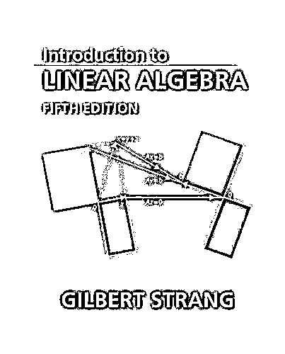
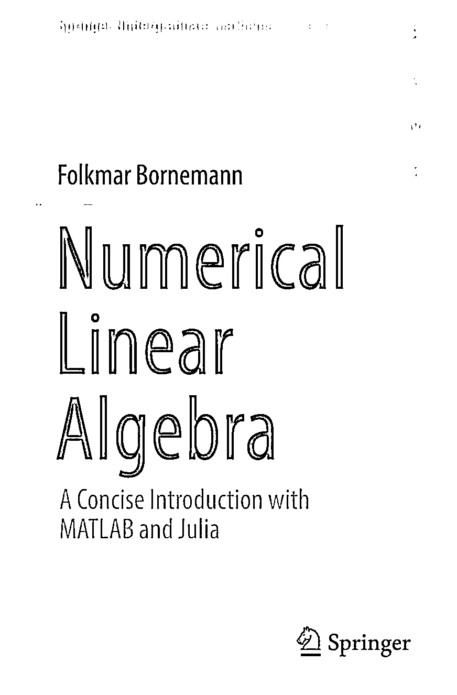

# 【顶级资源】掌握线性代数为机器学习打下坚实基础！

> 原文：[`mp.weixin.qq.com/s?__biz=MzAxNTc0Mjg0Mg==&mid=2653287475&idx=1&sn=39e41d221b8fca580825abea97b499a3&chksm=802e3626b759bf30d9bb761ad3fc02522531d746afa281e8a41a5da5df408e5b1610618397ce&scene=27#wechat_redirect`](http://mp.weixin.qq.com/s?__biz=MzAxNTc0Mjg0Mg==&mid=2653287475&idx=1&sn=39e41d221b8fca580825abea97b499a3&chksm=802e3626b759bf30d9bb761ad3fc02522531d746afa281e8a41a5da5df408e5b1610618397ce&scene=27#wechat_redirect)

**量化投资与机器学习**

为中国的量化投资事业贡献一份我们的力量!

 

开工大吉

线性代数是数学领域，也是机器学习领域重要的支柱。对于初学者来说，要想学好机器学习，线性代数的掌握是必不可少的，也可以说是十分十分重要的。

春节后的第一天，公众号特此为大家分享一份这样的顶级学习清单。希望大家在新的一年里，学业有成，事业更旺。同时也感谢大家对公众号一直以来的支持与厚爱！

**维基百科**

一些**高层次**的学习网页：

*   **线性代数**

https://en.wikipedia.org/wiki/Linear_algebra

*   **矩阵（数学）**

https://en.wikipedia.org/wiki/Matrix_(mathematics)

*   **矩阵分解**

https://en.wikipedia.org/wiki/Matrix_decomposition

*   **线性代数主题列表**

https://en.wikipedia.org/wiki/List_of_linear_algebra_topics

**书籍教程**

**所有书籍，编辑部费劲千辛万苦给大家都下载好了。**

**在文末获取。**

*   **Introduction to Linear Algebra, Fifth Edition, Gilbert Strang, 2016.**  

*   **Linear Algebra Done Right, Third Edition, 2015.**

*   **No Bullshit Guide To Linear Algebra, Ivan Savov, 2017.**

*   **Matrix Computations, Gene Golub and Charles Van Loan, 2012.**

*   **Numerical Linear Algebra with Applications: Using MATLAB.**

*   **Numerical Linear Algebra with Applications Using MATLAB.**

*   **Applied Multivariate Statistical Analysis, Richard Johnson and Dean Wichern, 2012.**

*   **Lin****ear Algebraand Its Applications David C. Lay, 2016.**

*   **ADVANCED LINEAR ALGEBRA NICHOLAS LOEHR, Virginia Polytechnic Institute and State University Blacksburg, USA, 2014.**

*   **Elementary Linear Algebra, 8e, Ron Larson, 2017.**

*   还有更多优秀的免费在线图书。 在维基百科上查看线性代数页面的末尾，可以看到更多的书籍列表。

https://en.wikipedia.org/wiki/Linear_algebra#Further_reading

**大学课程**

现在许多大学课程提供 PDF 版本的讲义幻灯片，笔记和阅读材料。 有些甚至提供预先录制的视频讲座，这是非常宝贵的。

美国顶尖学校推荐的一些课程包括：

*   **MIT 的线性代数——Gilbert Strang**

https://ocw.mit.edu/courses/mathematics/18-06-linear-algebra-spring-2010/index.htm

*   **The Matrix in Computer Science at Brown by Philip Klein**

http://cs.brown.edu/courses/cs053/current/index.htm

*   **Computational Linear Algebra for Coders at University of San Francisco by Rachel Thomas.**

https://github.com/fastai/numerical-linear-algebra/

**在线课程**

*   **Linear Algebra on Khan Academy**

https://www.khanacademy.org/math/linear-algebra

*   **Linear Algebra: Foundations to Frontiers on edX**

https://www.edx.org/course/laff-linear-algebra-foundations-to-frontiers

**问答平台**

考虑到当前有大量的问答平台，有很多地方可以在线提出有关线性代数的问题。

以下是推荐的最热门的平台，供大家参考学习：

*   **Linear Algebra tag on the Mathematics Stack Exchange**

https://math.stackexchange.com/?tags=linear-algebra

*   **Linear Algebra tag on Cross Validated**

https://stats.stackexchange.com/questions/tagged/linear-algebra

*   **Linear Algebra tag on Stack Overflow**

https://stackoverflow.com/questions/tagged/linear-algebra

*   **Linear Algebra on Quora**

https://www.quora.com/topic/Linear-Algebra

*   **Math Subreddit**

https://www.reddit.com/r/math/

**NumPy 资源**  

在 Python 中实现线性代数时，您可能需要 NumPy 的帮助。

*   **NumPy Reference**

https://docs.scipy.org/doc/numpy/reference/

*   **NumPy Array Creation Routines**

https://docs.scipy.org/doc/numpy/reference/routines.array-creation.html

*   **NumPy Array Manipulation Routines**

https://docs.scipy.org/doc/numpy/reference/routines.array-manipulation.html

*   **NumPy Linear Algebra**

https://docs.scipy.org/doc/numpy/reference/routines.linalg.html

*   **SciPy Linear Algebra**

https://docs.scipy.org/doc/scipy/reference/linalg.html

声明：本文来自 Jason Brownlee 和编辑部综合整理。未经允许，禁止转载！

**获取本文书籍教程**

**请在后台回复**

**线性代数**

**即可获取**

有些人不知道**后台回复**如何操作为大家介绍一下：

****