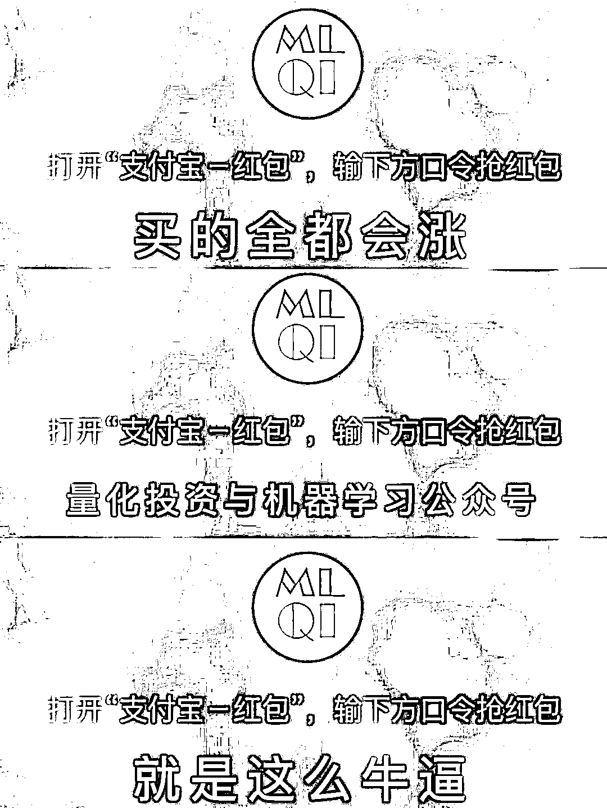

# 九百、个红包砸过来啦，新年最后一波福利！

> 原文：[`mp.weixin.qq.com/s?__biz=MzAxNTc0Mjg0Mg==&mid=2653287438&idx=1&sn=4ce9f4322fc121ad352442349bf147de&chksm=802e361bb759bf0dad4df8a89d414278e23de39389ce50b1dd2df17587534641a32a392e6e22&scene=27#wechat_redirect`](http://mp.weixin.qq.com/s?__biz=MzAxNTc0Mjg0Mg==&mid=2653287438&idx=1&sn=4ce9f4322fc121ad352442349bf147de&chksm=802e361bb759bf0dad4df8a89d414278e23de39389ce50b1dd2df17587534641a32a392e6e22&scene=27#wechat_redirect)

**量化投资与机器学习**

为中国的量化投资事业贡献一份我们的力量!

 

**祝大家新年快乐**

这是公众号创办以来综合**阅读量、分享量、收藏数、平台点击率**排名前十的文章。

通过这 10 篇文章，也是向所有读者传达一个我们的小目标：公众号一定会在量化投资结合机器学习领域做到最好。

谢谢你们的支持和厚爱！

（点击标题即可查看）

[01、Quantitative Finance 杂志关于量化交易领域排名前十的文章](https://mp.weixin.qq.com/s?__biz=MzAxNTc0Mjg0Mg==&mid=2653286500&idx=1&sn=106e28d25e413c816193005ef64c479d&chksm=802e3271b759bb67f5088e176153a51dc945abb373d7eabc5c089adb2ecdd207138bfb667631&scene=21#wechat_redirect)

[02、](https://mp.weixin.qq.com/s?__biz=MzAxNTc0Mjg0Mg==&mid=2653284689&idx=1&sn=ba9ccd0f98d5f9fc55bb64c280fbcf50&chksm=802e2b44b759a252f928f8a07b8ee74a601e8fe7ca8673eb26a7c52350ba311df74a99e30249&scene=21#wechat_redirect)[机器学习应用在量化投资中失败的 7 个主要原因](https://mp.weixin.qq.com/s?__biz=MzAxNTc0Mjg0Mg==&mid=2653286358&idx=1&sn=549e54a2a3b9607b18056463d90cd929&chksm=802e2dc3b759a4d5173bdb2f32801d79831cacf28d47c99f9c956fb42c039f6a23bb9cd98983&scene=21#wechat_redirect)

[03、通过 ML、Time Series 模型学习股价行为](https://mp.weixin.qq.com/s?__biz=MzAxNTc0Mjg0Mg==&mid=2653287197&idx=1&sn=9630389a52c7d0be4c1feaf3a534c2ce&chksm=802e3108b759b81ed11174f71b23fb73abe5c4ebad0f9d480b6efbd8f7e644de6b2232dc63fa&scene=21#wechat_redirect)

[04、](https://mp.weixin.qq.com/s?__biz=MzAxNTc0Mjg0Mg==&mid=2653286217&idx=1&sn=d0503692ce2090724b34ea0eb8ab94c5&chksm=802e2d5cb759a44a18ebde9a5b40e5ea626c1a01384459ccbdc406c1af67ad957a33a8de3dbb&scene=21#wechat_redirect)[CNN 预测股票走势基于 Tensorflow](https://mp.weixin.qq.com/s?__biz=MzAxNTc0Mjg0Mg==&mid=2653285128&idx=1&sn=fd4868634ce59b68809e7e4a3de80a21&chksm=802e291db759a00b734f2343936cb8339ddf6fbb5fcbd48c851e778cfcea04769ddc1aca894e&scene=21#wechat_redirect)

[05、精心解读关于 Jupyter Notebook 的 28 个技巧](https://mp.weixin.qq.com/s?__biz=MzAxNTc0Mjg0Mg==&mid=2653286936&idx=1&sn=17ebfb48f8541243953041b0c857ae5d&chksm=802e300db759b91bd4028d0cebe7f01ceb844c44a68067fbbf5312945b5b6f2b44830e606516&scene=21#wechat_redirect)

[06、](https://mp.weixin.qq.com/s?__biz=MzAxNTc0Mjg0Mg==&mid=2653286227&idx=1&sn=f9d88e74334ba4ae21930fa84949a2ee&chksm=802e2d46b759a4506c04618c2bfb11c0429e58d55ae7fbadcabc0c21e85451f85eee70e0bcee&scene=21#wechat_redirect)用 pandas 处理大数据节省 90%内存消耗

07、[最全 LSTM 在量化交易中的应用汇总](https://mp.weixin.qq.com/s?__biz=MzAxNTc0Mjg0Mg==&mid=2653286702&idx=1&sn=e4416e23c8b5ab7955a258e1077153e3&chksm=802e333bb759ba2dea0b46da08d0d7b6268090033d6af98b2f72b14909e2935c1e7fbe4bec69&scene=21#wechat_redirect)

[08、使用 RNN 预测股票价格系列一](https://mp.weixin.qq.com/s?__biz=MzAxNTc0Mjg0Mg==&mid=2653286558&idx=1&sn=25441578341bde783cf8190e877c55f1&chksm=802e328bb759bb9d28e420d783a61944adc1369c6371962d5ba55d7de13df1272ef7232313ec&scene=21#wechat_redirect)

[09、神经网络应用于算法交易](https://mp.weixin.qq.com/s?__biz=MzAxNTc0Mjg0Mg==&mid=2653286459&idx=1&sn=bade18dce9aeecf2815fc9d3000c39f1&chksm=802e322eb759bb380d7cba1d27a09d8aba096cfa9e972f4e2a68b4b44ec4a9537ba1393479cc&scene=21#wechat_redirect)

[10、高频交易（18 篇论文）+（15 本书籍）+（9 篇研报）](https://mp.weixin.qq.com/s?__biz=MzAxNTc0Mjg0Mg==&mid=2653285360&idx=1&sn=e90f550136b74dc8490a9d48886cdd71&chksm=802e29e5b759a0f3288d7c0434e46e2c7f116f21d056401de19df7b4aefda80434d6e509919c&scene=21#wechat_redirect)

**福利来啦**

**在支付宝口令红包输入**

**买的全都会涨**

**or**

**量化投资与机器学习公众号**

**or**

**就是这么牛逼**

共计送出**900**个红包

先到先得

**希望大家继续关注和支持公众号！**

**爱你们！**

