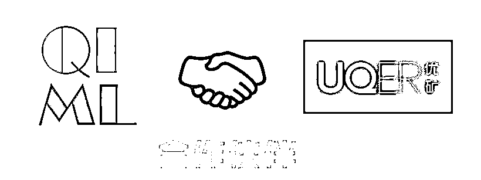
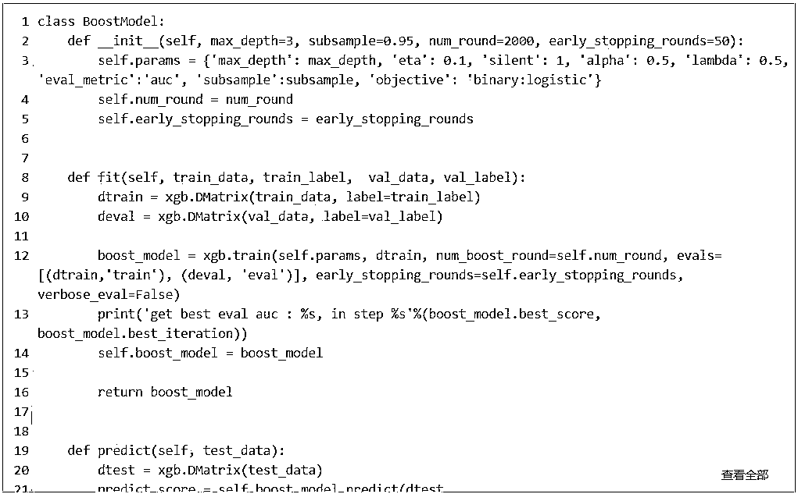

# 集成学习模型在选股方面的应用

> 原文：[`mp.weixin.qq.com/s?__biz=MzAxNTc0Mjg0Mg==&mid=2653287431&idx=1&sn=b2c19f7f2d865a9276c6180b7ca8640a&chksm=802e3612b759bf0478e885b73440e8d2e4db7236c444171bc70b843b21f727af82bb859b2cc2&scene=27#wechat_redirect`](http://mp.weixin.qq.com/s?__biz=MzAxNTc0Mjg0Mg==&mid=2653287431&idx=1&sn=b2c19f7f2d865a9276c6180b7ca8640a&chksm=802e3612b759bf0478e885b73440e8d2e4db7236c444171bc70b843b21f727af82bb859b2cc2&scene=27#wechat_redirect)

**量化投资与机器学习**

为中国的量化投资事业贡献一份我们的力量!

 

[**公众号新年超级福利**](https://mp.weixin.qq.com/s?__biz=MzAxNTc0Mjg0Mg==&mid=2653287427&idx=1&sn=e21745f19af074e66757db954e783d43&chksm=802e3616b759bf0000acb48458a0b567f36b7b473074f87d7c09e44d76664e7284b584abed50&scene=21#wechat_redirect)

**点我↑↑↑**

最近，人工智能引起了大家广泛的关注，其在图像识别，自然语言处理方向都做出了一些成果。该领域比较常用的模型有线性回归、树模型、SVM， 集成学习，深度学习模型(CNN, RNN)，以往大家在量化方面主要选取线性回归模型，其在解释因子收益方面比较直观，但这种做法会丧失一些非线性的特征关系。**本文主要考察集成学习在量化选股方面的运用，同上述研报一样，主要采用集成学习中的 boosting 方法， 选取了 xgboost 作为训练框架，对选取的因子进行合成，最终考察该合成因子的选股效果。**

（完整版代码请点击“**阅读原文**”获取）

1**数据准备**

本文选取了优矿的 70 个因子，提取股票每个月末的因子暴露作为训练输入特征。读者也可以选取自己感兴趣的因子作为基础因子。特征按照研报中所描述做中位数去极值，缺失值处理，标准化等，该处理后的数据作为模型输入特征。同时在每个月末截面期，选取下月收益排名前 30%的股票作为正例（𝑦=1），后 30%的股票作为负例（𝑦=−1）。利用 xgboost 进行分类预测。由于处理数据源代码过长，这里不做展示，且该部分也不具备参考价值，读者可根据自己常用特征处理习惯进行处理。

2 模型训练

为了能让模型及时抓取到市场的变化，我们采用了七个阶段滚动回测方法。模型训练区间为 20070101 至 20171231，按年份分为 7 个子区间，因此需要对每个子回测的不同训练集重复训练。每次训练完模型的测试必须选用训练样本外的数据，一般测试样本选取一年的数据，训练样本选取不超过 6 年的历史数据，因为优矿只提供 07 年后的数据，所以初始的几个样本不足 7 年。比如第一阶段选取 07-10 的数据为训练样本，11 年为测试样本；第二阶段选取 07-11 的数据作为训练样本，12 年为测试样本…以此内推，最后一个阶段为 11-16 的数据为训练样本，17 年为测试样本。另外模型在训练中，输入数据按照 90%与 10%的比例拆成训练集与验证集。训练中，保存在验证集上效果最好的模型。模型中参数可调，读者可更换一些参数，查看结果变更。

3**模型结果分析**

上述信息只展示了模型验证集上的效果，现在让我们来查看一下样本外的准确率如何。可以看到 7 个阶段的平均准确率在 57%左右，评价 AUC 在 60%左右。

同时，我们也可以查看特征的重要性，可以直观感受哪些因子的影响比较重要。首先统计各个年份的特征排序，排序范围 1~70，1 为影响最弱，70 为影响最强。最后求出均值。以下表格列出了排名前 10 和排名后 10 的因子名称，查看优矿因子文档，知道 Aroon(动量因子)，Hurst(赫斯特指数, 技术指标类因子), ChaikinOscillator(佳庆指标, 技术指标类因子), LCAP(对数市值), REVS20(动量类因子)在模型分类中表现最为重要。这里需要注意的是，很多因子之间本身有相关性，所以表现好坏并不能作为该因子的唯一判断标准。

4**因子回测**

上述模型在测试的时候，为每个股票打了一个分数，可以认为是将输入的 70 个因子转换成了一个集成的“因子”，现在让我们来检测这个非线性输出的因子回测效果如何。本文选取了中证 500 作为基准，并分为 5 组查看每类效果。回测框架参考优矿 API 文档 中 quick_backtest 参数优化，画图参考之前社区贴凤鸣朝阳 - 股价日内模式分析。

可以从上图看到 1-5 组有明显单调关系，可以说明该因子有一定的选股能力。上述一些输入仅作参考，读者可以根据自己需要更改模型输入基础因子，模型训练参数及框架，来进行因子回测。

参考：

1、凤鸣朝阳 - 股价日内模式分析；

2、华泰证券 《人工智能选股之 Boosting 模型》研报；

****