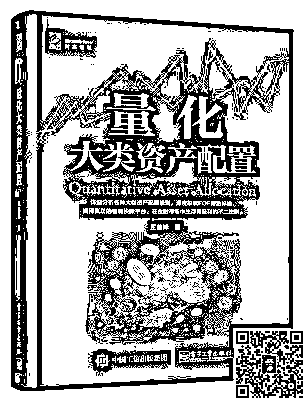

# 【重磅】公众号新年福利，不容错过！！！

> 原文：[`mp.weixin.qq.com/s?__biz=MzAxNTc0Mjg0Mg==&mid=2653287427&idx=1&sn=e21745f19af074e66757db954e783d43&chksm=802e3616b759bf0000acb48458a0b567f36b7b473074f87d7c09e44d76664e7284b584abed50&scene=27#wechat_redirect`](http://mp.weixin.qq.com/s?__biz=MzAxNTc0Mjg0Mg==&mid=2653287427&idx=1&sn=e21745f19af074e66757db954e783d43&chksm=802e3616b759bf0000acb48458a0b567f36b7b473074f87d7c09e44d76664e7284b584abed50&scene=27#wechat_redirect)

**量化投资与机器学习**

为中国的量化投资事业贡献一份我们的力量!

 

还有几天，就是农历新年啦

想必大家现在也陆陆续续在归家的路上 

今天

量化投资与机器学习公众号

特地为一直以来关注公众号的读者奉上

**一份新年礼物**

谢谢你们对公众号的厚爱和支持！

礼轻情意重

**福利一**

**15 本****量化投资、机器学习、数据科学类书籍**

感谢博文视点 Broadview 对本次活动的大力赞助

**免费送**

《量化大类资产配置》跳出单纯的选股策略，用量化的方式进行大类资产配置，从大类资产配置的角度详细介绍战略资产配置策略和战术资产配置策略，并介绍了多个在中国市场上行之有效、收益率稳健的资产配置模型，角度新颖、实操性强。同时对各种大类资产从长期收益的角度进行了介绍，如中国的股票、债券、分级基金、REITs 以及美国的各种新兴资产等，为投资者建立理性的投资理念提供了较强的依据。在最后，对目前学术界前沿的在线投资组合理论及其业绩表现进行了介绍和展望。

这是一本跟数据科学和数据科学家有关的“手册”，它还包含传统统计学、编程或计算机科学教科书中所没有的信息。《数据天才：数据科学家修炼之道》有 3 个组成部分：一是多层次地讨论数据科学是什么，以及数据科学涉及哪些其他学科；二是数据科学的技术应用层面，包括教程和案例研究；三是给正在从业和有抱负的数据科学家介绍一些职业资源。本书中有很多职业和培训相关资源（如数据集、网络爬虫源代码、数据视频和如何编写 API），所以借助本书，你现在就可以开始数据科学实践，并快速地提升你的职业水平。

TensorFlow 是谷歌 2015 年开源的主流深度学习框架，目前已得到广泛应用。《TensorFlow：实战 Google 深度学习框架（第 2 版）》为 TensorFlow 入门参考书，旨在帮助读者以快速、有效的方式上手 TensorFlow 和深度学习。书中省略了烦琐的数学模型推导，从实际应用问题出发，通过具体的 TensorFlow 示例介绍如何使用深度学习解决实际问题。书中包含深度学习的入门知识和大量实践经验，是走进这个前沿、热门的人工智能领域的优选参考书。第 2 版将书中所有示例代码从 TensorFlow0.9.0 升级到了 TensorFlow 1.4.0。在升级 API 的同时，第 2 版也补充了更多只有 TensorFlow 1.4.0 才支持的功能。另外，第 2 版还新增两章分别介绍 TensorFlow 高层封装和深度学习在自然语言领域应用的内容。

《深入浅出强化学习：原理入门》用通俗易懂的语言深入浅出地介绍了强化学习的基本原理，覆盖了传统的强化学习基本方法和当前炙手可热的深度强化学习方法。开篇从最基本的马尔科夫决策过程入手，将强化学习问题纳入到严谨的数学框架中，接着阐述了解决此类问题最基本的方法——动态规划方法，并从中总结出解决强化学习问题的基本思路：交互迭代策略评估和策略改善。基于这个思路，分别介绍了基于值函数的强化学习方法和基于直接策略搜索的强化学习方法。最后介绍了逆向强化学习方法和近年具有代表性、比较前沿的强化学习方法。除了系统地介绍基本理论，书中还介绍了相应的数学基础和编程实例。

《深度学习入门之 PyTorch》深度学习如今已经成为科技领域最炙手可热的技术，在本书中，我们将帮助你入门深度学习。本书将从机器学习和深度学习的基础理论入手，从零开始学习 PyTorch，了解 PyTorch 基础，以及如何用 PyTorch 框架搭建模型。通过阅读本书，你将学到机器学习中的线性回归和 Logistic 回归、深度学习的优化方法、多层全连接神经网络、卷积神经网络、循环神经网络，以及生成对抗网络，最后通过实战了解深度学习前沿的研究成果，以及 PyTorch 在实际项目中的应用。本书将理论和代码相结合，帮助读者更好地入门深度学习，适合任何对深度学习感兴趣的人阅读。

**福利二**

**2018 年全年券商金工研报独家推送**

我们会每月定时发送到用户指定邮箱

**福利三**

**2018 年半年券商金工研报独家推送**

我们会每月定时发送到用户指定邮箱

“为了避免部分用户刷流量等手段

这次我们全程采取电脑随机抽取”

还在等什么

赶紧扫下方二维码抽奖吧！

**中奖后请记得填写个人信息**

**方便我们寄出福利**