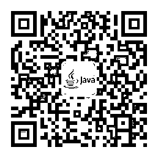

# 高手过招，岂能没有如此之利器？

> 原文：[`mp.weixin.qq.com/s?__biz=MzAxNTc0Mjg0Mg==&mid=2653287415&idx=1&sn=6b90630fba6f672fa445cea7874b1add&chksm=802e31e2b759b8f42961f9a3a6237dcf5bf21555fb004d427d870ee668438235e660166dea54&scene=27#wechat_redirect`](http://mp.weixin.qq.com/s?__biz=MzAxNTc0Mjg0Mg==&mid=2653287415&idx=1&sn=6b90630fba6f672fa445cea7874b1add&chksm=802e31e2b759b8f42961f9a3a6237dcf5bf21555fb004d427d870ee668438235e660166dea54&scene=27#wechat_redirect)

**工欲善其事**

**必先利其器**

今天，在这里为大家甄选了几个高质量的技术公众号。告别枯燥的理论，从及时资讯、一线技术、实用案例、职业发展等多方位分享实操性强、可落地的内容和学习方法。

新的一年，愿您的每一份努力都有回报！

1

**机器学习与自然语言处理**

机器学习算法与自然语言处理，一个哈工大 nlp 在读博士的技术提升之路，为您提供一系列我在学习路上的笔记，经验以及感悟，让您的碎片化时间最大价值化。力争通俗易懂，保证原创干货！自然语言处理领域排名第一，机器学习算法领域排名第一。机器学习算法与自然语言处理公号和你一起进步成长

▲长按二维码，识别后关注

2

**Java 后端技术**

专注 Java 相关技术：SSM、Spring 全家桶、微服务、MySQL、MyCat、集群、分布式、中间件、Linux、网络、多线程，偶尔讲点运维 Jenkins、Nexus、Docker、ELK，偶尔分享些技术干货，致力于 Java 全栈开发！

▲长按二维码，识别后关注

3

**架构文摘**

每天一篇架构领域重磅好文，涉及一线互联网公司的互联网应用架构、大数据、机器学习等各个热门领域。

▲长按二维码，识别后关注

4

**量化投资与机器学习**

作为微信全网量化&量化投资、机器学习关键字搜索排名第一，第三的技术类公众号。编辑部汇集了一群来自清华、北大、复旦、人大、中科大、上交、华中科技大、同济、武大、北邮、川大、上财、东财、央财、西财、中大、暨大、华师、华工、LSE、NUS 等海内外优秀院校毕业的博士、硕士和相关研究从业人员。为大家带来关于量化投资和机器学习相关的知识和干货。版块语言分为：Python 、MATLAB 、R 。涉及领域有：量化投资，机器学习，人工智能。

▲长按二维码，识别后关注

5

**程序猿 DD**

简介：作者翟永超 ，《Spring Cloud 微服务实战》作者，SpringCloud 中文社区创始人(springcloud.com.cn)，Spring4All 社区联合发起人（spring4all.com），专注于微服务架构与敏捷管理。

▲长按二维码，识别后关注

**6**

**Python 那些事**

人生苦短，我用 Python。Python 越来越受广大程序员的喜爱。「Python 那些事」致力于做最好的 Python 公众号，只为爱 Python 的你！公众号主要分享 Python 开发相关的技术文章、面试算法、工具资源和热门教程等。

▲长按二维码，识别后关注

**7**

**程序 IT 圈**

程序 IT 圈，一个专注于学习编程技术和 IT 技巧的公众号，面向所有计算机编程的爱好者，在这里你可以学到很多不一样的技术 。另外，每个月公众号会给读者争取送书福利活动 。欢迎长期关注，老铁！

▲长按二维码，识别后关注

8

**杨守乐**

作者：小乐，专注于编程、互联网动态。最终将总结的技术、心得、经验分享给大家。这里不只限于技术，还有职场心得、生活感悟、以及面经。

提升技能是一条慢长而艰苦的道路，不能靠一时激情，也不是熬几天几夜就能学好的，必须养成平时努力学习的习惯。所以: 贵在坚持！

▲长按二维码，识别后关注

9

**程序视界**

程序视界，《程序员的成长课》作者安晓辉的个人公众号，聚焦职场思维，职业适应、选择、发展、技能 Get，助力你的职业成长。

▲长按二维码，识别后关注

10

**码农有道**

码农有道，一个百度人的技术提升之路，为您提供一系列系统架构、数据结构、网络、C++、计算机底层等高质量技术文章，让您的碎片化时间最大价值化。同时会不定期分享精品免费视频和资源，让您的技术之路不再单调枯燥。

▲长按二维码，识别后关注

11

**Java 技术人**

「Java 技术人」专注于 Java 技术分享的公众号。分享 Java 开发相关的技术文章、源码剖析、架构设计、面试算法、工具资源和热门教程等。如果你在学习 Java，这个公众号一定能帮到你。

▲长按二维码，识别后关注

如果您觉得不错，可以转给有需要的朋友，非常感谢！