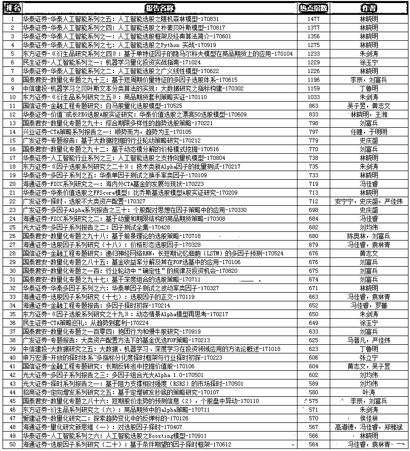
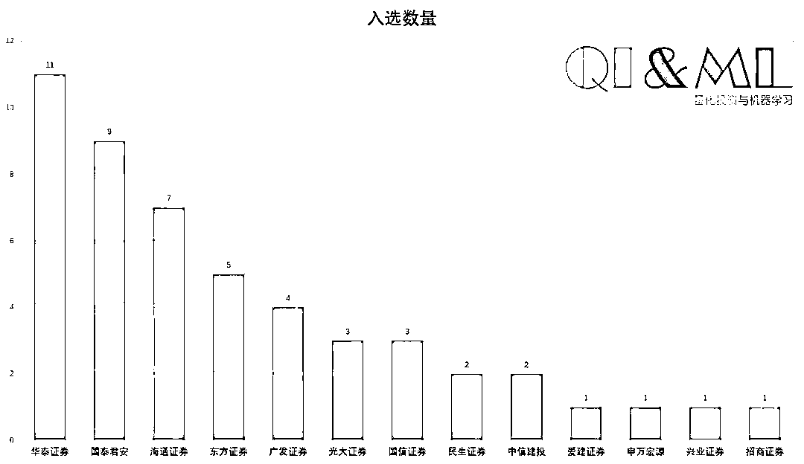
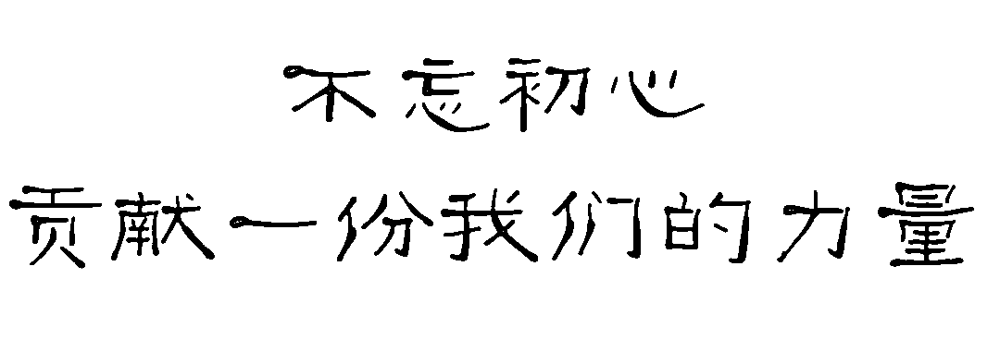

# 请收下这份榜单：2017 年最热门的 50 篇券商金工研报（附下载）

> 原文：[`mp.weixin.qq.com/s?__biz=MzAxNTc0Mjg0Mg==&mid=2653287411&idx=1&sn=f1151b0ad87f5b45e99aca7ddf1f412e&chksm=802e31e6b759b8f064653deee672eb2fb6d73e4743a077b3456659e1f9b58c7cfe8e3ff1271b&scene=27#wechat_redirect`](http://mp.weixin.qq.com/s?__biz=MzAxNTc0Mjg0Mg==&mid=2653287411&idx=1&sn=f1151b0ad87f5b45e99aca7ddf1f412e&chksm=802e31e6b759b8f064653deee672eb2fb6d73e4743a077b3456659e1f9b58c7cfe8e3ff1271b&scene=27#wechat_redirect)

**量化投资与机器学习**

为中国的量化投资事业贡献一份我们的力量!

 

还有几天就要过年啦！在此，公众号特地为大家准备了第一份新年礼物。

回顾 2017 年，公众号分享了全年所有券商的金工研报（[**这里下载**](https://mp.weixin.qq.com/s?__biz=MzAxNTc0Mjg0Mg==&mid=2653287361&idx=1&sn=b659d13209d14bfc2cc9865ca1c42042&chksm=802e31d4b759b8c2548c5f128f0a7b6d59dbc3a89b2f8f49fcdf197736ad2cb1c25182928e51&scene=21#wechat_redirect)），但是在这么多的研报中，最受大家喜爱，排名靠前的是哪些呢？想必大家可能不是很了解。

今天，公众号就为大家公布：**2017 年最热门的 50 篇券商金工研报**。让我们一睹为快吧！（数据来源于多方媒体）

我们对前 50 名做了简单的统计，排在前三的是：

**1、华泰证券**

**2、国泰君安**

**3、海通证券**

其他券商统计如下：

具体的文章，大家在过去一年的研报里，自行去找吧。多动手哦！

**棒**福利时间**金融工程研报汇总**

01. [各大券商研金融工程报告（1）](http://mp.weixin.qq.com/s?__biz=MzAxNTc0Mjg0Mg==&mid=2653283257&idx=2&sn=49c78925e7f3535b9cad95bf91574519&scene=21#wechat_redirect)

02. [各大券商研](http://mp.weixin.qq.com/s?__biz=MzAxNTc0Mjg0Mg==&mid=2653283773&idx=1&sn=d4604682da0c5563be9da16717d11bf9&scene=21#wechat_redirect)[金融工程报告](http://mp.weixin.qq.com/s?__biz=MzAxNTc0Mjg0Mg==&mid=2653283257&idx=2&sn=49c78925e7f3535b9cad95bf91574519&scene=21#wechat_redirect)（2）

03. [【海通证券】 研报大放送（百篇）](http://mp.weixin.qq.com/s?__biz=MzAxNTc0Mjg0Mg==&mid=2653284202&idx=1&sn=f94bdefe70ddcb538ca463ba1c5e5205&chksm=802e257fb759ac69899d8544937600c22637697591fce25d1ed1b72414d975eeeba7cc58c9d8&scene=21#wechat_redirect)

04. [【广发证券】 研报大放送（最全）](http://mp.weixin.qq.com/s?__biz=MzAxNTc0Mjg0Mg==&mid=2653284199&idx=1&sn=4ec9cac078f8057744349c9c953decb2&chksm=802e2572b759ac6438362451289132ab4bb631da5b41e9f2b2545eb5efe50e0d14d6bd3d3015&scene=21#wechat_redirect)

05. [【国泰君安】 研报大放送（精华）](http://mp.weixin.qq.com/s?__biz=MzAxNTc0Mjg0Mg==&mid=2653284196&idx=1&sn=85245caf9148fb965df1c56c963984ba&chksm=802e2571b759ac6772582aea40781bddd6f148f144edc9b8b08606749f3c2c012b907441d59d&scene=21#wechat_redirect)

06. [2016 年金工报告（共 600 篇）- 第 1 部分](http://mp.weixin.qq.com/s?__biz=MzAxNTc0Mjg0Mg==&mid=2653284668&idx=1&sn=1d099b61ac8a378f39ef99203cfb85af&chksm=802e2b29b759a23f1ce824e84ab55601f8da41ace7877cac3fe97900f1a7147c97a732481841&scene=21#wechat_redirect)

07. [2016 年金工报告（共 600 篇）- 第 2-4 部分](http://mp.weixin.qq.com/s?__biz=MzAxNTc0Mjg0Mg==&mid=2653284678&idx=1&sn=0c29d884ada86f565b5849057fe5cdb6&chksm=802e2b53b759a245db87fe77c211e8f987464d0d188305808b412fb2d36cbc9f4bb707fedde9&scene=21#wechat_redirect)

08. [2016 年金工报告（共 600 篇）- 第 5-9 部分](http://mp.weixin.qq.com/s?__biz=MzAxNTc0Mjg0Mg==&mid=2653284702&idx=1&sn=c150e541adb6f852459b085a086bf97f&chksm=802e2b4bb759a25de30c981d25e8db6c90e409e0c8ec5303ad0b3fa673abfc01fd4832842c16&scene=21#wechat_redirect)

[09\. 2017 年 1-3 月](https://mp.weixin.qq.com/s?__biz=MzAxNTc0Mjg0Mg==&mid=2653286032&idx=1&sn=f931e3de55ba425049553d524173b57e&chksm=802e2c85b759a5935002ab01161a92be5ba6c7a5ba64ad12d8be55490fa328973835008ab2dc&scene=21#wechat_redirect)[全部券商金工研报汇总](https://mp.weixin.qq.com/s?__biz=MzAxNTc0Mjg0Mg==&mid=2653286133&idx=1&sn=c8ef7e2df827698971c71c270ec08a65&chksm=802e2ce0b759a5f63de0fb7f635e8959c4f25a5c761d165a0a2312d08e48e48e408dde572642&scene=21#wechat_redirect)

[10\.](https://mp.weixin.qq.com/s?__biz=MzAxNTc0Mjg0Mg==&mid=2653286039&idx=2&sn=b6fda2baaff0af634531e3d2928755e0&chksm=802e2c82b759a59496553894c6e3a90e8a47622a228276d61c6c84a3b593b8a81e989926fb5c&scene=21#wechat_redirect) [2017 年 4-6 月](https://mp.weixin.qq.com/s?__biz=MzAxNTc0Mjg0Mg==&mid=2653286032&idx=1&sn=f931e3de55ba425049553d524173b57e&chksm=802e2c85b759a5935002ab01161a92be5ba6c7a5ba64ad12d8be55490fa328973835008ab2dc&scene=21#wechat_redirect)[全部券商金工研报汇总](https://mp.weixin.qq.com/s?__biz=MzAxNTc0Mjg0Mg==&mid=2653286133&idx=1&sn=c8ef7e2df827698971c71c270ec08a65&chksm=802e2ce0b759a5f63de0fb7f635e8959c4f25a5c761d165a0a2312d08e48e48e408dde572642&scene=21#wechat_redirect)

[11\. 2017 年 7 月全部券商金工研报汇总](https://mp.weixin.qq.com/s?__biz=MzAxNTc0Mjg0Mg==&mid=2653286133&idx=1&sn=c8ef7e2df827698971c71c270ec08a65&chksm=802e2ce0b759a5f63de0fb7f635e8959c4f25a5c761d165a0a2312d08e48e48e408dde572642&scene=21#wechat_redirect)

[12\. 2017 年 8 月全部券商金工研报汇总](https://mp.weixin.qq.com/s?__biz=MzAxNTc0Mjg0Mg==&mid=2653286262&idx=1&sn=8fe879fc4a5189cf027b7496da82681f&chksm=802e2d63b759a47535c7a0dfe279672f10821edcdeb49c6f099a7388feef39e8faeb2aaf30e3&scene=21#wechat_redirect)

[13 .2017 年 9 月全部券商金工研报汇总](https://mp.weixin.qq.com/s?__biz=MzAxNTc0Mjg0Mg==&mid=2653286383&idx=1&sn=7c6b9f54ee5727ede261042510daa401&chksm=802e2dfab759a4ec6a3eb346d6e27fceae852aefae361bd93320ba4ffab7a2859899b28ace19&scene=21#wechat_redirect)

[14\. 2017 年 10 月全部券商金工研报汇总](https://mp.weixin.qq.com/s?__biz=MzAxNTc0Mjg0Mg==&mid=2653286510&idx=1&sn=b64aab20dc1ba2e56776aa34090d361d&chksm=802e327bb759bb6d558caf6a2aaf4e86bfaf31a3558573f58c7f5f24d1526756ec0ac1d3a820&scene=21#wechat_redirect)

[15\. 2017 年 11 月全部券商金工研报汇总](https://mp.weixin.qq.com/s?__biz=MzAxNTc0Mjg0Mg==&mid=2653286772&idx=1&sn=f8ca457e87587ed73aa3d81903336db5&chksm=802e3361b759ba7775e1879e1c8a0b9b917d9ff43649e68c85b17b434d516acfc0ec758968a7&scene=21#wechat_redirect)

[16\. 2017 年 12 月全部券商金工研报汇总](https://mp.weixin.qq.com/s?__biz=MzAxNTc0Mjg0Mg==&mid=2653287361&idx=1&sn=b659d13209d14bfc2cc9865ca1c42042&chksm=802e31d4b759b8c2548c5f128f0a7b6d59dbc3a89b2f8f49fcdf197736ad2cb1c25182928e51&scene=21#wechat_redirect)

