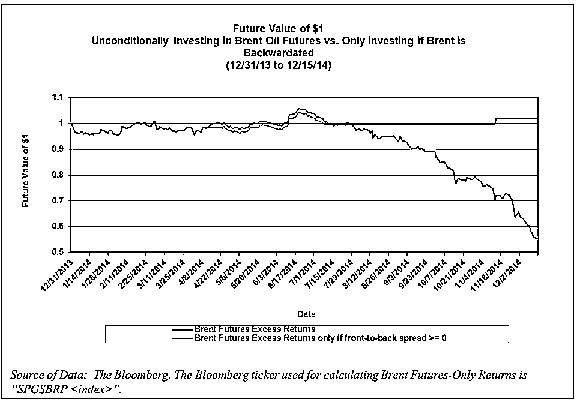
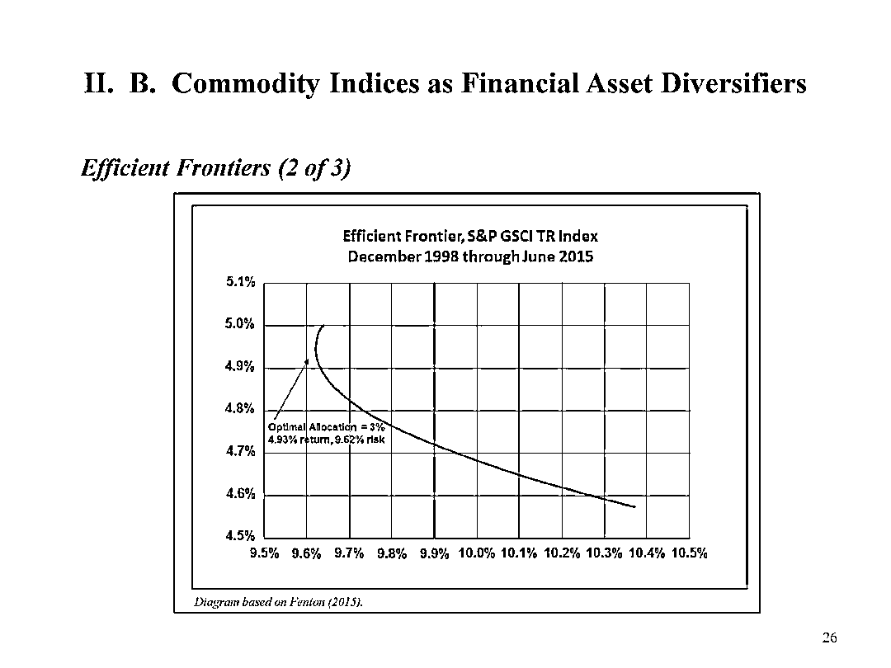
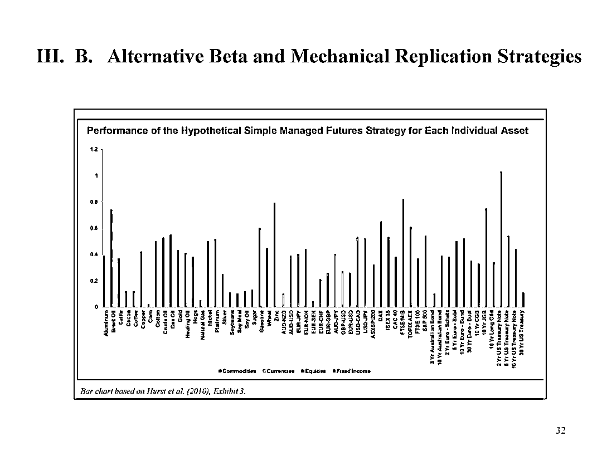

# CTA 和商品指数的收益来源是什么？【CTA 系列一】

> 原文：[`mp.weixin.qq.com/s?__biz=MzAxNTc0Mjg0Mg==&mid=2653287402&idx=1&sn=71183cc3c13a8f5c6c051356ec415711&chksm=802e31ffb759b8e9c261d98aa350923e06a10fe7a6a1904759cf32a9b8f12b734918f4d597b6&scene=27#wechat_redirect`](http://mp.weixin.qq.com/s?__biz=MzAxNTc0Mjg0Mg==&mid=2653287402&idx=1&sn=71183cc3c13a8f5c6c051356ec415711&chksm=802e31ffb759b8e9c261d98aa350923e06a10fe7a6a1904759cf32a9b8f12b734918f4d597b6&scene=27#wechat_redirect)

**量化投资与机器学习**

为中国的量化投资事业贡献一份我们的力量!

 

**分享一篇近期看到的文章****来自**

University of Illinois Urbana-Champaign

Ms. Hilary Till

Research Associate, EDHEC-Risk Institute;

Solich Scholar, J.P. Morgan Center for Commodities,

University of Colorado Denver Business School; and

Principal, Premia Capital Management, LLC

**1、回报来源**

**动量**

趋势跟踪是 CTA 中的主导风格。

“Although there are two basic types of CTA’s, discretionary and trend-following, the investment category is dominated by trend-followers. 

趋势跟踪者也被称为 systematic 交易者。 

自动化程序使用各种技术因素来筛选市场，以确定不同时间范围内趋势的开始或结束。

假设从 1903 年 1 月到 2012 年 6 月在不同资产类别和时间范围内的表现：

“动量在 1927 年至 2012 年之间获得了异常高的风险调整回报分别在 1927 年至 2012 和 1867 年至 1907 年之间。

然而，动量策略也使投资者在两个时期都蒙受巨大的亏损。

动量的亏损是可以预测的，当动量近期表现良好（两个时期），利率相对较低（1867-1907），或近期表现优于股票市场（1927-2012），借贷或吸引“blind capital”会更加容易。

**滚动收益（roll yield）**

**1、Across Asset Classes**

在 backwardation（期货价格低于现货价格）时，多头滚动收益为 positive，在 contango（期货价格高于现货价格）是，多头滚动收益为 negative。

**2、Agricultural Futures Contracts（农产品）**

我们可以研究期货合约结构曲线形状随时间的变化，对那些历史悠久的合约的影响。 在 50 多年的时间范围内，三种农产品期货合约的回报与其曲线形状在时间上呈线性关系：这一结果在五年间间隔内才显现出来。

**3、Roll Yield and Commodities（商品期货）**

“如果现货价格高于期货价格，或者近期合约价格高于更远期的合约价格。 In this case, if an index is long the nearby contract and will roll into more distant contracts when the nearby is about to expire, the roll return will be positive.

**4、Roll Yield and Crude Oil（原油）**

**再平衡溢价**

