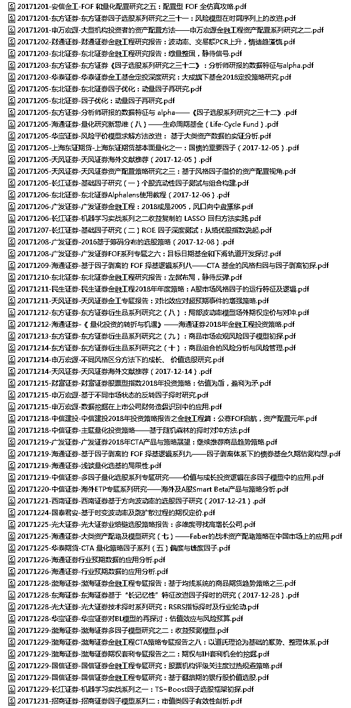
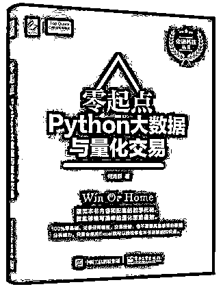

# 【每月系列】2017 年 12 月全部券商金融工程研报汇总（第十一期免费赠书活动来啦！）

> 原文：[`mp.weixin.qq.com/s?__biz=MzAxNTc0Mjg0Mg==&mid=2653287361&idx=1&sn=b659d13209d14bfc2cc9865ca1c42042&chksm=802e31d4b759b8c2548c5f128f0a7b6d59dbc3a89b2f8f49fcdf197736ad2cb1c25182928e51&scene=27#wechat_redirect`](http://mp.weixin.qq.com/s?__biz=MzAxNTc0Mjg0Mg==&mid=2653287361&idx=1&sn=b659d13209d14bfc2cc9865ca1c42042&chksm=802e31d4b759b8c2548c5f128f0a7b6d59dbc3a89b2f8f49fcdf197736ad2cb1c25182928e51&scene=27#wechat_redirect)

**量化投资与机器学习**

为中国的量化投资事业贡献一份我们的力量!

 

各位读者：

很抱歉，这么晚才把 2017 年 12 月的研报资源推送出来。

从 2018 年开始，公众号编辑部会暂停推送**【每月研报系列】**了。主要原因是不想给部分公众号做嫁衣，让其拿去以收费、转发等各种手段方式获取该资源。

我们可能会想一些其他办法，但在近期此系列正式宣告暂停！

给各位读者造成的不便，还请谅解！

**往期**

点击标题即可下载

[**2017 年 1-3 月所有券商金工研究报告**](https://mp.weixin.qq.com/s?__biz=MzAxNTc0Mjg0Mg==&mid=2653286032&idx=1&sn=f931e3de55ba425049553d524173b57e&chksm=802e2c85b759a5935002ab01161a92be5ba6c7a5ba64ad12d8be55490fa328973835008ab2dc&scene=21#wechat_redirect)

[**2017 年 4-6 月所有券商金工研究报告**](https://mp.weixin.qq.com/s?__biz=MzAxNTc0Mjg0Mg==&mid=2653286039&idx=2&sn=b6fda2baaff0af634531e3d2928755e0&chksm=802e2c82b759a59496553894c6e3a90e8a47622a228276d61c6c84a3b593b8a81e989926fb5c&scene=21#wechat_redirect)

[**2017 年 07 月所有券商金工研究报告**](https://mp.weixin.qq.com/s?__biz=MzAxNTc0Mjg0Mg==&mid=2653286133&idx=1&sn=c8ef7e2df827698971c71c270ec08a65&chksm=802e2ce0b759a5f63de0fb7f635e8959c4f25a5c761d165a0a2312d08e48e48e408dde572642&scene=21#wechat_redirect)

**[2017 年 08 月所有券商金工研究报告](https://mp.weixin.qq.com/s?__biz=MzAxNTc0Mjg0Mg==&mid=2653286262&idx=1&sn=8fe879fc4a5189cf027b7496da82681f&chksm=802e2d63b759a47535c7a0dfe279672f10821edcdeb49c6f099a7388feef39e8faeb2aaf30e3&scene=21#wechat_redirect)**

**[2017 年 09 月所有券商金工研究报告](https://mp.weixin.qq.com/s?__biz=MzAxNTc0Mjg0Mg==&mid=2653286383&idx=1&sn=7c6b9f54ee5727ede261042510daa401&chksm=802e2dfab759a4ec6a3eb346d6e27fceae852aefae361bd93320ba4ffab7a2859899b28ace19&scene=21#wechat_redirect)**

[**2017 年 10 月所有券商金工研究报告**](https://mp.weixin.qq.com/s?__biz=MzAxNTc0Mjg0Mg==&mid=2653286510&idx=1&sn=b64aab20dc1ba2e56776aa34090d361d&chksm=802e327bb759bb6d558caf6a2aaf4e86bfaf31a3558573f58c7f5f24d1526756ec0ac1d3a820&scene=21#wechat_redirect)

[**2017 年 11 月所有券商金工研究报告**](https://mp.weixin.qq.com/s?__biz=MzAxNTc0Mjg0Mg==&mid=2653286772&idx=1&sn=f8ca457e87587ed73aa3d81903336db5&chksm=802e3361b759ba7775e1879e1c8a0b9b917d9ff43649e68c85b17b434d516acfc0ec758968a7&scene=21#wechat_redirect)

**研报系列（12 月）**

**获取以上研报**

**请在后台回复**

**研报 12 月**

**即可获取**

有些人不知道**后台回复**如何操作

为大家介绍一下：

**赠书活动**

量化投资与机器学习公众号联合博文视点 Broadview 送出**5 本****《零起点 Python 大数据与量化交易》**

> 《零起点 Python 大数据与量化交易》是国内较早关于 Python 大数据与量化交易的原创图书，配合 zwPython 开发平台和 zwQuant 开源量化软件学习，是一套完整的大数据分析、量化交易的学习教材，可直接用于实盘交易。《零起点 Python 大数据与量化交易》有三大特色：第一，以实盘个案分析为主，全程配有 Python 代码；第二，包含大量的图文案例和 Python 源码，无须专业编程基础，懂 Excel 即可开始学习；第三，配有专业的 zwPython 集成开发平台、zwQuant 量化软件和 zwDat 数据包。《零起点 Python 大数据与量化交易》内容源自笔者的原版教学课件，虽然限于篇幅和载体，省略了视频和部分环节，但核心内容都有保留，配套的近百套 Python 教学程序没有进行任何删减。考虑到广大入门读者的需求，笔者在各个核心函数环节增添了函数流程图。

**原价：99.00 元**

**截止 2018.02.07 12:00**

大家在本篇推文【写留言】处发表留言，**获得点赞数前五的读者，即可免费获赠此书**。届时，工作人员会联系五位读者，寄出此书。

**最后最后最后**

公众号的官方微博

@**宽客的后花园**

**为全网宽客而生，一网打尽海外量化资源**

赶紧去**关注**吧！

****

点击**阅读原文**，即可关注！