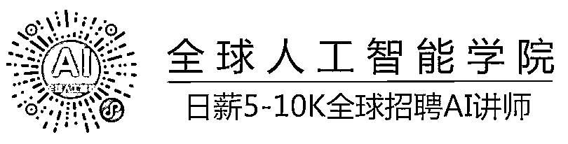
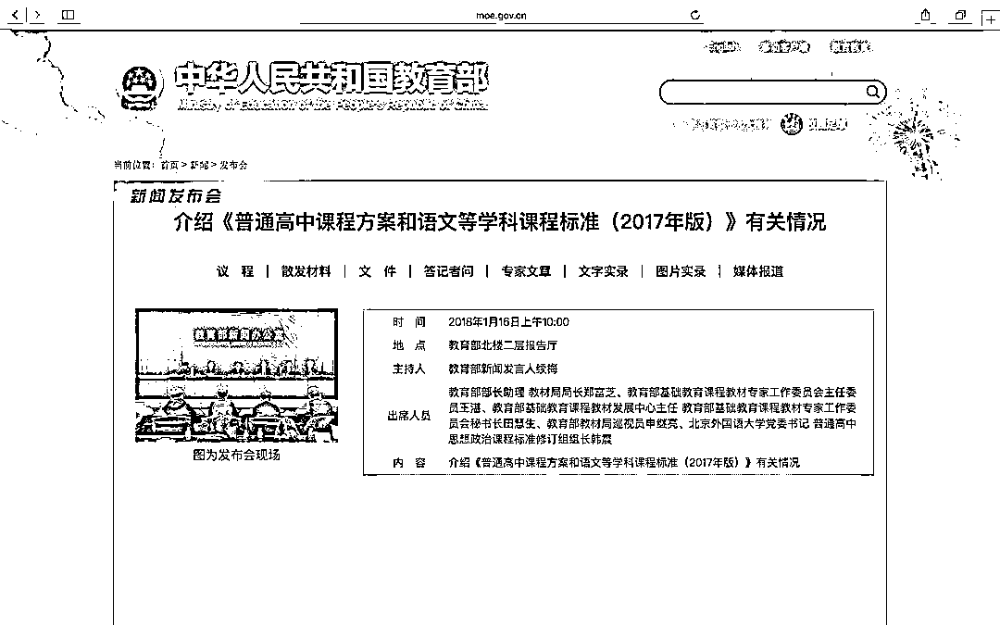
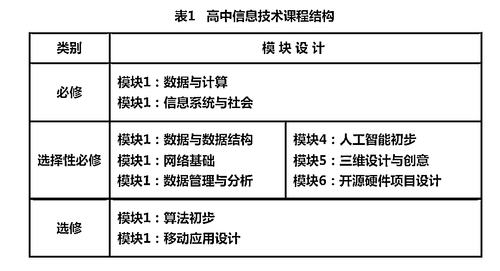
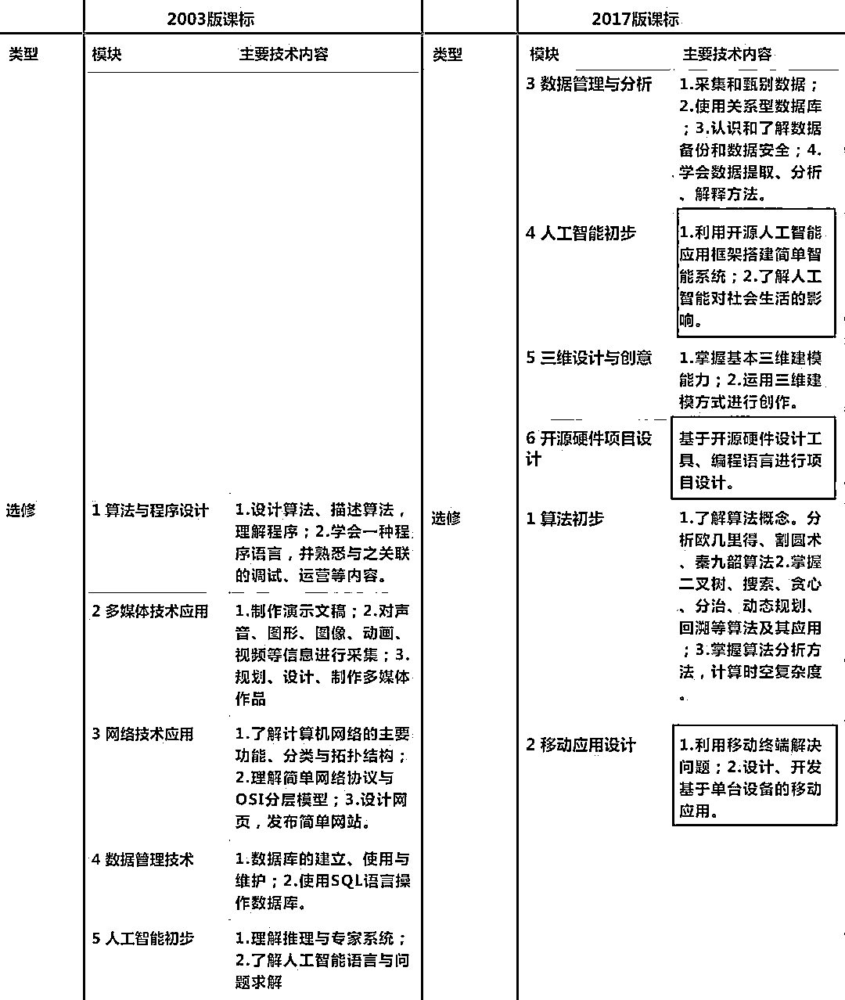
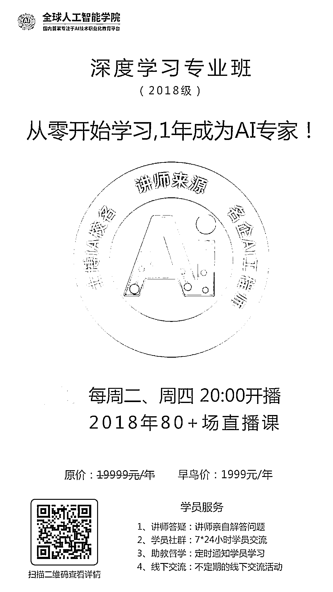

# 重磅｜教育部发文：AI、算法等 2018 年进入全国高中课程！

> 原文：[`mp.weixin.qq.com/s?__biz=MzAxNTc0Mjg0Mg==&mid=2653287351&idx=1&sn=dcb46d4e02e7140679f1900dd3da2257&chksm=802e31a2b759b8b42ec1f85f30788600959c9ade1dafc8606a554ea09134ae23619f40f7ce15&scene=27#wechat_redirect`](http://mp.weixin.qq.com/s?__biz=MzAxNTc0Mjg0Mg==&mid=2653287351&idx=1&sn=dcb46d4e02e7140679f1900dd3da2257&chksm=802e31a2b759b8b42ec1f85f30788600959c9ade1dafc8606a554ea09134ae23619f40f7ce15&scene=27#wechat_redirect)

1 月 16 日上午，教育部召开新闻发布会，介绍了《普通高中课程方案和语文等学科课程标准（2017 年版）》的有关情况，并重新修订了语文等 14 门学科的课程标准。在此次“新课标”改革中，正式将人工智能、物联网、大数据处理正式划入新课标。 

修订版本的方案中，把高中学习内容分成了必修课、选择性必修课和选修课。具体在信息技术课程上，课程结构如下图所示：

高中信息技术必修课程是全面提高高中生信息素养的基础，包括“数据与计算”和“信息系统与社会”两个模块。

**数据与计算：**

（1）了解数据编码

（2）学会采集、分析、可视化数据

（3）学会一种程序语言，并使用程序语言完成简单的算法

（4）了解人工智能的重要性

**信息系统与社会**

（1）知道信息系统基本工作原理

（2）可以开发简单的信息系统

（3）判断安全风险，了解安全防范技术

（4）学会遵守相关法律和道德伦理规范

高中信息技术选择性必修课程是根据学生升学、个性化发展需要而设计的，包括“数据与数据结构”“网络基础”“数据管理与分析”“人工智能初步”“三维设计与创意”“开源硬件项目设计”六个模块。 

高中信息技术选修课程是为满足学生的兴趣爱好、学业发展、职业选择而设计的自主选修课程，包括“算法初步““移动应用设计”以及各高中自行开设的信息技术校本课程。

相比于 2003 版课标，此次公布的“新课标”中，在技术（信息技术和通用技术）上给予了学生更大的发展选择空间。可以看出，“新课标”大幅度减少了对于基本软件使用的要求，而大幅度提升了在编程、计算思维、算法方面的思维要求，以及人工智能、开源硬件、网络空间安全等知识面要求。

这是 2017 年国务院出台[《新一代人工智能发展规划的通知》](http://mp.weixin.qq.com/s?__biz=MzA4NzE1NzYyMw==&mid=2247492339&idx=1&sn=41fa3b0c8552a09a0c048fd5f1cb5301&chksm=903f1ceba74895fdde8dcce39ccad5ecdbc5e36df47ec1fe372de237a2f9fdce42e81746d66f&scene=21#wechat_redirect)之后的又一个加强人工智能技术教育普及的政策。我国目前仅 5 万 ai 相关技术人才，目前缺口 500 万！各位亲，赶紧学习吧，不然再过两年中学生都比你更懂人工智能！

下面推荐一个人工智能课程，感兴趣的扫描二维码查看详情

点击“**阅读原文**”，查看详情！