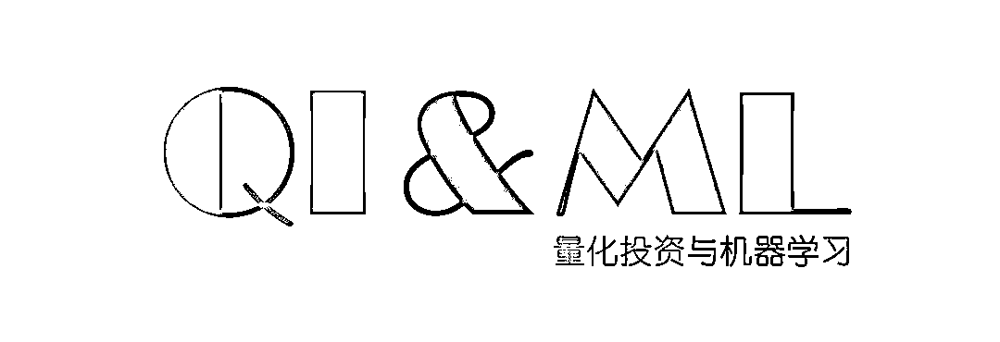

# 【公众号力荐】华尔街穿梭如鲫，江湖从此不再平静！

> 原文：[`mp.weixin.qq.com/s?__biz=MzAxNTc0Mjg0Mg==&mid=2653287328&idx=1&sn=0ddbb687493f3cefa08d3f0f44e51014&chksm=802e31b5b759b8a3d9282c449a5eddb8968cba5677485d46ae5b709d0d889f835451a0b8f863&scene=27#wechat_redirect`](http://mp.weixin.qq.com/s?__biz=MzAxNTc0Mjg0Mg==&mid=2653287328&idx=1&sn=0ddbb687493f3cefa08d3f0f44e51014&chksm=802e31b5b759b8a3d9282c449a5eddb8968cba5677485d46ae5b709d0d889f835451a0b8f863&scene=27#wechat_redirect)

公众号前段时间的一篇文章，推荐的[**全新的开源量化平台**](https://mp.weixin.qq.com/s?__biz=MzAxNTc0Mjg0Mg==&mid=2653286868&idx=1&sn=745556c9487a9613368cda067a9f321e&chksm=802e33c1b759bad7a228cbf6433354dc28079814866a2d9fbf6a04f2ce6afa1e7beb8b8e9fbb&scene=21#wechat_redirect)——**quantOS**，成立以来，公众号一直在持续关注。我们看到了 quantOS 的一步步成长，也看到了初创人员的良苦用心。

其中的一位成员：**渔阳**

是公众号今天要推荐的重点。不仅是他的传奇，也有他给我们带来的**一份礼物****！**

别急，继续往下看！

豆瓣读书评分 9.6，百度阅读评分 9.6，亚马逊评分 4.4，当当好评率 99.99%......从中国人视角记录华尔街风云至今也少之又少，因而这本名为**《乱世华尔街》**的书 11 年一经出版，立马畅销。

然而这却是一本没有结局的“故事书”，作者的金融圈奋斗史远不会因为华尔街的复苏而结束。6 年过去了，作者现在在哪里？在做什么？还在写故事吗？相信很多读者，都会像我一样怀有这样的疑问。

2017 年冬天，在浦东一间白色极简风的办公室里，我终于见到渔阳。渔阳的形象，与想象中不同，他是颇为内敛的，但双眼难掩“精明”的神采……Stop！怎么可能一眼就看穿别人呢？这显然是结合了我基于他那本畅销书的想象。

接下来要说的，也是对今天这份礼物的一个铺垫。

## 会编程才有未来？

***“远见”***

试想一下：10、20 年后，中国年轻一代人人都学过 Python，掌握编程变得就像如今会用 Office 般普遍，金融界又会遭怎样的颠覆呢？或许会有这样的场景：高频和系统化交易员入行后才习得的拿手好戏，职场新人都能轻易掌握，还自豪地说：“这我小学就学过了。”

与此同时，在量化交易、AI 选股等前沿金融领域，入行门槛又变窄了。在那个人人都懂编程的时代，候选者的计算机功力相差无几，想脱颖而出更要考验数学和金融功底。或者更准确的说，只有精通数学、金融和计算机的通才，才能得到高盛之类的世界顶级投资机构的青睐。

正如一名华尔街高管所说，编程更多关乎的是认知概念，而不是技术细节：“这是一种思维模式。你需要让你的大脑习惯用编程语言和工具来解决问题。一旦你做到了这一点，就能举一反三，然后你在就业市场上的竞争力就能大大增加。”

## 这个时候，你怎么办？

***“***回归人***”***

想见识这样的人才，不用等上 10 年 20 年，因为华尔街早有了。他就是《乱世华尔街》作者，在顶级投行历任工程师、交易员、量化对冲基金首席策略官……

渔阳 1998 年从北大数学系毕业，赴美留学攻读计算机，在顶级投行从事程序员工作后，认为自己还是更适合交易，又到美国最强的 UC Berkley 攻读金融工程硕士。 

他担任自营债券交易员期间，经历过 2008 年金融危机的大风大浪。此后参与创建量化对冲基金，直至 2012 年回国创业。

数十年前，他可没有教 Python 的小学电脑课、没有海量在线学习课程、甚至连专业求职网站都难觅踪迹。

因而，为了这一切，渔阳奋斗了 19 年。

期间也是经历种种“奇遇”：为转行前台，他在银行 IT 部门“潜伏”多年；为掌握投资原理，他在拉斯维加斯和大西洋城的赌场上奋战多年，借此读完了“华尔街预科”，并顺便找到了职业发展方向。 

他费了九牛二虎之力给面试官设下埋伏，最终成功征服高盛，却又在一年间为了交易员的理想抽身而去；而面对金融海啸，他还逆势赚过几百万，顺便写了本畅销书，记录了《乱世华尔街》。

渔阳给大家的**这份礼物**，初衷特别简单：**希望年轻一代少走弯路，不用像他当年一样付出那么多金钱、时间与汗水，读了一个又一个专业。****这份礼物**，***即便你是刚刚接触金融的学生、或是听消息下单的个人投资者，都有机会用量化思维管理自己的投资。***

## 小学校长

***“一切不动手的量化都是耍流氓！”***

在渔阳看来，同时精通金融、编程和数学知识的确很难，但基于这三者的“量化投资”还是容易上手的。毕竟小学生也能学 Python，而稍微加些难度的量化，广义上也只不过是“利用数学和统计的方法，计算机技术和现代的金融理论，为投资实践提供帮助”，广大普通投资者作为成年人肯定也学得会。 

关键是，许多人在外界纷扰的各种投资策略中，并没有去像我们小学阶段，最初接触一门新知识那样，去**真正沉浸和动手实践**。

因此，2017 年 12 月，量化小学开学，渔阳从此又有了新标签：**量化小学校长**。《乱世华尔街》的故事依然没有完结。

渔阳做的这个**《量化小学》**，通过至少**20**个小时的视频课程，用**500**多张极简金融知识幻灯片的方式，为小白用户、职场新人和专业投资者搭建适合自己的量化体系。 

该课程准备了数十个精心设计的实例操作，让大家去感受想法是如何通过搜集数据、研究回测等一系列行动进行验证的。最重要的，为了让大家“一定要动手”，还提供了完整案例的源代码。

比如，就在开学引言课上，渔阳就会让你去试水选**四个“你最喜欢产品”的股票**，并用模拟量化策略看看它们的效果；

又如，面对**疯狂涨跌的螺纹钢**，渔阳也会给你一个去理解 CTA 模式的小动手样例。

## 用心做事

***“乱世，总有一天还会再回来。”***

上面这句话是《乱世华尔街》全书的结尾。乱世什么时候回归，或者说是不是已经回来了，我作为旁观者无从判断，但公众号相信渔阳已经准备好了。

渔阳还总结了他的量化交易心得：刚开始做交易的时候，你会觉得到处都是规律，能够抓住很多；现在，我们已经倾向于大多数都是陷阱，你看到好多规律都是假的，真的规律不多，或者说很细微。只有通过计算机才能有一点概率优势，所以这才是量化交易将资源极致化的体现。

这次下了血本当老师的渔阳，恐怕还是忘不掉当年对媒体吹过的那句牛逼：

> ***我总有一种想法，如果我自己弄明白一个事情，会很愿意指点给别人听，以免别人重陷我当年的窘境。***

**你们的礼物**

**一直往下看哦！**

****

****

**公众号作为微信全网量化&量化投资、****机器学习****关键字搜索排名第一，第三的技术类公众号。这次力荐的不光是《量化小学》，也是对渔阳的一份肯定！**

多的就不说了

**下图扫码**或者**点击阅读原文**

一起去听渔阳讲课吧

 **扫码报名**   

********