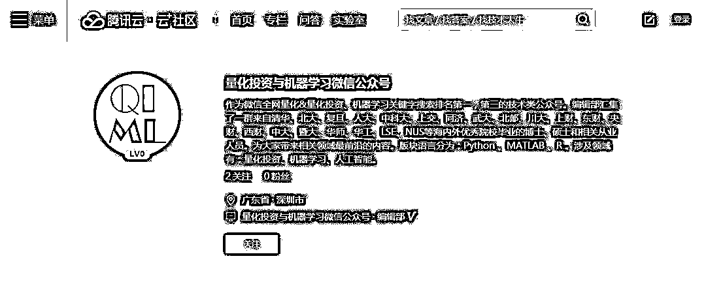

# 腾讯云‧云社区我们来啦！

> 原文：[`mp.weixin.qq.com/s?__biz=MzAxNTc0Mjg0Mg==&mid=2653287318&idx=1&sn=0953dceb2349793a11a4381a4c18ee77&chksm=802e3183b759b89516335bdfa7ce9345e3b00b115f521ed5df0162abcc99e1c8c057de58115f&scene=27#wechat_redirect`](http://mp.weixin.qq.com/s?__biz=MzAxNTc0Mjg0Mg==&mid=2653287318&idx=1&sn=0953dceb2349793a11a4381a4c18ee77&chksm=802e3183b759b89516335bdfa7ce9345e3b00b115f521ed5df0162abcc99e1c8c057de58115f&scene=27#wechat_redirect)

***链接：https://cloud.tencent.com/developer/user/1262632/activities***

继知乎、搜狐、雪球、点宽、优矿专栏后，今天公众号正式受邀入驻腾讯云‧云社区专栏。

2 年来，公众号不追求量的多少，而一直希望在质上不断提升。

在各大社区我们也得到了用户的认可和好评。为此，我们希望在未来做的更好，把更优质的内容奉献给大家。

后面我们会逐步开通**公众号的专属微博**。像陈老师（@爱可可）学习，在**量化这块**，分享更多国外好的文章和资源。希望大家能够多多关注，多多支持！

明天就是周末。祝大家过得快乐。

下周有更精彩的文章推送给大家！

****