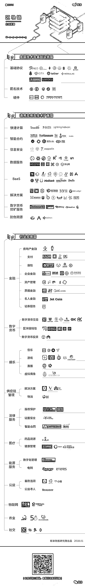

# 【史上最全】区块链生态图谱，一张图看清 2400 个典型项目！

> 原文：[`mp.weixin.qq.com/s?__biz=MzAxNTc0Mjg0Mg==&mid=2653287293&idx=1&sn=0209c6c1aecf58b776160df3e15d237a&chksm=802e3168b759b87e351cf15fb08fa98d94261aef5b003cae4a5894e46563e873cd2f55e7e701&scene=27#wechat_redirect`](http://mp.weixin.qq.com/s?__biz=MzAxNTc0Mjg0Mg==&mid=2653287293&idx=1&sn=0209c6c1aecf58b776160df3e15d237a&chksm=802e3168b759b87e351cf15fb08fa98d94261aef5b003cae4a5894e46563e873cd2f55e7e701&scene=27#wechat_redirect)

**量化投资与机器学习**

为中国的量化投资事业贡献一份我们的力量!

 

前几日鲸准研究院推出了一张区块链的生态图谱，编辑部觉得总结的很好，今天分享给大家，并解读图片各个部分的内容。

**图谱在文末**

区块链革命确确实实已经到来。并不仅仅是一个"风口"，一场"骗局"那么简单。

任何一个新技术浪潮到来的时候，都伴随着一定的狂热与泡沫，但到头来最终胜出的，还是那些提供了实实在在技术和产品、创造了能够被人类使用价值的人和公司。

目前区块链行业项目数量众多，项目质量层次不齐，有真正解决商业问题的优质项目，也有蹭热度的空气币。想要辨别项目的实力如何，需要能从整个区块链生态系统上有一个全局的视野。

鲸准研究院将所有基于区块链去中心化项目整理成的生态系统图谱共分为三层，涉及十余种垂直行业应用并列出了百家典型项目。

**————**

**底层技术及基础设施层**

底层技术与基础设施层，主要是代表了提供区块链最底层的协议代码和基础硬件设施。 

基础协议通常是一个完整的区块链产品，类似于我们电脑的操作系统，它维护着网络节点，仅提供 Api 供调用。这个层次是一切的基础，使用网络编程、分布式算法、加密签名、数据存储等技术来构建网络环境、搭建交易通道以及制定节点的奖励规则，典型的例子国外的以太坊，国内的 NEO（小蚁）。

**代表项目：NEO、Ethereum、量子链**  

区块链相关硬件则主要由比特币矿机的制造售卖厂商以及区块链路由器提供商构成，以比特大陆和极路由为代表。

**代表项目：嘉楠耘智、RockMiner、极路由**

**————**

**通用应用及技术扩展层**

通用应用及技术扩展层主要是为了让区块链产品更加实用以及面向开发者提供服务以便构建基于区块链技术的应用，这一层使用的技术基本没有限制，之前提到的分布式存储、机器学习、大数据等技术均可被使用。 

快速计算：快速计算主要是在底层区块链基础上进行优化，借以解决底层区块链固有的一些问题，提高区块链的计算速度。例如闪电网络（lightning network）是创建一个能够以高容量和高速度进行交易的参与者的安全网络，具有即时付款、扩展性强、低成本、可跨区块链交易的特点。

**代表项目：lightning-network、truebit、raiden**

智能合约：智能合约就是“可编程合约”，或者叫做“合约智能化”，其中的“智能”是执行上的智能，也就是说达到某个条件，合约自动执行，比如自动转移证券、自动付款等，这将是区块链技术重要的发展方向。

**代表项目：秘猿科技、全息互信、SCRY.INFO**

挖矿服务：挖矿服务主要为需求方提供算力，此类项目要么与矿厂进行合作，要么集合全网用户的算力进行再分配。

**代表项目：MaidSafeCoin、bitfury、hashfast**

信息安全：信息安全部分的项目主要是保障开发的安全性以及区块链网络中信息内容的安全性，可以使得开发者进行更加安全的开发和管理应用程序，个人和企业的交易数据得到保障。

**代表项目：万物链、zeppelin、gladius**

数据服务：数据服务主要包括数据共享、数据库、数据保护三项服务，数据共享项目是建立一个基于区块链的市场和管理平台，在此基础上提供数据保全和安全存储的服务则构成数据保护，数据库则是为开发者或企业提供数据库基础设施。

**代表项目：公信宝、众享比特、矩阵元**

区块链 BAAS：区块链 BAAS 是基于已有的区块链技术开发的去中心化平台，提供基于公链的实例服务。

**代表项目：百度 Baas、趣链科技、快贝**

区块链解决方案：区块链解决方案为区块链的企业级应用，为特定的商业场景提供一整套的解决方案。

**代表项目：海星区块链、塔链网络、网录科技**

防伪溯源：平台级别的防伪溯源项目一般基于区块链、物联网等相关技术辨别商品、产品的真假，解决中间链条不透明的问题。

**徐小平说： 一场区块链革命已经降临，it has already arrived! 请大家系好安全带，加速，加油，带着自己的企业稳、准、狠、快地开进区块链时代！**

**图谱在这里！**

****