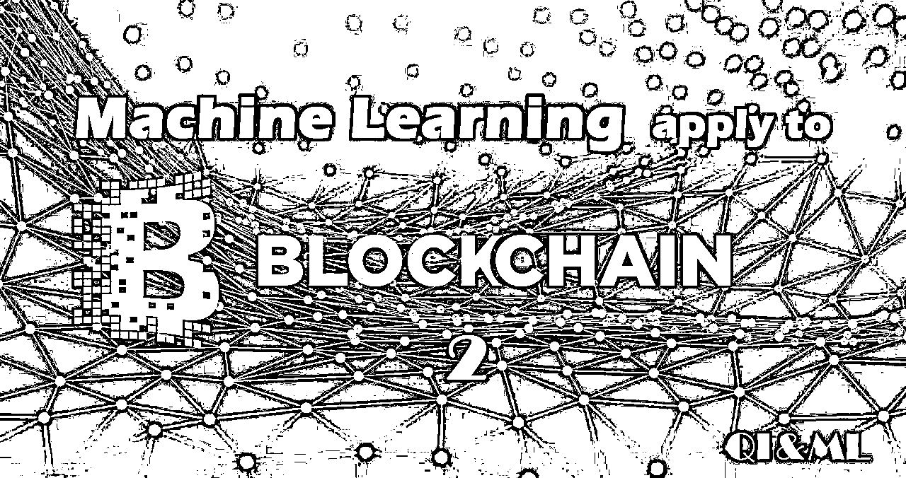

# 还是不靠谱！多维 LSTM 网络预测比特币价格【机器学习应用区块链系列二】

> 原文：[`mp.weixin.qq.com/s?__biz=MzAxNTc0Mjg0Mg==&mid=2653287287&idx=1&sn=a4efd248d74afa7360f2e32751066b5d&chksm=802e3162b759b8748907f4d889d648d89acd54837041a8f94cde00740b5a867012ae48fa1f5d&scene=27#wechat_redirect`](http://mp.weixin.qq.com/s?__biz=MzAxNTc0Mjg0Mg==&mid=2653287287&idx=1&sn=a4efd248d74afa7360f2e32751066b5d&chksm=802e3162b759b8748907f4d889d648d89acd54837041a8f94cde00740b5a867012ae48fa1f5d&scene=27#wechat_redirect)


**量化投资与机器学习**

为中国的量化投资事业贡献一份我们的力量!

 



公众号今天为大家带来机器学习应用区块链系列的第二篇文章。

这篇文章的作者是公众号之前推过一位原作者，具体文章***《**[**通过 LSTM 神经网络进行时序预测针对股票市场（附 Python 源码）**](https://mp.weixin.qq.com/s?__biz=MzAxNTc0Mjg0Mg==&mid=2653284793&idx=1&sn=76c954a5a8006c815565d8669411f983&chksm=802e2bacb759a2ba4dd2ad122fe7cd99ab85ed29900b212189ab0af36749123c9e39b422363b&scene=21#wechat_redirect)**》***，虽然有一段时了，但是，我们觉得这篇文章的结论很有用，希望大家可以认真阅读。

**结论很精彩，见文末。**

也侧面告诉我们使用一些机器学习算法做股价预测，效果并没有那么好！大家不要觉得什么高大上就一定好，有时候真实的交易其实并没有那么复杂！

至于怎么预测的过程大家可以下载代码自行去研究。 

写这篇文章，主要是为了预测比特币的价格和张量，使用一个不只是看价格而且还看 BTC 交易量和货币（在这种情况下为美元）的多维 LSTM 神经网络，并创建一个多变量序列机器学习模型。

### **时间数据集**

Kaggle 上有一个数据集，包含了 7 种要素的比特币历史数据。

链接：**https://www.kaggle.com/mczielinski/bitcoin-historical-data**


具体处理的过程大家自行查看内容，只把 clean_data（）函数的核心代码贴出来：

```py
num_rows = len(data)
x_data = []
y_data = []
i = 0
while((i+x_window_size+y_window_size) <= num_rows):
  x_window_data = data[i:(i+x_window_size)]
  y_window_data = data[(i+x_window_size):(i+x_window_size+y_window_size)]

  #Remove any windows that contain NaN
  if(x_window_data.isnull().values.any() or y_window_data.isnull().values.any()):
    i += 1
    continue

  if(normalise):
    abs_base, x_window_data = self.zero_base_standardise(x_window_data)
    _, y_window_data = self.zero_base_standardise(y_window_data, abs_base=abs_base)

  #Average of the desired predicter y column
  y_average = np.average(y_window_data.values[:, y_col])
  x_data.append(x_window_data.values)
  y_data.append(y_average)
  i += 1
```

**预测结果**

我们将尝试做两种类型的预测：

第一种：逐点预测，即预测 t+1 点，然后移动真实数据的窗口并继续预测下一个点。

```py
model = lstm.load_network('data/model_saved.h5')
predictions = model.predict_generator(
    generator_strip_xy(data_gen_test, true_values),
    steps=steps_test
)

#Save our predictions
with h5py.File(configs['model']['filename_predictions'], 'w') as hf:
    dset_p = hf.create_dataset('predictions', data=predictions)
    dset_y = hf.create_dataset('true_values', data=true_values)

plot_results(predictions[:800], true_values[:800])
```


第二种：是 t+n 的多步超前预测，我们在移动窗口填充真实数据窗口预置的预测，并绘制 N 个步骤。

```py
#Reload the data-generator
data_gen_test = dl.generate_clean_data(
    configs['data']['filename_clean'],
    batch_size=800,
    start_index=ntrain
)
data_x, true_values = next(data_gen_test)
window_size = 50 #numer of steps to predict into the future

#We are going to cheat a bit here and just take the next 400 steps from the testing generator and predict that data in its whole
predictions_multiple = predict_sequences_multiple(
    model,
    data_x,
    data_x[0].shape[0],
    window_size
)

plot_results_multiple(predictions_multiple, true_values, window_size)
```


**结论（我们认为很有用的结论）**

不以人工智能的角度，而是从投资的角度来解释一些事实。

**预测回报是一项相当没有意义的行为**。我的意思是说，预测回报是预测的圣杯，而一些顶级对冲基金视图通过在现实中找到新的 alpha 指标来做到这一点，这是一件非常困难的事情，因为复杂的外部因素会影响到价格的走动。实际上，它可以看作是试图预测随机的下一步。

但是，我们做的也并不是完全没有意义。有限的时间序列数据，即使有多个维度，也很难预测回报，我们可以看到，特别是从第二个图表看到，是有一个预测波动的方法。而不仅仅是波动，而且我们也可以通过扩张它来预测市场环境，使我们能够了解我们目前所在的市场环境。

我们可以看到，通过了解我们当前的市场环境，预测未来的市场环境是在任何时候将正确的策略分配到市场的关键。虽然这更多是传统市场的一般投资方式，但同样适用于比特币市场。

所以，**预测比特币的长期价格目前相当的困难**，没有人可以只是通过时间序列数据技术做到，因为有很多因素加入使价格发生了变动。在这样的数据集上使用 LSTM 神经网络的另一个问题是我们将整个时间序列数据集作为一个固定的时间序列。**也就是说，时间序列的属性在整个时间内都是不变的。然而这不可能，因为影响价格变化的因素也会随时间而变化，所以假设网络发现的属性或模式在现在仍然使用是一种不合理的做法。**

当然，可以通过一些方法来克服这个非平稳性问题，**目前前沿的研究方向是利用贝叶斯方法和 LSTM 一起克服时间序列非平稳性的问题。**

**获取本系列****代码+论文**

****请在后台回复****

****区块链 2****

****即可获取****

**有些人不知道**后台回复**如何操作**

**为大家介绍一下：**

****

********