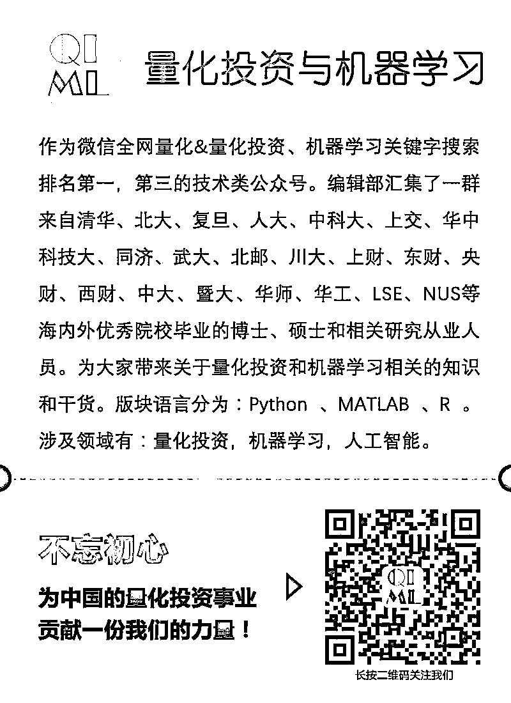
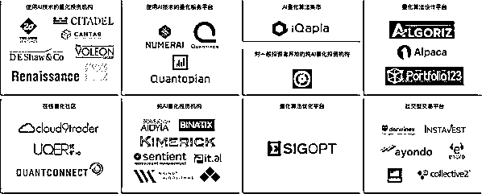
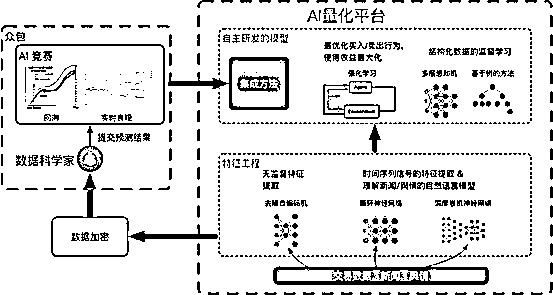
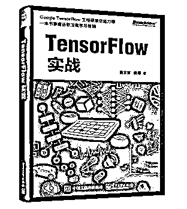

# 用 AlphaGo 背后的人工智能做金融投资（第十期免费赠书活动来啦！）

> 原文：[`mp.weixin.qq.com/s?__biz=MzAxNTc0Mjg0Mg==&mid=2653287282&idx=1&sn=7114c34275ccf585ae8f7069f8f74e30&chksm=802e3167b759b871a7a1eef514137d754fd90d3d66b4c672f8e8c29f511444ba7f619bf989c1&scene=27#wechat_redirect`](http://mp.weixin.qq.com/s?__biz=MzAxNTc0Mjg0Mg==&mid=2653287282&idx=1&sn=7114c34275ccf585ae8f7069f8f74e30&chksm=802e3167b759b871a7a1eef514137d754fd90d3d66b4c672f8e8c29f511444ba7f619bf989c1&scene=27#wechat_redirect)

**量化投资与机器学习**

为中国的量化投资事业贡献一份我们的力量!

 

公众号今天受邀为大家介绍一下由黄文坚先生创立的墨宽人工智能量化投资平台。

**黄文坚 **香港科技大学本科、研究生，墨宽投资 CEO，人工智能领域研究者，有多篇顶级学术论文发表。著有《TensorFlow 实战》，国内计算机类书籍月度销量冠军，该书获李开复、Jeff Dean（谷歌大脑团队负责人）推荐，并在日本、韩国等地翻译出版。目前正带领团队研发新一代的人工智能量化平台，旨在将人工智能技术应用于价值投资领域。团队成员包括北大、浙大、香港科技大学、中科院等多名专家、博士，并有 ACMICPC 金牌获奖者。

**文末免费送出 5 本《TensorFlow 实战》哦！**

**金融人工智能的浪潮已来**

近年来，伴随着大数据和机器学习技术的兴起，人工智能技术被大规模地应用在许多工业领域，并在一些领域（搜索引擎、个性化推荐、智能客服等）取得了良好的效果。Google 去年展示的围棋 AIAlphaGo，击败了目前人类最优秀的围棋大师。这标志着人工智能技术日趋成熟，具备在一些高智力行业取代人类专家的能力。

在众多行业中，金融投资领域无疑是最有价值又充满挑战性的人工智能应用场景。然而两个行业间存在着一定的技术壁垒——大多数金融从业者不熟悉人工智能技术，正如大部分人工智能专家们不了解金融市场。为了帮助人工智能领域和金融行业更好的互通和合作，这篇文章将介绍我们在金融投资领域运用人工智能方法的一些经验和思考。

在海外发达国家（美国、英国），人工智能与金融投资已经非常紧密地结合并取得了良好的成效。一些新兴的人工智能投资机构的崛起，证明了人工智能方法在金融市场的巨大潜力。比如著名的大奖章基金在 2008 年金融危机时，通过成功的预测风险，避免了投资者的重大损失，并保持连续多年资产的稳定增长。2017 年 5 月，摩根大通发布了一份题为《大数据与人工智能战略：机器学习和其它投资数据分析方法（BigData and AI Strategies: Machine Learning and Alternative Data Approach toInvesting）》的报告，对人工智能和对金融领域的影响进行了全面的阐述。报告指出人工智能量化技术将成为未来金融业的主流方法，帮助投资者处理、分析、理解数据，指导投资决策。一个优秀的金融投资机构，必须发展人工智能投资系统，以适应金融数据化、智能化时代的到来。

**金融投资如何应用人工智能**

下面我们将具体介绍人工智能是如何在金融领域发挥作用，帮助投资者做出更好的投资决策。为了易于读者理解，我们先介绍一些基本的机器学习概念，也就是人工智能背后的算法，并简单说明他们如何与金融投资相联系。通过合理运用机器学习技术，投资者们有能力开发出与人类专家水平相当甚至更好的投资决策系统，称之为人工智能投资系统。

什么是机器学习：机器学习是通过一系列算法，挖掘出历史数据中我们关心的规律的技术手段，并期望挖掘出的规律，能帮助我们对未来数据做出正确的预测。

金融领域的机器学习：在金融领域，从业者们其实也做着同样的工作。以计划长期持有某只股票为例，分析师们一般会关注公司的基本面信息、财务状况和发展规划等因素，从而对公司的未来运营状况做出预测，并决定是否投资。如果我们将公司的信息量化成各种数据因子，将预测目标改为公司的未来发展趋势、风险情况，则整个问题可以通过机器学习方法解决，获得可靠的预测，并指导投资行为。

因此，借助机器学习的手段，打造一个人工智能系统来分析金融市场是一个直接而自然的想法。随之而来的问题是，机器学习能否与有经验的分析师竞争呢？就欧美国家的市场经验来看，机器学习方法在某些方面确实是比人工决策更为出色。例如上文提到的文艺复兴基金和著名的 DEShaw 基金，都是人工智能在金融投资领域成功落地的案例，是近年来金融投资领域的领头羊。下图汇总了一些使用人工智能技术的知名量化投资机构和平台，以及他们专注的具体方向。可以看到，金融 AI 技术被广泛的应用在金融投资的各个环节之中，并带来了一些新的机遇。对某个应用方向具体感兴趣的读者可以查找相关资料做进一步的了解。

具体来说，相比如传统投资方式，基于人工智能的量化投资理念有如下几个方面的优势：

1.     相比于传统分析，机器学习方法可以处理更多的输入信息，能够考虑的信息面更全，信息量更大，可以达到的效果上限更高。从效率上说，人工智能方法可以同时考虑整个市场，从中选出更多的优质股票，分散投资风险，提供稳定的投资回报，并容纳更大量的资金。

2.     人工智能算法会量化整个投资过程中的变量，做出更精准高效的投资决策。例如对于一个上市公司，投资者关心公司每个信息因子和未来长期股价的相关性。哪些因子对长期受益更重要？未来上涨的概率是多少？最大投资回撤是多少？这些问题都可以通过算法和回测获得答案。

3.     近年来伴随着深度学习算法的快速发展，一些重要但之前不易获取的非结构性信息可以被算法分析得到，从而提高投资效率。其中文字类和图像类信息是传统金融信息的重要补充。借助于深度学习和自然语言处理技术，新闻、舆论、图像信息可以被加工成用于构建人工智能的模型特征，轻松使用于投资决策中。欧美的一些发达投资机构早已成立专门的部门对社交媒体进行分析，从而判断一个企业的流行程度和受众群体等信息，甚至通过这些信息对关注公司的未来财报进行预测，以占得投资先机。

4.     从金融交易角度，人工智能算法带来的一个巨大的优势是在决策中可以回避人性弱点，例如性格、情感、害怕失败等因素，始终保持客观的态度。对于普通投资者，市场的波动或多或少会影响人的情绪，进而影响之后的投资决策，使人做出一些不正确的决定。人工智能方法则不会受到市场波动的影响，市场的波动只是客观的数据，算法会一致地贯彻自己的交易策略。

5.     相对于传统方法，人工智能算法有着维护成本低廉，维护效率高的特点。一个优秀的团队一旦有了想法，就可以快速地写出一个人工智能交易策略，在历史的数据上回测，并最终运用在市场上。策略的后期维护也只需要修改对应模型参数或者某个程序模块，以适应市场的变化。成熟的团队可以开发多样的策略，以适应不同的市场，打破投资风格的局限，始终保持高水平的盈利。

**人工智能量化投资平台**

基于上述原因，人工智能在金融领域的发展前景是非常令人期待的，智能化的浪潮将席卷全球的金融市场。在这样的背景下，仅靠少数的从业者进行探索是远远不够的。因此，我们搭建了一个利用人工智能的量化投资平台，打通传统的金融投资行业和新兴的人工智能领域之间的壁垒，推动金融行业的蜕变。

这个平台的名称是墨宽人工智能量化投资平台，它使用 AlphaGo 背后的人工智能技术，并期望找到 Alpha（超额）收益。整个平台采用机器学习社区流行的竞赛模式，旨在聚集全球优秀的人工智能专家，一起解决有价值的金融问题。

平台的整体运营模式类似著名的机器学习竞赛网站 Kaggle，平台会不断地发布最新的各种金融机器学习问题，将问题抽象后提供给数据科学家们，让他们基于数据构建模型。对每个比赛，平台保留一部分未发布的数据集（private set）用于回测，参赛者们在有限的次数内提交基于他们模型获得的关于未发布数据的预测结果。根据提交结果在未发布数据集的表现，评定每个参赛者的得分，最终决定比赛的排名。排名靠前的优秀参赛模型，将有机会被实际运用于金融投资中，分享最终的投资收益。

平台的赛题来源有两方面，一方面是将平台自身在网上抓取新闻、报道、交易等数据，抽象成一个交易问题。另一方面是第三方的金融机构可以向平台提供举办比赛的申请，提出机构希望借助人工智能技术解决的问题。对于采纳的赛题，平台会提供必要的支持，帮助金融机构进行问题抽象、数据脱敏、特征提取，并在比赛结束后协助构建基于优秀模型的人工智能交易系统。对人工智能专家来说，只需要像参与传统机器学习竞赛那样，在给定的数据集和目标上找到最优秀的模型。最后，平台会选取比赛中表现优秀的一个或多个模型作为基础，融合他们的预测结果，用于实际的金融交易中，并拿出一部分投资收益回馈给模型开发者。

具体而言，整个平台的运作方式如下图所示：

结合我们近年来的实际人工智能投资经验，平台还提供一些高效的特征工程和自主研发的模型，用于搭建人工智能投资系统。特征工程包括无监督特种提取和基于深度网络的时间序列信号和自然语言处理特征提取。无监督特征提取中，除了常见的聚类，去噪自编码机等，我们还引入了知识图谱技术。借助于知识图谱技术，平台可以挖掘出多个特征因子间的相互关系，由此抽取出大量的多维度特征，为模型训练提供更多的信息输入。在有监督特征提取方面，平台集成了最前沿的神经网络技术，可以处理新闻、舆论等信息，从中抽取出对投资决策有意义的信息供参赛选手使用。

在比赛结束后，平台会选取一部分优秀的模型，采用自主研发的集成方法，将模型融合，以实现不同的投资目标。例如在一定风险下最大化收益或是在目标收益下最小化风险等。另一方面，平台集成了构建 AlphaGo 的增强学习技术，旨在能够在不同时间段，不同市场环境下，选取到对长期而言最优秀的投资策略和资产组合。通过一系列的投资操作，实现更高更稳定的长期投资收益。

金融领域的人工智能浪潮已经到来，借助于墨宽人工智能量化投资平台，我们希望能够构建更多优秀的人工智能投资模型，为金融市场注入新的活力，进行更高效的优质资产配置。在未来的一段时间内，平台将会致力于运用人工智能技术综合分析宏观经济局势、社会需求和一些公司的经营状况，帮助投资者和机构构建优秀的投资系统，降低投资风险，以在各种市场环境下获得长期、稳定、可观的投资回报。

**赠书活动**

量化投资与机器学习公众号联合博文视点 Broadview 送出**5 本****《TensorFlow 实战》**

> 《TensorFlow 实战》是由 PPmoney 大数据算法总监黄文坚和美国 Uptake 数据科学家唐源倾力原创的新书。本书是 Google TensorFlow 研发团队内部力荐的教程，两位作者均是 TensorFlow 开发者，其中唐源是 TensorFlow 研发团队的 Committer。本书结合了大量代码实例，深入浅出地介绍了如何使用 TensorFlow。 《TensorFlow 实战》希望用简单易懂的语言带领大家探索 TensorFlow（基于 1.0 版本 API）。在《TensorFlow 实战》中我们讲述了 TensorFlow 的基础原理，TF 和其他框架的异同。并用具体的代码完整地实现了各种类型的深度神经网络：AutoEncoder、MLP、CNN（AlexNet，VGGNet，Inception Net，ResNet）、Word2Vec、RNN（LSTM，Bi-RNN）、Deep Reinforcement Learning(Policy Network、Value Network)。此外，《TensorFlow 实战》还讲解了 TensorBoard、多 GPU 并行、分布式并行、TF.Learn 和其他 TF.Contrib 组件。《TensorFlow 实战》希望能帮读者快速入门 TensorFlow 和深度学习，在工业界或者研究中快速地将想法落地为可实践的模型。

**原价：79.00 元**

**截止 2018.01.24 12:00**

大家在本篇推文【写留言】处发表留言，**获得点赞数前五的读者，即可免费获赠此书**。届时，工作人员会联系五位读者，寄出此书。

****