# 【代码+论文】通过 ML、Time Series 模型学习股价行为（第九期免费赠书活动来啦！）

> 原文：[`mp.weixin.qq.com/s?__biz=MzAxNTc0Mjg0Mg==&mid=2653287197&idx=1&sn=9630389a52c7d0be4c1feaf3a534c2ce&chksm=802e3108b759b81ed11174f71b23fb73abe5c4ebad0f9d480b6efbd8f7e644de6b2232dc63fa&scene=27#wechat_redirect`](http://mp.weixin.qq.com/s?__biz=MzAxNTc0Mjg0Mg==&mid=2653287197&idx=1&sn=9630389a52c7d0be4c1feaf3a534c2ce&chksm=802e3108b759b81ed11174f71b23fb73abe5c4ebad0f9d480b6efbd8f7e644de6b2232dc63fa&scene=27#wechat_redirect)


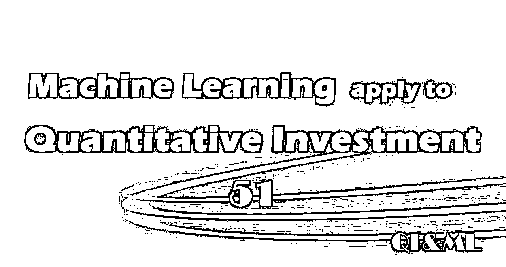

今天编辑部给大家带来的是来自 Jeremy Jordan 的论文，主要分析论文的建模步骤和方法，具体内容大家可以自行查看。

```py
# Standard imports
import pandas as pd
import numpy as np
import matplotlib.pyplot as plt
%matplotlib inline
plt.style.use('seaborn-notebook')
import seaborn as sns
sns.set()
import matplotlib.cm as cm

# Enable logging
import logging
import sys
logging.basicConfig(level=logging.DEBUG, 
format='%(asctime)s - %(levelname)s - %(message)s')
```

**步骤 1：下载数据**

**获取 S＆P 500 公司名单**

从维基百科下载的 S＆P 500 公司信息。我们只使用股票代码列表，但 GICS_sector 和 GICS_sub_industry 等可能有用。

```py
column_names = ['ticker', 'security', 'filings', 
'GICS_sector', 'GICS_sub_industry', 'HQ_address', 'date_added', 'CIK']

sp500companies = pd.read_csv('data/S&P500.csv',
 header = 0, names = column_names).drop(['filings'], axis=1)

 sp500companies = sp500companies.set_index(['ticker'])
sp500companies.head(10)
```

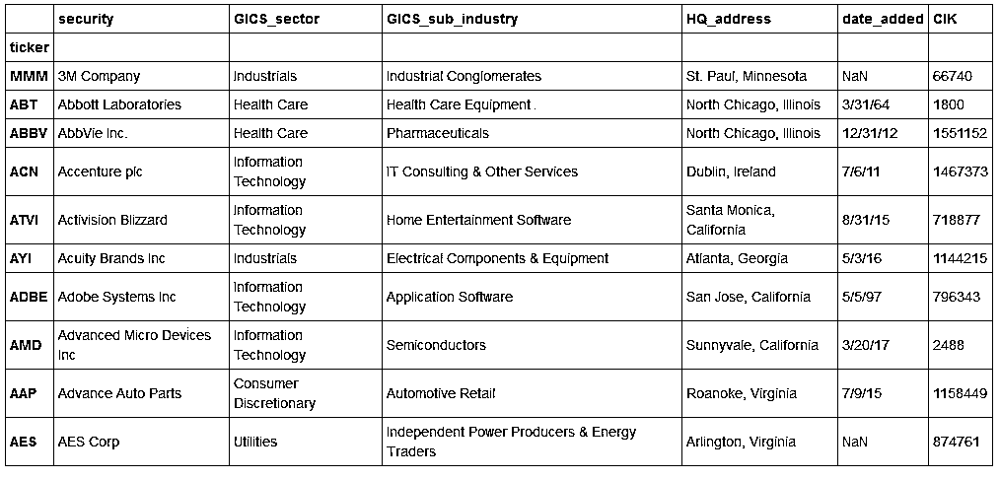

**下载价格数据**

```py
import pandas_datareader as pdr

start = pd.to_datetime('2009-01-01')
end = pd.to_datetime('2017-01-01')
source = 'google'

for company in sp500companies.index:
    try:
        price_data = pdr.DataReader(company, source, start, end)
        price_data['Close'].to_csv('data/company_prices/%s_adj_close.csv' % company)
    except:
        logging.error("Oops! %s occured for %s. \nMoving on to next entry." % (sys.exc_info()[0], company))
```

Transcripts are scraped from Seeking Alpha using the Python library Scrapy.

To fetch a company transcript, complete the following steps.

```py
cd data/
scrapy crawl transcripts -a symbol=$SYM
```

This will download all of the posted earnings call transcripts for company SYM and store it as a JSON lines file in data/company_transcripts/SYM.json.

**步骤 2：加载数据**

```py
# Read in a collection of company transcripts
def load_company_transcripts(company):
    '''
    Reads a company's transcripts into a Pandas DataFrame. 

    Args:
        company: The ticker symbol for the desired company. 
    '''
    logging.debug('Reading company transcripts for {}'.format(company))

    # Read file
    text_data = pd.read_json('data/company_transcripts/{}.json'.format(company), lines=True)

    # Drop events that don't have an associated date
    text_data = text_data.dropna(axis = 0, subset= ['date'])

    # Reindex according to the date
    text_data = text_data.set_index('date').sort_index()

    # Check for possible duplicate entries from scraping
    if sum(text_data.duplicated(['title'])) > 0:
        logging.warning('{} duplicates removed from file'.format(sum(text_data.duplicated(['title']))))
        text_data = text_data.drop_duplicates(['title'])

    # Concatenate body into single body of text
    text_data['body'] = text_data['body'].apply(lambda x: ' '.join(x))

    # Add a column to each transcript for word count, plot histogram
    text_data['count'] = text_data['body'].apply(lambda x: len(x.split()))

    # Check for empty transcripts
    if len(text_data[text_data['count'] == 0]) > 0:
        logging.warning('{} empty transcripts removed from file'.format(len(text_data[text_data['count'] == 0])))
    text_data = text_data[text_data['count'] != 0]

    return text_data
```

**加载价格数据**

```py
def load_company_price_history(companies, normalize = False, fillna = True, dropna=True):
    ''' 
    Builds a DataFrame where each column contains one company's adjusted closing price history.

    Args:
        companies: A list of company ticker symbols to load.
        normalize: Boolean flag to calculate the log-returns from the raw price data. 
        fillna: Boolean flag to fill null values. Limited fill up to 5 days forward and 1 day backward,
        for companies with long periods of null values, this prevents from creating a stagnant time series.
        Instead, those companies should be dropped using `dropna=true`.
        dropna: Boolean flag to drop companies that don't have a full price history. 

    '''
    prices = []
    for company in companies:
        logging.debug('Reading company prices for {}'.format(company))
        price_history = pd.read_csv('data/company_prices/{}_adj_close.csv'.format(company), 
                                    names=[company], index_col=0)
        prices.append(price_history)

    df = pd.concat(prices, axis=1)
    df.index = pd.to_datetime(df.index)
    df = df.asfreq('B', method='ffill')

    if normalize:
        df = np.log(df).diff() # Calculate the log-return, first value becomes null
        df.iloc[0] = df.iloc[1] # Forward fill the null value

    if fillna:
        df = df.fillna(method = 'ffill', limit=5) # First pass fill NAs as previous day price
        df = df.fillna(method = 'bfill', limit=1) # For NAs with no prev value (ie. first day), fill NA as next day price

    if dropna:
        # Validate quality of data (null values, etc)
        # Drop any companies that don't have a full 8-year history
        df = df.dropna(axis=1, how='any')
        assert df.isnull().values.any() == 0
        logging.debug('Null values found after cleaning: {}'.format(df.isnull().values.any()))

    return df
```

**读取文件目录并加载可用数据**

```py
# Go to data folder and get list of all companies that have data
import glob
import re

# All files for price history
price_files = glob.glob('data/company_prices/*_adj_close.csv')
company_prices = [re.search(r'(?<=data\/company_prices\/)(.*)(?=_adj_close.csv)', f).group(0) 
                  for f in price_files]
logging.info('{} company price histories available.'.format(len(company_prices)))

# All files for transcripts
transcript_files = glob.glob('data/company_transcripts/*.json')
company_transcripts = [re.search(r'(?<=data\/company_transcripts\/)(.*)(?=.json)', f).group(0) 
                       for f in transcript_files]
logging.info('{} company transcripts available.'.format(len(company_transcripts)))

# Intersection of two datasets
company_both = list(set(company_prices) & set(company_transcripts))
logging.info('{} companies have both transcripts and price history available.'.format(len(company_both)))
```

```py
2017-10-04 09:52:44,215 - INFO - 502 company price histories available.
2017-10-04 09:52:44,219 - INFO - 173 company transcripts available.
2017-10-04 09:52:44,220 - INFO - 170 companies have both transcripts and price history available.
```

```py
# Load all pricing data into memory
company_price_df = load_company_price_history(company_both, normalize=True)
```

```py
2017-10-04 09:52:45,680 - DEBUG - Reading company prices for AAL
2017-10-04 09:52:45,683 - DEBUG - Reading company prices for XRAY
2017-10-04 09:52:45,686 - DEBUG - Reading company prices for CVX
2017-10-04 09:52:45,689 - DEBUG - Reading company prices for ACN
2017-10-04 09:52:45,692 - DEBUG - Reading company prices for COF
2017-10-04 09:52:45,696 - DEBUG - Reading company prices for DISCK
2017-10-04 09:52:45,699 - DEBUG - Reading company prices for AXP
2017-10-04 09:52:45,702 - DEBUG - Reading company prices for CVS
2017-10-04 09:52:45,705 - DEBUG - Reading company prices for AMGN ```
```py

```
# Load all transcript data into memory
company_transcripts_dict = {}
failures= []

for company in company_transcripts:
    try:
        company_transcripts_dict[company] = load_company_transcripts(company)
    except:
        logging.error("Oops! {} occured for {}. \nMoving on to next entry.".format(sys.exc_info()[0], company))
        failures.append(company)
```py

```
2017-10-04 09:52:51,910 - DEBUG - Reading company transcripts for A
2017-10-04 09:52:51,979 - DEBUG - Reading company transcripts for AAL
2017-10-04 09:52:52,080 - DEBUG - Reading company transcripts for AAP
2017-10-04 09:52:52,150 - DEBUG - Reading company transcripts for AAPL
2017-10-04 09:52:52,213 - DEBUG - Reading company transcripts for ABBV
2017-10-04 09:52:52,251 - DEBUG - Reading company transcripts for ABC
2017-10-04 09:52:52,314 - DEBUG - Reading company transcripts for ABT
2017-10-04 09:52:52,345 - WARNING - 1 duplicates removed from file
2017-10-04 09:52:52,422 - DEBUG - Reading company transcripts for ACN
2017-10-04 09:52:52,483 - DEBUG - Reading company transcripts for ADBE
2017-10-04 09:52:52,546 - DEBUG - Reading company transcripts for ADI
2017-10-04 09:52:52,548 - ERROR - Oops! <class 'KeyError'> occured for ADI. 
Moving on to next entry.
2017-10-04 09:52:52,549 - DEBUG - Reading company transcripts for ADM
```py
```

```py
failures
```

```py
['ADI', 'BHF', 'CTHS', 'ED', 'ETN']
```

都是空的文件。

**抽样检查**

```py
# Select companies to load and inspect
google_transcripts = company_transcripts_dict['GOOG']
amazon_transcripts = company_transcripts_dict['AMZN']
adobe_transcripts = company_transcripts_dict['ADBE']
apple_transcripts = company_transcripts_dict['AAPL']

transcript_samples = [google_transcripts, amazon_transcripts, adobe_transcripts, apple_transcripts]

google_prices = company_price_df['GOOG']
amazon_prices = company_price_df['AMZN']
adobe_prices = company_price_df['ADBE']
apple_prices = company_price_df['AAPL']

price_samples = load_company_price_history(['GOOG', 'AMZN', 'ADBE', 'AAPL'], normalize=True)

google_transcripts
```

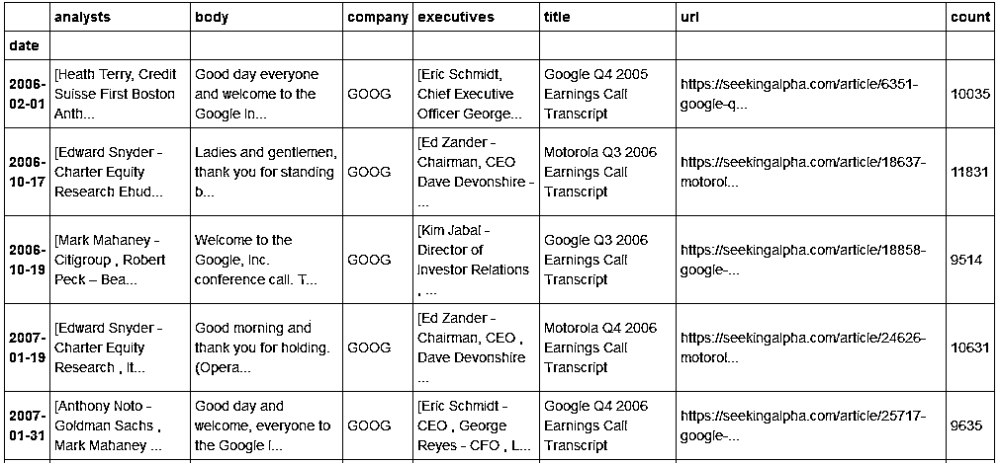

**步骤 3：分析数据**

```py
# Calculate average word count across all company transcripts
companies_avg_word_count = []

for company in company_transcripts_dict:
    company_avg = company_transcripts_dict[company]['count'].mean()
    companies_avg_word_count.append(company_avg)

print('Average word count in transcripts: {}'.format(np.mean(np.array(companies_avg_word_count))))
```

```py
Average word count in transcripts: 9449.255561736534
```

```py
# Plot histogram of word counts for company transcripts
def visualize_word_count(transcripts):
    '''
    Plots a histogram of a company's transcript word counts.

    Args:
        transcripts: A Pandas DataFrame containing a company's history of earnings calls.
    '''

    company = transcripts['company'][0]
    fig, ax = plt.subplots(figsize=(10,5))
    ax.hist(transcripts['count'])
    plt.title("Word count distribution for {}".format(company))
    ax.set_xlabel('Word count')
    ax.set_ylabel('Number of occurrences')

for company in transcript_samples:
    visualize_word_count(company)
```

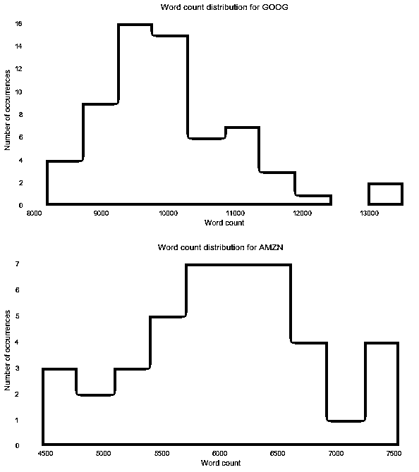

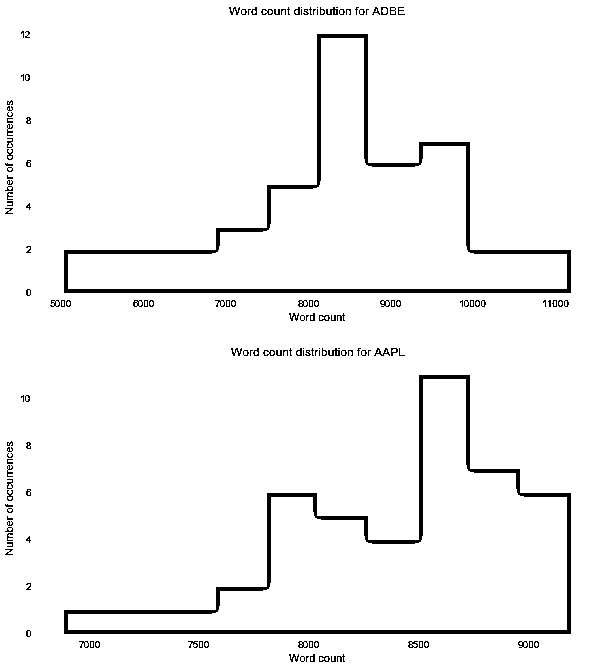

```py
# Visualize transcript dates
def visualize_dates(transcripts):
    '''
    Plots the dates of a company's earning calls.

    Args:
        transcripts: A Pandas DataFrame containing a company's history of earnings calls.
    '''

    company = transcripts['company'][0]
    fig, ax = plt.subplots(figsize=(22,5))
    ax.scatter(transcripts.index, np.ones(len(transcripts.index)), marker = 's', alpha=0.6, s=100)
    fig.autofmt_xdate()
    ax.set_title("Dates of earnings calls for {}".format(company))
    ax.set_yticklabels([])

for company in transcript_samples:
    visualize_dates(company)
```

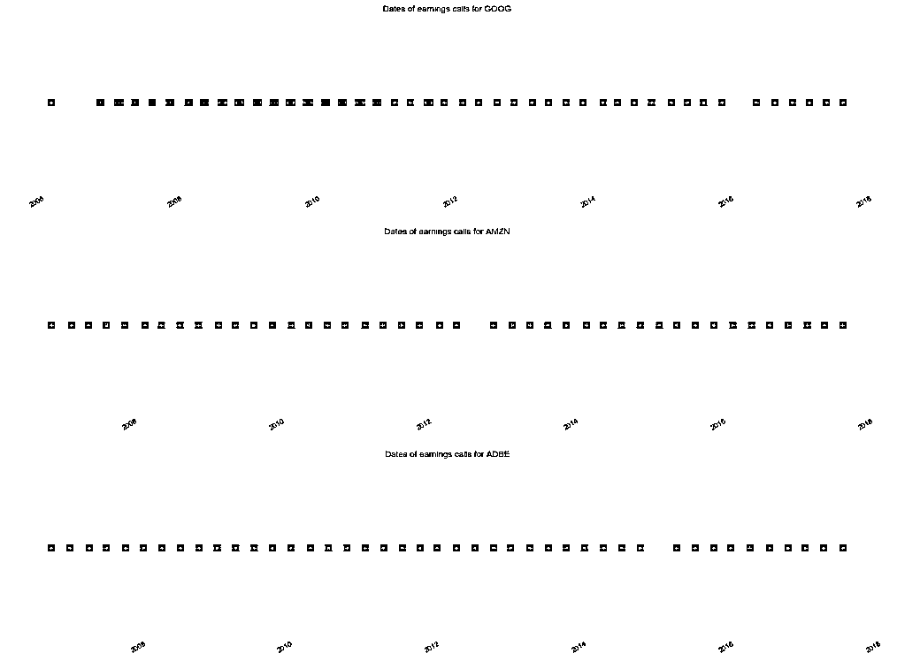


```py
# Average value of all S&P 500 companies
all_companies = load_company_price_history(company_both, normalize=False)
all_companies.mean(axis=1).plot()
plt.xlabel('Date')
plt.ylabel('Adjusted Closing Price')
plt.title('Average Daily Stock Price of all S&P 500 companies')
```

```py
google_true_prices = load_company_price_history(['GOOG'])
google_true_prices.plot()
plt.xlabel('Date')
plt.ylabel('Adjusted Closing Price')
plt.title('Google Stock Price')
```

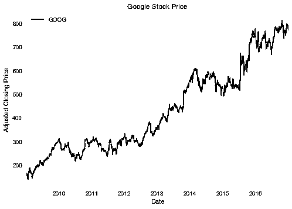

```py
google_prices.plot()
plt.xlabel('Date')
plt.ylabel('Daily Log Return')
plt.title('Google Daily Log Returns')
```


```py
price_samples.head(10)
```

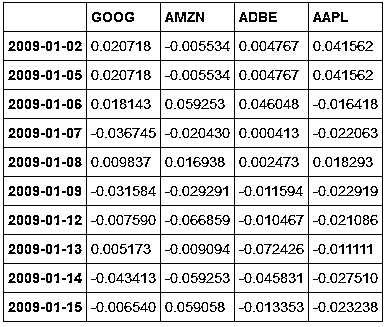

```py
cum_returns = price_samples.cumsum()
cum_returns.plot()
plt.title('Cumulative log-returns')
```

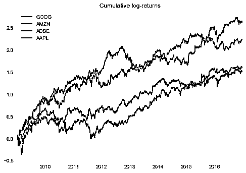

```py
tot_rel_returns = 100*(np.exp(price_samples.cumsum()) - 1)
tot_rel_returns.plot()
plt.title('Total relative returns')
```

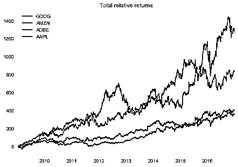

```py
google_price_sample = load_company_price_history(['GOOG'])['2012':'2015']
google_returns_sample = load_company_price_history(['GOOG'], normalize=True)['2012':'2015']
google_transcript_sample = load_company_transcripts('GOOG')['2012':'2015']
```

```py
2017-09-19 20:26:57,937 - DEBUG - Reading company prices for GOOG
2017-09-19 20:26:57,996 - INFO - Null values found after cleaning: False
2017-09-19 20:26:57,998 - DEBUG - Reading company prices for GOOG
2017-09-19 20:26:58,050 - INFO - Null values found after cleaning: False
2017-09-19 20:26:58,052 - DEBUG - Reading company transcripts for GOOG
2017-09-19 20:26:58,093 - WARNING - 1 duplicates removed from file
```

### **Comparing price data with earnings call events**

```py
def plot_price_and_text(prices, transcripts):
    '''
    Plots the dates of a company's earning calls on top of a chart of the company's stock price.

    Args:
        prices: A Pandas DataFrame containing a company's price history. 
        transcripts: A Pandas DataFrame containing a company's history of earnings calls.
    '''
    # Plot the transcript events below the price, 10% offset from min price
    event_level = int(prices.min()*0.9) 
    fig, ax = plt.subplots(figsize=(22,8))
    ax.scatter(transcripts.index, event_level*np.ones(len(transcripts.index)), marker = 's', alpha=0.4, s=100)
    ax.plot(prices.index, prices)
    fig.autofmt_xdate()
    ax.set_title('Analyzing the connection between earnings call events and price movement')

plot_price_and_text(google_price_sample, google_transcript_sample)
```

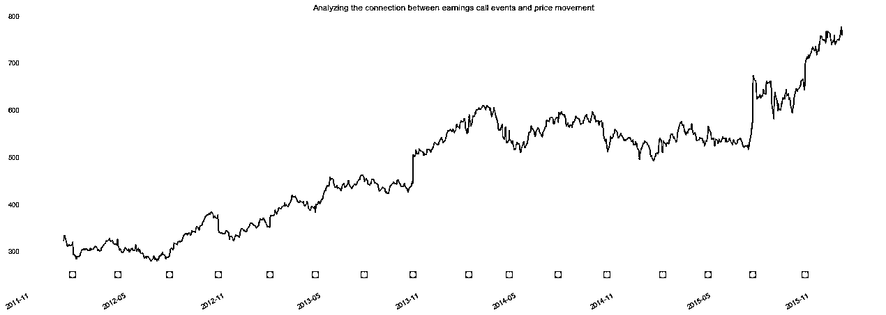

### **Explore connection between text events and returns**

```py
def plot_returns_and_text(returns, transcripts):
    # Plot the transcript events below the price, 10% offset from min price
    event_level = int(returns.min()*0.9) 
    fig, ax = plt.subplots(figsize=(22,8))
    #ax.scatter(transcripts.index, 0.1*np.ones(len(transcripts.index)), marker = 's', alpha=0.4, s=100)
    ax.plot(returns.index, returns)
    for date in transcripts.index:
        ax.axvspan(date - pd.to_timedelta('1 days'), date + pd.to_timedelta('6 days'), color='green', alpha=0.15)
    fig.autofmt_xdate()
    ax.set_title('Analyzing the connection between earnings call events and price movement')
    ax.set_ylabel('Daily return')

plot_returns_and_text(google_returns_sample, google_transcript_sample)
```


```py
plot_returns_and_text(load_company_price_history(['CMG'], normalize=True)['2012':'2015'],
                      load_company_transcripts('CMG')['2012':'2015'])
```

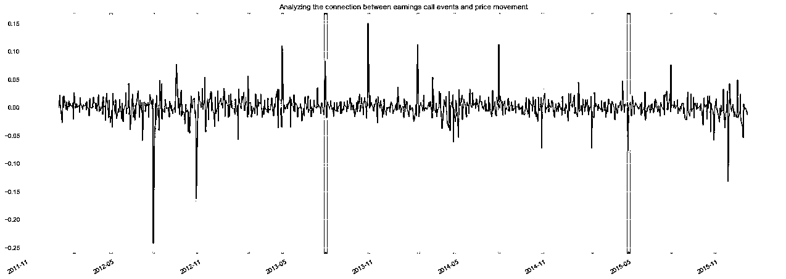

Clearly, we can see some examples of large price movements surrounding the time of quarterly earnings calls. The goal of this project is to develop an algorithm capable of learning the price movements associated with the content of an earnings call.

**步骤 4：将文本转换为文字嵌入**

```py
with open('glove.6B/glove.6B.50d.txt') as words:
    w2v = {word.split()[0]: np.vectorize(lambda x: float(x))(word.split()[1:]) for word in words}

logging.info('{} words in word2vec dictionary.'.format(len(w2v)))

# We'll later reduce the dimensionality from 50 to 2, let's go ahead and fit the entire corpus
# I've opted to use PCA over t-SNE given that we can fit the transformer once and have deterministic results
from sklearn.decomposition import PCA
pca = PCA(n_components=2)
reduced_embeddings = pca.fit_transform(list(w2v.values()))
w2v_reduced = dict(zip(list(w2v.keys()), reduced_embeddings.tolist()))
```

```py
2017-10-04 09:55:50,937 - INFO - 400000 words in word2vec dictionary.
```

我们创建了一个字典，其中的关键字代表了我们词汇表中的单词，值是给定单词的向量表示。可以通过查询字典来访问单词的 50 维向量。并将 50 维矢量投影到二维中，以便于观察。

```py
w2v['example']
```

```py
array([ 0.51564  ,  0.56912  , -0.19759  ,  0.0080456,  0.41697  ,
        0.59502  , -0.053312 , -0.83222  , -0.21715  ,  0.31045  ,
        0.09352  ,  0.35323  ,  0.28151  , -0.35308  ,  0.23496  ,
        0.04429  ,  0.017109 ,  0.0063749, -0.01662  , -0.69576  ,
        0.019819 , -0.52746  , -0.14011  ,  0.21962  ,  0.13692  ,
       -1.2683   , -0.89416  , -0.1831   ,  0.23343  , -0.058254 ,
        3.2481   , -0.48794  , -0.01207  , -0.81645  ,  0.21182  ,
       -0.17837  , -0.02874  ,  0.099358 , -0.14944  ,  0.2601   ,
        0.18919  ,  0.15022  ,  0.18278  ,  0.50052  , -0.025532 ,
        0.24671  ,  0.10596  ,  0.13612  ,  0.0090427,  0.39962  ]) 
```

```py
w2v_reduced['example']
```

```py
[4.092878121172412, 1.785939893037579]
```

```py
# Sample transcripts from collection
sample_text_google = google_transcripts['body'][5]
sample_text_amazon = amazon_transcripts['body'][5]
sample_text_adobe = adobe_transcripts['body'][5]
```

Let's see what words were ignored when we translate the transcripts to word embeddings.

```py
from keras.preprocessing.text import text_to_word_sequence

not_in_vocab = set([word for word in text_to_word_sequence(sample_text_google) if word not in w2v])
print('  --  '.join(not_in_vocab))
```

```py
motofone  --  segment's  --  we're  --  ml910  --  here's  --  we've  --  doesn't  --  didn't  --  ed's  --  z6  --  asp's  --  vhub  --  p2k  --  weren't  --  you're  --  3gq  --  i'll  --  ray's  --  wasn't  --  they're  --  what's  --  i'd  --  motowi4  --  world's  --  embracement  --  downish  --  broadbus  --  hereon  --  devices'  --  shippable  --  w355  --  motorola's  --  w205  --  that’s  --  isn't  --  morning's  --  mw810  --  wimax's  --  that's  --  wouldn't  --  ounjian  --  let's  --  w215  --  dan's  --  motoming  --  organization's  --  krzr  --  reprioritizing  --  w510  --  mc50  --  greg's  --  today's  --  mc70  --  terry's  --  we'll  --  company's  --  don't  --  5ish  --  haven't  --  kvaal  --  you've  --  you'll  --  can't  --  nottenburg  --  motorokr  --  what’s  --  mc35  --  i've  --  metlitsky  --  there's  --  july's  --  w370  --  i'm  --  it's  --  motorizr
```

词嵌入字典不支持连词。 然而，这应该是正确的，因为大多数会被视为停用词。 

A note on stopwords, these are words that are very commonly used and their presence does little to convey a unique signature of a body of text. They're useful in everyday conversations, but when you're identifying text based on the frequency of words used, they're next to useless.

**TF-IDF 权重**

```py
from sklearn.feature_extraction.text import CountVectorizer, TfidfTransformer

def get_tfidf_values(documents, norm=None):
    count_vec = CountVectorizer()
    counts = count_vec.fit_transform(documents)
    words = np.array(count_vec.get_feature_names())

    transformer = TfidfTransformer(norm=norm)
    tfidf = transformer.fit_transform(counts)
    tfidf_arr = tfidf.toarray()

    tfidf_documents = []
    for i in range(len(documents)):
        tfidf_doc = {}
        for word, tfidf in zip(words[np.nonzero(tfidf_arr[i, :])], tfidf_arr[i, :][np.nonzero(tfidf_arr[i, :])]):
            tfidf_doc[word] = tfidf
        tfidf_documents.append(tfidf_doc)
    return tfidf_documents

def docs_to_3D(tfidf_documents, w2v_reduced):
    text_docs_3D = []

    for i, doc in enumerate(tfidf_documents): # list of documents with word:tfidf
        data = []
        for k, v in tfidf_documents[i].items():
            try:
                item = w2v_reduced[k][:] # Copy values from reduced embedding dictionary
                item.append(v) # Append the TFIDF score
                item.append(k) # Append the word
                data.append(item) # Add [dim1, dim2, tfidf, word] to collection
            except: # If word not in embeddings dictionary
                continue 

        df = pd.DataFrame(data, columns=['dim1', 'dim2', 'tfidf', 'word'])
        df = df.set_index(['word'])

        text_docs_3D.append(df)

    return text_docs_3D

from mpl_toolkits.mplot3d import Axes3D
```
```py


```
plt.hist(text_docs_3D[0]['tfidf'].apply(np.sqrt), range=(0,20))
```py

```
(array([ 911.,  679.,   88.,   15.,   12.,    3.,    2.,    1.,    2.,    2.]),
 array([  0.,   2.,   4.,   6.,   8.,  10.,  12.,  14.,  16.,  18.,  20.]), 
```py


**Evolution of company transcripts over time**

Enhancement: rather than providing a list of word embedding vectors to plot, pass a dictionary of word:vector pairs so that user can hover mouse over points to see what words are.

```
from matplotlib import rc
# equivalent to rcParams['animation.html'] = 'html5'
rc('animation', html='html5')

from matplotlib.animation import FuncAnimation
from IPython.display import HTML

import matplotlib.pyplot as plt
from mpl_toolkits.mplot3d import Axes3D

def animate_company_transcripts_3D(vis_docs):
    fig = plt.figure()
    ax = fig.add_subplot(111, projection='3d')
    ax.set_xlim([-3, 6])
    ax.set_ylim([-3, 6])
    ax.set_zlim([0, 20])
    ax.set_xlabel('Word Embedding')
    ax.set_ylabel('Word Embedding')
    ax.set_zlabel('Word Importance')

    text = vis_docs[0]
    scatter = ax.scatter(text['dim1'], text['dim2'], text['tfidf'], alpha=0.1, 
                         zdir='z', s=20, c=None, depthshade=True, animated=True)

    def update(frame_number):
        text = vis_docs[frame_number]
        scatter._offsets3d = (text['dim1'], text['dim2'], text['tfidf'].apply(np.sqrt))
        return scatter

    return FuncAnimation(fig, update, frames=len(vis_docs), interval=300, repeat=True)

tfidf_docs = get_tfidf_values(google_transcripts['body'])
text_docs_3D = docs_to_3D(tfidf_docs, w2v_reduced)
animate_company_transcripts_3D(text_docs_3D)
```py


**Digitize input space for ConvNet**

```
def digitize_embedding_space(text_docs_3D, index, bins=250):
    binned_docs = []
    for frame, data in enumerate(text_docs_3D):
        doc = text_docs_3D[frame]

        # Sort collection of word embeddings in continous vector space to a 2D array of bins. Take square root of 
        # TF-IDF score as a means of scaling values to prevent a small number of terms from being too dominant.
        hist = np.histogram2d(doc['dim1'], doc['dim2'], weights=doc['tfidf'].apply(np.sqrt), bins=bins)[0]
        binned_docs.append(hist)

    # Technically, you shouldn't store numpy arrays as a Series
    # Somehow, I was able to hack my way around that, but when you try to reindex the Series it throws an error
    # It was convenient to use the Series groupby function, though
    # NOTE: This should be revisited at some point using xarray or some other more suitable data store
    text_3D = pd.Series(binned_docs, index=index)

    # Combine same-day events
    if text_3D.index.duplicated().sum() > 0:
        logging.info('{} same-day events combined.'.format(text_3D.index.duplicated().sum()))
    text_3D = text_3D.groupby(text_3D.index).apply(np.mean)

    # Now I'll convert the Series of numpy 2d arrays into a list of numpy 2d array (losing the date index)
    # and create another Series that ties the date to the list index of text_docs 
    text_docs = text_3D.values.tolist()
    lookup = pd.Series(range(len(text_docs)), index = text_3D.index)

    return text_docs, lookup
```py

### Develop full text processing pipeline

```
def process_text_for_input(documents, w2v_reduced, norm=None):
    index = documents.index
    tfidf_docs = get_tfidf_values(documents, norm=norm)
    text_docs_3D = docs_to_3D(tfidf_docs, w2v_reduced)
    text_docs, lookup = digitize_embedding_space(text_docs_3D, index)
    return text_docs, lookup

# Test out pre-processing pipeline
text_docs, lookup = process_text_for_input(google_transcripts['body'], w2v_reduced)
```py

```
2017-09-19 17:28:52,774 - INFO - 2 same-day events combined.
```py

## **步骤五：ARIMA 模型**

**探索数据的统计属性**

```
# Note: this cell was copied from source as cited. 

# TSA from Statsmodels
import statsmodels.api as sm
import statsmodels.formula.api as smf
import statsmodels.tsa.api as smt
from statsmodels.graphics.api import qqplot

def tsplot(y, lags=None, title='', figsize=(14, 8)):
    '''Examine the patterns of ACF and PACF, along with the time series plot and histogram.
    Original source: https://tomaugspurger.github.io/modern-7-timeseries.html
    '''
```py
```

```py
# Load a few companies for inspection
company_price_ARIMA = load_company_price_history(['GOOG', 'AAPL', 'AMZN', 'CA', 'MMM'])

# Select a company and sample a two year time period, reindexing to have a uniform frequency
google_price_ARIMA = company_price_ARIMA['GOOG']['2012':'2013']

apple_price_ARIMA = company_price_ARIMA['AAPL']['2012':'2013']

logging.info("Index frequency: {}".format(google_price_ARIMA.index.freq))
```

```py
tsplot(google_price_ARIMA['2013'], title='Google price for 2013', lags =40)
```

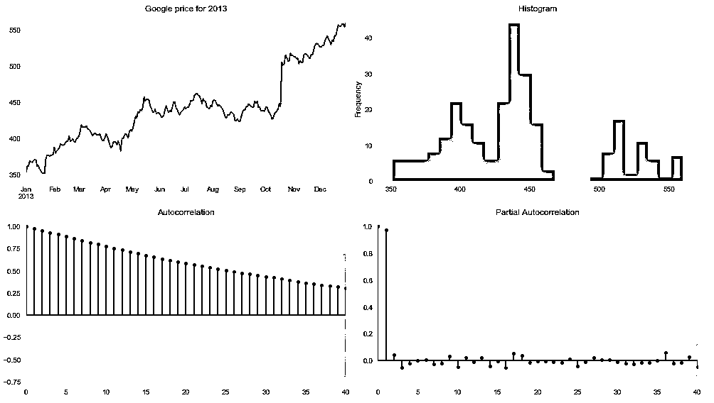

```py
tsplot(apple_price_ARIMA['2013'], title='Apple price for 2013', lags = 40)
```


看看自相关图，时间序列数据高度依赖于它的历史。

```py
google_returns_2013 = np.log(google_price_ARIMA['2013']).diff()[1:]
apple_returns_2013 = np.log(apple_price_ARIMA['2013']).diff()[1:]

tsplot(google_returns_2013, title='Google 2013 log returns', lags = 40)
```

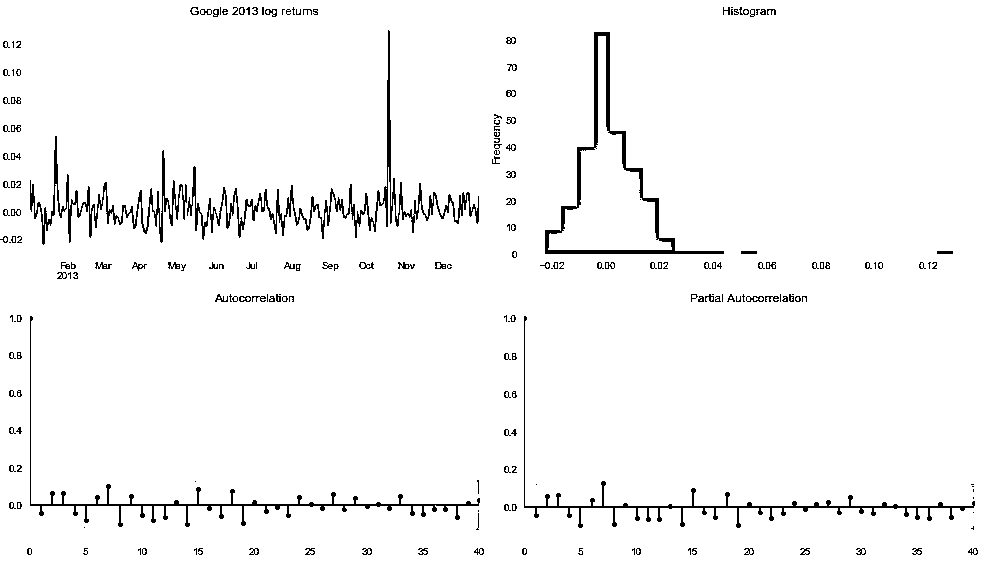

```py
tsplot(apple_returns_2013, title='Apple 2013 log returns', lags = 40)
```

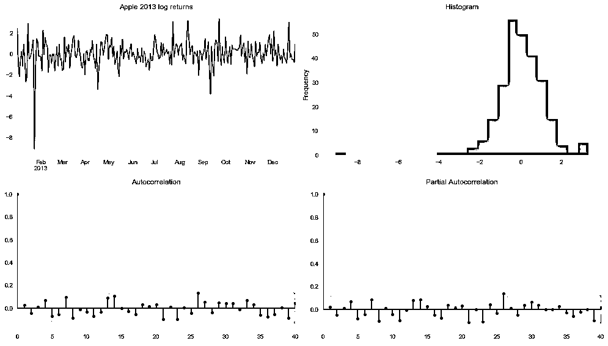

注意，一阶差分产生时间序列的平稳性。 因此，我们应该执行 d = 1。

返回大概遵循随机游走，其中当前时间步与先前的任何时间步不相关。 这表明一个 ARIMA（0,1,0）模型，其中最好的预测可以使它成为一个常数值。

**网格搜索最佳的 ARIMA 参数**

```py
import itertools

import warnings
warnings.filterwarnings("ignore") # Ignore convergence warnings

def grid_search_SARIMA(y, pdq_min, pdq_max, seasonal_period):
    p = d = q = range(pdq_min, pdq_max+1)
    pdq = list(itertools.product(p, d, q))
    seasonal_pdq = [(x[0], x[1], x[2], seasonal_period) for x in list(itertools.product(p, d, q))]

    best_params = []
    best_seasonal_params = []
    score = 1000000000000 # this is a bit of a hack

    for param in pdq:
        for param_seasonal in seasonal_pdq:
            try:
                mod = sm.tsa.statespace.SARIMAX(y,
                                                order=param,
                                                seasonal_order=param_seasonal,
                                                enforce_stationarity=False,
                                                enforce_invertibility=False)

                results = mod.fit()
                logging.info('ARIMA{}x{}12 - AIC:{}'.format(param, param_seasonal, results.aic))
                if results.aic < score:
                    best_params = param
                    best_seasonal_params = param_seasonal
                    score = results.aic
            except:
                continue
    logging.info('\n\nBest ARIMA{}x{}12 - AIC:{}'.format(best_params, best_seasonal_params, score))
    return best_params, best_seasonal_params, score

params, seasonal_params, score = grid_search_SARIMA(google_price_ARIMA, 0, 2, 12)
```

```py
ARIMA(0, 0, 0)x(0, 0, 1, 12)12 - AIC:6898.362293047701
ARIMA(0, 0, 0)x(0, 0, 2, 12)12 - AIC:6200.392463920813
ARIMA(0, 0, 0)x(0, 1, 1, 12)12 - AIC:4377.816871987012
ARIMA(0, 0, 0)x(0, 1, 2, 12)12 - AIC:4278.05126125979
```
```py

```
mod = sm.tsa.statespace.SARIMAX(google_price_ARIMA,
                                order=(0, 1, 2),
                                seasonal_order=(0, 1, 2, 12),
                                enforce_stationarity=False,
                                enforce_invertibility=False)

results = mod.fit()

print(results.summary().tables[1])
```py


```
pred = results.get_prediction(start = pd.to_datetime('2013-10-1'), end = pd.to_datetime('2013-12-31'), dynamic=False)
pred_ci = pred.conf_int()

fig, ax = plt.subplots(figsize=(20,10))
ax.plot(google_price_ARIMA.index, google_price_ARIMA, 
        label='Observed stock price')
ax.plot(pred.predicted_mean.index, pred.predicted_mean, 
        label='One-step ahead forecast', alpha=.7)
fig.autofmt_xdate()
ax.fill_between(pred_ci.index,
                pred_ci.iloc[:, 0],
                pred_ci.iloc[:, 1], color='k', alpha=.2)
ax.set_xlabel('Date')
ax.set_ylabel('Stock price')
ax.set_title('In sample one-step prediction')
plt.legend()
```py


```
pred_dynamic = results.get_prediction(start = pd.to_datetime('2013-11-1'), dynamic=True, full_results=True)
pred_ci_dynamic = pred_dynamic.conf_int()

fig, ax = plt.subplots(figsize=(20,10))
ax.plot(google_price_ARIMA.index, google_price_ARIMA, 
        label='Observed stock price')
ax.plot(pred_dynamic.predicted_mean.index, pred_dynamic.predicted_mean, 
        label='Dynamic forecast', alpha=.7)
fig.autofmt_xdate()
ax.fill_between(pred_ci_dynamic.index,
                pred_ci_dynamic.iloc[:, 0],
                pred_ci_dynamic.iloc[:, 1], color='k', alpha=.2)
ax.set_xlabel('Date')
ax.set_ylabel('Google stock price')
ax.set_title('In sample dynamic prediction')
ax.set_ylim(200,600)
plt.legend()
```py


```
# Get forecast 500 steps ahead in future
pred_future = results.get_forecast(steps=100)

# Get confidence intervals of forecasts
pred_future_ci = pred_future.conf_int()

fig, ax = plt.subplots(figsize=(20,10))
ax.plot(company_price_ARIMA['GOOG']['2013':'2014-05-01'].index, company_price_ARIMA['GOOG']['2013':'2014-05-01'], 
        label='Observed stock price')
ax.plot(pd.to_datetime(pred_future.predicted_mean.index), pred_future.predicted_mean, 
        label='Dynamic forecast', alpha=.7)
fig.autofmt_xdate()
ax.fill_between(pred_future_ci.index,
                pred_future_ci.iloc[:, 0],
                pred_future_ci.iloc[:, 1], color='k', alpha=.2)
ax.set_xlabel('Date')
ax.set_ylabel('Google stock price 2013')
ax.set_title('Out of sample prediction')
ax.set_ylim(200,800)
plt.legend()
```py


**训练**

除非时间序列数据是由同一过程生成的，否则 ARIMA 模型通常不会在时间序列上进行训练。 对于股票价格的情况，对个别公司的影响是独立的，对所有公司的影响并不一致。 因此，5 种不同的 ARIMA 模型将针对不同的公司进行训练，分别评估每个模型并平均每个结果。

```
google_arima_train = company_price_df['GOOG']['2009':'2012']
amazon_arima_train = company_price_df['AMZN']['2009':'2012']
mmm_arima_train = company_price_df['MMM']['2009':'2012']
chipotle_arima_train = company_price_df['CMG']['2009':'2012']
duke_arima_train = company_price_df['DUK']['2009':'2012']

companies_train = [google_arima_train, amazon_arima_train, mmm_arima_train, chipotle_arima_train, duke_arima_train]

google_arima_test = company_price_df['GOOG']['2013':'2014']
amazon_arima_test = company_price_df['AMZN']['2013':'2014']
mmm_arima_test = company_price_df['MMM']['2013':'2014']
chipotle_arima_test = company_price_df['CMG']['2013':'2014']
duke_arima_test = company_price_df['DUK']['2013':'2014']

companies_test = [google_arima_test, amazon_arima_test, mmm_arima_test, chipotle_arima_test, duke_arima_test]

company_results = []
for company_price in companies_train:
    model = sm.tsa.statespace.SARIMAX(company_price,
                                order=(0, 1, 2),
                                seasonal_order=(0, 1, 2, 12),
                                enforce_stationarity=False,
                                enforce_invertibility=False)

    results = model.fit()
    company_results.append(results)
```py

**评估**

我们将在三个时间尺度上评估每个模型：5 天预测，20 天预测和 100 天预测。 长期预测非常困难，特别是对于随机过程；因此，短期预测提供了一个更合理的业绩衡量标准。

```
forecast_5_day = []
forecast_20_day = []
forecast_100_day = []

for result in company_results:
    forecast_5_day.append(result.get_forecast(steps=5))
    forecast_20_day.append(result.get_forecast(steps=20))
    forecast_100_day.append(result.get_forecast(steps=100))

from sklearn.metrics import mean_absolute_error

forecast_5_day_mae = []
for true, pred in zip(companies_test, forecast_5_day):
    forecast_5_day_mae.append(mean_absolute_error(true.iloc[0:5], pred.predicted_mean))

forecast_20_day_mae = []
for true, pred in zip(companies_test, forecast_20_day):
    forecast_20_day_mae.append(mean_absolute_error(true.iloc[0:20], pred.predicted_mean))

forecast_100_day_mae = []
for true, pred in zip(companies_test, forecast_100_day):
    forecast_100_day_mae.append(mean_absolute_error(true.iloc[0:100], pred.predicted_mean))

print('Average MAE across companies (5 day): {:.6f}'.format(np.mean(forecast_5_day_mae)))
print('Average MAE across companies (20 day): {:.6f}'.format(np.mean(forecast_20_day_mae)))
print('Average MAE across companies (100 day): {:.6f}'.format(np.mean(forecast_100_day_mae)))
```py

```
Average MAE across companies (5 day): 0.009500
Average MAE across companies (20 day): 0.009690
Average MAE across companies (100 day): 0.009965
```py

让我们来看看长期预测是怎样的。

```
fig, ax = plt.subplots(figsize=(20,10))
ax.plot(google_arima_test.iloc[0:100], label='True')
ax.plot(forecast_100_day[0].predicted_mean, label='Pred')
ax.set_title('ARIMA: 100 Day Forecast of Google (starting Jan 1, 2013)')
plt.legend()
```py


## **步骤六：LSTM 模型**

**数据准备**

```
# Load a test company for inspection
LSTM_company_prices = load_company_price_history(['GOOG', 'AMZN', 'MMM', 'CMG', 'DUK'], normalize = True)

LSTM_prices_train = LSTM_company_prices['2009':'2012']
LSTM_prices_test = LSTM_company_prices['2013':'2014']
LSTM_prices_val = LSTM_company_prices['2015':'2016']

def price_generator(data, window=180, batch_size=128):

    timesteps = data.shape[0]
    companies = data.shape[1]

    if window + batch_size > timesteps:
        logging.warning('Not enough data to fill a batch, forcing smaller batch size.')
        batch_size = timesteps - window

    # Index to keep track of place within price timeseries, corresponds with the last day of output
    i = window

    # Index to keep track of which company to query the data from
    j = 0

    while True:
        # If there aren't enough sequential days to fill a batch, go to next company
        if i + batch_size >= timesteps:
            i = window

            # If end of companies has been reached, start back at first company
            if j+1 >= companies:
                j=0
            else:
                j+=1

        samples = np.arange(i, i + batch_size)
        i += len(samples)

        # 代码太多略去
```py

**建立模型**

```
from keras.models import Sequential
from keras.layers import Dense, TimeDistributed, LSTM

# define LSTM configuration
n_features = 1 # only price
window = 180 # look back 50 days
batch_size = 128

# create LSTM
price_only_model = Sequential()
price_only_model.add(LSTM(20, input_shape=(window, n_features), return_sequences=True))
price_only_model.add(LSTM(60, return_sequences=True))
price_only_model.add(TimeDistributed(Dense(1)))
print(price_only_model.summary())
```py


```
from keras.callbacks import ModelCheckpoint 

price_only_model.compile(loss='mean_absolute_error', optimizer='adam')

checkpointer = ModelCheckpoint(filepath='saved_models/weights.best.price_only.hdf5', 
                               verbose=1, save_best_only=True)

# Train LSTM
history = price_only_model.fit_generator(train_gen, steps_per_epoch=train_steps, epochs=3, callbacks=[checkpointer], 
                                         validation_data=val_gen, validation_steps=val_steps)
```py


```
# Load weights from previous training
price_only_model.load_weights('saved_models/weights.best.price_only.hdf5')

def validation_curve(history):
    loss = history.history['loss']
    val_loss = history.history['val_loss']
    epochs = range(len(loss))

    plt.figure()
    plt.plot(epochs, loss, 'g', label='Training loss')
    plt.plot(epochs, val_loss, 'b', label='Validation loss')
    plt.title('Training and validation loss')
    plt.legend()

    validation_curve(history)
```py


**评估模型**

```
def forecast(seed_data, forecast_steps, model):
    '''
    Forecast future returns by making day-by-day predictions.

    Args:
        seed_data: Initial input sequence.
        forecast_steps: Defines how many steps into the future to predict.
        model: Trained LSTM prediction model. 
    '''

    future = []

    for timestep in range(forecast_steps):
        pred = model.predict(seed_data)[0][-1][0]
        future.append(pred)
        seed_data = np.append(seed_data[0][1:], [pred]).reshape(1, seed_data.shape[1], 1)

    return future

    # 代码太多略去 
```py

```
fig, ax = plt.subplots(figsize=(20,10))
ax.plot(company_prices_test.iloc[0:100, 0].values, label='True')
ax.plot(forecast_100_day[0], label='Pred')
ax.set_title('LSTM: 100 Day Forecast of Google (starting Jan 1, 2013)')
plt.legend()
```py


**测试评估**

```
mae = price_only_model.evaluate_generator(test_gen, steps=test_steps)
print('Mean absolute error on test data: {:.6f}'.format(mae))
```py

```
Mean absolute error on test data: 0.009176
```py

## **步骤七：ConvNet 特征提取**

在本节中，我们将为 ConvNet 模型准备数据，开发一个能够根据文本信息预测价格变动的模型，并从网络的最后一层提取特征，以便在卷积网络中输入。

只贴出核心代码

```
def text_generator(price_data, text_data, w2v_reduced, window=5, batch_size=1):
    companies = len(text_data)

    # Start with first transcript
    i = 0

    # Start with first company
    j = 0

    text_docs, lookup = process_text_for_input(text_data[j]['body'], w2v_reduced, norm='l2')

    while True:
        # If end of transcripts reached, go to next company
        if i >= len(lookup):
            i = 0
            if j+1 >= companies:
                j=0
            else:
                j+=1

            text_docs, lookup = process_text_for_input(text_data[j]['body'], w2v_reduced, norm='l2')

        event = lookup.index[i]
        text = text_docs[i].reshape(1, text_docs[i].shape[0], text_docs[i].shape[1], 1)
        price_target = company_prices[event : event + pd.to_timedelta('{} days'.format(window+1))].iloc[:,j].sum()

        yield text, np.array(price_target).reshape(1)

        i+= 1
```py
```

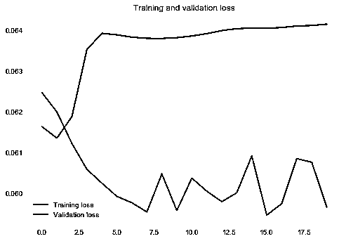

```py
# Run this cell to inspect a new example
text, price = next(test_gen)

print('Predicted return:\t{}'.format(text_model.predict(text)[0][0]))
print('True return:\t\t{}'.format(price[0]))
```

```py
Predicted return:	0.01737634837627411
True return:		0.06355231462064292
```

```py
mae = text_model.evaluate_generator(test_gen, steps=test_steps)
print('Mean absolute error on test data: {}'.forma
```

```py
Mean absolute error on test data: 0.057885023705180616
```

**步骤八：LSTM 价格+测试模型**

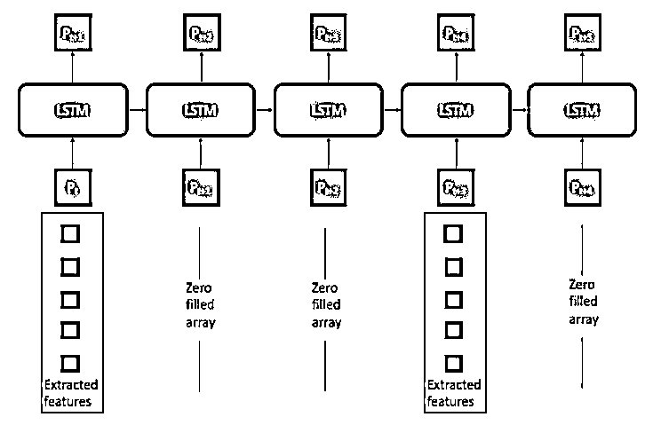

```py
companies = ['GOOG', 'AMZN', 'MMM', 'CMG', 'DUK']

company_transcripts_train = [load_company_transcripts(company)['2009':'2012'] for company in companies]
company_prices_train = load_company_price_history(companies, normalize=True)['2009':'2012']

```
window_size = 180
batch_size = 128
text_features = 10

train_gen = price_text_generator(company_prices_train, company_transcripts_train, w2v_reduced, extract_features, 
                                 text_features=text_features, window=window_size, batch_size=batch_size)
train_steps = (company_prices_train.shape[0] // batch_size)*company_prices_train.shape[1]

```py

def price_text_generator(price_data, text_data, w2v_reduced, extract_features_model, text_features, 
                         window=180, batch_size=128):
```

# Train LSTM
history = price_text_model.fit_generator(train_gen, steps_per_epoch=train_steps, epochs=3, callbacks=[checkpointer], 
                                         validation_data=val_gen, validation_steps=val_steps)

# Load weights from previous training
price_text_model.load_weights('saved_models/weights.best.price_with_text_features.hdf5')

validation_curve(history)

mae = price_text_model.evaluate_generator(test_gen, steps=test_steps)
print('Mean absolute error on test data: {:.6f}'.format(mae))
```py


```
2017-09-22 14:29:52,468 - INFO - 1 same-day events combined.
2017-09-22 14:29:55,605 - INFO - 1 same-day events combined.
```py

```
Mean absolute error on test data: 0.008930
```

**赠书活动**

量化投资与机器学习公众号联合博文视点 Broadview 送出**5 本****《****量化投资：以 Python 为工具》**

> 《量化投资：以 Python 为工具》主要讲解量化投资的思想和策略，并借助 Python 语言进行实战。《量化投资：以 Python 为工具》一共分为 5 部分，第 1 部分是 Python 入门，第 2 部分是统计学基础，第 3 部分是金融理论、投资组合与量化选股，第 4 部分是时间序列简介与配对交易，第 5 部分是技术指标与量化投资。《量化投资：以 Python 为工具》首先对 Python 编程语言进行介绍，通过学习，读者可以迅速掌握用 Python 语言处理数据的方法，并灵活运用 Python 解决实际金融问题；其次，向读者介绍量化投资的理论知识，主要讲解量化投资所需的数量基础和类型等方面；最后讲述如何在 Python 语言中构建量化投资策略。

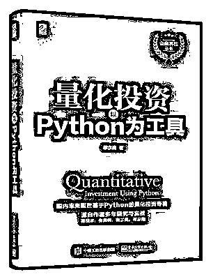

**原价：99.00 元**

**截止 2018.01.20 12:00**

大家在本篇推文【写留言】处发表留言，**获得点赞数前五的读者，即可免费获赠此书**。届时，工作人员会联系五位读者，寄出此书。

**获取本系列**

**代码+论文**

**请在后台回复**

**系列 51**

**即可获取**

有些人不知道**后台回复**如何操作

为大家介绍一下：


****