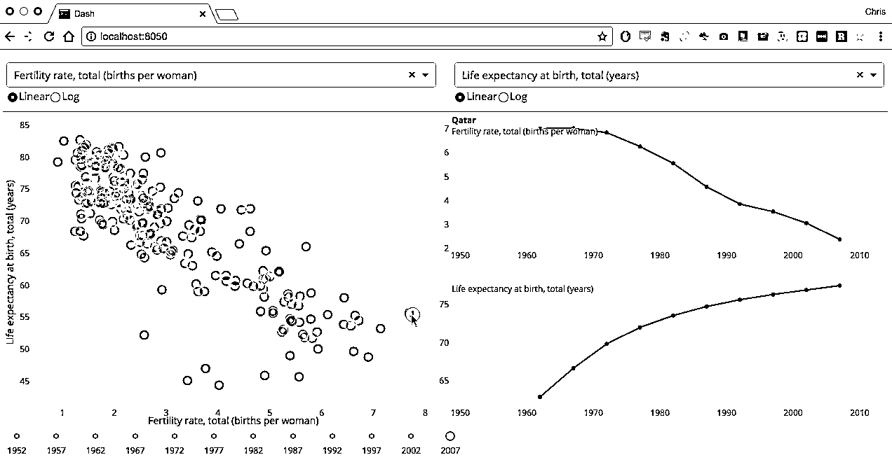
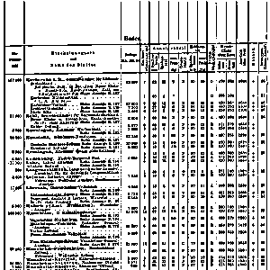

# 从 15000 个 Python 开源项目中精选的 Top30，Github 平均 star 为 3707，赶紧收藏！

> 原文：[`mp.weixin.qq.com/s?__biz=MzAxNTc0Mjg0Mg==&mid=2653287157&idx=1&sn=241665dbd04ff09a1b00236eb832f6a6&chksm=802e30e0b759b9f6a72bfd1286b7d3285a1c1a73df32e94147312ebe98a33c4f9328b0ef1fa6&scene=27#wechat_redirect`](http://mp.weixin.qq.com/s?__biz=MzAxNTc0Mjg0Mg==&mid=2653287157&idx=1&sn=241665dbd04ff09a1b00236eb832f6a6&chksm=802e30e0b759b9f6a72bfd1286b7d3285a1c1a73df32e94147312ebe98a33c4f9328b0ef1fa6&scene=27#wechat_redirect)

来源、翻译 | AI 科技大本营（ID：rgznai100） 

参与 | SuiSui

Mybridge AI 推出了一个 Python 开源项目 Top 30 榜单，包括开源 Python 库、工具等。该榜单基于项目质量、用户参与度以及其他几个方面进行了评估，从大约 15000 个开源项目中挑选了 Top 30，差不多都是在 2017 年 1-12 月发布。这些项目在 Github 上的平均 star 为 3707。

## No 1：Home-assistant (v0.6+)

基于 Python 3 的开源家庭自动化平台[Github 11357 stars，由 Paulus Schoutsen 提供]

***https://github.com/home-assistant/home-assistant***

## No 2：Pytorch

PyTorch 是使用 GPU 和 CPU 优化的深度学习张量库，基于 Python 语言编写。[Github 11019 stars，由 PyTorch 团队的 Adam Paszke 和其他人提供]

***https://github.com/pytorch/pytorch***

## No 3：Grumpy

Grumpy 是一个 Python to Go 的源代码翻译编译器和运行时，旨在取代 CPython 2.7。关键区别在于，Grumpy 是将 Python 源码编译为 Go 源代码，然后将其编译为 native code，而不是 bytecode。这也就意味着 Grumpy 没有虚拟机（VM）。编译好的 Go 源码是对 Grumpy 运行时的一系列调用，一个 Go 库服务于具有相似目的的 Python C API。 [Github 8367 stars，由 Google 的 Dylan Trotter 及其他工作人员提供]。

***https://github.com/google/grumpy***

## No 4：Sanic

该项目是一个类 Flask 的 Python 3.5+ 网页服务器，专为加速而设计。Sanic 支持异步请求处理，意味着你可以使用 Python 3.5 中一些 async/await 语法。。[Github 8028 stars，由 Channel Cat 和 Eli Uriegas 提供]

***https://github.com/channelcat/sanic***

## No 5：Python-fire

一个可以从任何 Python 对象自动生成命令行界面（CLI）的库。 [Github 7775 stars，来自 Google Brain 的 David Bieber]

***https://github.com/google/python-fire***

## No 6：spaCy（v2.0）

该项目是一个使用 Python 和 Cython 的进行高级自然语言处理（NLP）的开源库 [Github 7633 stars，由 Matthew Honnibal 提供]

***https://github.com/explosion/spaCy***

## No 7：Pipenv

Python.org 官方推荐的 Python 打包工具。它会自动为项目创建和管理 virtualenv，并在安装/卸载软件包时从 Pipfile 中添加/删除软件包。 [Github 7273 stars，由 Kenneth Reitz 提供]

***https://github.com/pypa/pipenv***

## No 8：MicroPython

一个脱胎于 Python 且非常高效的 Python 实现，主要是为了能在嵌入式硬件上（这里特指微控制器级别）更简单地实现对底层的操作。[Github 5728 stars]

***https://github.com/micropython/micropython***

## No 9：Prophet

该工具是 Facebook 开源的一款用于为多周期性的线性或非线性时间序列数据生成高质量预测的工具。[Github 4369 stars，由 Facebook 提供]

***https://github.com/facebook/prophet***

## No 10：Serpent AI

该项目是一个 Python 写的游戏代理框架，简单而强大，可帮助开发者创建游戏代理。可将任何视频游戏变成一个 Python 写成的成熟沙箱环境。该框架的目的是为机器学习和 AI 研究提供一个有价值的工具，不过对于爱好者来说也是非常有趣的。[Github 3411 stars，由 Nicholas Brochu 提供]

***https://github.com/SerpentAI/SerpentAI***

## No 11：Dash

Dash 是一个纯 Python 写成的框架，无需 JavaScript 即可构建交互式的分析类 web 应用程序。[Github 3281 stars，由 Chris P 提供]

***https://github.com/plotly/dash***

## No 12：InstaPy

Instagram 机器人，喜欢/评论/Follow 自动化脚本。[Github 3179 stars，由 TimG 提供]。

***https://github.com/timgrossmann/InstaPy***

## No 13：Apistar

专为 Python 3 定制的 Web API 框架[Github 3024 stars，Tom Christie 提供]。

***https://github.com/encode/apistar***

## No 14：Faiss

用于密集向量的高效相似性搜索库和聚类的库 [GitHub 2717 stars，贡献者 Facebook Research]

***https://github.com/facebookresearch/faiss***

## No 15：MechanicalSoup

一个与网站自动交互的 Python 库，自动存储和发送 cookies，支持重定向，并可以跟踪链接和提交表格。[Github 2244 stars]

***https://github.com/MechanicalSoup/MechanicalSoup***

## No 16：Better-exceptions

该项目以更友好的形式展示 Python 中的异常信息。[Github 2121 stars，贡献者 Qix]

***https://github.com/Qix-/better-exceptions***

## No 17：Flashtext

该项目基于 FlashText 算法，用以高效搜索句子中的关键词并进行替代。[Github 2019 stars，由 Vikash Singh 提供]。

***https://github.com/vi3k6i5/flashtext***

## No 18：Maya

在不同系统上的不同语言环境中，Python 对日期时间的处理非常不畅，Maya 主要就是为了解决解析网站时间数据问题。[Github 1828 stars，Kenneth Reitz 提供]

***https://github.com/kennethreitz/maya***

## No 19：Mimesis

是一个快速易用的 Python 库，可以用不同语言为基于不同的目的生成合成数据。这些数据在软件开发和测试阶段非常有用。[Github 1732 stars，由 LíkieGeimfari 提供]

***https://github.com/lk-geimfari/mimesis***

## No 20：Open-paperless

该项目是一个一个文件管理系统，可扫描、索引和归档所有纸张文档。[Github 1717 stars，由 Tina Zhou 提供]

***https://github.com/zhoubear/open-paperless***

## No 21：Fsociety

黑客工具包，渗透测试框架。[Github 1585 stars，Manis Manisso 提供]

## No 22：LivePython

Python 代码实时可视化跟踪。[Github 1577 stars，由 Anastasis Germanidis 提供]

***https://github.com/agermanidis/livepython***

## No 23：Hatch

一个 Python 项目、包以及虚拟环境的管理工具。[Github 1537 stars，由 Ofek Lev 提供]

***https://github.com/ofek/hatch***

## No 24：Tangent

该项目是谷歌开源的一个用于自动微分的源到源纯 Python 库。[Github 1433 stars，来自 Google Brain 的 Alex Wiltschko 以及其他人]。

***https://github.com/google/tangent***  

## No 25：Clairvoyant

一个 Python 程序，用于识别和监控短期库存移动的历史线索[Github 1159 stars，由 Anthony Federico 提供]。

***https://github.com/anfederico/Clairvoyant***

## No 26：MonkeyType

该项目是 Instagram 开源的一款适用于 Python 的工具，通过收集运行时类型来生成静态类型注释。[Github 1137 stars，由 Instagram 工程师 Carl Meyer 提供]。

***https://github.com/Instagram/MonkeyType***

## No 27：Eel

该项目是一个小型 Python 库，用于制作简单的类似 Electron 的离线 HTML/JS GUI 应用程序，当前仅支持 Python3。 [Github 1137 stars]

***https://github.com/ChrisKnott/Eel***

## No 28：Surprise v1.0

用于构建和分析推荐系统的 Python scikit  [Github 1103 stars]

***https://github.com/NicolasHug/Surprise***

## No 29：Gain

Web 爬虫框架。[Github 1009 stars，由高久力提供]

***https://github.com/gaojiuli/gain***

## No 30：PDFTabExtract

一组用于从 PDF 文件中提取表格的工具，有助于在扫描的文档上进行数据挖掘。 [Github 722 stars]

***https://github.com/WZBSocialScienceCenter/pdftabextract***

> ***https://medium.mybridge.co/30-amazing-python-projects-for-the-past-year-v-2018-9c310b04cdb3***

****