# 用 NLP 自然语言处理技术感知市场温度——万得 3C 中国会议专场报告（PPT+音频）

> 原文：[`mp.weixin.qq.com/s?__biz=MzAxNTc0Mjg0Mg==&mid=2653287153&idx=1&sn=1796113a4d48a1d70929c326b6f22b0c&chksm=802e30e4b759b9f2b4f6efb19b1d861d2f43aaf665ca627c086a27fd77ff4e5c2f2207514afb&scene=27#wechat_redirect`](http://mp.weixin.qq.com/s?__biz=MzAxNTc0Mjg0Mg==&mid=2653287153&idx=1&sn=1796113a4d48a1d70929c326b6f22b0c&chksm=802e30e4b759b9f2b4f6efb19b1d861d2f43aaf665ca627c086a27fd77ff4e5c2f2207514afb&scene=27#wechat_redirect)

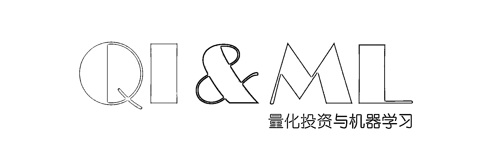

2018 年 1 月 12 日，公众号作为全网受 **Wind（万得）**邀请的自媒体平台

参加了**中国最专业的机构路演平台**

我们很荣幸，能够和各大金融机构、金融大咖在此平台上分享我们的研究心得。这既是对公众号的认可，也是对公众号编辑部所有人的肯定。

下面就给大家分享这次会议演讲的 PPT 和音频录音。

**录音音频**请点击**阅读原文**进行收听

**（由于微信不能上传大于 30 分钟的音频，请大家谅解！）**

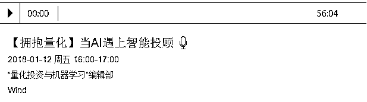

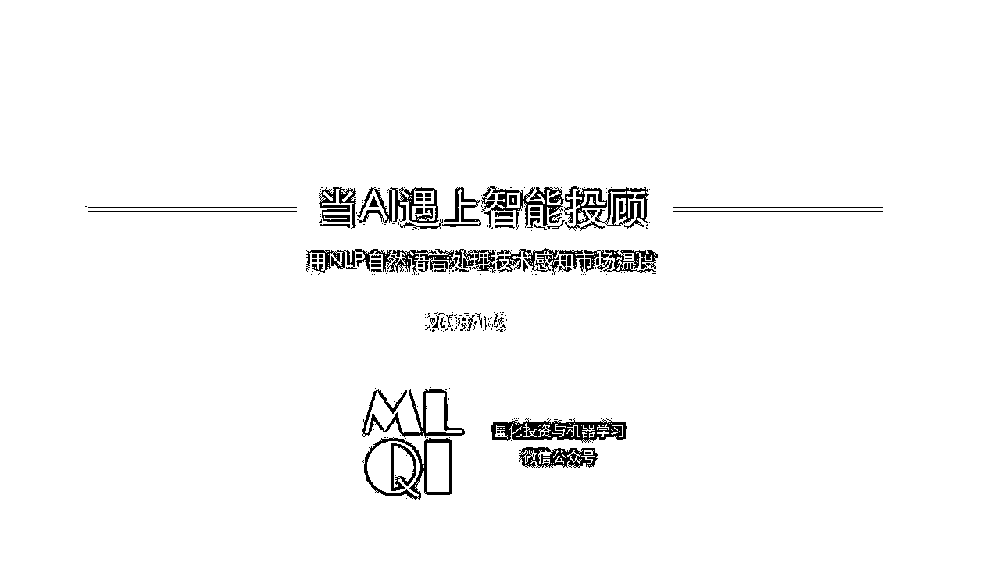

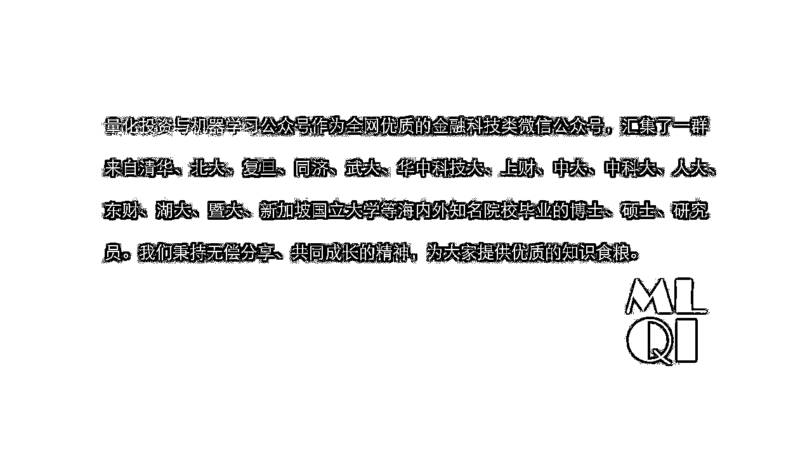

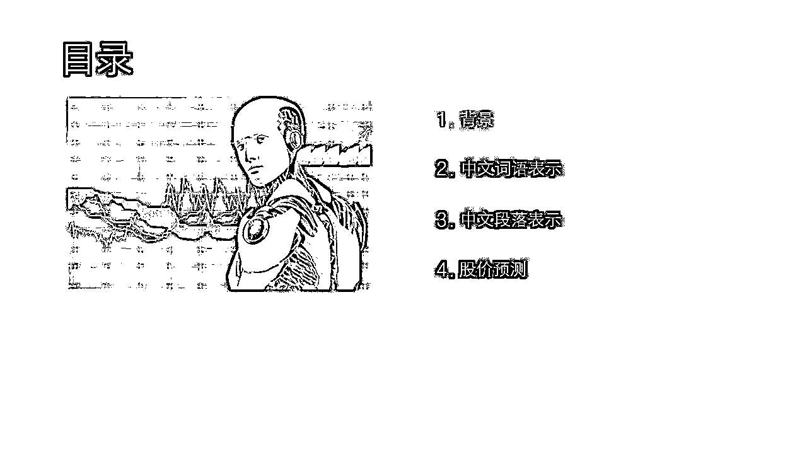

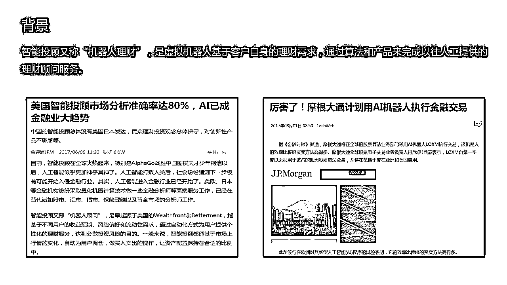

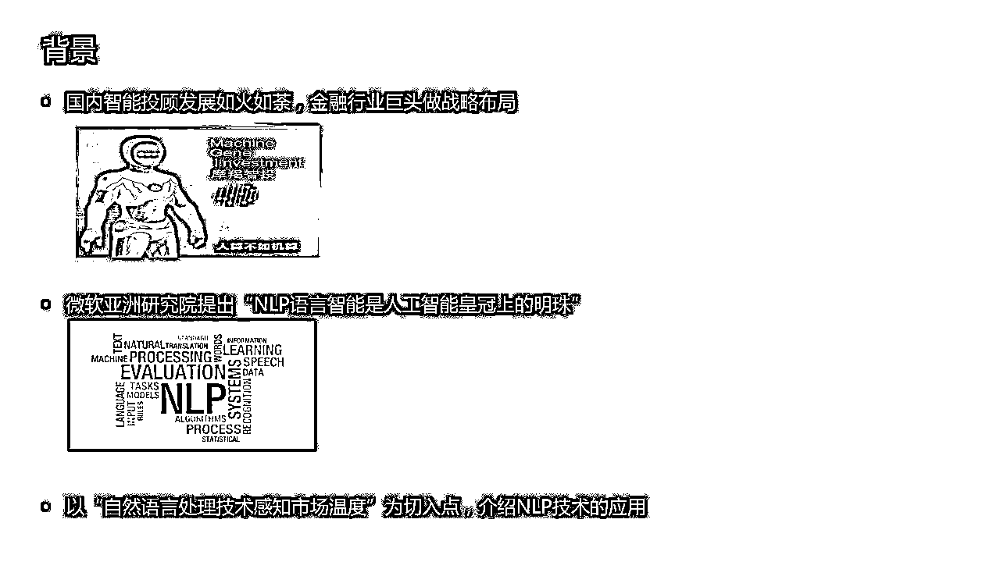

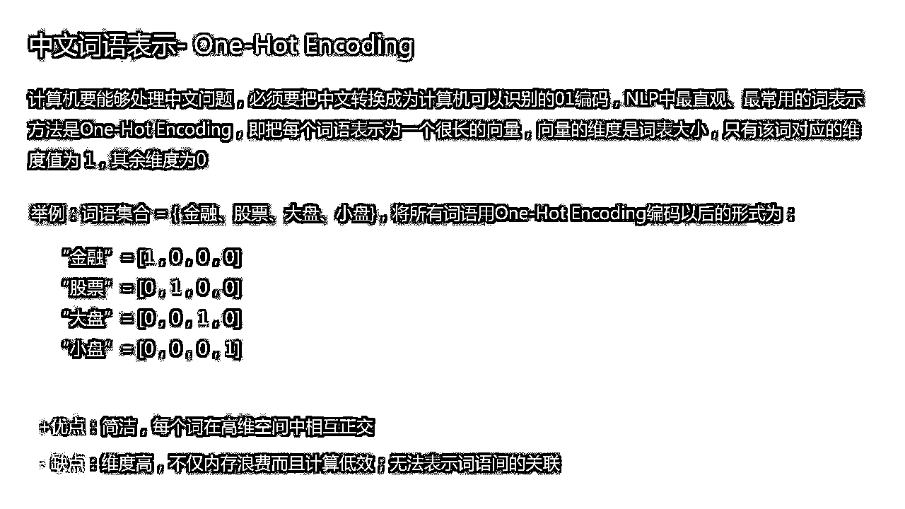

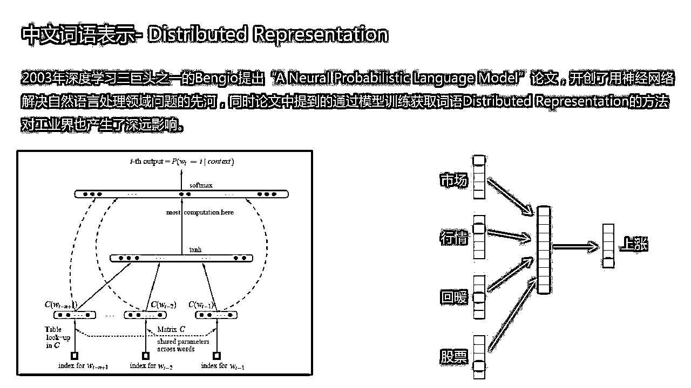

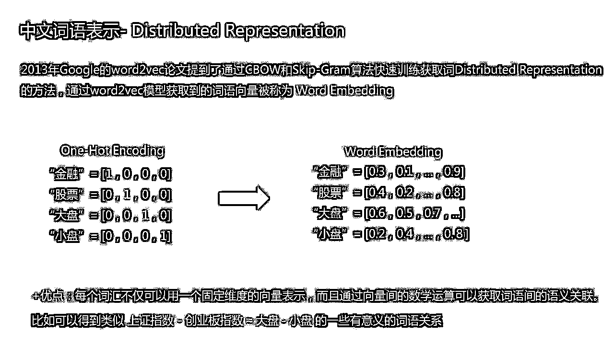

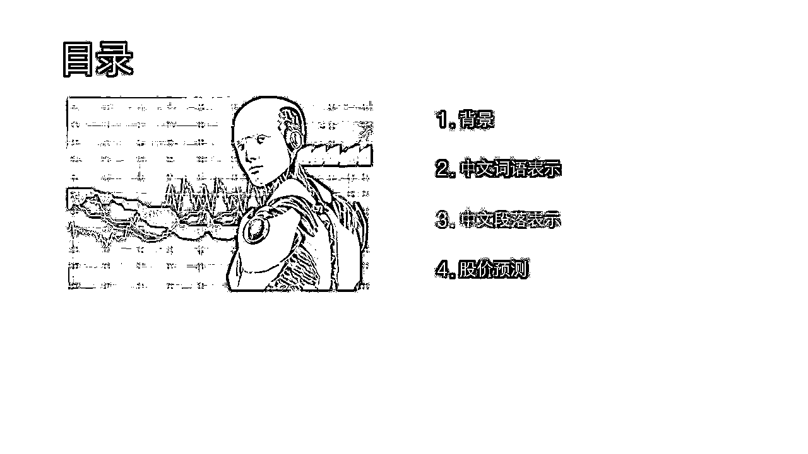

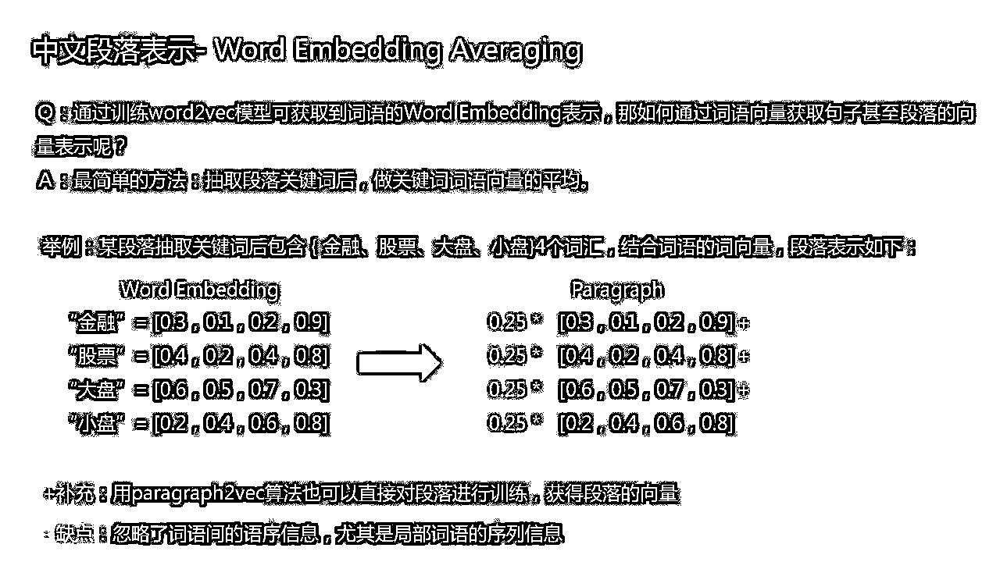

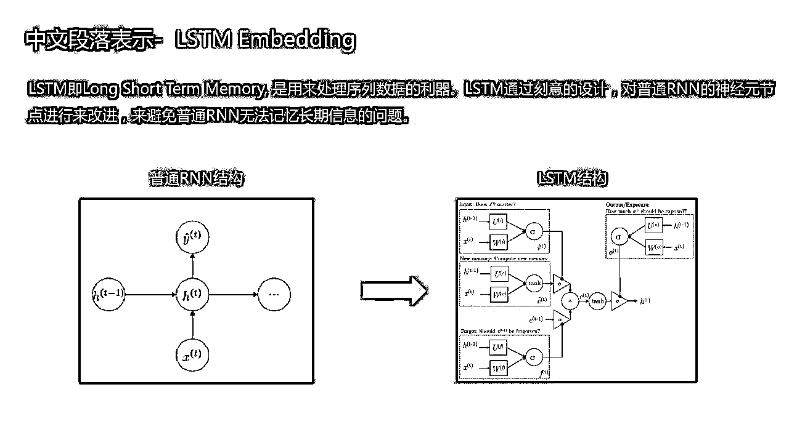

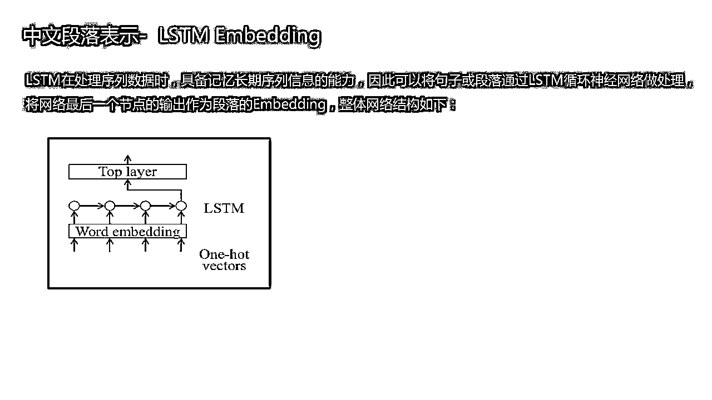

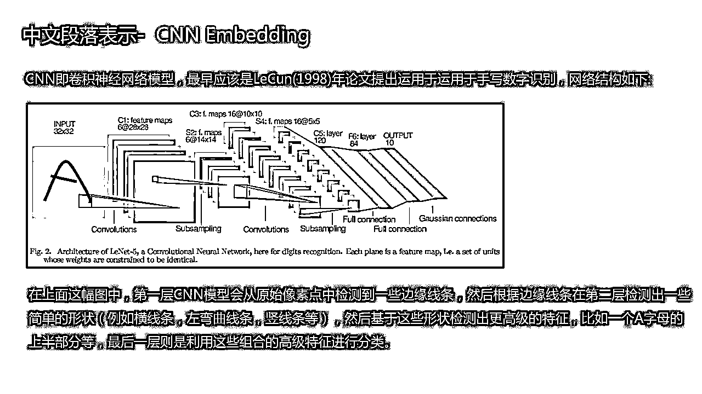

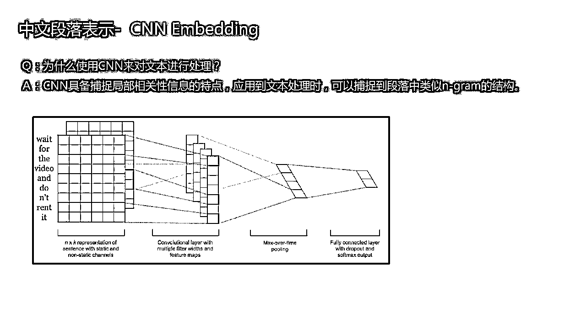

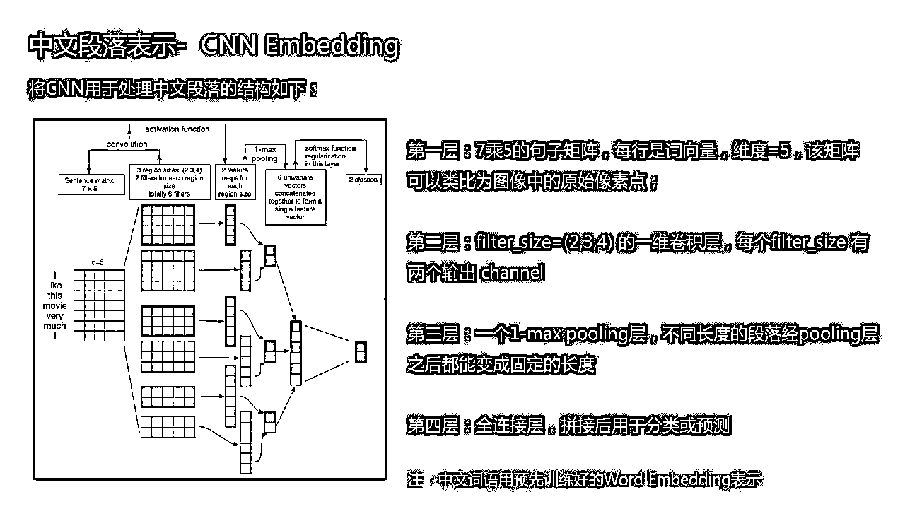

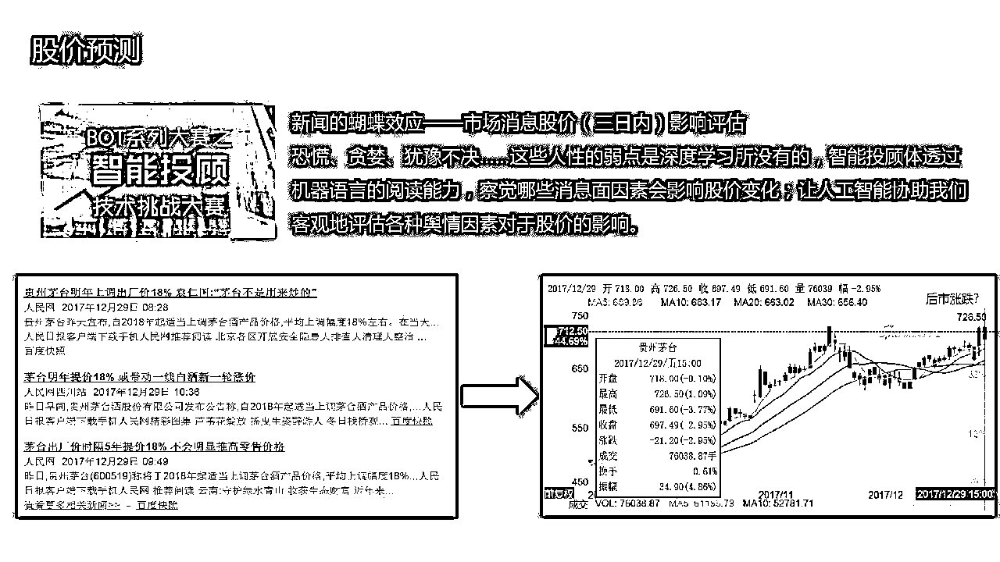

****

****录音音频****

**请点击****阅读原文**