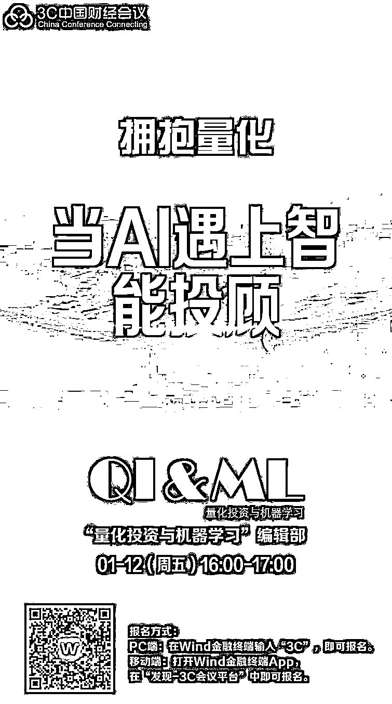
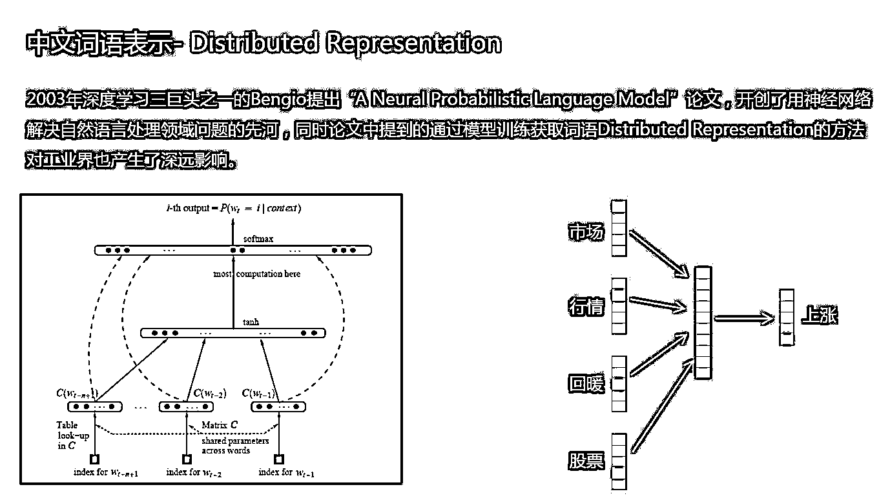
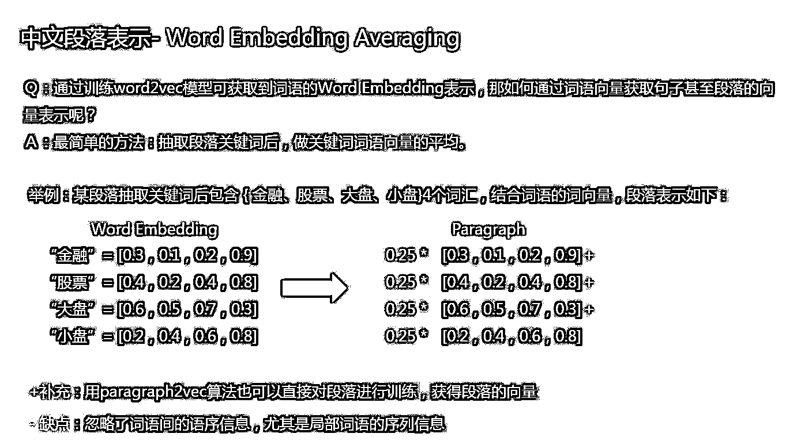
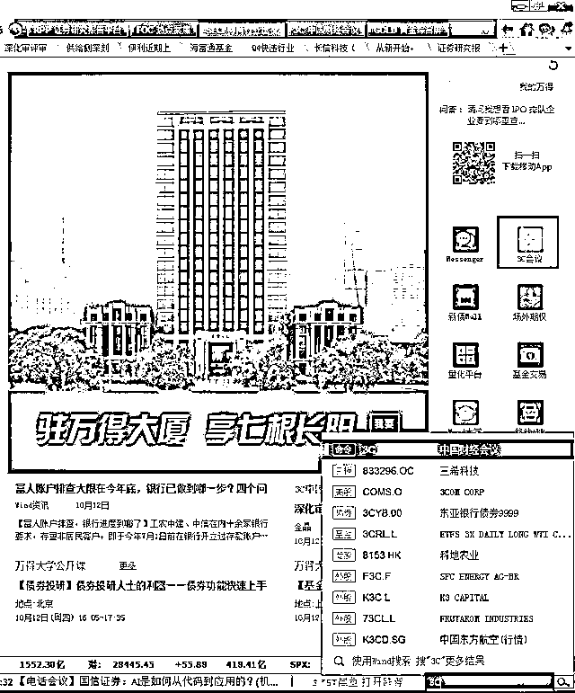
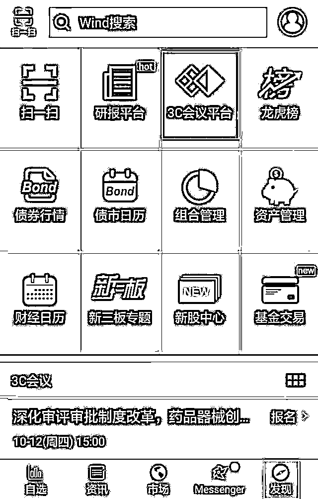

# 【拥抱量化】当 AI 遇上智能投顾——公众号受邀参加万得 3C 中国财经会议

> 原文：[`mp.weixin.qq.com/s?__biz=MzAxNTc0Mjg0Mg==&mid=2653287126&idx=1&sn=84f3d5619e2da6b7d668f0a387aae229&chksm=802e30c3b759b9d52ab8a2847cb9abc27f2935af5c60facae37fc8c59358056ca41dce74a157&scene=27#wechat_redirect`](http://mp.weixin.qq.com/s?__biz=MzAxNTc0Mjg0Mg==&mid=2653287126&idx=1&sn=84f3d5619e2da6b7d668f0a387aae229&chksm=802e30c3b759b9d52ab8a2847cb9abc27f2935af5c60facae37fc8c59358056ca41dce74a157&scene=27#wechat_redirect)

**收听会议**

**请点击****阅读原文**

量化投资与机器学习公众号成立 2 年多来，一直秉持着无偿分享，共同成长的精神。努力为中国的量化投资事业贡献一份自己微薄的力量。

2 年来从 0 到 1，公众号成长很多，但是在大家的鼓励和支持下，我们不忘初心，赢得了众多媒体和机构的认可。

近期，公众号作为全网受 **Wind（万得）**邀请的自媒体平台

参加了**中国最专业的机构路演平台**

我们很荣幸，能够和各大金融机构、金融大咖在此平台上分享我们的研究心得。这既是对公众号的认可，也是对公众号编辑部所有人的肯定。

在未来，公众号会继续秉持知识分享、坚持原创的精神。为更多的量化爱好者提供学习交流的平台。

下面，大家快来看看我们这次线上路演的内容吧！

**部分 PPT 内容**

**如何参加？**

**非万得用户**

请点击**阅读原文**。

****万得用户****

**PC 端**

1、点击 Wind 金融终端首页右侧的**“3C 会议”**或在右下角按键精灵**输入“3C”**，进入 3C 会议模块。

2、选中一场会议，点击**“立即报名”**。

3、会议开始后，进入会议详情页，点击**“立即参会”**，无需拨打电话，立即在线收听。您还可以在互动处留言，交流、提问。

**移动端**

没有 Wind 金融终端的客户，请扫面下方二维码下载。

1、进入 APP 后，先点击右下角**“发现”**，再进入**“3C 会议平台”**。 

2、报名及参会步骤，与 PC 端相同。

**注意：**请确认 APP 已升级至最新版。

**收听会议**

**请点击****阅读原文**