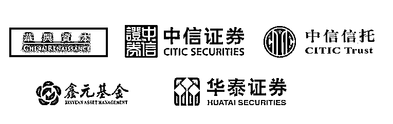

# 不会估值，你真的敢说自己懂金融？掌握这个硬技能你就叼炸了！

> 原文：[`mp.weixin.qq.com/s?__biz=MzAxNTc0Mjg0Mg==&mid=2653287114&idx=1&sn=a313297649d4eef047e0302689ee3f12&chksm=802e30dfb759b9c9bed49a937f42dbb4e6a46c916ea9eac92628d250eec12bb07be60ffee8ab&scene=27#wechat_redirect`](http://mp.weixin.qq.com/s?__biz=MzAxNTc0Mjg0Mg==&mid=2653287114&idx=1&sn=a313297649d4eef047e0302689ee3f12&chksm=802e30dfb759b9c9bed49a937f42dbb4e6a46c916ea9eac92628d250eec12bb07be60ffee8ab&scene=27#wechat_redirect)

企业估值是证券投资的重要能力

也是国内外投行、PE、VC、分析师等 

平日工作中所需要掌握的基本技能

是投资分析时要运用的必备工具

也是基金买卖双方都必须掌握的专业能力

中金公司曾经的一道面试题就是

**现场推荐一支股票**

**并介绍运用的估值方法和注意事项**

除此之外

想做投资，但是像顺丰这样的上市公司 

到底应该如何正确分析他的**利润表和资产负债表？**

想做估值，但是

为什么互联网企业不适合相对估值法？

滴滴并购 Uber 的案例，用的估值方法是哪一个？

怎么用绝对估值法估算京东的投资价值？

事实上

投行或者投资界的财务模型（Financial Model）

听起来虽然高大上白富美

制作工具却非常简单，就是 EXCEL

知乎上不少投行领域的大 V

在说到这个话题时都表示：

无论最初的模型是拿什么搭起来的 

到交流层面也是拿 Excel 在工作中交流沟通

无论是上市公司还是对初创企业

从研究到分析、从商业模式到财务

研究分析落脚点必定基于合理的企业估值

这种估值是基于大量数据方法和思考形成的

相对估值法的核心要务是什么？

绝对估值法的实务是什么？

**现金流量表，资产负债表，利润表**

**这三大表该怎么进行估值分析？**

如何在企业一大堆纷繁复杂的数据上面

结合商业模式，给出一个合理的估值？

如果你未来想从事金融行业

或者目前已经在金融行业工作

估值是你永远绕不开的业务和能力

* * *

**为什么苹果有 5000 亿美金的估值？**

**为什么滴滴有 300 亿美金的估值？**

**优酷土豆的并购案应该如何分析？**

**这些天文数字都是怎么算出来的？**

参与这节课你将有一个深入的分析和了解

我们邀请来三位**总监级导师**

带来**7 大专题 45 讲**全方位传授企业估值建模实务

**／／ 导师介绍 ／／**

**Borg**

国内某 TOP10 券商投行部投资总监

北京大学金融学硕士，CPA

曾就职于华兴资本，中信证券投资银行部

在财务分析及估值建模方面有着丰富的经验

**主导或参与了多起大型并购重组及资产证券化项目**

**Josh**

国内某 TOP10 券商投行部投资总监

北京大学金融学硕士

曾就职于世界 500 强投资中心

国内排名前三的房地产基金等机构

**负责三期房地产项目投融资，一起资产证券化项目，两起 preIPO 投资项目**

在财务分析，估值建模方面有较为丰富的经验 

**Ducan **

中信信托投资总监

北京大学金融学硕士，CFA

曾就职于申银万国研究院，鑫元基金研究部

**拥有丰富的行业研究经验，对资本市场有较强的研究能力**

熟悉财务分析及估值建模相关工作且拥有丰富的行业分析能力 

**／／ 课程内容 ／／**

**／／ 课件实例 ／／**

**// 本课程适合人群 //**

******1、想**迅速掌握**企业估值建模这项技能的人士******

******2、未来有志于从事金融行业的大学生******

******3、刚刚进入投行、咨询、行研买方卖方等金融部门的人士******

**********// **参加课程你将获得**// **********

******1\. 系统的估值建模实务技能****** 

******2\. 一门马上能上手操作的硬技能******

******3\. 掌握金融行业必备技能，助力接下来的职业发展******

******4\. 课后导师直播答疑******

******5.打造自己的金融人脉圈，与来自各大金融机构在职人士与顶尖高校的校友交流******

********／／ 学员来源 ／／********

********学校：**哥伦比亚大学，MIT，哈佛大学，LSE，牛津大学，剑桥大学，北京大学，清华大学，复旦大学，中国人民大学，上海交通大学，对外经济贸易大学，中央财经大学，上海财经大学，香港大学 （排名不分先后）******

********公司：**中金公司，中信建投，申万宏源，方正证券，太平洋证券，九鼎投资，清科集团，天星资本、中科招商，金元资本，品今投资，冠恒资本控股，展恒基金，诚通集团，工商银行，平安银行等（排名不分先后）******

************

******（课程中的反馈）******

********／／ 开课时间&课程周期 ／／********

********开课时间&课程周****期：****1 月 9 日至 1 月 30 日********

********课程原价：****599 元********

********优惠价：****前 200 名报名学员，每人 499 元******** 

********课程形式****：****录播视频 & 社群互动 & 直播答疑********

**********参与****方式：**长按文章底部二维码支付报名，支付成功后添加**课程小助手并发送截图**让她拉你进入班级群，加入班级群后按照班主任提示等待正式开课即可********

**********团购返现**********

********如果你带着你的小伙伴一起报名********

********3 人以上（含 3 人）可享受团购价********

**********每人将获得 50 元返现**********

**********团购学员请联系课程小助手微信**********

**********微信号****：tina0479**********

**********／／ 估值建模大礼包 ／／**********

****************

****************

********（上图仅部分资料截图）********

**********／／ Q&A ／／**********

**********Q：**请问有事错过或者可以看回放吗？********

**********A：**这个不用担心，本次采取课程为录播+直播形式，课程视频一年内会留存供复习使用，如果您有事错过可随时复习观看。********

**********Q：**请问可以和导师互动交流答疑吗？********

**********A：**当然可以，导师会在直播答疑时间与大家在线互动交流，如果平时学习有问题，可将问题发至助教，导师会做出书面回复与解答。********

**********Q：**请问课程的课件可以提供吗？********

**********A：**可以提供，本次课程的课件均为导师制作并提供至学员，但是一律不得外泄，仅供内部学员使用。********

**********Q：**这些课程我可以退款吗？********

**********A：**本课程为一次性付款，无需缴纳其它任何费用，一经付款不予退还，报名前请谨慎考虑。******** 

**********／／ 报名二维码  ／／**********

**********本次课程通过此二维码直接付款********** 

**********付款后添加课程小助手入群**********

********↓↓↓戳此码报名↓↓↓********

********                                                    ********

**********详情可咨询小助手微信（tina0479）**********

**********注：可开具发票，如有需求请在上课时与助教沟通**********

**********所有解释权归华尔街学堂**********