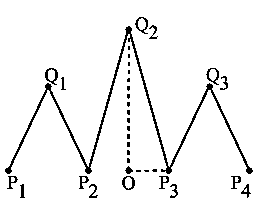
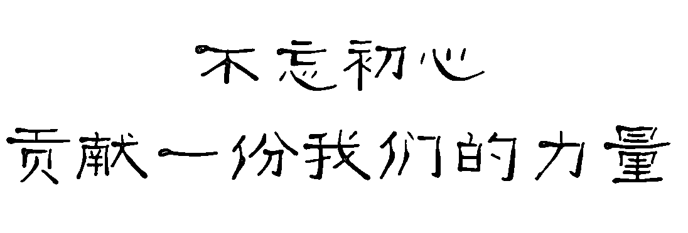

# 模式识别在金融时间序列中的应用【系列五十】

> 原文：[`mp.weixin.qq.com/s?__biz=MzAxNTc0Mjg0Mg==&mid=2653287106&idx=1&sn=93e506237376f0540ff5ede81f1d2343&chksm=802e30d7b759b9c1d9716776fade282acebae0e55a1f6fcd3897f183736c24b14fd23f08ce27&scene=27#wechat_redirect`](http://mp.weixin.qq.com/s?__biz=MzAxNTc0Mjg0Mg==&mid=2653287106&idx=1&sn=93e506237376f0540ff5ede81f1d2343&chksm=802e30d7b759b9c1d9716776fade282acebae0e55a1f6fcd3897f183736c24b14fd23f08ce27&scene=27#wechat_redirect)

今天编辑部诶大家带来 Kathryn Dover 的一篇文章。主要讲模式识别在股票数据中的应用。

Finding patterns in high dimensional data can be difficult because it cannot be easily visualized. Many different machine learning methods are able to fit this high dimensional data in order to predict and classify future data but there is typically a large expense on having the machine learn the fit for a certain part of the dataset. This thesis proposes a geometric way of defining different patterns in data that is invariant under size and rotation so it is not so dependent on the input data. Using a Gaussian Process, the pattern is found within stock market data and predictions are made from it.

主要是用一种不依赖于输入数据的方法。 使用高斯过程，在股票市场数据中发现该模式，并从中进行预测。

前面几部分都是背景介绍，大家可以自己去查阅，我们主要把后面几部分解读一下。 

作者定义了三种大家常见的指标形态：W 底、M 顶、头肩形。 

**1\. Standard Double-Bottom Pattern (A Standard W)**

**2\. Standard Double-Top Pattern (A Standard M)**

**3\. Standard Head and Shoulder Pattern**

When we actually apply our definition of shapes to the data, we will find that there is no perfect match to our standard definition. Therefore, we will want to define a “fuzzy shape” that will be considered an approximate form of the standard shape. These fuzzy shapes will not only allow us to approximate how far away a shape is from the standard shape but also how far fuzzy shapes are from each other. The way that we define our fuzzy shapes is discussed below.

用数据去定义这些指标形态时，我们会发现与我们定义的形态并不是完全匹配。 作者做了一个“模糊形状”的处理。将被视为标准形状的近似形式。 

**1\. The Fuzzy W**

**2\. The Fuzzy M**

**3\. The Fuzzy Head and Shoulder**

Now that we have defined both our standard and fuzzy shapes, we want to be able to define some actions we can take on these shapes. We discuss the change of basis and flipping a shape and how they can be used to compare different shapes to each other. We also discuss how the slopes and lengths of the vectors can be used to categorize the shape that can be used for prediction.

接下来作者对这三种形态的一些变化进行了讨论。

**1\. Change of Basis**

**2\. Flipping a Shape**

****

**3\. Symmetric Representation**

Once the shapes have been found in the data, we can categorize these shapes using their slopes and lengths. By categorizing certain shapes by their slopes and lengths, we can group similar shapes together and run traditional machine learning techniques on these specific groups. This is to determine indicators of these types of shapes, which can ultimately be used for predictive purposes. We discuss how shapes can be categorized using slopes and lengths and how we can use those categories to do rough predictions of stock market data.

开始对图形的斜率和长度进行定量的分析结合机器学习方法，然后开始预测。

**Saving the Slopes and Lengths**

两种预测方法：

**1\. Predictions with Slopes and Lengths** 

**2\. Prediction with Direction**

创建一个算法来寻找模式：

Now that we have defined what our shapes are and how to approximate shapes, we will be discussing the algorithm that finds these shapes and how it handles the data. I used a Gaussian Process to fit the data with a function that the local minimums and maximums could be extracted from. These local extrema are used to define the vectors of the shapes and subsequently the algorithm checks these vectors using the definitions from the previous sections.

关键词：**Gaussian Process**

最终过程如下：

1\. Given a certain variance, a Gaussian Process is used to fit the data.

2\. From this fit of the data, the algorithm identifies all the local extrema in the data.

3\. The algorithm goes through the local extrema in the data sequentially and identifies sequences that could possibly be a predefined shape.For example, a W has a following sequence of minium and maximum:max/min/max/min/max.

4\. If a sequence is valid for a certain shape, then the algorithm uses the definitions of the shapes defined earlier in order to figure out if they qualify.

5\. If a shape is found, the lengths and slopes of the vectors in the shape are stored (as well as the following segment) for predictive purposes.

6\. The categorizing constants k` i and ks i are calculated and stored.

7\. Once the algorithm has gone through all the extrema, it uses the stored slopes, lengths, and categorizing constants and uses them to calculate the rough prediction from the weighted average.

在下图中，我们可以看到算法的运行步骤。

实际的应用： 

In this section, I describe the results of the algorithm I developed in the last chapter when it was run on stock price history for different companies. The algorithm was run for variances 0.001 and 4 over the entire stock price history for the companies Apple, Disney, Microsoft, Walmart and the NASDAQ index. For testing the prediction part of the algorithm, the entire stock price history for the Dow Jones index was used. The reason for choosing this dataset was twofold. First, there was between 20-30 years worth of data for each company, which would mean I could potentially find a variety of shapes in different sizes. Second, I chose these specific companies by looking through the stock history of companies and choose those that had many turbulent years that offer enough fluctuation that can create the shapes I am looking for. All stock data was found at yahoo.finance.com. The below subsections discuss how I fit my data, found the shapes, and calculated predictions for different shapes.

用了两种方法

**1\. Finding Different Sized Shapes**

The original data (upper le), the fit of the data when the variance is 0.001 (upper right), the algorithm identifying the local extrema (lower le), the W found by the algorithm (lower right)

**2\. Finding Multiple Shapes**

is 4 (upper right), the algorithm identifying the local extrema (lower le), the W found by the algorithm (lower right)

A fit with variance = 0.001 where multiple Ws were found

A fit with variance = 0.001 where multiple Ms were found

预测

I used the data from Apple, Disney, Microsoft, Walmart and the NASDAQ as my learning set for both of my prediction methods and I used the Dow Jones index as my test data. The results from each of the methods is given below.

算法存在的问题： 

While the algorithm was successful in finding the shapes and doing a rough prediction, there were still some issues with it. For example, finding a good tolerance for finding a shape was not exact. I had to run the algorithm many times to determine at what point the algorithm would find identify a pattern was not the correct shape. This usually happened because the tolerance was too high and the patterns found did not look like the shape. Likewise, when the tolerance was too low, it would identify no shape. Finding an appropriate tolerance (somewhere between 0.7 and 1) took a while and the tolerance for each shape was different as the Ws had a lower tolerance while the head and shoulder pattern needed a higher tolerance.

总结：

Finally, the predictive step of the algorithm has a long way to go. Using the slopes and lengths method did not work well which might be explained by having no good way of measuring the difference between slopes. Addi tionally, the weighted average method might not be enough to get a good understanding unless I had a lot more data. I had about 55 shapes for each type of shape when I ran the algorithm on the data. If I want to get a better average, I would need to run my code on a lot more data in order for the average to not be swayed as heavily by outliers. The directional vector method worked much better than the slopes and lengths method, but there was still a error of about 20-28 degrees. We could potentially decrease this error by simply getting more data. This prediction also indicated that there actually might be a correlation between the shapes and the directional vector, so perhaps we could use more traditional machine learning methods on these directional vector values to see if we can learn anything extra from it.For example, is there some sort of correlation between the k values we found in the slope/lengths predictions and the directional vector we calculated? A question like this might be answered by using a neural network or a support vector machine.

同时作者还提出了一些改进模型的方法。我们认为此部分最为有探究性：

**1\. Improving Shape Recognition**

**2\. Extending into Multiple Dimensions**

论文在**阅读原文**下载