# 【公众号福利】“女生科技体验节” （北京）送票啦！

> 原文：[`mp.weixin.qq.com/s?__biz=MzAxNTc0Mjg0Mg==&mid=2653287051&idx=1&sn=0806f025dcb969006d266882340575e3&chksm=802e309eb759b988642baf8921b575c8f0ee3210f326c0667f5985073cc0d9f2a29f966edc19&scene=27#wechat_redirect`](http://mp.weixin.qq.com/s?__biz=MzAxNTc0Mjg0Mg==&mid=2653287051&idx=1&sn=0806f025dcb969006d266882340575e3&chksm=802e309eb759b988642baf8921b575c8f0ee3210f326c0667f5985073cc0d9f2a29f966edc19&scene=27#wechat_redirect)

感谢大家对量化投资与机器学习公众号的支持。2018 新年伊始，作为首届“女生科技体验节”的合作社区之一，我们为大家带来一波福利

**20 张免费现场票**  

活动将于 1 月 14 日(下周日)在北京举行，有兴趣的小伙伴不要错过。

直接点击文末的“**阅读原文**”进入，或者在购票页面输入优惠码** MLQI**均可享受。数量有限，先到先得。

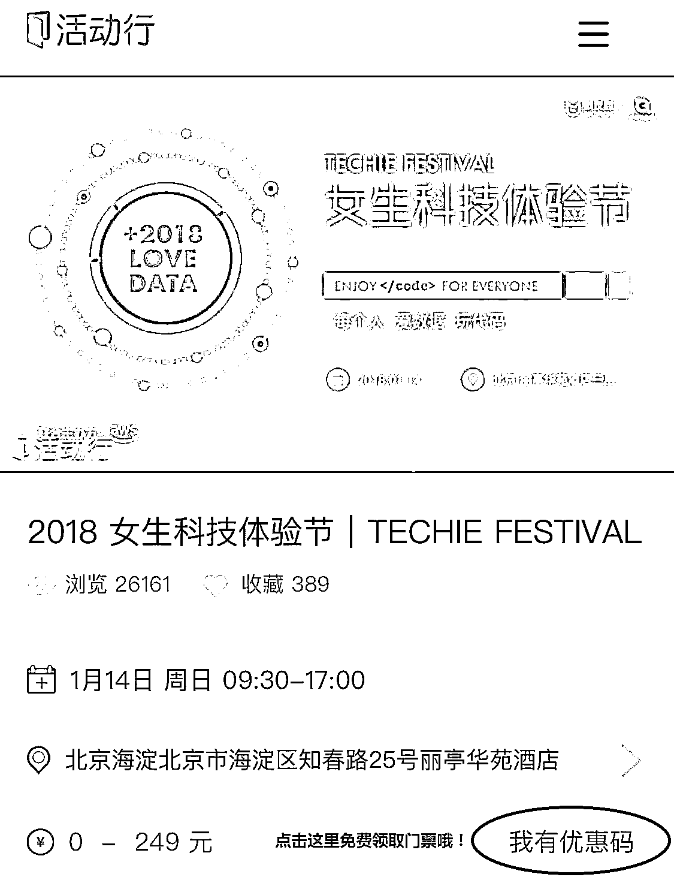

* * *

2018 年终于来了！我们也即将迎来科技女性领域的大事件！首届女生科技体验节将于 2018 年伊始的第二个周末 (1 月 14 日)，盛放召开！10 余位来自全球顶尖的科技互联网公司高管及国内数据领域出色的导师们，将邀请你**拥抱数据，走近科技，开启 2018 年的更多可能！**

**量化投资与机器学习公众号**作为全网合作媒体，也参与其中。希望给大家带来一场别开生面的技术分享盛会。

**2018.01.14**

**首届女生科技体验节**

**每个人，不管男女 **

**都可以离科技和数据更近！**

**❤️**

**为什么这次盛会值得你参与其中？**

🌟**六****大主题演讲**🌟

嘉宾来自 

亚马逊 AWS, Google, Facebook, TalkingData 

等科技公司

🌟**五大实操工作坊**🌟

导师来自 Facebook, Strikingly 上线了等 

🌟**五大科技体验区**🌟

有新兴科技产品 Hover Camera 无人机, 编程机器人

3D 打印 和 VR 体验区等 

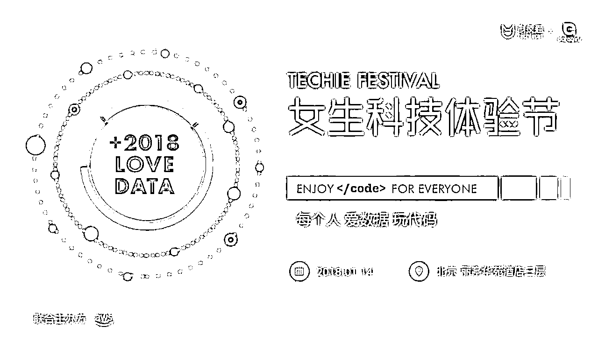

**❤️**

****六大主题演讲 (KEYNOTE)****

**多位资深女性科技工作者和导师倾囊分享**

五大主题演讲中，我们邀请了来自 **AWS、Facebook、Google、TalkingData、科技猫以及 DataGirls** 的科技高管分享他们对数据和前沿科技的认识，并分享她们对行业发展和女性在科技领域自身职业发展的见解。

**张萌｜AWS 解决方案架构师**

*   负责基于 AWS 的云计算方案架构的咨询和设计

*   在加入 AWS 之前，曾就职于 IBM，负责 DBaaS 以及企业信息管理相关的产品及解决方案

*   在数据库、信息集成、数据分析和数据治理等方面有着丰富的项目经验

**Yanghua Xia｜Facebook Oculus, Senior Reliability Engineer**

*   在 Facebook Oculus 负责从原型、可靠性测试和现场回访等产品不同阶段的硬件问题的分析与解决，以提高产品质量和可靠性 

*   在 Facebook 之前，他曾在苹果和诺基亚担任可靠性工程师

*   拥有中国科学院微电子工程博士学位

**Bill Luan｜Google 中国开发技术推广负责人**  

*   负责谷歌各种开发技术、互联网技术、开源代码等在大中华区的推广和使用

*   曾留学美国南伊利诺斯州立大学，并曾在摩托罗拉、微软公司里担任产品开发项目经理

*   加入 Google 后，帮助其在全国十几个城市成立了当地的谷歌开发者社区、赞助了全国近万名大学生和开发者们利用谷歌开发技术进行创新和创业

**李淑卿｜TalkingData 数据工程师**

*   从事软件研发的工作，并带领过 TalkingData 的项目。 

*   TalkingData 是国内专业的独立第三方移动数据服务平台。一直致力于数据的深耕与数据价值的挖掘，从数据的采集、处理到数据的分析，再到数据的应用与咨询。

**古茜 ｜ 科技猫联合创始人**

*   曾多次代表国内女性技术社区参与国际技术交流大会和女性峰会；

*   中国技术社群联盟成员，SheroChina 2016 女性影响力年度获奖者；

*   致力于打造最温馨、最酷炫的女性科技圈。

**Aislinn ｜ DataGirls 创始人**

*   新加坡国立大学全额奖学金得主

*   在美国新加坡欧洲多国创业工作 5 年

*   专注数据分析 7 年

*   获得数据可视化产品认证

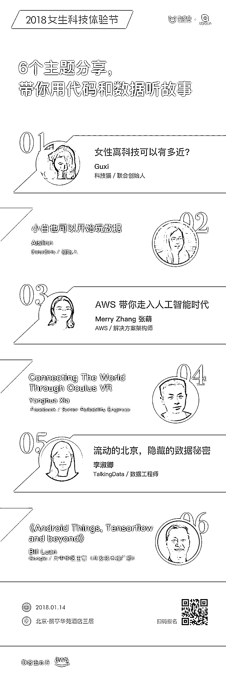

**❤️**

**五大实操工作坊 (WORKSHOP)**

<inherit>**收获一个下午与科技的深度参与和体验**</inherit>

五大实操工作坊中，

我们将联合**国内外众多科技公司和技术社区，如：**

****Facebook****

****上线了****

****Alpha-Nebula 知乎专栏****

****Wechaty****

****桔子互动****

****景略集智****

****OpenBayes****

****Women Techmakers****

**共同打造！**

**参与者可以**五选一**深入参与其中：**

**01**

**你可以通过** “上线了”的免费建站平台**，**

**无需任何编程和设计经验，**

**在短时间内**快速自助建站**，**

**为你的 Idol 们建立一个酷炫介绍页。**

**02**

**你还可以跟随**

****康奈尔金融工程硕士：知乎@文兄**，**

**学习简单的**量化交易**基础知识。**

**03**

**还可以跟着**90 后美女全栈工程师**，**

**零基础设计和打造你的**微信智能助理**。**

**04**

**如果你希望更了解 AI，**

**你可以跟着**AI 教育求职平台创始人 Kaiser**，**

**看看**机器学习**如何与时尚结合在一起。**

**05**

**你还可以跟着 **Facebook 的导师**，**

**了解他们最新的**黑科技**！**

**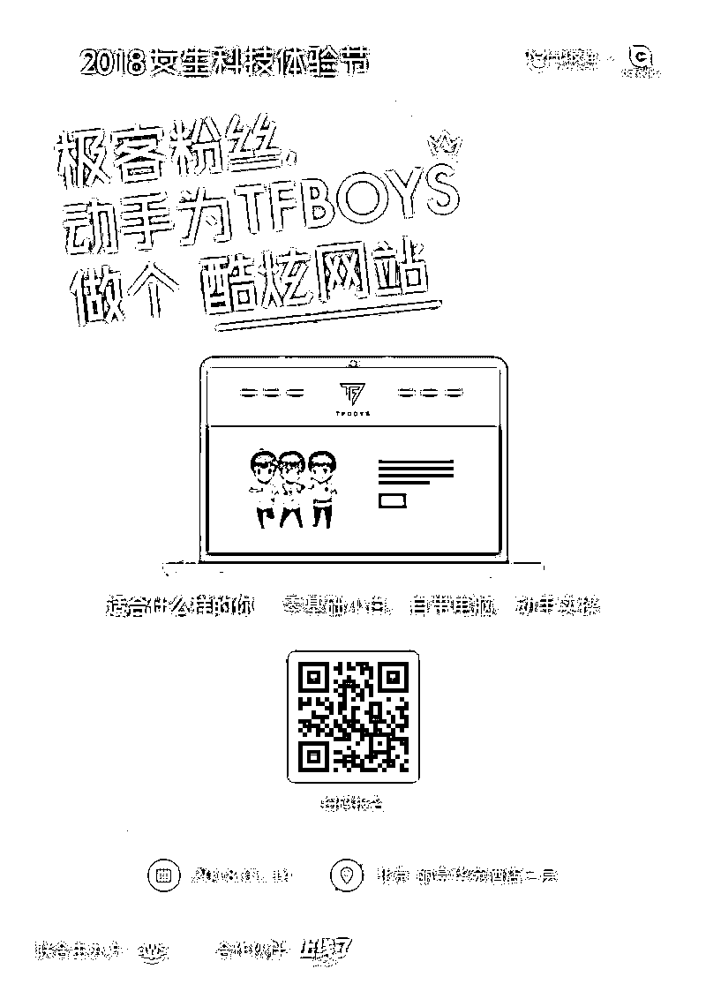**

**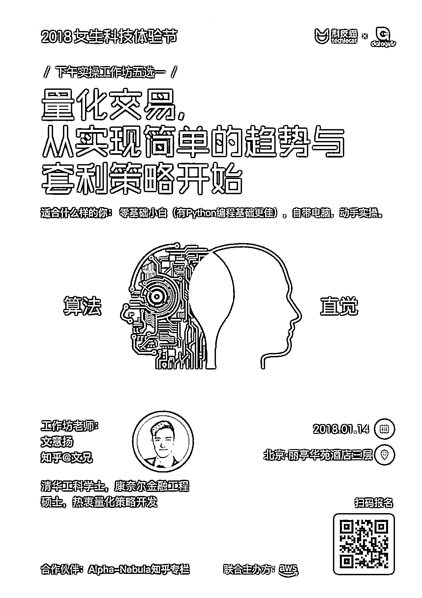**

**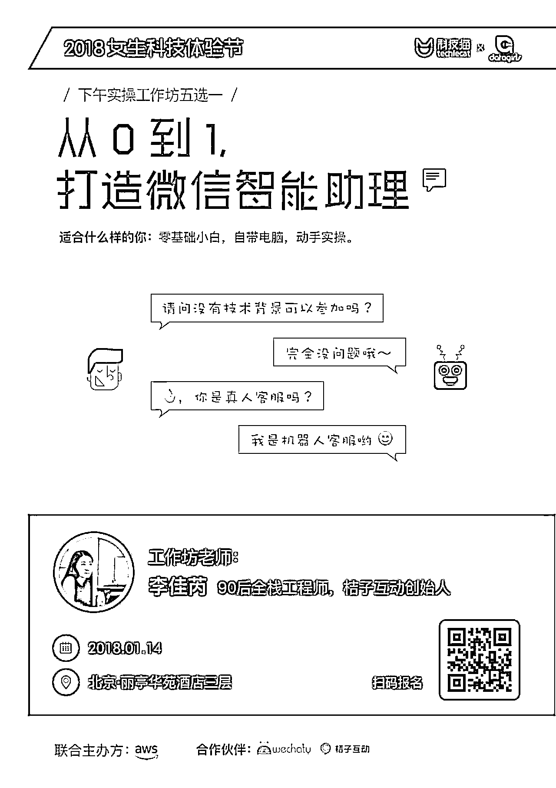**

**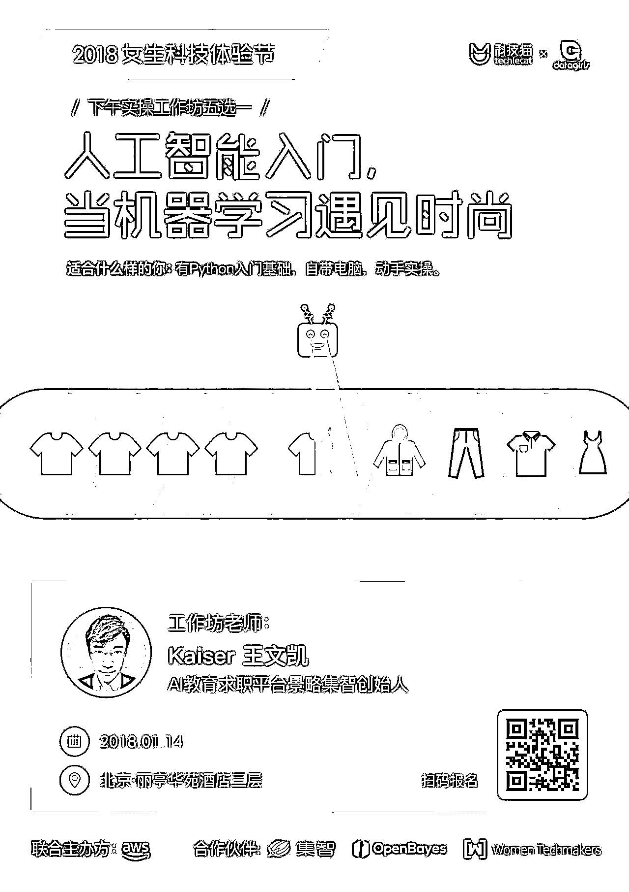**

**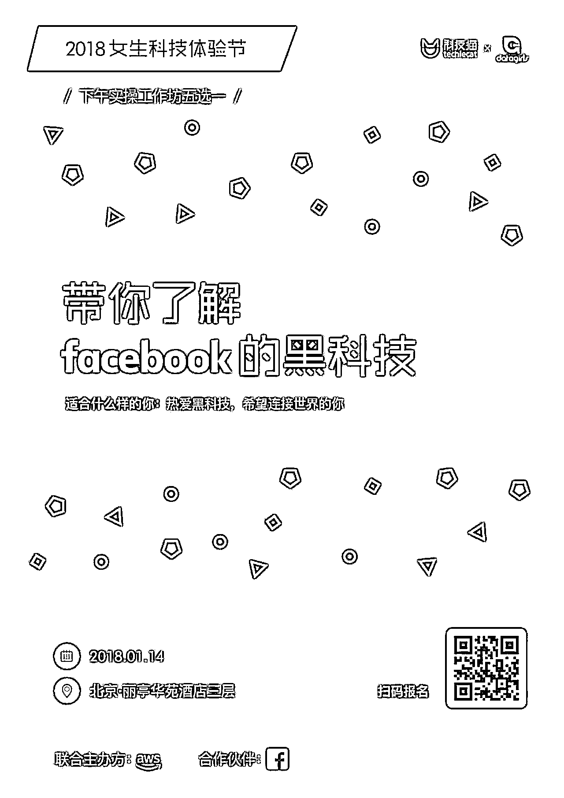**

****❤️****

****五大科技体验区 (EXHIBITION)****

**<inherit>**各种新科技产品零距离接触**</inherit>**

**在这个区域里，**

**你可以亲自接触**

**这些好玩有趣的科技产品：**

**紫晶立方的磁悬浮月球灯**

**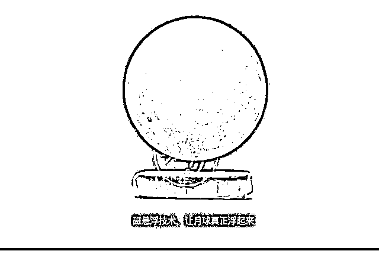**

**VRCORE 的 VR 体验和超感官内容**

**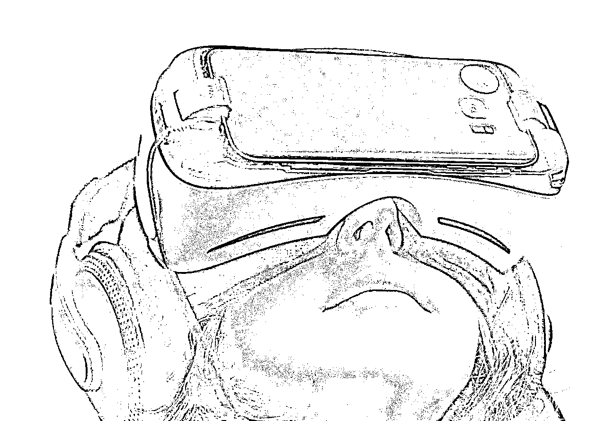**

**Hover Camera 的无人机**

**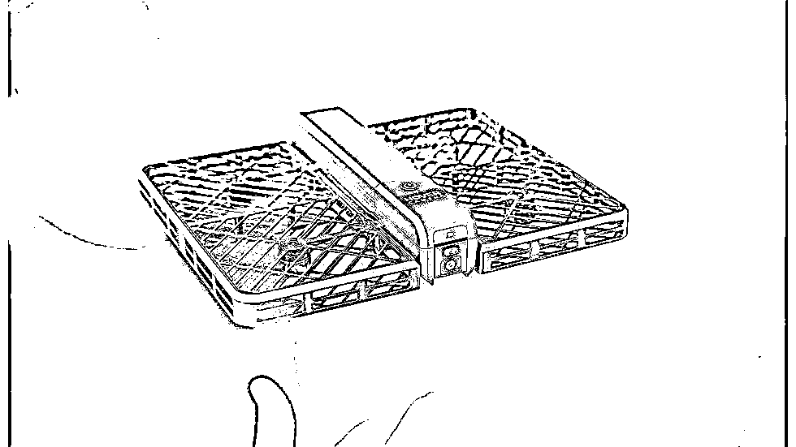**

**VinCross 的 HEXA 机器人**

**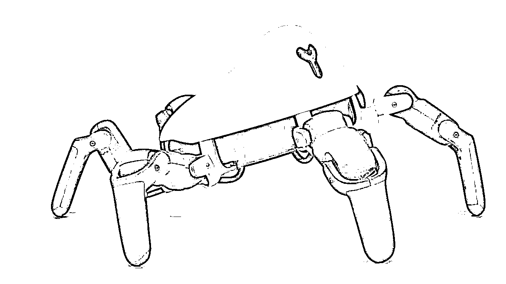**

**还有萌萌的小胖机器人**

**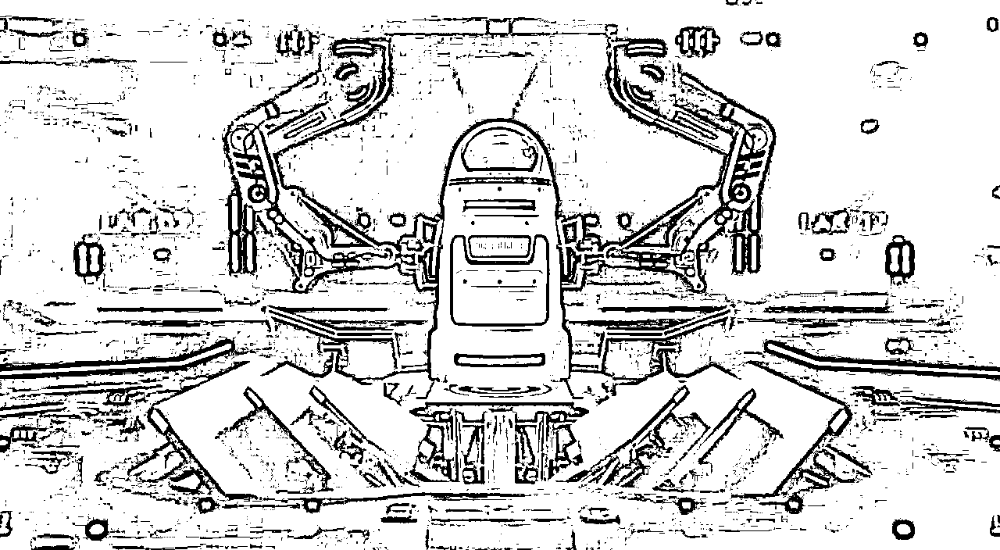**

**所以，让我们一起走近科技**

**迎接 2018 新的一年吧！**

**<inherit>女生也可以离科技很近，</inherit>**

**<inherit>让我们一边美丽优雅，一边聪慧极客！</inherit>**

**点击****阅读原文****报名参与**首届女生科技体验节**！**

****❤️****

****合作媒体与社区 (MEDIA)****

**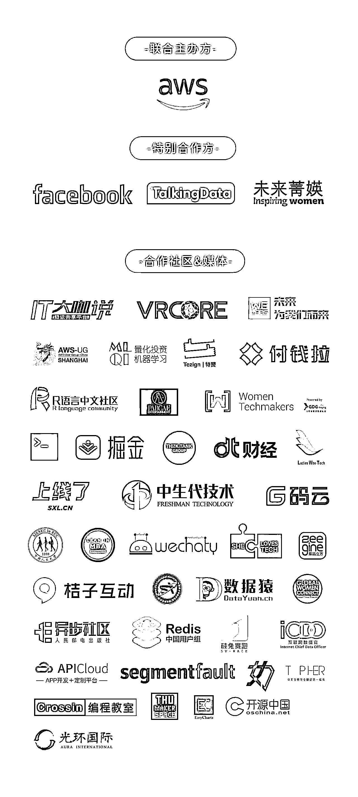**

****活动信息**** 

**<inherit><inherit>时间：2018 年 1 月 14 日</inherit></inherit>**

**<inherit>地点：北京丽亭华苑酒店，三层</inherit>**

**<inherit>**活动流程：**</inherit>**

**<inherit>09:30 - 12:00    六大主题分享</inherit>**

**<inherit>12:00 - 14:00    午休</inherit>**

**<inherit>14:00 - 17:00    五大实操工作坊</inherit>**

**17:05 - 17:20    致谢、合照**

**注：流程可能会根据现场活动需要进行微调** 

**<inherit><inherit>**学生 & 女生优惠票现正开售，**</inherit></inherit>**

**<inherit>**可获得七折优惠！**</inherit>**

**<inherit>报名时记得标明一下学校哦！</inherit>**

**点击******阅读原文******报名参与**首届女生科技体验节**！**