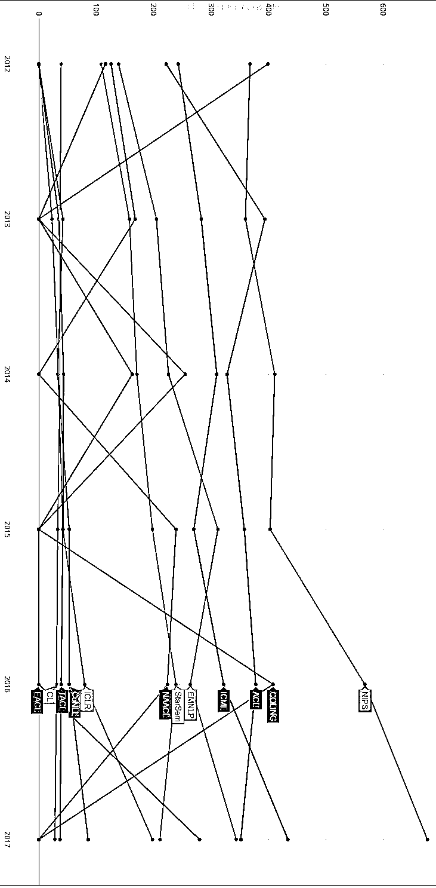
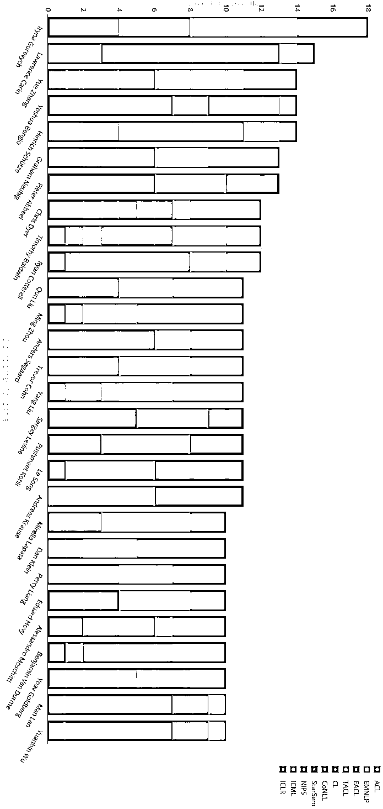
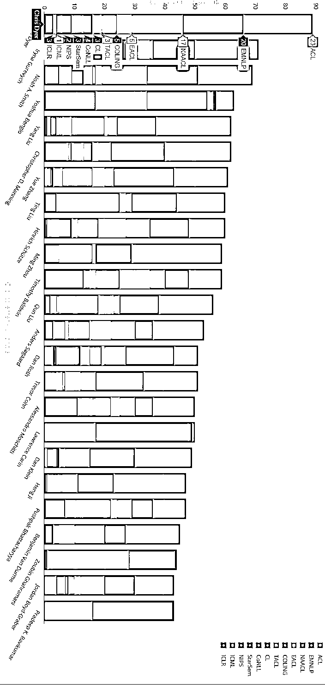
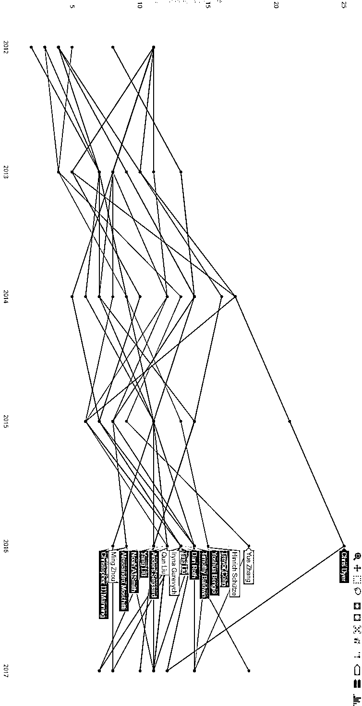
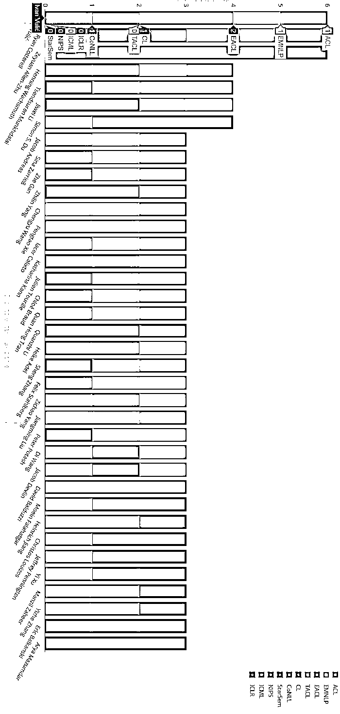
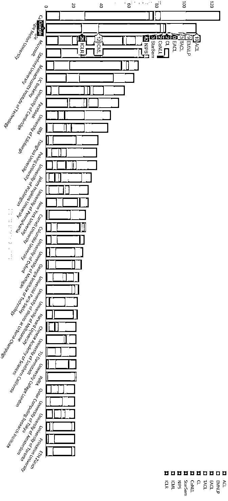
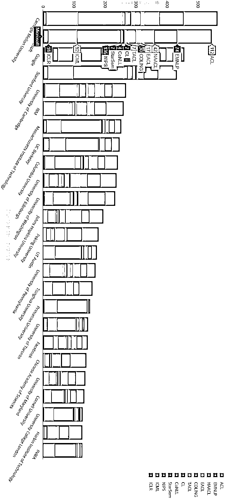
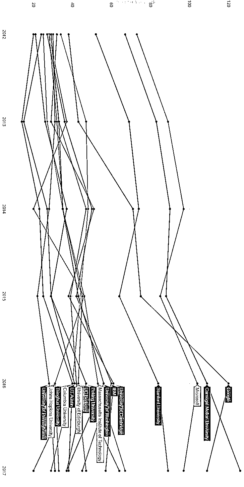
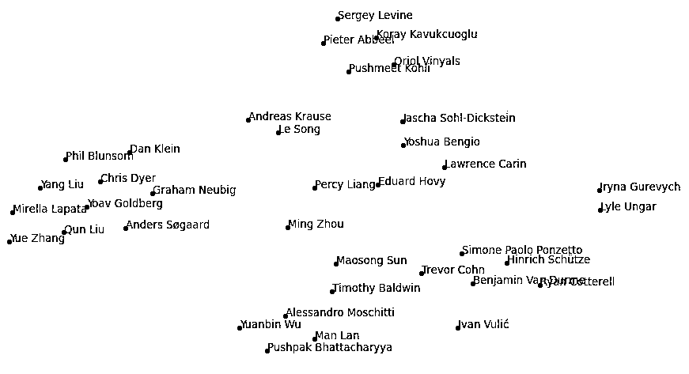
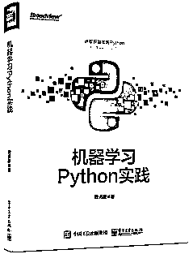

# 【解读】2017 年 ML/NLP 论文发表情况（第八期免费赠书活动来啦！）

> 原文：[`mp.weixin.qq.com/s?__biz=MzAxNTc0Mjg0Mg==&mid=2653287040&idx=1&sn=1646a4dd963e795472880c91d3839774&chksm=802e3095b759b9834ca4637393f8fe775a09bfde064710fdbb2e0f6fb5a320b911878df755a5&scene=27#wechat_redirect`](http://mp.weixin.qq.com/s?__biz=MzAxNTc0Mjg0Mg==&mid=2653287040&idx=1&sn=1646a4dd963e795472880c91d3839774&chksm=802e3095b759b9834ca4637393f8fe775a09bfde064710fdbb2e0f6fb5a320b911878df755a5&scene=27#wechat_redirect)

**编辑部**

微信公众号

**关键字**全网搜索**最新排名**

**『量化投资』：排名第一**

**『量       化』：排名第一**

**『机器学习』：排名第三**

我们会再接再厉

成为全网**优质的**科技文公众号

对于 NLP 和 ML 研究来说，这是非常高产的一年。这两个领域都在不断发展，会议的出版量达到了创纪录的数量。这篇文章的统计来源有个人作者和组织。涵盖以下：ACL，EMNLP，NAACL，EACL，COLING，TACL，CL，CoNLL，* Sem + SemEval，NIPS，ICML，ICLR。与去年相比，加入了 ICLR，在过去的两年里，ICLR 的发展非常迅速。

通过从会议网站和 ACL 选集中抓取出版物信息，自动进行分析。作者姓名通常列在程序中，易于提取，但组织名称比较麻烦，需要直接从 PDF 中提取。但是已经创建了许多规则来映射替代名称和拼写错误。

**venues**

首先，让我们看看 2012 - 2017 年之间不同的出版社。NIPS 显然正走向榜单，今年出版了 677 份出版物。其他大多数 venues 也在迅速发展，2017 年是 ICML、ICLR、EMNLP、EACL 和 CoNLL 历史上最大的一年。相比之下，TACL 和 CL 似乎每年都要保持一定数量的出版物。在 2017 年，NAACL 和 COLING 明显下降，但我们可以期待 2018 年两者的重返。

**Authors**

2017 年最多产的作家是 IrynaGurevych（TU Darmstadt），共有 18 篇论文。Lawrence Carin（Duke University）拥有 16 个出版物，在 NIPS 上有 10 篇令人印象深刻的论文。 紧随其后的是 YueZhang（Singapore），Yoshua Bengio （Montreal）和 Hinrich Schütze（Munich）。

从 2012 - 2017 年的统计数据来看，Chris Dyer（DeepMind）位居榜首，其次是 Iryna Gurevych（TU Darmstadt）和 Noah A. Smith（Washington）。Lawrence Carin (Duke), Zoubin Ghahramani (Cambridge) and Pradeep K. Ravikumar (CMU)主要出版在一般的 MLvenues，而其他则在 NLP 和 ML 之间保持平衡。

年度出版物的分类表明，Chris Dyer 已经把出版物数量降低到今年更易处理的水平，Iryna Gurevych 正在朝着一个向上的轨迹发展，令人印象深刻。

**First Authors**

现在让我们看看第一个作者，因为这些人通常是执行代码并运行实验的人。 Ivan Vulić (Cambridge), Ryan Cotterell (Johns Hopkins) 和 Zeyuan Allen-Zhu (Microsoft Research)在 2017 年都出版了 6 本第一作者的出版物。其次是 Henning Wachsmuth (Weimar), Tsendsuren Munkhdalai (Microsoft Maluuba), Jiwei Li (Stanford) and Simon S. Du (CMU)。

**Organisations**

从 2017 年看不同组织的出版模式，卡耐基梅隆（Carnegie Mellon）有 126 本出版物，其次是 Google，微软和斯坦福。 与 NLP 相比，ML 领域包括 MIT，Columbia，Oxford，Harvard，Toronto，Princeton 和 Zürich。 相比之下，更多关注 NLPvenues 的大学和组织包括爱丁堡，IBM，北京，华盛顿，约翰霍普金斯，宾夕法尼亚，中科院，达姆施塔特和卡塔尔。

从 2012 - 2017 整个世家段来看，CMU 再次领先微软、谷歌和斯坦福大学。

从时间序列看，CMU，斯坦福大学，麻省理工学院和伯克利大学在出版物方面正处于上升阶段。 相比之下，行业领导者谷歌，微软和 IBM 略有减少他们的出版数量。

**主题聚类**

最后，对所有来自 9 个或更多出版物的作者的论文做了 LDA，并用 tsne 对结果进行了可视化。 中间是一般机器学习，神经网络和对抗性学习。 顶端群集涵盖强化学习和不同的学习政策。 左侧的集群包含 NLP 应用程序，语言建模，分析和机器翻译。 底部的聚类包括信息建模和特征空间。

期待 2018 年所有令人兴奋的研究！

http://www.marekrei.com/blog/ml-nlp-publications-in-2017/

**赠书活动**

量化投资与机器学习公众号联合博文视点 Broadview 送出**5 本**《机器学习 Python 实践》

> 本书系统地讲解了机器学习的基本知识，以及在实际项目中使用机器学习的基本步骤和方法；详细地介绍了在进行数据处理、分析时怎样选择合适的算法，以及建立模型并优化等方法，通过不同的例子展示了机器学习在具体项目中的应用和实践经验，是一本非常好的机器学习入门和实践的书籍。不同于很多讲解机器学习的书籍，本书以实践为导向，使用 scikit-learn 作为编程框架，强调简单、快速地建立模型，解决实际项目问题。读者通过对本书的学习，可以迅速上手实践机器学习，并利用机器学习解决实际问题。本书非常适合于项目经理、有意从事机器学习开发的程序员，以及高校相关专业在的读学生阅读。

**截止 2018.01.06 12:00**

大家在本篇推文【写留言】处发表留言，**获得点赞数前五的读者，即可免费获赠此书**。届时，工作人员会联系五位读者，寄出此书。

