# 往事如烟，1998 年已经过去 20 年了！

> 原文：[`mp.weixin.qq.com/s?__biz=MzAxNTc0Mjg0Mg==&mid=2653287023&idx=1&sn=f681b23d42e1e273f3dc50a43351d7b5&chksm=802e307ab759b96c64fa3091631535b853ff1bb02839e7c5ca7b4cdcb0cb5158e968d06e96e1&scene=27#wechat_redirect`](http://mp.weixin.qq.com/s?__biz=MzAxNTc0Mjg0Mg==&mid=2653287023&idx=1&sn=f681b23d42e1e273f3dc50a43351d7b5&chksm=802e307ab759b96c64fa3091631535b853ff1bb02839e7c5ca7b4cdcb0cb5158e968d06e96e1&scene=27#wechat_redirect)

今天，苍老师结婚了

希望这个坦荡又积极的女孩

可以幸福

原来，2008 年已经是 10 年前了

原来，1998 年已经过去 20 年了

20 年，仿佛眨眼的瞬间

1998 年发生的一切仍历历在目

好像就在昨天

那一年，里奇马丁的《生命之杯》响彻世界，

一场关于巴西和法国的对战，万众瞩目，

在那场比赛当中，罗纳尔多却如同梦游，

最终巴西 0 比 3 饮恨，法国在本土如愿捧得金杯。

那一年，一场特大洪水肆虐大半个中国，

滔滔江水无情地淹没了房屋，

冲走了一个又一个死死拽住树干的生命，

灾情一再告急，

全国人民的目光都聚焦在这场灾难与救援当中。

那一年，比尔盖茨发布了 Windows 98 系统，

中国互联网才刚刚兴起，

百度李彦宏还在国外给别人打工；

马云刚经历创业失败，

马化腾则和好友张志东注册了一个公司，

全名是深圳市腾讯计算机系统有限公司。

刘强东刚在北京创办了京东，

那时候主要工作是在中关村卖光碟。

那一年，一桩性丑闻轰动国际，

1998 年 8 月 17 日，美国总统克林顿承认和莱温斯基发生过不正当关系，

并发表讲话向全美国致歉。

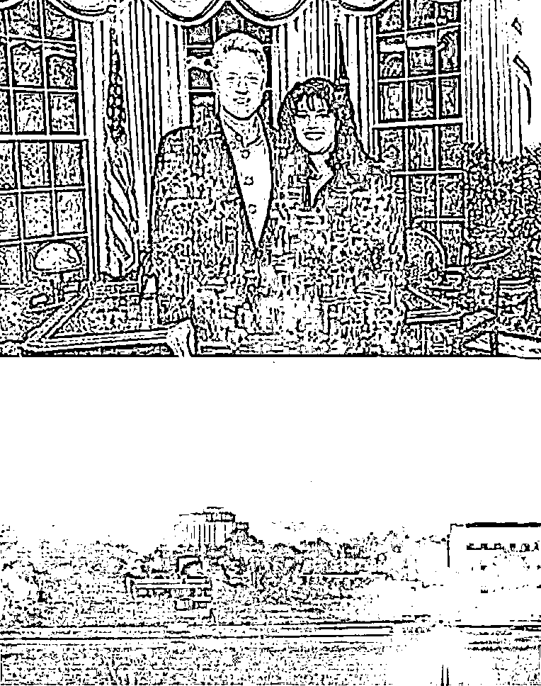

4 个月后，提上拉链的克林顿宣布空袭伊拉克。

那一年，周杰伦写了两首歌，

一首叫做《眼泪知道》送给刘德华，

一首叫做《双节棍》写给张惠妹，

但都被拒了。

章子怡那年还在中戏上大三，

刚刚接到张艺谋邀请出演《我的父亲母亲》。

那一年，房子很便宜，

北京二环的房子才 2000 一平。

**人生一梦二十年，物是人非恍然间**

**时间悄悄过去，怀念却从未消失**

1

**98 年开年大戏《水浒传》**

1998 年年初，电视剧《水浒传》在央视播出。

不久，便在全国范围内引起广泛关注，

一度万人空巷。

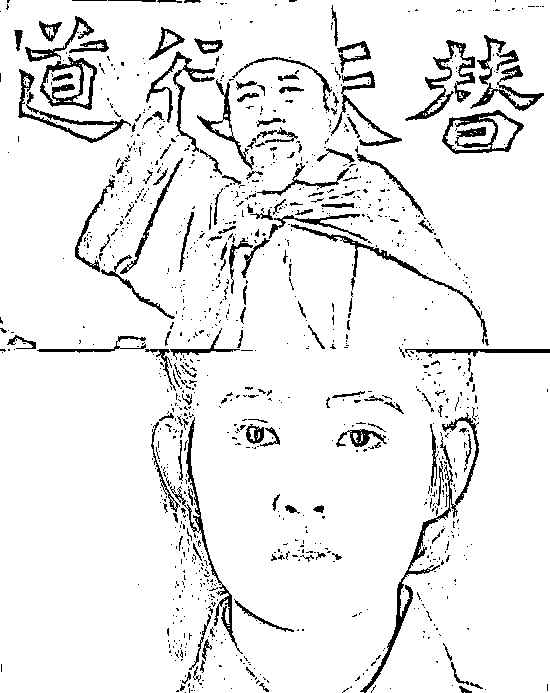

43 集的电视剧，潘金莲出现了 5 集，

在这 5 集当中潘金莲洗了 4 次澡，

除去这个槽点，

这部名著改编的电视剧受到观众一致好评。

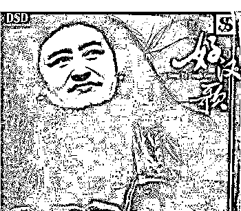

由刘欢演唱的主题曲《好汉歌》让人难以忘怀，

气势恢宏的歌词加上刘欢高亢有力的歌声，

这首歌当年雄踞各大排行榜冠军位置多周，

成为一首具有跨时代意义的歌曲。

无论是编剧、演员表现还是音乐，

98 版《水浒传》已是公认的经典。

2

**历史罕见大洪水**

对很多中国人来说，

1998 年的大洪水是刻骨铭心的记忆。

那一年，有人失去了父亲，有人失去了丈夫，

有人失去了孩子，有人失去了家园。

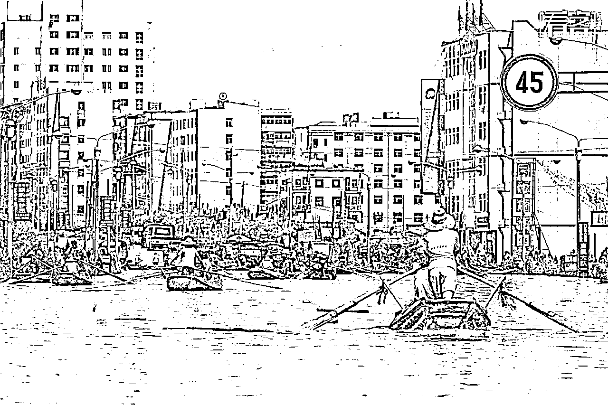

1998 年，一入夏，珠江、松花江、长江、嫩江……

中国境内全流域发生大洪水，

荆州告急，武汉告急，九江告急，大庆告急，哈尔滨告急，

全国 29 个省市受灾。长江流域一共出现八次洪峰。

江西省抚州市黎川县一村支书这样描述，

“从梦中醒来，发现背上有水，穿衣时淹到膝部，穿好衣服淹到胸部。”

湖北咸宁年仅 6 岁的女孩小江珊在洪水中紧紧抱住一棵摇摇欲坠的小杨树，

挣扎了近 9 个小时后终于获救。

灾情像梦魇一般折磨着每一个国人的心，

人们子弟兵前赴后继的赶往第一线，

用身体和沙袋做最后的抵抗，坚持再坚持！

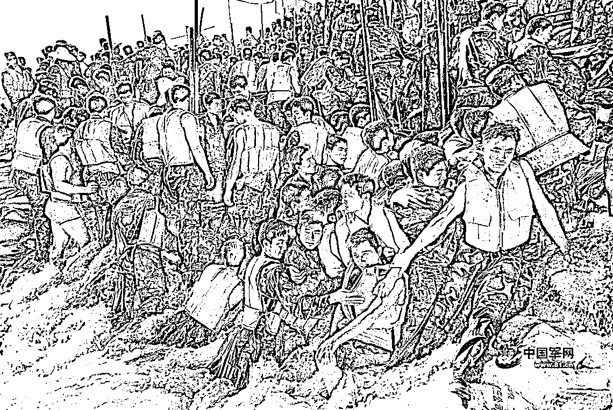

据统计，1998 年全国受灾面积 3.18 亿亩，

受灾人口 2.23 亿人，死亡 3004 人，

倒塌房屋 685 万间，直接经济损失达 1660 亿元。

**那个夏天，已经过去了二十年。**

3

**互联网大潮**

 

1998 年，很多国人还没有摸过电脑，

中国的网络浪潮一兴起就热浪滚滚。

1995 年，因受到互联网的震撼，

海归张朝阳放弃美国的安逸生活，

提着个破箱子揣着一千美元，

把互联网带到中国，

1998 年 2 月，第一家全中文的网上搜索引擎——搜狐网，成立。

彼时，张朝阳到硅谷搜寻互联网人才，

问一个名叫李彦宏的愿不愿意回国做互联网，

不久后，李彦宏靠着搜狐的案例游说硅谷投资人，回国创立了百度。

那两年，张朝阳被奉为“中国互联网”第一人，

像个明星一样来到深圳演讲，

台下聚集 700 多人，

其中有个年轻人听完演讲之后激动不已，

决定回去开始做 OICQ，

这个年轻人叫做马化腾。

之前，腾讯公司做的是寻呼软件，

马化腾也是风靡一时的股霸卡的作者之一，

他和朋友合作开发的股霸卡在市场一直卖得不错。

但他真正意义上的第一桶金是来自股市，

他最精彩的一单是将 10 万元炒到 70 万元。

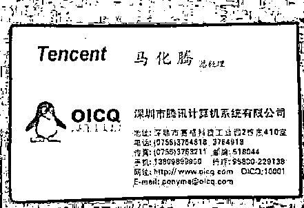

腾讯做的 OICQ，因为抢了很多 ICQ 的用户被起诉，

最终败诉，不得再使用 OICQ 这个名称，

马化腾急中生智改成了 QQ，

腾讯 QQ 就此诞生。  

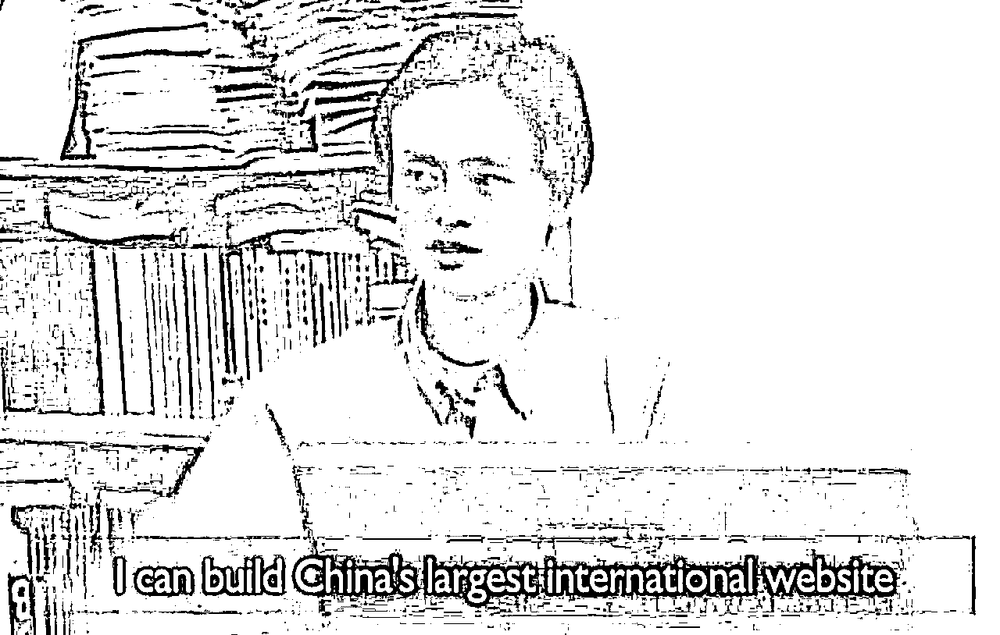

1998 年年底，34 岁的马云北漂创业，

两次梦破的马云带领团队去了趟长城，

大家心情都很沉重，

团队中的一个人突然号啕大哭，

对着长城大声喊：为什么！为什么！

离开北京前的最后一个晚上，

马云和自己的团队聚在北京的一个小酒馆。

那天下着很大的雪，

众人边喝酒，边抱头痛哭，

最后唱起了《真心英雄》。

之后，马云回到杭州，

在自己家里创办了阿里巴巴。 

4

**香港乐坛走向衰落的开端**

1998 年，是整个香港作为华语乐坛领军地位的最后一次辉煌。

在这之后，华语歌曲的重心逐渐转移，

香港乐坛慢慢走向衰落和不景气直至今日。

这一年，乐坛仍旧是四大天王的天下，

但明显可以感觉到后起之力的崛起。

在十大劲歌金曲奖颁奖典礼上，

年度十大金曲中有四席是属于四大天王的，

陈奕迅和古巨基夺得两席，预示着新星力量的崛起，

而在最具分量的年度最受欢迎男歌星奖的角逐赛中，

最终胜出者为郭富城。

1998 年之后，黎明宣布不再于香港领取任何关于音乐方面的奖项。

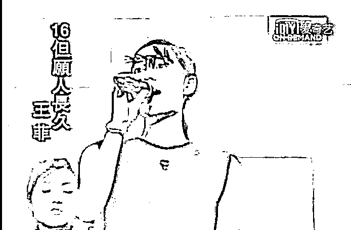

1998 年十大劲歌金曲奖颁奖典礼

90 年代无疑是“王菲”时代！

此时，只有一位可以和她分庭抗礼，

那就是郑秀文。 

郑秀文是“唯一”可以与王菲竞争的歌手，

她被誉为香港乐坛天后，更被誉为梅艳芳的接班人。 

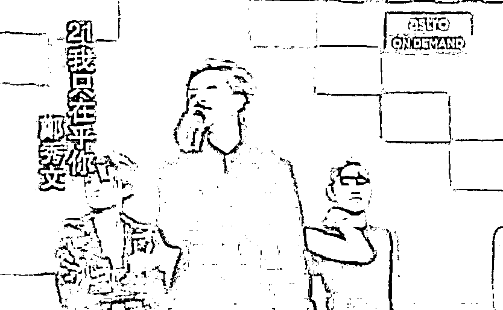

但在这场年度最受欢迎女歌手的竞争中，

郑秀文最终败下阵来，

王菲拿下当年最受欢迎女歌星奖，

从此，香港传媒开始了对王菲一面倾倒的支持。

如果说 1998 年的香港还是乐坛的中心，

刚出道不久的张惠妹也从台湾跑到香港去颁奖，

那么台湾乐坛则即将从沉睡中醒来，

内地乐坛则刚刚苏醒。

<qqmusic jumpurlkey="" albumid="001gn7g54ZEIKb" otherid="002duM6708vYks" musictype="1" src="https://mp.weixin.qq.com/cgi-bin/readtemplate?t=tmpl/qqmusic_tmpl&amp;singer=%E7%8E%8B%E8%8F%B2%20-%20%E5%94%B1%E6%B8%B8&amp;music_name=%E6%83%85%E8%AF%AB&amp;albumurl=https%3A%2F%2Fy.gtimg.cn%2Fmusic%2Fphoto_new%2FT002R68x68M000001gn7g54ZEIKb.jpg&amp;musictype=1" play_length="260" singer="王菲&nbsp;-&nbsp;唱游" music_name="情诫" audiourl="http://ws.stream.qqmusic.qq.com/C100000aIsYq3YZzAU.m4a?fromtag=46" albumurl="https://y.gtimg.cn/music/photo_new/T002R68x68M000001gn7g54ZEIKb.jpg" mid="002duM6708vYks" musicid="1255738" frameborder="0" scrolling="no" class="res_iframe qqmusic_iframe js_editor_qqmusic" style="width: 928.155px;font-size: 16px;"> 这一年，</qqmusic>

许多歌手推出了自己的代表作品。

> 王菲推出经典专辑《唱游》；
> 
> 刘德华也发行了《笨小孩》《冰雨》；
> 
> 李玟推出《DI DA DI》在这一年横空出世；
> 
> 任贤齐发行《对面的女孩看过来》《伤心太平洋》，走上事业的巅峰；
> 
> 林志炫推出《蒙娜丽莎的眼泪》；
> 
> 梁咏琪发行《胆小鬼》；
> 
> 周华健推出《最近比较烦》；
> 
> 张惠妹推出《牵手》；
> 
> 刘若英发行《很爱很爱你》；
> 
> 陈慧琳发行《记事本》；
> 
> 那英推出《征服》；
> 
> 黄磊发行《我想我是海》；
> 
> 徐怀钰发行《我是女生》；
> 
> 张宇发行《月亮惹的祸》……

粤语歌曲占比迅速减少，

台湾歌手占了一大半，

但国语趋势还不是很明显。

直到 2000 年，周杰伦横空出世，

乐坛正式转向周杰伦时代。 

5

**电视剧《还珠格格》**

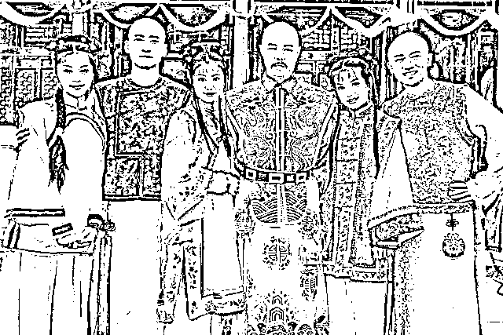

1998 年，一部台湾大陆合作的电视剧首播，

迅速火遍两岸三地，万人空巷，

开创了中国电视剧至今无人超越的收视纪录，

最高点突破 65%，

在此后的二十年里，一直被重播，

并且一连出了三部，

这部剧叫做《还珠格格》。

《还珠格格》的诞生，

开启了中国内地的造星时代。

当时内地就处于对偶像尤其是本土偶像渴求的年代，

赵薇凭此小燕子一角一飞冲天，

成为全亚洲最耀眼的偶像明星，

还为琼瑶开启内地市场打下坚实的基础。

其他主演包括林心如、苏有朋、周杰、范冰冰等也在那一年走红，

二十年过去，他们大多都成长为娱乐圈的中流砥柱。

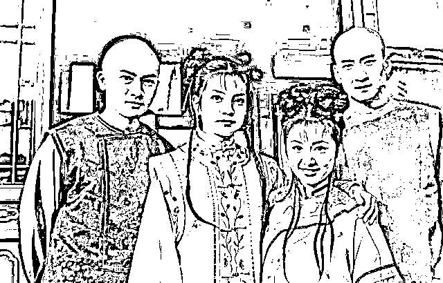

除了造星之外，这部剧的主题曲及插曲也一度传唱大街小巷。

 “啊~~~~~~啊~~~~当山峰没有棱角的时候……”，

每当音乐一响起，多少人会不自觉的跟着唱起来，

这首由动力火车演唱的《当》成为萦绕在中国人心中最难以忘怀的一首歌。

歌曲由琼瑶亲自填词，

并将中国古诗《乐府诗集·鼓吹曲辞一》融入歌词中，

听着首歌感觉就像谈了一场缠绵悱恻、轰轰烈烈的爱情，

那个时候淘妹还小，什么都不懂，

只觉的小燕子比较好笑。

而片尾曲《雨蝶》也让台湾歌手李翊君在内地红了一把，

但后续发力不够，这之后就再没有了水花。

二十年过去了，《还珠格格》还一直在发挥它的余力，

一波又一波的表情包在网上疯传，

剧中演员之间的爱恨情仇变成娱乐梗，

成为人们的八卦谈资，几度被翻新讨论。

也许，这就是经典的力量吧。 

6

**电影《不见不散》**

> “我叫霍华德，欢迎你到我们美国来，你们中国的菜很好吃。”
> “你刘元吧？ ”

年底，电影《不见不散》上映，

延续上一年《甲方乙方》的风格，

冯氏喜剧带着他的小人物故事再次登上贺岁档，

故事讲述的是两个从北京来到美国奋斗的年轻人刘元和李靖，

在一次偶然的机会下相识，

并展开了一段不是冤家不聚头的爱情故事。

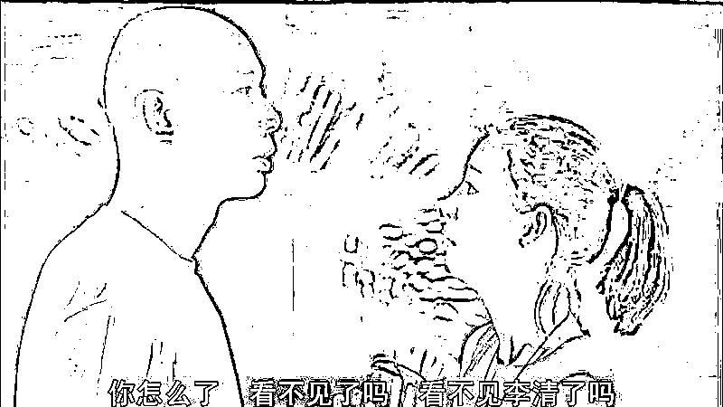

> 许多年过去了，我没有再见到过她，也没有她的任何音信，我把我的爱人给丢了，我一直以为我们还会见面，可能是在一条经常走过的街上，也可能是偶然走进的咖啡馆里，我相信，只要她在我的附近，我就能够感觉道她的存在。

电影台词充满了冯氏幽默，让你会心一笑。

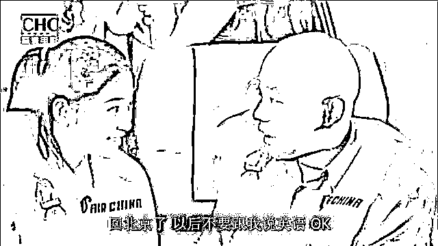

《不见不散》之后，跟着火的还有孙楠的那首《不见不散》。 

7

**《泰坦尼克号》中国上映**

1998 年 4 月，《泰坦尼克号》在中国上映，

轰动一时，各大媒体争相报道，新闻铺天盖地。

南方周末曾评价：

当时的《泰坦尼克号》已经不是一部电影而是一起“事件”了。

大到一线城市，小到没有电影院的城镇，

人们都在谈论这部电影带来的震撼，

即使是不懂英文的大叔大妈也能哼上一段电影的经典旋律，

盗版光碟也炒到几十块一张，

一张光碟几个人轮流排队看。

《泰塔尼克号》在全球创作 18 亿美元的票房，

中国区票房 3.7 亿人民币，

那个年代，贺岁档最受欢迎的电影《不见不散》的票房也只有 4000 万。

《泰坦尼克号》的火爆，

使得小李子成为许多中国影迷心中的偶像，

电影主题曲《我心永恒》也顺势在中国走红，

年底，在 1999 年央视春晚上，

赵丽蓉在小品《老将出马》中演唱了英文版《我心永恒》的高潮部分。

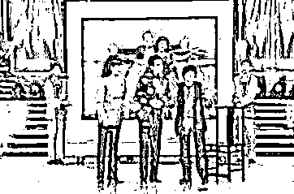

《泰坦尼克号》注定成为一个符号，

深深地烙在一代人的心中。

8

** 拯救大兵瑞恩瑞恩 **

1998 年，战争大片《拯救大兵瑞恩》上映，

风靡全球。

横扫奥斯卡多项大奖，

成为世界战争片的经典之作。

影片传递了强烈的英雄价值观，

当一个人陷入危险时，

要不要不计成本的救援他，

哪怕是牺牲几个人的生命。

一时间，功利价值观和人道主义价值观到底孰优孰劣成为人们议论的话题，

整个影片中充满着对人性的思考。

同时，这部影片也捧红了一批男神。

在《拯救大兵瑞恩》演员表里，

我们看到了汤姆·汉克斯、马特·达蒙、范·迪塞尔、杰瑞米·戴维斯、爱德华·伯恩斯等好莱坞男星。

1998 年，他们中的大部分还是演艺圈的“无名之辈”，

在斯皮尔伯格的慧眼识英下，

他们参演了这部战争巨片，迎来事业的高峰。

尤其是马特·达蒙和范·迪塞尔，

他们在出演《拯救大兵瑞恩》之后，

一跃成为好莱坞最抢手的硬汉，为世界影迷所熟悉。

20 年过去了，这部影片仍然是值得刷 20 遍的经典电影。  

9

**赵本山、高秀敏、范伟小品《拜年》**

1998 年，赵本山、高秀敏、范伟“铁三角”首次组合亮相春晚，

演绎了一出小品《拜年》，逗的观众捧腹大笑。

之后，他们三人又 4 次登上春晚的舞台，

演绎了《卖拐》《卖车》《送水工》《心病》4 个经典小品，

三人的形象深入人心，

成为国人心中的最为经典的小品组合之一。

遗撼的是 2005 年 8 月，

高秀敏因心肌梗塞不幸去世，

而同为辽宁人的范伟自 1995 年开始和赵本山一起合演小品，

但 2005 年春晚合作完《功夫》后，两人也分道扬镳。

10

**王菲、那英《相约 98》**

要说 1998 年最火的歌曲是哪一首， 

必然是《相约 98》无疑了。

[`v.qq.com/iframe/preview.html?vid=r03241csu9g&width=500&height=375&auto=0`](https://v.qq.com/iframe/preview.html?vid=r03241csu9g&width=500&height=375&auto=0)

在 1998 年除夕夜的“中央电视台春节联欢晚会”上，

王菲和那英合唱一曲《相约 98》，

不足三十岁的王菲乍一出场，

扎着高高的辫子，像一个天真的孩童，

那英一席白裙，干净利落。

两个人，一个如高山般气势沉稳，

一个似流水般温柔清澈，

歌声相得益彰，

成就华语乐坛史上最经典的女声二重唱。

春晚以后，这首歌占据各大榜单第一，

长达半年之久。

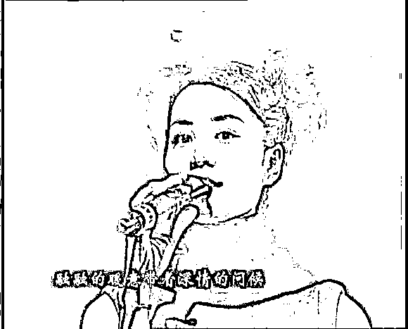

那时候，王菲的署名旁边还标注着“香港”二字，

那是她首次登上春晚，

在那之后，王菲的名字开始在大陆迅速流行起来，

借助《相约 98》的名气，

那英也再次稳固了她在内地乐坛的天后地位。

很多人说，《相约 98》的生命只有一年，

过了 1998 年，这首歌就失去了意义，

下次在唱起应该是 2098 年了，

但事实证明，好的歌曲，

不管哪年都能一直流传下去。

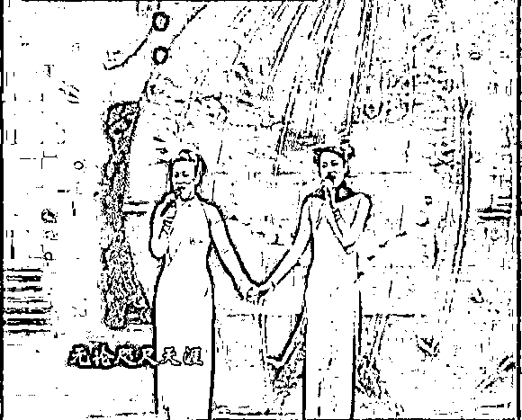

无论什么时候听，仍旧余味无穷。

今天，当《相约 98》的歌声再次响起，

世界已经变了天地，

家里的彩色电视机不见了踪影，

天真的孩童也已长大成人，

但当那个年代的记忆再次被唤起时，

还是忍不住感慨，

1998 年，很庆幸，我曾拥有它。

1998 年，一个充满希望的年代，

20 年过去了，纵使我们失去了青春，

失去了激情，曾经美好的记忆将永存心底，

但愿我们依旧能怀着希望，继续前行。

就像《相约 98》歌词所唱：

**来吧来吧相约九八，**

**来吧来吧相约一九九八**

**相约在甜美的春风里，**

**相约那永远的青春年华**

**心相约心相约，相约一年又一年，**

**无论咫尺天涯**

— END —

