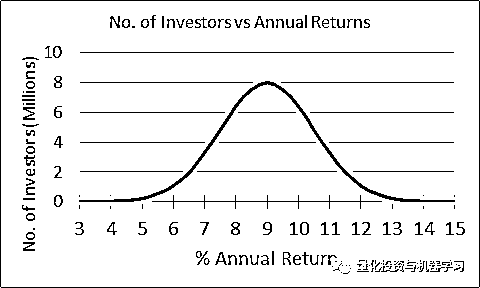
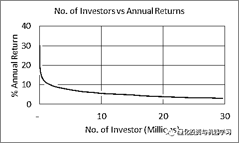

# 一个击败股市的超级数学模型？

> 原文：[`mp.weixin.qq.com/s?__biz=MzAxNTc0Mjg0Mg==&mid=2653296020&idx=1&sn=ebde7716e780e1234d433239e669b05b&chksm=802dd781b75a5e9728521d820ba48092cb2cdcfd1ec079e27c5869e1c12362a3c981c0cbf2cc&scene=27#wechat_redirect`](http://mp.weixin.qq.com/s?__biz=MzAxNTc0Mjg0Mg==&mid=2653296020&idx=1&sn=ebde7716e780e1234d433239e669b05b&chksm=802dd781b75a5e9728521d820ba48092cb2cdcfd1ec079e27c5869e1c12362a3c981c0cbf2cc&scene=27#wechat_redirect)

**标星★****置顶****公众号     **爱你们♥   

***量化投资与机器学习微信公众号编译***

*来自：quora*

其实，我们的问题是：

**为什么还没找到一个击败股市的****数学模型****？**

**回答一**

因为市场是一个所谓的**“二级”混沌系统**。

第一级混沌是对天气预报没有反应的混沌：它不在乎天气预报员说什么；如果下雨，就下雨。尽管它受到无数因素的影响，但我们可以建立计算机模型，越来越多地考虑这些因素，从而做出越来越好的天气预报。

第二级混沌是对预测做出反应的混沌，因此永远无法准确预测（比如市场）：他们非常关心预测和消息。如果我们开发一种计算机程序，能够 100%准确地预测明天的股票价格，会发生什么？股价将立即对这一预测做出反应，而这一预测最终将无法实现。

**有如此多的力量在起作用，它们之间的相互作用是如此复杂，以至于这些力量的强度以及它们相互作用方式的极小变化都会产生巨大的结果差异。**

**回答二**

很幸运能够作为在纽约招募对冲基金专业人士的负责人接触到一些市场内部人士。D.E Shaw 从事收敛交易（Convergence Trading），他们在这方面做得很好。

收敛交易是指你利用资产之间的错误定价，并综合创造出等价资产，其交易价格高于或低于实际资产。你做多较便宜的标的，做空较贵的标的，直到它们收敛（变成相同的价格）时，这时你锁定利润并退出。这种策略的问题在于你无法预测它的时机。

Shaw 公司的人告诉我，文艺复兴（西蒙斯）每个月都进行期货交易并赚钱，这证明他们有一个预测收敛的数学模型。如果你能预测收敛，你就能每次都赚钱，而且确切地知道什么时候会发生。

他们所做的是一个秘密，但更令人印象深刻的是他们的员工有多忠诚。公司之外的人对他们的实际工作几乎一无所知。

文艺复兴也是我的客户，我为他们挑选了十几位专业人士。**在 1996-1999 期间，他们通常只聘用来自学术界（不一定是常春藤联盟）、拥有 STEM 背景（通常是博士或来自 IBM 等行业）的非金融专业人士**。他们倾向于雇佣大数据分析师，**面试过程的一部分就是要求应聘者解决一个没有答案的问题。**他们分析如何排除噪音，以及他们用来做这件事的严格程度。我清楚地记得一个游戏开发者被文艺复兴科技公司拒绝了。第二天，文艺复兴打电话说他们想要给游戏开发者提供一份工作，原因是游戏开发者采取的方法一开始并没有被面试官理解，但经过进一步的分析，他们发现其提供的解决方案是一条没有人走过的道路，需要大量的分析才能理解。我打电话给游戏开发者，他说：“不，谢谢，游戏比他们做的更有趣，他不是博士！”。

还有一个客户，他的数学模型也优于市场。他们模拟了货币的流入和流出，就像人们分析股票来预测货币是升值还是贬值一样。如果流入多于流出，货币就会升值。他们向我提供了一份机密文件，显示了这些资金的表现。令人惊讶的是，**他们管理的基金与我们已知的任何指数都没有任何关联。这意味着，即使金融危机出现，其也不会受到影响**。2008 年（金融危机期间），我打电话给他们，在通话结束时，我问他们过得怎么样？他们说：“我们度过了很棒的一年，我们的资产翻了一番”，那是 2008 年 9 月，当时雷曼和 Bear 已经破产。

像这样的公司很少见，而且在大多数情况下，不可能编写一个总是获胜的算法。以今天的计算能力，任何好的交易算法在 6 个月内都会被逆向工程化，利润也会消失。

还有一个客户是荷兰银行资助的一家对冲基金，他让我为他们的交易部门招聘一名 IT 网络管理员。他们交易的是货币市场证券。这让我感到困惑，因为我无法想象在短期内会有利润丰厚的交易。他们发现，期限不到 1 年的债券往往在同等货币市场上被错误定价，可以被套利。他们说，这是真的，如果杠杆化，他们可以获得巨大的收益。他们通过持有多头/空头头寸并持有至到期而获利，同时用借来的钱高度杠杆化这一头寸。他们告诉我，这是一个涉及蒙特卡洛模拟应用的风险管理游戏。**这家鲜为人知的对冲基金持续盈利 20%——他们的团队由 2 名程序员、1 名分析师和 1 名交易员组成，他们的年利润超过 10 亿美元（加上那位网络管理员）。****他们的系统竟然运行在联网的个人 PC 上！**

**回答三**

如果一个模型打败市场，十年又十年，那么每个人都会想要使用它！

因此，随着计算机模型减少了人为误差，每个人都会变得更擅长选股。

然而，这仅仅意味着其他人会使用它，市场本身也会改变。

想象一下 10 年前。计算机预见到了 FANG 的到来。所以每个人都投资了这些科技股。

随着市场结构的改变，指数投资者也将受益。

这是一个原因。另一个原因是，虽然人工智能和计算机模型可能会减少或消除人类在投资时的错误，比如利己主义和恐惧，但它无助于阻止世界上所有未知的未知和已知的未知。

谁能预见到以下事情的发生呢？

最后，早期迹象表明，人工智能在选股方面比人类做得更好。

不过，现在就判断它能否长期跑赢市场还为时过早。

记住，在 5 年的时间里，人类有 20%的时间跑赢了市场。50 年后，这一比例降至 2%。人工智能可能会改善这些数字，但谁知道呢。

**回答四**

**有些数学模型继续在股市中赚大钱，但它们是私有的，由对冲基金和私人投资者所有：它们不与公众分享。他们没有任何理由这样做！**

对于长期投资来说，有一个很好的模式适合你：当市盈率和整体市场的市净率处于历史低点时买入股票，与过去处于市场低点时的水平大致相同（2002，2008）。然后，当你的股票接近较高水平时，卖出它们（1999，2007）。这是一个非常简单但有效的击败股市的模式。换句话说，低买高卖。多数投资者之所以搞砸这一过程，是因为**他们一心只想在准确的低点买入，在准确的高点卖出，或者是因为他们需要太多的保证，以确保市场已经结束下跌，以至于他们错过了大部分反弹的机会。**

**回答五**

多年来，有些模型和算法的表现好于平均水平。

随着一些模型的公开，越来越多的人开始使用它们，它们的效果也逐渐消失了。

经典的金融理论基于有效市场假说。100%理性的投资者，一旦有了信息，他们就会知道。

当然这是一个假设。投资者并不理性，信息并不总是被广泛获取，市场也不是 100%有效的。

我们回溯得越远，他们的效率就越低。这就是为什么巴菲特、彼得·林奇和等人能做得这么好。

今天仍然存在效率低下的问题，人们仍然在寻找这些问题，但我们相信，这些问题越来越难找到。仔细观察那些随着时间推移表现相当不错的公司，你会发现超额收益会随着时间的推移而减少。

为什么？

因为使市场有效的机制正在变得更加强大。有许多受过教育的投资者、更专业的投资者、更好的技术（互联网、更复杂的算法和软件、大数据分析）等等。

甚至有一些市场领跑者比其他人领先几毫秒（高频）。

当大多数人想到“平均市场收益”这个概念时，他们的脑海中会有这样一个画面：

例如，对于一个有 3000 万投资者的市场来说，这是一个正态分布，平均收益率为 9% 。 大多数投资者都能达到市场平均水平，只有少数例外的投资者做得更好，而极少数非常无能的投资者表现得非常糟糕。

但是，如果上述市场的收益与投资者人数之比的分布看起来更像这样呢？

只有极少数的投资者，几百个，最多几千个做得非常好，绝大多数表现低于市场平均水平。

事实上，这似乎就是市场收益在投资者之间实际分配的方式。许多研究表明，大多数散户投资者通常能获得 3%或 4%的收益。事实上，从长期来看，大多数金融顾问和专业投资者的表现并不总是好于市场。但似乎确实有少数投资者，可能是 5%，可能是 1%，也可能更少，他们总是跑赢市场。

这也是全球财富分配的方式。只要用数百万美元的财富来代替年度收益轴，然后将投资者轴乘以 100，就能得到拥有这些财富的人数。

全球 70 亿人口中约有 700 位亿万富翁，约占全球人口的 0.00001%。

我们不知道有多少百万富翁，但如果全球有大约 3500 万人的净资产超过 100 万美元（约占全球人口的 0.5%），你也不会感到惊讶。

***你可以点击******阅读原文******在******知乎******发表你的看法。***

***或者在******留言处******发表你的看法！***

*—End—*

量化投资与机器学习微信公众号，是业内垂直于**Quant**、**MFE**、**Fintech****、AI、ML**等领域的**量化类主流自媒体。**公众号拥有来自**公募、私募、券商、期货、银行、海外**等众多圈内**18W+**关注者。每日发布行业前沿研究成果和最新量化资讯。

你点的每个“在看”，都是对我们最大的鼓励