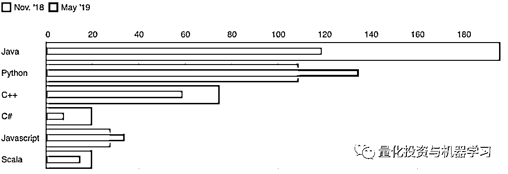
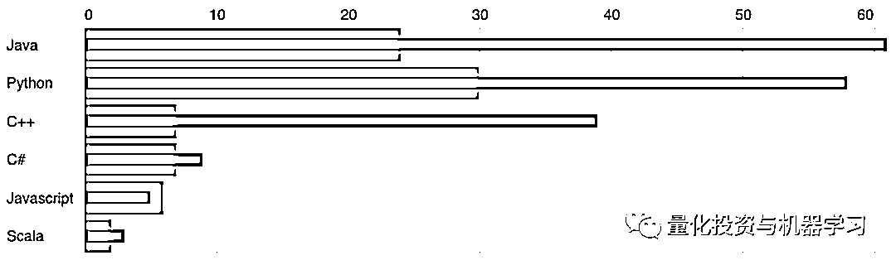
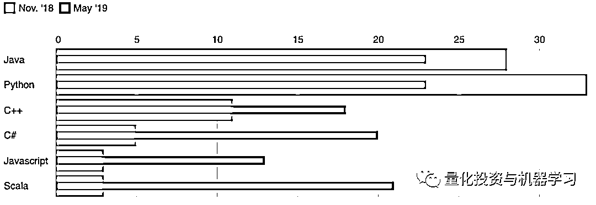
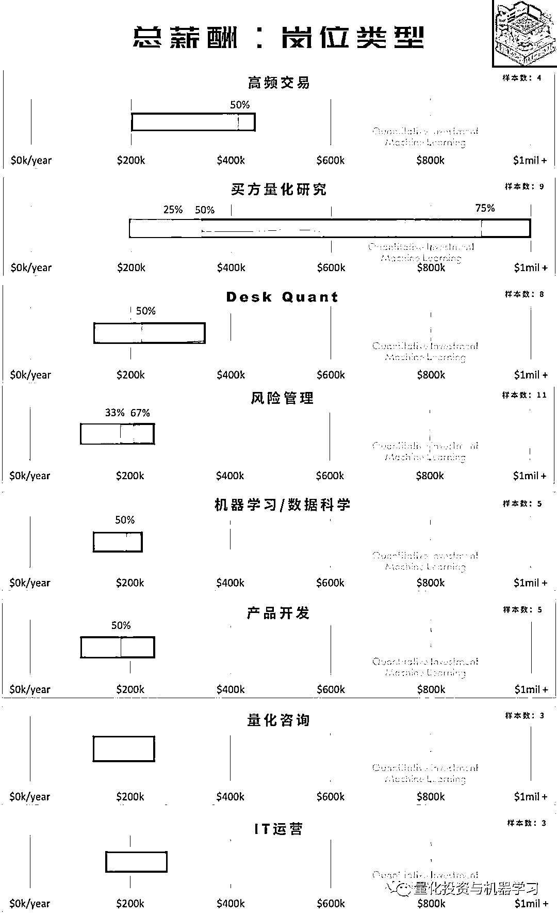
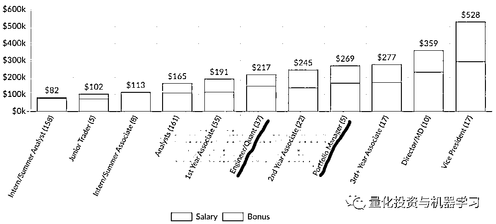
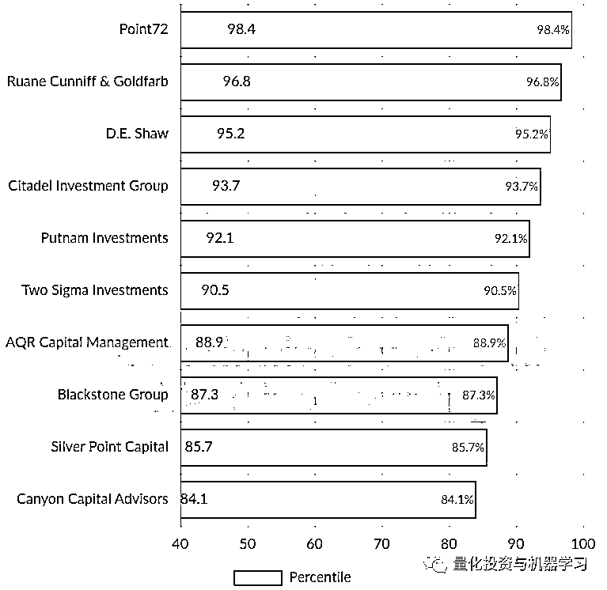

# Baruch 量化职业发展报告：一半时间在编程！

> 原文：[`mp.weixin.qq.com/s?__biz=MzAxNTc0Mjg0Mg==&mid=2653295991&idx=1&sn=a13c487b064fbf743cbbc640cd5df19b&chksm=802dd762b75a5e740da5af6554267e461e129ed457e1891985608901e42c85ea0169cb5faf75&scene=27#wechat_redirect`](http://mp.weixin.qq.com/s?__biz=MzAxNTc0Mjg0Mg==&mid=2653295991&idx=1&sn=a13c487b064fbf743cbbc640cd5df19b&chksm=802dd762b75a5e740da5af6554267e461e129ed457e1891985608901e42c85ea0169cb5faf75&scene=27#wechat_redirect)

**标星★****置顶****公众号     **爱你们♥   

***量化投资与机器学习微信公众号出品***

*编辑：1+1=6*

**目录**

*   前言

*   报告概述

*   岗位分布

*   工作性质

*   英国投行举例

*   投行编程岗位空缺数据

*   薪酬

*   全球薪资水平

*   行业分布

*   公司分布

*   学校分布

*   GPA

*   哪家对冲基金面试最难？

*   哪家对冲基金面试体验最好？

*   哪家对冲基金实习生获得全职工作几率最高？

**前言**

*图片来自：网络

巴鲁克学院（Bernard M.Baruch College，CUNY）是一所以商科著名的位于美国纽约市曼哈顿的公立大学。其金融工程硕士项目，被誉为美国顶尖金工项目之一，在 2020 年 QuantNet 金融工程排名中位列第二。巴鲁克学院 MFE 注重培养学生定量金融方面的技能，且该校就业资源强大，每年进入摩根士丹利、摩根大通、花旗等企业的毕业生很多。

给大家看一组数据**最新 CUNY 2019 年秋季入学统计数据：**

**506 名申请人，44 名录取，****8%****的录取率！**

*   录取申请人：

*   平均 GPA：3.75

*   平均 GRE：169.5

*   口语：158

*   就业公司：巴克莱，法国巴黎银行，Citadel，EY，高盛，JP 摩根，摩根士丹利，Point72，普华永道，Tower 等，都是顶尖投行和对冲基金公司！想不去都难

当然除了 Baruch，还有其他院校也是可以的：

**全球顶尖的宽客硕士学位课程**

本文是对 Baruch MFE 项目五年量化职业发展报告的解读。有一些参考价值，今天公众号分享给各位读者，希望对其有所帮助！

**查看 2020 年全美 MFE 排名及解析**，请查看下文：

**报告概述**

本报告涵盖了对 BaruchMFE 学院 2012-2014 届毕业生的职业发展调查结果，这些学生毕业后**已经工作了 4-6 年，所有有很好的参考价值**。而且，在这 59 名全日制毕业生中，所有人都接受了调查，其中 52 人给出了调查表。

在这 52 名毕业生中，有 50 人继续在金融服务业工作。其中 94%的人在美国工作，90%的人在纽约地区。在中国的有 2%，在北京。

**岗位分布**

48%的毕业在银行工作，38%从事买方工作（对冲基金、资管等），其余从事金融技术或咨询工作。

41%的毕业生专注于宏观/跨资产领域，24%和 29%涉及固收和股票。

**工作性质**

**超过****50%****的毕业生每天进行****编程、数据分****析和建模****。**量化人不会编程真是没得玩！

报告显示，**编程****占到了他们日常工作的 ****50%**

编程在日常工作中占比

**C++、Python、R、SQL 和 VBA 是最常用的编程语言**，每种语言的使用率都超过 25%。**Python ****是最受欢迎的**，**使用****率为 ****80%**，其次是 SQL，使用率为 52%。

为什么 Python 是这么多人的选择，Zen of Python 的前四行总结了其精髓：

> *Beautiful is better than ugly.*
> 
> *Explicit is better than implicit.*
> 
> *Simple is better than complex.*
> 
> *Complex is better than complicated.*

TOP 10 编程语言 TIOBE 指数走势（2002-2018）

在 eFinancialCareers 平台上，我们分析了纽约和伦敦的金融编程岗位：Python 的平均年薪为$117k (£92k) ，如下图所示：

可见 Python 在金融领域的重要性。

**英国投行举例**

我们拿英国来做具体分析，我们对 2019 年 9 月和 2019 年 5 月在英国各大投行网站上发布的工作岗位进行了分析。在这两个时期**Java 和 Python 主导**了招聘列表，C++，Javascript 和 C#紧随其后。

*英国地区

我们研究了**高盛（Goldman Sachs）、摩根大通（JPMorgan）、摩根士丹利（Morgan Stanley）、美国银行（Bank of America）、花旗（Citi）、德意志银行（Deutsche Bank）、瑞银（UBS）、瑞士信贷（Credit Suisse）和巴克莱银行（Barclays**）这几家顶尖的投行。

并非所有投行都在 5 月至 9 月期间削减了对编程人才的需求。在高盛、摩根士丹利和瑞银 ，需求大幅增长。然而，在德意志银行，这个数字跌至 0，原因大家都知道的。巴克莱银行目前是英国最大的技术人员招聘机构，但同期巴克莱银行对编程语言人才的需求下降了近 40% 。

英国地区

****投行编程岗位空缺数据****

过去半年，纽约投资银行与科技相关的职位空缺数量大幅下降。例如，与去年秋季相比，摩根士丹利和花旗目前的岗位空缺远少于去年秋季的一半。与此同时，摩根大通在纽约的科技类职位空缺较去年 11 月减少了 55%。

下面这张图是一个整体的数据情况：

正如你所看到的，仅仅 6 个月之后，**Ja****va 就几乎被 Python 取代，成为纽约投行最受欢迎的编程语言**。就在去年秋天，纽约提到 Java 的职位空缺比需要 Python 的职位空缺多了 180 个。现在这一差距已被削减至 12 个。

过去的一段时间，有关 Python 的职位数量几乎没有变化。Python 使用率的上升就向前面说的，**非开发人员的使用等**。C#的百分比降幅最大，目前仍在使用，但主要用于一些低延迟项目。

自去年 11 月以来，高盛与编程相关的岗位空缺减少了一半以上。范围所有部门。高盛可能自称是一家技术公司，但其对限制成本的控制似乎缩减了工程师的数量，至少在纽约是这样。

高盛岗位空缺数据截止 5 月

与此同时，摩根大通似乎有一些变化，Python 的使用度比去年明显增多。

摩根大通岗位空缺数据截止 5 月

最反常的是美国银行，Java、Python 和 C++的缺口都增加了一倍多。 过去六个月里，美国银行在纽约地区的技术工作岗位数量有所下降。通过梳理该行网站上的职位描述，很可能新的职位介绍加入了额外的编程语言，以便在搜索中更具包容性。虽然有重叠部分，但总体结果与去年一样：**美国银行似乎并不偏爱 Java 或 Python。**

美国银行岗位空缺数据截止 5 月

摩根士丹利和花旗的 Java 和 Python 职位空缺数量均大幅减少，不过它们似乎都更愿意**考虑在不太受欢迎的编程语言方面招聘具有专业知识的求职者**。

摩根士丹利岗位空缺数据截止 5 月

花旗岗位空缺数据截止 5 月

**薪酬**

年度总薪酬包括：**基本工资和年度奖**。

还是对冲基金给的高啊！大部分一年$40 万-$80 万，稳妥！

还是量化研究员挣的多。最高的能有$100 万！

工作经验指的是加入 Baruch MFE 项目之前的工作经验。因为有工作经验的毕业生有可能会达到最高的薪酬水平。

先前教育指的是在加入 Baruch MFE 项目之前达到的最高教育水平。薪酬范围最广的是那些在上学前只持有学士学位的毕业生。

**全球薪资水平**

为了比较，我们看看 WSO2019 年的全球情况（截止最新 2019 年 12 月）：

截止 2019 年 12 月，**89171 份**样本中，Quant 的平**均薪资是$149K**。

**行业分布**

截止 2019 年 12 月，**89171 份**样本中，去**投资银行**面试的人最多，资管公司其次。

**公司分布**

截止 2019 年 12 月，**89171 份**样本中，去**高盛**面试的人最多。

**学校分布**

截止 2019 年 12 月，**89171 份 **样本中，来自**纽约大****学、宾夕法尼亚大学、哈佛大学**的毕业生从事量化金融行业是最多的。

**GPA**

截止 2019 年 12 月，**89171 份** 样本中，大多数毕业生的 GPA 都在 3.5-3.8 之间，都是学霸啊！

**哪家对冲基金面试最难？**

看来 D.E.Sha 要求确实高！

**哪家对冲基金面试体验最好？**

Point 72 看起来在整体氛围最好。详情见：

[**加入顶尖对冲基金 Point72，和 Billions 大佬面对面！**](https://mp.weixin.qq.com/s?__biz=MzAxNTc0Mjg0Mg==&mid=2653291180&idx=1&sn=04858d7d50c14bb52659b0e82ea9adef&scene=21#wechat_redirect)  

****哪家对冲基金实习生获得全职工作几率最高？****

*—End—*

量化投资与机器学习微信公众号，是业内垂直于**Quant**、**MFE**、**Fintech****、AI、ML**等领域的**量化类主流自媒体。**公众号拥有来自**公募、私募、券商、期货、银行、海外**等众多圈内**18W+**关注者。每日发布行业前沿研究成果和最新量化资讯。

你点的每个“在看”，都是对我们最大的鼓励