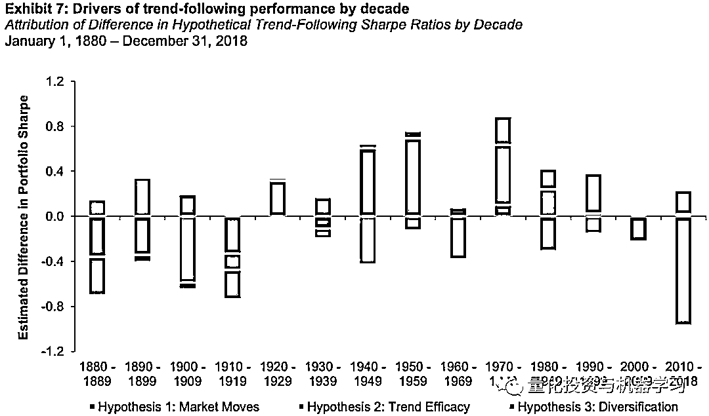

# AQR 最新 | 趋势跟踪策略，大势已去？

> 原文：[`mp.weixin.qq.com/s?__biz=MzAxNTc0Mjg0Mg==&mid=2653295897&idx=1&sn=63675b84325c51e79494990c26851514&chksm=802dd70cb75a5e1add624a2d51e22613466191b74802d7adc6fad248e6f8a82b68d8657d9b9e&scene=27#wechat_redirect`](http://mp.weixin.qq.com/s?__biz=MzAxNTc0Mjg0Mg==&mid=2653295897&idx=1&sn=63675b84325c51e79494990c26851514&chksm=802dd70cb75a5e1add624a2d51e22613466191b74802d7adc6fad248e6f8a82b68d8657d9b9e&scene=27#wechat_redirect)

**标星★****置顶****公众号     **爱你们♥   

本系列是公众号长期运营的一个内容。我们会不定期分享解读高质量的最新论文与学术报告。希望给大家带来一些启迪。

**论文简介**

# ***You Can't Always Trend When You Want***

**关键词：**

trend-following investing、momentum、managed futures、CTA

**JEL Classification：**

G02、G1、G13、G14

**作者：**

## Abhilash Babu | AQR Capital Management, LLC

## Brendan Hoffman | AQR Capital Management, LLC

## Ari Levine | AQR Capital Management

## Yao Hua Ooi | AQR Capital Management, LLC

## Sarah SchroederC | affiliation not provided to SSRN

## Erik Stamelos | AQR Capital Management, LLC

**获取本论文，见文末**

**概要**

**在 2008 - 2009 年金融危机之后，有关趋势跟踪基金和策略一度非常流行。它们提供了诱人的业绩，多样化的资产使它们成为投资组合中的一个不错的补充。十年后的今天，“趋势跟踪策略”已不再是一个流行词汇。策略并没有失效，但它们的表现却远不从前。主要的原因是什么？是市场之间的相关性增强了吗？趋势规则是否低效？来自 AQR 的 Babu、Hoffman、Levine、Ooi、Schroeder 和 Stamelos 最近撰写的一项重要的学术研究，**分析了过去 140 年中每个十年趋势跟踪的表现**。他们使用了三个不同的因素：**

*   ****the magnitude of market moves****
*   ****the strategy’s ability to profit from those market moves****
*   ****the degree of diversification across markets****

**它们表明，在过去十年中，影响最大的是第一个因素。这表明，**如果市场规模回归到更符合长期历史收益分布的水平，趋势跟踪策略应该能够在未来提供更好的表现。****

****摘要****

**我们提出了一个新的框架，将趋势跟踪表现的驱动因素分解为(i) the magnitude of market moves, (ii) the strategy’s ability to profit from those market moves 和(iii) the degree of diversification across markets。这个框架可以让我们研究为什么趋势表现在当前十年低于策略的长期平均收益。我们发现(ii)和(iii)都不能解释策略的低绩效：趋势跟踪继续从市场波动中获利，并从多元化中获益。相反，主要的解释因素是(i)，即全球市场的平均波动幅度在当前 10 年比以往更加平缓。趋势跟踪策略继续以多元化的方式将市场波动转化为利润，这一事实表明，趋势跟踪投资在市场环境中可能会有更强劲的表现，其特征是市场的未来走势更加明显。**

****论文要点解读****

**我们的方法建立在 Hurst 等人在 2013 年，2017 年定义其趋势跟踪的策略基础上，并使用了从 19 世纪末到 2018 年的数据。考虑的市场包括：29 种大宗商品、11 种股票指数、15 种债券市场和 12 种货币对。对于上述每个市场，我们构建 1 个月、3 个月和 12 个月的时间序列动量信号。然后，这三个信号的权重相等。头寸是根据预期的波动率来确定大小的，然后按比例进行组合，使投资组合保持 10%的年化 ex-ante 波动率目标。**

****

****

**图 1 和图 2 显示，在个别市场的绝对波动幅度与假设趋势跟踪策略的风险调整收益率之间存在明显的历史正相关关系。**

****

**图 4 描述了 2010-2018 年当前十年相对于滚动十年完整样本平均值的模型拟合情况。我们观察到，最近十年的市场波动幅度更接近 x 轴的左侧，这表明市场波动确实很小。这一效应在图 5 中得到了验证，图 5 显示了当前十年内市场波动幅度的分布情况与使用不包括当前十年全部抽样数据点的分布情况相比较。**

****

**接下来，我们考虑近年来投资组合层面的趋势跟踪表现是否因缺乏多样化而受到阻碍。民间传闻称，在全球金融危机之后，由于央行货币政策的高压手段影响了市场，市场之间的关联度可能提高了。然而，数据并不能证明这一点。表 6 显示了所有滚动数十年相对于当前十年的全样本平均多样化乘数 DT，趋势跟踪策略的多样化乘数与完整的样本并没有本质的不同。因此，我们可以得出这样的结论：这似乎并不能解释趋势跟踪基金最近相对于历史表现不佳的原因。**

****

**在表 7 中，我们总结了在我们的样本中，每十年这三个因素的影响。随着时间的推移，我们没有观察到任何因素的影响有任何明确和持续的模式。在趋势跟踪表现相对于整个样本最强的几十年里，市场波动的幅度带来了有利的影响。在趋势表现最强的 20 世纪 70 年代，这三个因素都是有利的。**

****

****论文获取****

**在**后台**输入（严格大小写）**

*****AQR 系列 1*****

***—End—***

**量化投资与机器学习微信公众号，是业内垂直于**Quant**、**MFE**、**Fintech****、AI、ML**等领域的**量化类主流自媒体。**公众号拥有来自**公募、私募、券商、期货、银行、海外**等众多圈内**18W+**关注者。每日发布行业前沿研究成果和最新量化资讯。**

******你点的每个“在看”，都是对我们最大的鼓励**